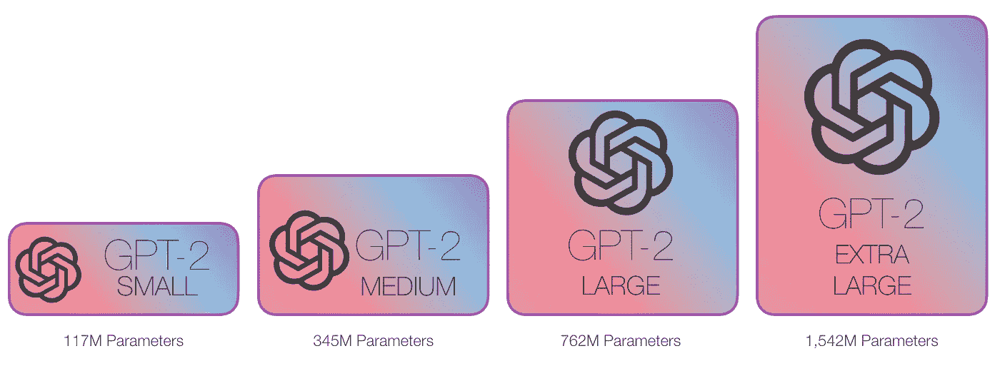

# 如何使用谷歌 Colab 在书籍上训练 GPT-2 的逐步指南

> 原文：<https://towardsdatascience.com/step-by-step-guide-on-how-to-train-gpt-2-on-books-using-google-colab-b3c6fa15fef0?source=collection_archive---------8----------------------->

我是如何成为一名共产党员的



共产主义者的人工智能是用 GPT-2 训练的。它阅读马克思、法农、葛兰西、列宁和其他革命作家的书籍。该项目旨在看看 GPT-2 能理解多深的哲学思想和概念。
结果相当有趣，也很有希望，因为我们见证了 A。我合乎逻辑地扭曲了我们给它的任何句子，使之成为抨击资本主义和为“工人”而斗争的借口。只要有可能，它就呼吁革命。

这是使用无条件生成的样本生成的——没有人的输入

此外，在介绍了无政府共产主义作家克鲁泡特金之后，我注意到“共产主义人工智能”倾向于使用更具攻击性的词语。另一方面，当我们介绍德·波伏娃的《第二性》(The Second Sex)时，《共产主义者人工智能》(The Communist A.I)有点错过了这本书的重点，在某些时候谈到了资本家的恋物癖——或者说它错过了重点？

而讨论人工智能的话语和哲学很有趣，比如回答“一个人如何变得自由”的问题，这篇文章旨在展示一个简单的分步指南，告诉你如何只用 GPT-2、谷歌 Colab 和你的谷歌硬盘创建你自己的人工智能角色。那我们开始吧。
如果你想[阅读更多关于共产主义人工智能的信息，请点击此链接](https://medium.com/@mhd.ali.nasser/how-this-a-i-became-a-communist-ddf9146bc147?sk=f443a5b02bcf1156c510d021f4628445)

# 准备您的 Google Colab 笔记本

我们将使用 Google Drive 来保存我们的检查点(检查点是我们最后保存的训练模型)。一旦我们训练好的模型被保存，我们就可以在任何时候加载它来生成有条件和无条件的文本。

首先，把你的 Colab 的运行时间设置为 GPU，以后你会感谢我的。
使用以下代码连接您的 Google Drive:

```
from google.colab import drive
drive.mount('/content/drive')
```

现在您已经连接了 Google Drive，让我们创建一个检查点文件夹:

```
%cd drive
%cd My\ Drive
%mkdir NAME_OF_FOLDER
%cd /content/
!ls
```

现在让我们克隆我们将使用的 GPT-2 存储库，它来自 nnsheperd 的 awesome 存储库(它来自 OpenAI，但添加了令人敬畏的 train.py)，我添加了一个 conditional_model()方法，该方法允许我们一次传递多个句子，并返回一个包含相关模型输出样本的字典。它还让我们避免使用 bash 代码。

```
[!git clone](https://github.com/mohamad-ali-nasser/gpt-2.git) [https://github.com/mohamad-ali-nasser/gpt-2.git](https://github.com/mohamad-ali-nasser/gpt-2.git)
```

现在让我们下载我们选择的模型。我们将使用相当不错的 345M 型号。我们将使用该型号而不是 774M 或 1558M 的原因是训练时 Colab 中可用的 GPU 内存有限。也就是说，如果我们想使用预训练的 GPT-2，而不需要对我们的语料库进行任何微调或训练，我们可以使用 774M 和 1558M。

```
%cd gpt-2
!python3 download_model.py 345M
```

现在模型已经安装好了，让我们准备好语料库并加载检查点，以防我们之前已经训练过模型。

```
# In Case I have saved checkpoints
!cp -r /content/drive/My\ Drive/communist_ai/gpt-2/checkpoint/run1/* /content/gpt-2/models/345M
```

# 下载文本并将其合并到一个语料库中

让我们创建并移动到我们的语料库文件夹，并获得这些文本。

```
%cd src
%mkdir corpus
%cd corpus/
!export PYTHONIOENCODING=UTF-8
```

我在 Github 存储库中有我的文本，但是您可以用您需要的任何链接替换 url 变量。你也可以手动将你的文本文件上传到 Google Colab，或者如果你的 Google Drive 中有文本文件，那么只需将 cd 放入该文件夹即可。

```
import requests
import osfile_name = "NAME_OF_TEXT.txt"if not os.path.isfile(file_name):
    url = "https://raw.githubusercontent.com/mohamad-ali-nasser/the-
           communist-ai/master/corpus/manifesto.txt?
           token=AJCVVAFWMDCHUIOOUDSD2FK6PYTN2"
    data = requests.get(url)with open(file_name, 'w') as f:
         f.write(data.text)
f.close()
```

现在文本已经下载完毕，使用下面的代码将多个文本文件合并成一个文件。如果您将只使用一个文本文件，请忽略此代码。

```
# Get list of file Namesimport glob
filenames = glob.glob("*.txt") # Add all texts into one filewith open('corpus.txt', 'w') as outfile:
       for fname in filenames:
            with open(fname) as infile:
                  outfile.write(infile.read())
outfile.close()
```

# 下载库和 CUDA

现在我们已经准备好了一切，让我们准备环境。我们将从安装需求文件开始。(如果你碰巧用你本地的 Jupyter 笔记本来使用 GPT-2，那么在使用 download_model.py 之前安装需求文件)

```
# Move into gpt-2 folder
%cd /content/gpt-2!pip3 install -r requirements.txt
```

现在，以下是可选的，因为如果您想使用 774M 型号和 1558M 型号，它们是必需的。我使用过没有这些的 334M，但我还是建议这样做，尤其是 CUDA，因为你的模型会运行得更快，这些可能会修复一些你可能会遇到的随机错误。

```
!pip install tensorflow-gpu==1.15.0
!pip install 'tensorflow-estimator<1.15.0rc0,>=1.14.0rc0' --force-reinstall
```

现在安装 Cuda v9.0:

```
!wget [https://developer.nvidia.com/compute/cuda/9.0/Prod/local_installers/cuda-repo-ubuntu1604-9-0-local_9.0.176-1_amd64-deb](https://developer.nvidia.com/compute/cuda/9.0/Prod/local_installers/cuda-repo-ubuntu1604-9-0-local_9.0.176-1_amd64-deb)
!dpkg -i cuda-repo-ubuntu1604-9-0-local_9.0.176-1_amd64-deb
!apt-key add /var/cuda-repo-*/7fa2af80.pub
!apt-get update
!apt-get install cuda-9-0!export LD_LIBRARY_PATH=$LD_LIBRARY_PATH:/usr/local/cuda-9.0/lib64/
```

重启运行时并移回 GPT2 文件夹

```
%cd gpt-2
```

# 让我们训练模型:

现在是我们一直在等待的时刻，对模型进行微调。复制下面的一行程序并运行它。

```
!PYTHONPATH=src ./train.py --dataset src/corpus/corpus.txt --model_name '345M'
```

该模型将加载最新的检查点，并从那里开始训练(似乎加载以前训练过的检查点并添加到其中会导致您在使用 Colab 中的 345M 时遇到内存问题)。
还可以指定批次数和学习率。批次数量真正的整体好处是训练的速度，默认的批次大小是 1，增加批次大小会导致你遇到内存问题，所以要小心你增加多少，特别是当你在一个 GPU 上运行时，我使用的批次大小是 1，尝试 2 或 4，并在评论中添加你的结果。

虽然提高学习率可以提高训练的速度，但它可能会导致模型卡在局部最小值(梯度)甚至超调，因此我建议保持学习率不变，或者如果*损失*停止下降，则降低学习率。默认学习率为 0.00001。

```
!PYTHONPATH=src ./train.py --dataset src/corpus/corpus.txt --model_name '345M' --batch_size 1 --learning_rate 0.00001
```

该模型将每 1000 步保存一个检查点。你可以持续运行它几分钟、几小时或几天，这完全取决于你，只要确保如果你有一个小文本，你不要过度拟合模型。
要停止模型，只需“停止”它，它将保存最后一个训练步骤(因此，如果您在步骤 1028 停止，您将有两个检查点 1000 和 1028)。
注意:当在训练 Colab 时停止模型时，它可能看起来没有反应并保持训练，为了避免这种情况，在它训练时，清除输出，然后停止它，这将节省您的几次点击。

现在模型已经训练好了，让我们将检查点保存在 Google Drive 中:

```
!cp -r /content/gpt-2/checkpoint/ /content/drive/My\ Drive/checkpoint
```

将新保存的检查点复制到模型的目录中

```
!cp -r /content/gpt-2/checkpoint/run1/* /content/gpt-2/models/345M/
```

# 生成条件文本

```
import os
%cd src
from conditional_model import conditional_model
%cd ..
```

运行下面的代码，了解该方法的参数是什么:

```
conditional_model??
```

我建议设置一个种子，这样你可以得到一些可重复的结果。参数语句接受一个字符串或字符串列表，并返回一个字典，其中输入作为键，输出样本作为值。

现在来看看魔术:

```
conditional_model(seed=1,sentences=['How are you today?', 'Hi i am here'])
```

你现在已经根据你选择的书籍对你的 GPT-2 进行了微调，并且创建了你自己的人工智能，祝贺你！！

如果你觉得这个教程有帮助，请分享并开始 GitHub repo—[https://github.com/mohamad-ali-nasser/gpt-2](https://github.com/mohamad-ali-nasser/gpt-2)。谢谢

别忘了跟着[共产主义者 A.I](https://twitter.com/CommunistAI) 。

在 [LinkedIn](https://www.linkedin.com/in/mohamad-ali-nasser-data-scientist/) 上联系，在 [Twitter](https://twitter.com/mhd_ali_nasser) 上关注。

您也可以查看我的[组合](https://www.mohamadalinasser.com)网站，了解更多项目。

编码快乐！