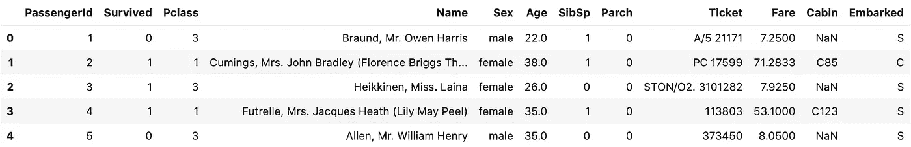
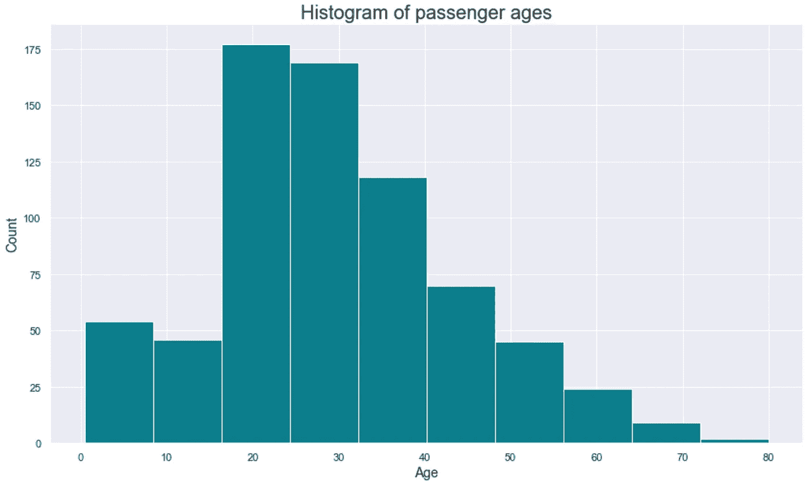
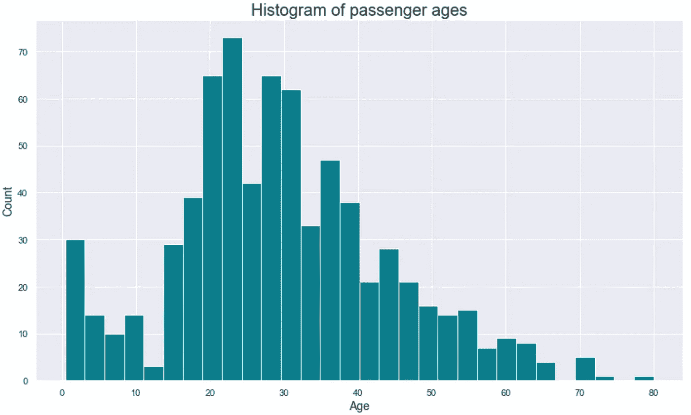
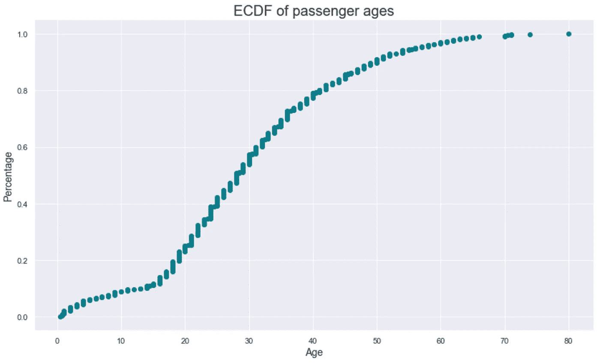
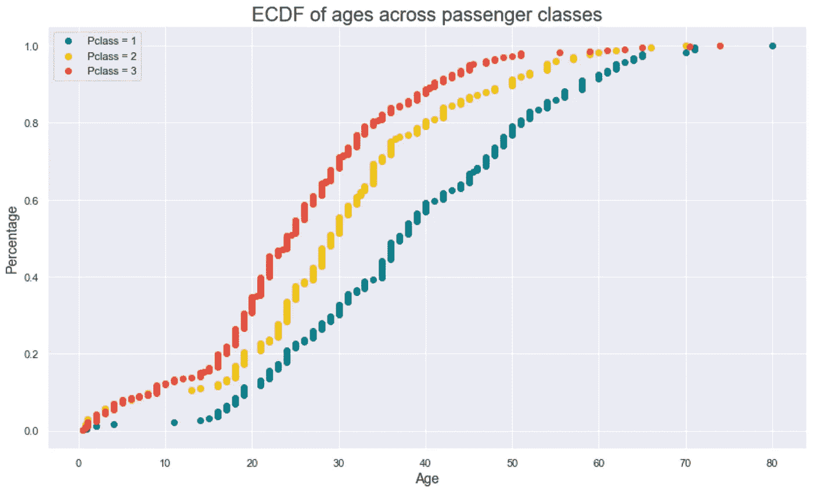

# ECDFs 分步指南——强大的直方图替换

> 原文：<https://towardsdatascience.com/step-by-step-guide-to-ecdfs-a-robust-histogram-replacement-8b2309ac9c1c?source=collection_archive---------43----------------------->

## 用 ECDFs 一劳永逸地抛弃宁滨偏见


照片由[尼克·费因斯](https://unsplash.com/@jannerboy62?utm_source=unsplash&utm_medium=referral&utm_content=creditCopyText)在 [Unsplash](https://unsplash.com/s/photos/analytics?utm_source=unsplash&utm_medium=referral&utm_content=creditCopyText) 上拍摄

每个人都喜欢好的数据可视化。尽管如此，他们不应该把解释留给观众，就像直方图一样。今天我们将回答*宁滨偏差*如何在分析中误导你，以及如何用 ECDF 图的力量来防止这个问题。

这篇文章回答了以下问题:

*   直方图有什么问题——什么时候应该避免使用它们
*   如何用 ECDFs 替换直方图——一种更健壮的检查数据分布的方法
*   如何在单个图表中使用和解释多个 ECDFs 比较不同数据段之间的分布

事不宜迟，我们开始吧！

# 直方图有什么问题？

正如来自[数据营](https://learn.datacamp.com/courses/statistical-thinking-in-python-part-1)的贾斯汀·博伊斯所说——宁滨偏见——我完全同意。这意味着在直方图上使用不同的区间大小会使数据分布看起来不同。不要相信我的话，下面的例子不言自明。

首先，我们将导入几个用于数据分析和可视化的库，并直接从 web 加载 [Titanic](https://raw.githubusercontent.com/datasciencedojo/datasets/master/titanic.csv) 数据集:

```
import numpy as np
import pandas as pd
import matplotlib.pyplot as plt
import seaborn as sns
sns.set()

df = pd.read_csv('https://raw.githubusercontent.com/datasciencedojo/datasets/master/titanic.csv')
```

如果您不熟悉数据集，下面是前几行的样子:



作者图片

```
df.dropna(subset=['Age'], inplace=True)
```

接下来，让我们声明一个可视化直方图的函数。它需要很多参数，但在我们的例子中最重要的参数是:

*   `x`–表示我们要为其绘制直方图的单个属性
*   `nbins`–直方图应该有多少个箱

```
def plot_histogram(x, size=(14, 8), nbins=10, title='Histogram', xlab='Age', ylab='Count'):
    plt.figure(figsize=size)
    plt.hist(x, bins=nbins, color='#087E8B')
    plt.title(title, size=20)
    plt.xlabel(xlab, size=14)
    plt.ylabel(ylab, size=14)

plot_histogram(df['Age'], title='Histogram of passenger ages')
plot_histogram(df['Age'], nbins=30, title='Histogram of passenger ages')
```

我们将使用提到的函数两次，第一次用 10 个面元制作直方图，第二次用 30 个面元制作直方图。结果如下:

有 10 个条块的直方图:



作者图片

有 30 个条柱的直方图:



作者图片

数据是相同的，但不同的箱大小会导致*宁滨偏差*——由于视觉表现的细微变化，对相同数据的感知不同。

我们能做些什么来解决这个问题？ECDF 的阴谋终于来了。

# ECD fs——更强大的直方图替换

ECDF 代表*经验累积分布函数*。别担心，它没有听起来那么花哨，也相对容易理解。

像直方图一样，ECDFs 显示单个变量的分布，但方式更有效。我们之前已经看到了直方图是如何由于不同的 bin 大小选项而产生误导的。ECDFs 就不是这样了。ECDFs 显示每一个数据点，并且该图只能以一种方式解释。

将 ECDFs 视为散点图，因为它们也有沿 X 轴和 Y 轴的点。更准确地说，这是 ECDFs 在两个轴上显示的内容:

*   x 轴——我们正在测量的量(上面例子中的*年龄*)
*   Y 轴-值小于相应 X 值的数据点的百分比(在每个点 X，Y%的值小于或等于 X)

为了实现这种可视化，我们需要先做一些计算。需要两个阵列:

*   X —排序数据(从最低到最高排序*年龄*列)
*   y-最大值为 1 的均匀间隔数据点列表(如 100%)

以下 Python 片段可用于计算 Pandas 数据帧中单个列的 *X* 和 *Y* 值:

```
def ecdf(df, column):
    x = np.sort(df[column])
    y = np.arange(1, len(x) + 1) / len(x)
    return x, y
```

这是一个非常简单的问题。不过，我们还需要一个函数。这个是用来做一个实际的图表的:

```
def plot_ecdf(x, y, size=(14, 8), title='ECDF', xlab='Age', ylab='Percentage', color='#087E8B'):
    plt.figure(figsize=size)
    plt.scatter(x, y, color=color)
    plt.title(title, size=20)
    plt.xlabel(xlab, size=14)
    plt.ylabel(ylab, size=14)
```

让我们使用这个函数来制作一个*年龄*属性的 ECDF 图:

```
x, y = ecdf(df, 'Age')

plot_ecdf(x, y, title='ECDF of passenger ages', xlab='Age')
plt.show()
```



作者图片

*但是等等，我该怎么解读这个？这很容易。这里有几个例子:*

*   大约 25%的乘客年龄在 20 岁或以下
*   大约 80%的乘客年龄在 40 岁以下
*   大约 5%的乘客年龄在 60 岁或以上(1——百分比)

那不是很容易吗？但是等等，派对不会就此结束。接下来我们来探讨如何绘制和解释多个 ECDFs。

# 多个 ECDFs

在 Titanic 数据集中，我们有 *Pclass* 属性，它表示乘客类别。即使在今天，这种等级组织也是旅行中的典型，因为头等舱是为较富裕的人保留的，其他的舱是其他人所在的地方。

借助 ECDFs 的强大功能，我们可以探索乘客年龄是如何在各个阶层中分布的。我们需要调用`ecdf()`函数三次，因为船上有三个类。代码的其余部分归结为数据可视化，这是不言自明的:

```
x1, y1 = ecdf(df[df['Pclass'] == 1], 'Age')
x2, y2 = ecdf(df[df['Pclass'] == 2], 'Age')
x3, y3 = ecdf(df[df['Pclass'] == 3], 'Age')

plt.figure(figsize=(14, 8))
plt.scatter(x1, y1, color='#087E8B')
plt.scatter(x2, y2, color='#f1c40f')
plt.scatter(x3, y3, color='#e74c3c')
plt.title('ECDF of ages across passenger classes', size=20)
plt.xlabel('Age', size=14)
plt.ylabel('Percentage', size=14)
plt.legend(labels=['Pclass = 1', 'Pclass = 2', 'Pclass = 3'])
plt.show()
```

结果可视化如下所示:



作者图片

正如我们所看到的，第三个班级(红色)有很多孩子，而第一个班级(绿色)没有这么多孩子。第一个班级的学生年龄也很大:

*   只有 20%的头等舱乘客年龄超过 50 岁
*   只有 20%的二等舱乘客年龄超过 40 岁
*   只有 20%的三等舱乘客年龄超过 34 岁

这些只是粗略的数字，所以如果我犯了一两年的错误，不要引用我的话。现在您知道了如何使用和解释 ECDFs。让我们在下一部分总结一下。

# 离别赠言

不要把任何东西留给数据科学中的个人解读。仅仅因为你喜欢在柱状图中看到 15 个柱，并不意味着你的同事也喜欢。如果直观地解释，这些差异可能会导致不同的数据解释。

ECDFs 就不是这样了。现在，您已经对它们有了足够的了解，可以将它们包含在下一个数据分析项目中。乍一看，它们似乎令人望而生畏，但我希望这篇文章做出了必要的澄清。

感谢阅读。

[**加入我的私人邮件列表，获取更多有用的见解。**](https://mailchi.mp/46a3d2989d9b/bdssubscribe)

*喜欢这篇文章吗？成为* [*中等会员*](https://medium.com/@radecicdario/membership) *继续无限制学习。如果你使用下面的链接，我会收到你的一部分会员费，不需要你额外付费。*

[](https://medium.com/@radecicdario/membership) [## 通过我的推荐链接加入 Medium-Dario rade ci

### 作为一个媒体会员，你的会员费的一部分会给你阅读的作家，你可以完全接触到每一个故事…

medium.com](https://medium.com/@radecicdario/membership) 

*原载于 2020 年 10 月 23 日 https://betterdatascience.com*[](https://betterdatascience.com/ecdf-as-a-histogram-replacement/)**。**