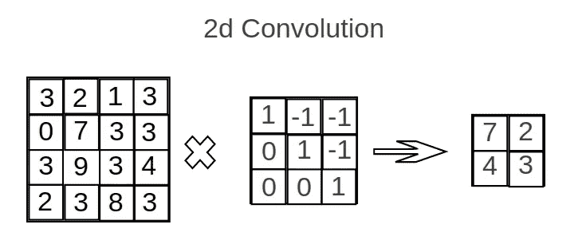
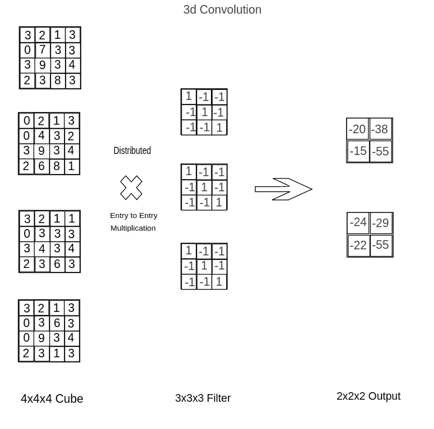
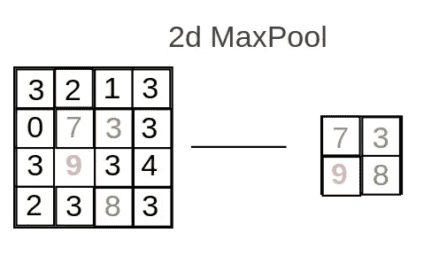
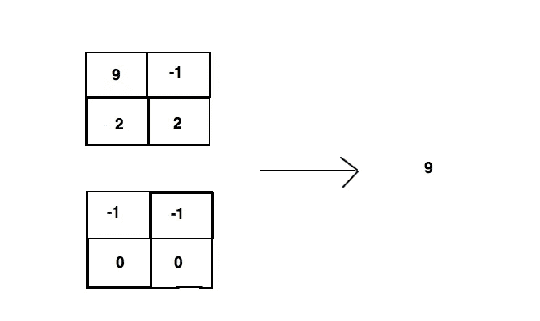
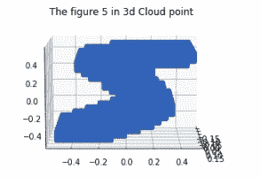
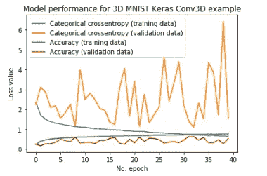

# 一步一步实现:Keras 中的 3D 卷积神经网络

> 原文：<https://towardsdatascience.com/step-by-step-implementation-3d-convolutional-neural-network-in-keras-12efbdd7b130?source=collection_archive---------1----------------------->

## 深度学习

> 了解如何实现您自己的 3D CNN

[来源](https://www.pexels.com/photo/mirror-lake-reflecting-wooden-house-in-middle-of-lake-overlooking-mountain-ranges-147411/)

在本文中，我们将简要解释什么是 3d CNN，以及它与普通的 2d CNN 有何不同。然后我们会一步步教你如何用 Keras 实现自己的 3D 卷积神经网络。

本文将围绕这四个**部分**展开:

*   **1】什么是 3D 卷积神经网络？**
*   **2】3d 数据是什么样的？(如 MNIST)**
*   **3】现在如何实施？！**
*   **4】但是然后一个 3d？为什么**

## 1]什么是 3D 卷积神经网络？

不管我们怎么说，3d CNN 仍然是一个与 2d CNN 非常相似的 CNN。不同之处在于以下几点(非穷尽列举):

**3d 卷积层**

最初，2d 卷积层是输入和不同滤波器之间的逐条目乘法，其中滤波器和输入是 2d 矩阵。(图 1)

图 1(版权所有:自有)

在 3d 卷积层中，使用相同的操作。我们在多对 2d 矩阵上进行这些操作。(图 2)

图 2(版权所有:自有)

填充选项和幻灯片步长选项的工作方式相同。

## 3d 最大池图层

2d Maxpool Layers (2x2 filter)是从输入中提取一个 2x2 小正方形的最大元素。(图 3)

图 3(版权所有:自有)

现在，在 3d Maxpool (2x2x2 内核)中，我们寻找宽度为 2 的立方体中的最大元素。此立方体代表由输入的 2x2x2 区域界定的空间。(图 4)

图 4(版权所有:自有)

请注意，操作的数量(与 2d CNN 层相比)乘以所使用的过滤器的大小(不管该层是最大池还是卷积层)，还乘以输入本身的大小。

## 2]**3d 数据是什么样子的？**

那么 3d CNN 的数据点是什么样的呢？

描绘它的一种方法是使用下面的图像(图 5):

图 5(版权所有:自有)

其他可用于 CNN 的现有数据集有:

*   RGB-D 设备:[谷歌 Tango](http://get.google.com/tango/) 、[微软 Kinect](https://developer.microsoft.com/en-us/windows/kinect) 等。
*   [激光雷达](https://en.wikipedia.org/wiki/Lidar)
*   [多幅图像的三维重建](https://en.wikipedia.org/wiki/3D_reconstruction_from_multiple_images)

## 3] **现在如何实现？！(**预处理和实现)

你可以自己试试我们正在使用的来自 [Kaggle](https://www.kaggle.com/daavoo/3d-mnist) 的数据集上的代码。

需要导入的库如下:

首先，由于数据集有点特殊，我们使用下面的 to helper 函数在将它们提供给网络之前对它们进行处理。

另外，数据集存储为 h5 文件，因此要提取实际的数据点，我们需要从 h5 文件中读取数据，并使用 to _ categorical 函数将其转换为向量。在这一步中，我们还要准备交叉验证。

最后，3d CNN 的模型和语法如下:(架构是在没有太多改进的情况下挑选的，因为这不是本文的重点)

请注意，与 2d CNN 相比，对于相同数量的层，参数的数量要高得多。

供您参考，经过小样本训练，我们得到了以下准确度和损耗。(图 6)

图 6(版权所有:自有)

## 4]但是然后一个 3d？为什么

3d CNN 碰巧有许多应用，例如:

*   IRM 的数据处理和由此得出的推论
*   自驾
*   距离估计

好了，差不多就这些了。我希望你尝试一下这项技术！源代码结束[这里](https://github.com/miki998/3D_CNN)！

感谢您的阅读，如果您喜欢，请关注我、我的[网站](http://aitechfordummies.com)和我的[脸书](https://www.facebook.com/aitechfordummies/)页面！

 [## 经典神经网络:什么是真正的节点和层？

### 一个节点和一个层在数学上代表什么？简单易懂的幕后概念介绍。

towardsdatascience.com](/classical-neural-network-what-really-are-nodes-and-layers-ec51c6122e09)  [## 卷积神经网络:为什么它们对图像相关学习如此有效？

### 快速解释为什么 CNN 现在几乎总是用于计算机视觉任务。

towardsdatascience.com](/convolutional-neural-networks-why-are-they-so-good-for-image-related-learning-2b202a25d757)