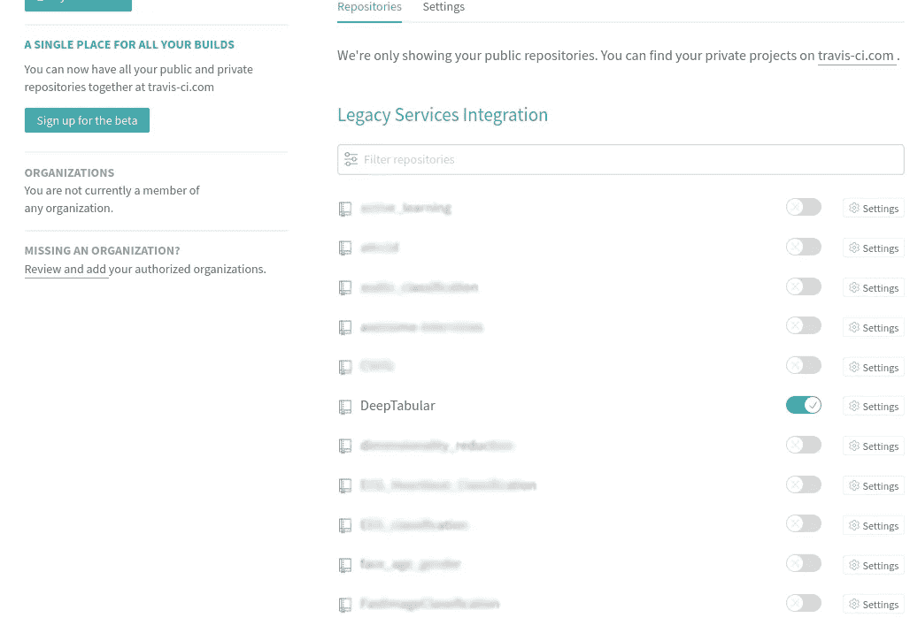
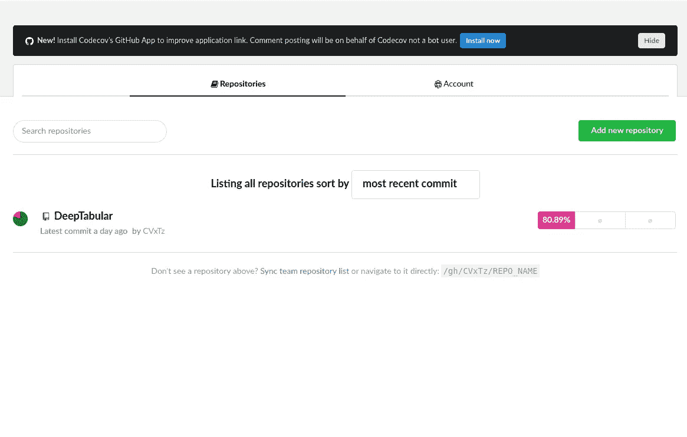
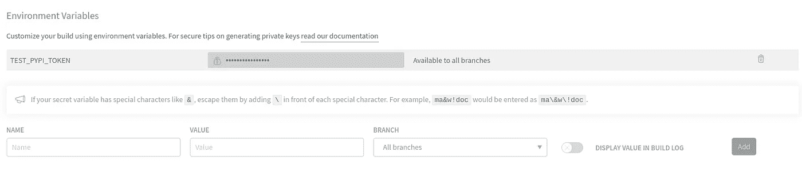
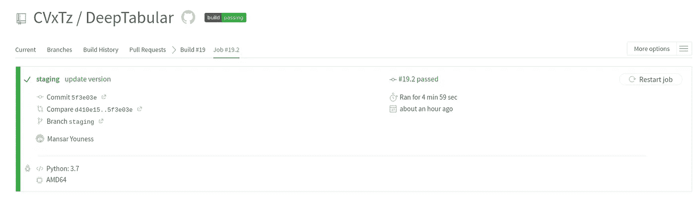
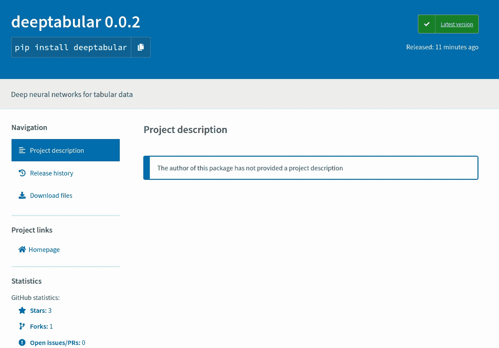
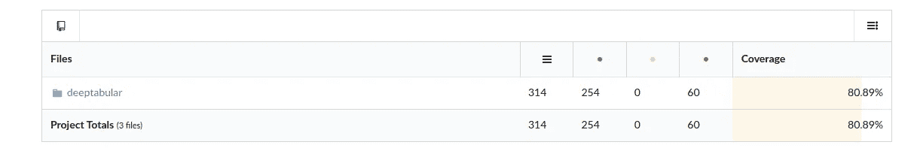

# 使用 Travis-CI 为您的 Python 项目构建最小 CI/CD 管道的分步教程

> 原文：<https://towardsdatascience.com/step-by-step-tutorial-to-build-a-minimal-ci-cd-pipeline-for-your-python-project-using-travis-ci-c074e42f0c65?source=collection_archive---------21----------------------->

## 使用 Travis-CI、Codecov 和 Pypi 自动构建、测试和发布您的 Python 包。


Philipp Wüthrich 在 [Unsplash](https://unsplash.com/s/photos/pipeline?utm_source=unsplash&utm_medium=referral&utm_content=creditCopyText) 上的照片

如果您想在自动发布/部署包之前，节省在多种环境中测试 python 代码的时间，那么构建 CI/CD 管道非常有用。这也是一种及早发现错误并确保开发过程的一致性和可重复性的方法。

我最近参与了一个项目，该项目实现了一种相对较新的方法，将深度学习模型应用于结构化数据，该方法的细节可以在这里找到:[使用半监督学习为结构化数据训练更好的深度学习模型](/training-better-deep-learning-models-for-structured-data-using-semi-supervised-learning-8acc3b536319)。我想建立一个 CI/CD 管道来完成以下任务:

*   在每次合并请求时自动测试代码的。
*   计算并显示主分支的**测试覆盖率**。
*   如果登台分支上的构建通过了测试，python 包 /wheel 的自动**部署到 PyPi。**

为了做到这一点，我使用了 Github、 [Travis-CI](https://travis-ci.org) 和 [Codecov、](https://codecov.io/)这两个软件对开源项目都是免费的。

# 步骤:

## 1)登录

第一步是使用您的 Github 帐户登录 Travis-CI，然后转到 settings 并激活您想要处理的存储库:



然后用 Codecov 做同样的事情:



最后是 PyPI，您需要通过转到 account setting 来生成一个访问令牌:


## 2)将 PyPI 令牌添加到 Travis-CI:

要自动发布包，您需要将 PyPI 令牌作为环境变量添加到 Travis-CI 中。在设置中:



## 3)代码

代码需要有一个 **setup.py** 文件以及一个 **requirements.txt** (如果需要的话)。例如，我的代码依赖于多个像 Tensorflow 或 Pandas 这样的库，所以我需要一个这样的需求文件:

```
**pandas**==**1.0.4
numpy**==**1.17.3
scipy**==**1.4.1
matplotlib**==**3.1.1
tensorflow_gpu**==**2.0.1
tqdm**==**4.36.1
scikit_learn**==**0.23.2
tensorflow**==**2.3.0**
```

您还需要实现一些测试，并将它们放在 tests/文件夹中。我的代码中的一个测试示例是在合成训练集上运行一个小训练，并通过在测试集上运行一个评估来检查网络是否学习了:

```
**from** deeptabular.deeptabular **import** (
    DeepTabularClassifier,
)
**import** pandas **as** pd
**import** numpy **as** np
**import** tensorflow **as** tf
**from** sklearn.metrics **import** accuracy_score

**def** test_build_classifier():
    classifier = DeepTabularClassifier(
        cat_cols=[**"C1"**, **"C2"**], num_cols=[**"N1"**, **"N2"**], n_targets=1, num_layers=1
    )
    df = pd.DataFrame(
        {
            **"C1"**: np.random.randint(0, 10, size=5000),
            **"C2"**: np.random.randint(0, 10, size=5000),
            **"N1"**: np.random.uniform(-1, 1, size=5000),
            **"N2"**: np.random.uniform(-1, 1, size=5000),
            **"target"**: np.random.uniform(-1, 1, size=5000),
        }
    )
    df[**"target"**] = df.apply(
        **lambda** x: 1 **if** (x[**"C1"**] == 4 **and** x[**"N1"**] < 0.5) **else** 0, axis=1
    )

    test = pd.DataFrame(
        {
            **"C1"**: np.random.randint(0, 10, size=5000),
            **"C2"**: np.random.randint(0, 10, size=5000),
            **"N1"**: np.random.uniform(-1, 1, size=5000),
            **"N2"**: np.random.uniform(-1, 1, size=5000),
            **"target"**: np.random.uniform(-1, 1, size=5000),
        }
    )
    test[**"target"**] = test.apply(
        **lambda** x: 1 **if** (x[**"C1"**] == 4 **and** x[**"N1"**] < 0.5) **else** 0, axis=1
    )

    classifier.fit(df, target_col=**"target"**, epochs=100, save_path=**None**)

    pred = classifier.predict(test)

    acc = accuracy_score(test[**"target"**], pred)

    **assert** isinstance(classifier.model, tf.keras.models.Model)
    **assert** acc > 0.9
```

## 4)管道

Travis-CI 中使用的管道被编写为 YAML 文件。例如，deeptabular 存储库中使用的是:

```
**language**: python
**python**:
  - **"3.6"** - **"3.7"
install**:
  - pip install -r requirements.txt
  - pip install codecov
  - pip install pytest-cov
  - pip install .
**script**:
  - pytest --cov-report=xml --cov=deeptabular tests/

**after_success**:
  - codecov

**deploy**:
  **provider**: pypi
  **user**: __token__
  **password**: $TEST_PYPI_TOKEN
  **distributions**: **"sdist bdist_wheel"
  skip_existing**: true
  **on**:
    **branch**: staging
```

首先选择要使用的 python 版本:

```
**python**:
  - **"3.6"** - **"3.7"**
```

然后安装库的需求加上库本身，pytest 和用于测试的 Codecov:

```
**install**:
  - pip install -r requirements.txt
  - pip install codecov
  - pip install pytest-cov
  - pip install .
```

运行测试并将测试覆盖结果写成 XML 格式:

```
**script**:
  - pytest --cov-report=xml --cov=deeptabular tests/
```

将覆盖报告推送到 codecov:

```
**after_success**:
  - codecov
```

最后，将包作为 zip 和 wheel 发布到 PyPI:

```
**deploy**:
  **provider**: pypi
  **user**: __token__
  **password**: $TEST_PYPI_TOKEN
  **distributions**: **"sdist bdist_wheel"
  skip_existing**: true
  **on**:
    **branch**: staging
```



然后将包推送到 PyPI:



测试覆盖结果可以在 Codecov:



结论:

就是这样，每当有代码被推送到任何分支时，这个管道就运行测试，如果 staging 分支发生变化，就将包发布到 PyPI。

参考资料:

1.  [https://dev . to/oscarmcm/distributing-pypi-packages-using-API-tokens-in-travisci-1n9i](https://dev.to/oscarmcm/distributing-pypi-packages-using-api-tokens-in-travisci-1n9i)
2.  【https://docs.travis-ci.com/user/languages/python/ 号

## 代码:

【https://github.com/CVxTz/DeepTabular 