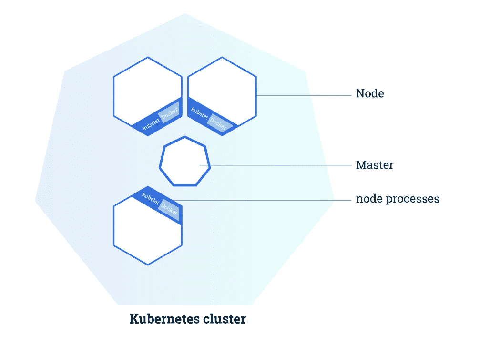
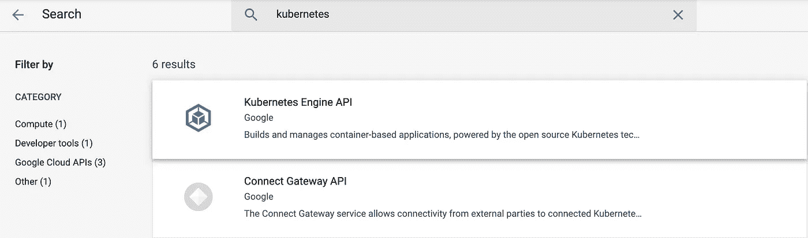
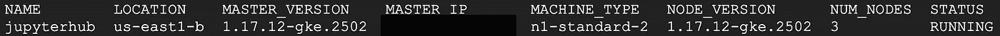
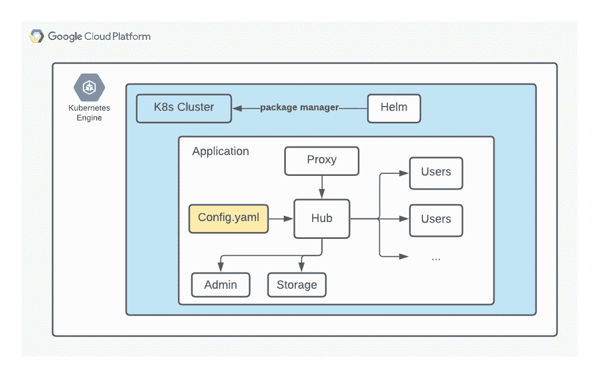
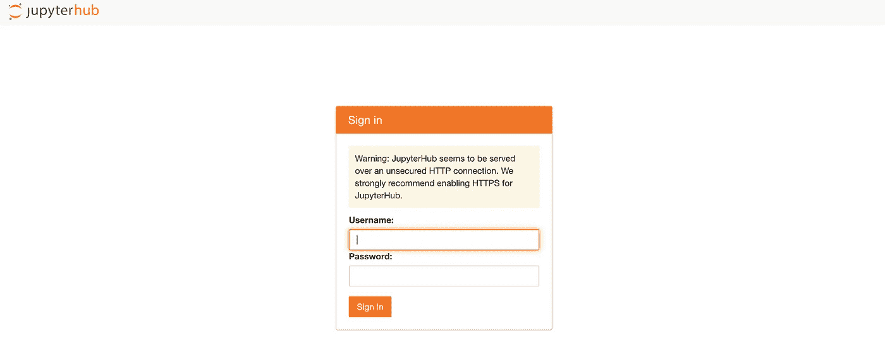

# 将 Kubernetes 部署到您的 GCP 云的分步指南

> 原文：<https://towardsdatascience.com/step-by-step-tutorial-to-deploy-kubernetes-to-your-gcp-cloud-171e739eedc2?source=collection_archive---------18----------------------->

## [实践教程](https://towardsdatascience.com/tagged/hands-on-tutorials)

## 用动手练习揭开 Kubernetes 的神秘面纱！


由[克里斯托弗·高尔](https://unsplash.com/@cgower?utm_source=unsplash&utm_medium=referral&utm_content=creditCopyText)在 [Unsplash](https://unsplash.com/s/photos/portable?utm_source=unsplash&utm_medium=referral&utm_content=creditCopyText) 上拍摄的照片

# 介绍

作为一名在实践中的数据科学家，我感受到了将数据处理、模型训练和推理的传统例行程序推入具有( [CI/CD](https://docs.gitlab.com/ee/ci/) )持续集成/持续部署的集成管道的趋势，其概念是从 DevOps 借用的。至少从我的角度来看，有两个主要原因。一个是建模正在走出原型阶段，进入生产中模型的大规模采用，无论是作为一个附件还是应用程序。另一个原因是将整个建模体验带到云中的需求增加，以及模型开发的增强编排。

在这种需求的驱使下，我开始了我的技能提升之旅，使用了适合建模转型的工具，比如 Kubernetes。它现在很受欢迎，并获得了易于扩展、可移植性和可扩展性的声誉。[这篇博客](https://stackoverflow.blog/2020/05/29/why-kubernetes-getting-so-popular/)在这里特别展示了它提供的组件。然而，当我开始我的研究并得到它的时候，我感到*被所有这些概念和“官方指南”淹没了，因为我不是一个训练有素的软件开发人员。我一点一点地咀嚼所有这些材料，并开始获得更完整的图片，即使我没有丰富的 DevOps 背景。我的笔记和理解都在这个教程中，我希望这对于那些也需要在 Kubernetes 中提升自己的人来说是一个简单而成功的开始。*

## 一言以蔽之的库伯内特

Kubernetes 将自己定义为一个生产级的开源平台，在计算机集群内部和之间协调应用程序容器的执行。简而言之，Kubernetes 是一个为你组装几台计算机来执行应用程序的管理者。它是执行您分配给它的任务的指挥中心:安排应用程序、定期维护、扩展容量和推出更新。



来自 [Kubernetes](https://kubernetes.io/docs/tutorials/kubernetes-basics/create-cluster/cluster-intro/) 的聚类图

Kubernetes 集群最基本的组件是主节点和节点。主服务器是管理器，是集群的中心。节点是虚拟机或物理计算机。每个节点都有一个 Kubelet 来管理它并与主节点通信。由于节点是一个虚拟机，我们还应该有 Docker/Container 作为工具来执行我们的应用程序。

## Kubernetes 应用程序

现在我们知道了 Kubernetes 的基本知识，我们可能会开始想从数据科学家的角度来看它能做什么。以我的观点和经验，我确实发现 Kubernetes 的概念非常吸引人，尤其是当你认为建模最终应该作为应用程序/服务产品化的时候。当我们想让最终用户访问模型时，它阻碍许多产品设计者的问题，如可伸缩性和可扩展性也将是考虑的一部分。

谷歌提供了一份他们内部解决方案的应用程序列表。但是我们在这里想要实现的是根据我们的需求和目的来使用和定制 Kubernetes。因此，本教程将自下而上，从基础开始设置 GCP，一直到在 Kubernetes 集群上部署应用程序。

# 步骤 0。GCP 设置

在本教程中，我们将使用 [Google Kubernetes 引擎](https://cloud.google.com/kubernetes-engine/)来建立一个 Kubernetes 集群。但是在开始之前，请确保满足以下先决条件:

1.  在 [GCP](https://cloud.google.com/) 获得一个账号，登录[控制台](https://console.cloud.google.com/)。
2.  在控制台中，启用 [Kubernetes Engine AP](https://console.cloud.google.com/apis/api/container.googleapis.com/overview) I .你可以在 API 库中找到一个库 API，只需搜索名称即可。



API 库(图片由作者提供)

3.安装 [gcloud](https://cloud.google.com/sdk/docs/install) 。您可以使用基于网络的终端或您自己的计算机终端。要在 GCP 控制台中找到基于 web 的终端:


单击红色框中的图标(图片由作者提供)

建议按照[官方指南](https://cloud.google.com/sdk/docs/install)安装 gcloud，但为了方便起见，您也可以使用以下命令:

4.安装 kubectl。这一步很简单:设置 gcloud 后，输入命令:

```
gcloud components install kubectl
```

# 第一步。Kubernetes 设置

一旦我们完成了前面的所有步骤，项目现在可以使用 Google Cloud SDK 来创建一个托管的 Kubernetes 集群。

1.  要使用 gcloud 创建容器集群:

```
gcloud container clusters create \
--machine-type n1-standard-2 \
--num-nodes 3\
--zone <compute zone from the list linked below> \
--cluster-version latest \
<CLUSTERNAME>
```

*   [机器类型](https://cloud.google.com/sdk/gcloud/reference/container/clusters/create#--machine-type):用于节点的机器类型。
*   [num-nodes](https://cloud.google.com/sdk/gcloud/reference/container/clusters/create#--num-nodes) :要在每个集群区域中创建的节点数量。您可以将其设置为 1 来创建一个单节点集群，但是构建一个 Kubernetes 集群至少需要 3 个节点。稍后可以使用 [gcloud 命令](https://cloud.google.com/kubernetes-engine/docs/how-to/resizing-a-cluster)调整大小。
*   [zone](https://cloud.google.com/sdk/gcloud/reference/container/clusters/create#--zone) :计算集群的 [zone](https://cloud.google.com/compute/docs/regions-zones/#available) (例如 us-central1-a)。

如果集群创建正确，它将显示如下信息:



2.为了测试新设置的集群，我们可以使用 kubectl:

```
kubectl get node
```

3.接下来，我们将[授予用户执行管理操作的权限](https://kubernetes.io/docs/reference/access-authn-authz/rbac/#kubectl-create-clusterrolebinding)。

```
kubectl create clusterrolebinding cluster-admin-binding \
  --clusterrole**=**cluster-admin \
  --user**=**<GOOGLE-EMAIL-ACCOUNT>
```

4.安装[舵](https://helm.sh/docs/intro/install/)。Helm 是 Kubernetes 应用程序的包管理器。您可以使用[导航图](https://artifacthub.io/)来搜索要部署到 Kubernetes 的应用程序/包。Helm Chart 是预设的抽象概念，用来描述如何将包安装到 Kubernetes

```
curl https://raw.githubusercontent.com/helm/helm/master/scripts/get-helm-3 | bash
```

安装 Helm 后，我们可以通过调用以下命令来检查集群中安装了什么:

```
helm list
```

现在你的 Kubernetes 已经准备好了！祝贺🤓

# 第二步。Kubernetes 的应用

## 以 JupyerHub 为例

在开始安装过程之前，从较高的层次进行检查并了解它的样子总是有帮助的。在前面的步骤中，我们已经完成了安装 Helm 的 Kubernetes 集群的设置。现在，我们想为它部署一个应用程序，并开始使用它。对于这里的例子，我将使用可以服务多个用户的 JupyterHub。下面是这个练习的结构，以便于参考。



安装结构(图片由作者使用 LucidChart 提供)

1.  安全设置

*   生成代理安全令牌。出于安全考虑，强烈建议不要在没有 SSL 加密的情况下运行 JupyerHub。用`openssl rand -hex 32`简单生成。将生成的令牌保存在记事本中以备后用。
*   向您的[代理](http://penssl rand -hex 32)添加令牌。它可以在配置文件中设置，也可以使用或存储为环境变量。然而，由于我们已经安装了 Helm，我们可以使用`helm`来模板化`yaml`文件以添加 SSL 令牌。下面是您用上一步生成的令牌提供给`yaml`的格式。我们稍后将把它添加到配置文件中。

```
**proxy:**
  **secretToken:** "<SSL_Token>"
```

2.添加配置

JupyterHub 就如何设置配置提供了非常全面的[指南](https://zero-to-jupyterhub.readthedocs.io/en/latest/jupyterhub/customization.html)。我正在添加一些有用的自定义数据科学的目的。您也可以参考指南来设置您的定制或使用参考[此处的](https://zero-to-jupyterhub.readthedocs.io/en/latest/resources/reference.html#singleuser-memory)来导航您的需求。

*   [图片](https://zero-to-jupyterhub.readthedocs.io/en/latest/resources/reference.html#singleuser-image):我们可以从[这里](https://jupyter-docker-stacks.readthedocs.io/en/latest/using/selecting.html)提供的综合列表中添加[数据科学笔记本](https://jupyter-docker-stacks.readthedocs.io/en/latest/using/selecting.html#jupyter-datascience-notebook)图片。还有，记得用标签代替`latest`。你的图片标签可以在 DockerHub 中找到，数据科学笔记本的标签信息可以在[这里](https://hub.docker.com/r/jupyter/pyspark-notebook/tags/)找到。
*   [内存](https://zero-to-jupyterhub.readthedocs.io/en/latest/resources/reference.html#singleuser-memory):我们为你的用户指定存储限制。这将向 Kubernetes API 发送请求。

如果您只想遵循示例，只需复制并粘贴上面的内容，并替换必要的凭证。使用`nano config.yaml`或`vim config.yaml`创建`yaml`文件并替换内容。

3.用舵安装。以下脚本将使用`helm upgrade`安装 JupyterHub。有关该命令的详细信息，请查看此处的[以供参考。](https://helm.sh/docs/helm/helm_upgrade/)

对于将来使用`helm`的升级，我们不需要创建名称空间。

JupyterHub 的[指南](https://zero-to-jupyterhub.readthedocs.io/en/latest/jupyterhub/installation.html)对这一部分做了非常透彻的解释，我个人认为阅读起来非常有帮助。`RELEASE`指定您希望如何从`helm`命令调用，`NAMESPACE`是您希望与`kubectl`一致的内容。

在 helm 开始安装的时候休息一下，一旦安装完成，你将会看到 JupyterHub 的结束信息。如果您需要对该步骤中的任何问题进行故障诊断，请参考[指南](https://zero-to-jupyterhub.readthedocs.io/en/latest/jupyterhub/installation.html)或使用`kubectl get events`检索日志并自己找出发生了什么。

4.检查状态并测试您的 JupyterHub。正确设置后，我们应该通过调用以下命令看到集线器准备就绪:

```
kubectl —-namespace=jhub get pod
```

要通过集群访问集线器，请调用以下命令来获取 IP 地址:

```
kubectl --namespace=jhub get svc proxy-public
```


将您的外部 IP 复制并粘贴到一个新的浏览器，它应该会将您导航到 JupyerHub 登录页面。您可以将自己的 JupyterHub 用于 Kubernetes 集群。



JupyterHub 界面(图片由作者提供)

请注意，我们没有为用户设置任何身份验证，所以我们只需输入随机的用户名和密码即可开始。但是，如果您正在寻找更多的安全性来保护您的集群，请检查[此链接](https://jupyterhub.readthedocs.io/en/stable/getting-started/authenticators-users-basics.html)来设置您的 JupyerHub 身份验证。

## 打扫卫生。&最终想法

如果你什么都不做就让云闲置，那它就不便宜。所以如果你不再需要你的集群，建议将[删除](https://cloud.google.com/kubernetes-engine/docs/how-to/deleting-a-cluster#deleting_a_cluster)它。

```
# Retrieve the cluster **gcloud container clusters list**# Delete the cluster**gcloud container clusters delete <CLUSTER-NAME>**
```

我从这个例子的实现中学到了很多，希望你也有同感。Kubernetes 并不完全是神秘的，作为一名数据科学家，即使没有事先培训，也可以理解基本原理并获得实际应用。我将继续用 Kubernetes 写我的研究、想法和应用，并用简单明了的语言揭开的神秘面纱。和平！🤗