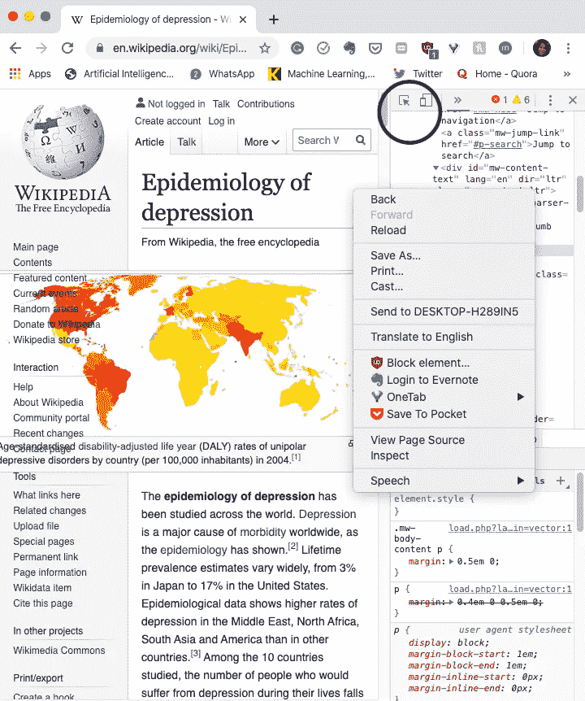
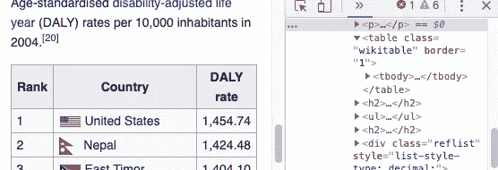
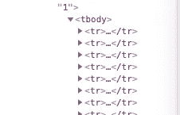
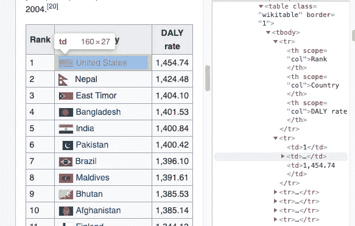
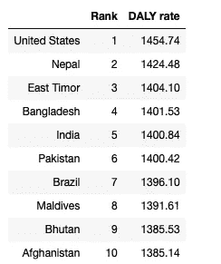
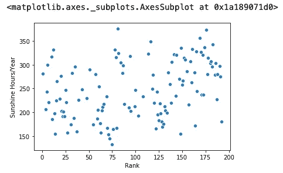
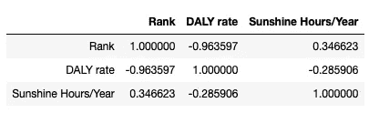

# 分步教程:用 BeautifulSoup 抓取维基百科

> 原文：<https://towardsdatascience.com/step-by-step-tutorial-web-scraping-wikipedia-with-beautifulsoup-48d7f2dfa52d?source=collection_archive---------1----------------------->


我的室友和我讨论了她对瑞典高抑郁率的观察。我们得出了抑郁率和缺少阳光之间的联系。我决定通过收集自己的数据并进行分析来支持我的假设。

我使用 Beautiful Soup，这是一个易于使用的 Python web 抓取工具。我喜欢这个工具的原因是它易于使用和理解。库的文档可以在[这里](https://www.crummy.com/software/BeautifulSoup/bs4/doc/)找到。

# 准备

假设:一个国家的日照时间越少，这个国家的抑郁率就越高。

要收集的数据:

*   国家名称
*   他们的抑郁率
*   他们的日照时间

要使用的资源:

*   [https://en.wikipedia.org/wiki/Epidemiology_of_depression](https://en.wikipedia.org/wiki/Epidemiology_of_depression)
*   [https://en . Wikipedia . org/wiki/List _ of _ cities _ by _ sunshine _ duration](https://en.wikipedia.org/wiki/List_of_cities_by_sunshine_duration)

# 开始

```
import requests
import urllib.request
import time
from bs4 import BeautifulSoup
import numpy as np
import pandas as pd
from urllib.request import urlopenurl = 'https://en.wikipedia.org/wiki/Epidemiology_of_depression'html = urlopen(url) soup = BeautifulSoup(html, 'html.parser')
```



右键单击页面，然后转到检查。单击上面显示的图标，选择网站中要检查的元素。

我们对从表格中提取信息感兴趣。这可以用一行代码轻松完成。通过检查，我们发现这张桌子被贴上了`<table>`标签。



`find_all('table')`扫描整个文档寻找标签`<table>`

```
tables = soup.find_all('table')
```

find_all()是一个简单有效的方法，在本教程中会经常用到。

# 收集数据

因为“，”，看起来`DALY rate`列中的数据在收集时将是一个字符串。创建一个函数，通过使用 re.sub()将字符串处理成整数，这是一个返回与正则表达式匹配的子字符串的方法。

```
import re
def process_num(num):
    return float(re.sub(r'[^\w\s.]','',num))
```

测试功能

```
num1 = float(re.sub(r'[^\w\s.]','','1,156.30'))
num1
```

产量:1156.30

我们来分析一下。

第 6–7 行:我们注意每一行都在`<tr>`标签下。这给了我们一个想法，我们将通过找到所有的标签`<tr>`来得到这些行



第 9–10 行:通过查找所有`<td> tags`来提取行



第 14 行:由于第一行的`len(cells)`是 1，我们设置条件跳过第一行，从其他行提取。

第 15 行:因为`cells`是 3 个单元格的列表，我们使用第一个单元格提取排名，使用第二个单元格提取国家名称，使用第三个单元格提取 DALY 比率。

把数据放入`pandas.DataFrame`

```
df1 = pd.DataFrame(ranks, index= countriescolumns = ['Rank'])df1['DALY rate'] = ratesdf1.head(10)
```



使用与上述相同的方法从第二个网站收集日照时数。请记住，这两个网站的数据有两个不同之处:

*   同一个国家的日照时数有多种数据。因此，我们可能希望取这些数据的平均值，以获得每个国家的小时数。为了取平均值，我们简单地使用两个字典，`country_suns` 和`count`，它们具有相同的关键字但不同的值。
*   第二次数据中的一些国家在第一次数据中没有。因此，我们只想从第一个数据中的国家收集数据，这些数据存储在上面创建的变量`countries`中。

结果:

```
789.14 3
Country: Benin, Sunshine Hours: 263.05
515.99 2
Country: Togo, Sunshine Hours: 258.0
710.25 3
Country: Ghana, Sunshine Hours: 236.75
866.0500000000001 4
Country: Cameroon, Sunshine Hours: 216.51
344.03999999999996 2
Country: Gabon, Sunshine Hours: 172.02
1334.54 5
Country: Nigeria, Sunshine Hours: 266.91
711.91 2
Country: Sudan, Sunshine Hours: 355.95
336.1 1
...
```

# 清理数据

使用 join 方法连接我们之前收集的两个数据。

```
df2 = pd.DataFrame.from_dict(country_suns,orient='index', columns = ['Sunshine Hours/Year'])df = df1.join(df2)df.info()
```

结果:

```
<class 'pandas.core.frame.DataFrame'>
Index: 192 entries, United States to Japan
Data columns (total 3 columns):
Rank                   192 non-null int64
DALY rate              192 non-null float64
Sunshine Hours/Year    122 non-null float64
dtypes: float64(2), int64(1)
memory usage: 11.0+ KB
```

我们意识到最后一列中有空值，因为第一个来源中的一些国家不在第二个来源中。有许多方法可以处理缺失值。但是现在，只需删除缺少值的行，就可以直观地看到我们得到了什么。

```
df.dropna(inplace=True)
```

# 将数据可视化

```
import matplotlib.pyplot as plt
import seaborn as snssns.scatterplot('Rank', 'Sunshine Hours/Year', data=df)
```



这里似乎没有很强的相关性。看一下相关系数。



如果要使用不同的工具处理数据，请保存数据。

```
df.to_csv('wiki-2.csv')
```

# 结论

相关性没有我想象的那么强。但是我们没有考虑到不同的因素，如确定抑郁率的指标的准确性，国家的大小(国家越大，日照时数/年的变化越大)，GDP，人口等。应该收集更多的数据以获得更准确的结果。但在此之前，要为自己感到骄傲，因为你刚刚学会了网络搜集，这是数据科学中最重要的过程之一。

本教程的 Github 库可以在这里找到:[https://github.com/khuyentran1401/Web-Scrapping-Wikipedia](https://github.com/khuyentran1401/Web-Scrapping-Wikipedia)。

我喜欢写一些基本的数据科学概念，并尝试不同的算法和数据科学工具。你可以在 [LinkedIn](https://www.linkedin.com/in/khuyen-tran-1401/) 和 [Twitter](https://twitter.com/KhuyenTran16) 上联系我。

如果你想查看我写的所有文章的代码，请点击这里。在 Medium 上关注我，了解我的最新数据科学文章，例如:

## 参考

[1]抑郁症流行病学，维基百科

[2]根据日照时间列出的城市列表，维基百科

[3]Varun Choudhary，如何抓取网站而不被列入黑名单(2019)，Hackernoon