# 循序渐进:Python 中的 Twitter 情感分析

> 原文：<https://towardsdatascience.com/step-by-step-twitter-sentiment-analysis-in-python-d6f650ade58d?source=collection_archive---------0----------------------->


图片由[皮克斯拜](https://pixabay.com/?utm_source=link-attribution&utm_medium=referral&utm_campaign=image&utm_content=2990424)的 Gerd Altmann 提供

通过分析人们分享的推文，了解人们对一个话题的看法不再困难。情感分析是 NLP(自然语言处理)最流行的用例之一。

在这篇文章中，我将使用**“Tweepy”，**，这是一个易于使用的 Python 库，用于访问 Twitter API。您需要有一个 Twitter 开发人员帐户和样本代码来做这个分析。你可以在我的 [**Github 库中找到 Jupyter 笔记本代码。**](https://github.com/yalinyener/TwitterSentimentAnalysis)

这篇文章的目的是分析人们对伦敦第二次封锁的看法。

# **步骤 1:安装并导入库**

在分析之前，需要使用 ***安装 **textblob** 和 **tweepy** 库！pip 在你的 Jupyter 笔记本上安装*** 命令。

```
# Install Libraries
!pip install textblob
!pip install tweepy
```

您需要导入将在这个情感分析项目中使用的库。

```
# Import Librariesfrom textblob import TextBlob
import sys
import tweepy
import matplotlib.pyplot as plt
import pandas as pd
import numpy as np
import os
import nltk
import pycountry
import re
import stringfrom wordcloud import WordCloud, STOPWORDS
from PIL import Image
from nltk.sentiment.vader import SentimentIntensityAnalyzer
from langdetect import detect
from nltk.stem import SnowballStemmer
from nltk.sentiment.vader import SentimentIntensityAnalyzer
from sklearn.feature_extraction.text import CountVectorizer
```

Tweepy 支持 OAuth 1a(应用程序用户)和 OAuth 2(仅应用程序)身份验证。身份验证由 tweepy 处理。AuthHandler 类。

OAuth 2 是一种身份验证方法，其中应用程序在没有用户上下文的情况下发出 API 请求。如果您只需要对公共信息进行只读访问，请使用此方法。

您首先注册我们的客户端应用程序，并获得一个消费者密钥和秘密。然后创建一个 AppAuthHandler 实例，传入我们的消费者密钥和秘密。

认证之前，你需要有 **Twitter 开发者账号。**如果没有，可以通过使用此 [**链接**](https://developer.twitter.com/) 进行申请。获得 Twitter 开发者账户通常需要一两天，有时甚至更长时间，你的申请才会被 Twitter 审核。

# 步骤 Twitter API 的认证

```
# Authentication
consumerKey = “Type your consumer key here”
consumerSecret = “Type your consumer secret here”
accessToken = “Type your accedd token here”
accessTokenSecret = “Type your access token secret here”auth = tweepy.OAuthHandler(consumerKey, consumerSecret)
auth.set_access_token(accessToken, accessTokenSecret)
api = tweepy.API(auth)
```

在您认证之后，您需要使用 tweepy 获取文本，并使用 Textblob 从文本中计算出**正**、**负**、**中性**、**极性**和**复合**参数。

# 第三步:获取带有关键词或标签的推文

```
#Sentiment Analysisdef percentage(part,whole):
 return 100 * float(part)/float(whole)keyword = input(“Please enter keyword or hashtag to search: “)
noOfTweet = int(input (“Please enter how many tweets to analyze: “))tweets = tweepy.Cursor(api.search, q=keyword).items(noOfTweet)
positive = 0
negative = 0
neutral = 0
polarity = 0
tweet_list = []
neutral_list = []
negative_list = []
positive_list = []for tweet in tweets:

 #print(tweet.text)
 tweet_list.append(tweet.text)
 analysis = TextBlob(tweet.text)
 score = SentimentIntensityAnalyzer().polarity_scores(tweet.text)
 neg = score[‘neg’]
 neu = score[‘neu’]
 pos = score[‘pos’]
 comp = score[‘compound’]
 polarity += analysis.sentiment.polarity

 if neg > pos:
 negative_list.append(tweet.text)
 negative += 1elif pos > neg:
 positive_list.append(tweet.text)
 positive += 1

 elif pos == neg:
 neutral_list.append(tweet.text)
 neutral += 1positive = percentage(positive, noOfTweet)
negative = percentage(negative, noOfTweet)
neutral = percentage(neutral, noOfTweet)
polarity = percentage(polarity, noOfTweet)
positive = format(positive, ‘.1f’)
negative = format(negative, ‘.1f’)
neutral = format(neutral, ‘.1f’)
```

这篇文章中的场景是这样的，用户应该键入关键字或标签( **lockdown2 london** )并键入想要获取和分析多少条推文( **2500** )。

因为有限制，tweets 参数的数量很重要。

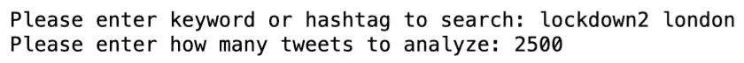

作者图片

在收到 2500 条关于“**封锁伦敦**”的推文后，让我们看看有多少条推文表达了这种情绪

```
#Number of Tweets (Total, Positive, Negative, Neutral)tweet_list = pd.DataFrame(tweet_list)
neutral_list = pd.DataFrame(neutral_list)
negative_list = pd.DataFrame(negative_list)
positive_list = pd.DataFrame(positive_list)
print(“total number: “,len(tweet_list))
print(“positive number: “,len(positive_list))
print(“negative number: “, len(negative_list))
print(“neutral number: “,len(neutral_list))
```

你会收到 2500 条推文。

*   **1025 条推文(41.0%)** 包含正面情绪
*   **580 条(23.2%)** 条推文中包含负面情绪
*   **895 条(35.8%)** 条推文包含中性情绪

```
#Creating PieCartlabels = [‘Positive [‘+str(positive)+’%]’ , ‘Neutral [‘+str(neutral)+’%]’,’Negative [‘+str(negative)+’%]’]
sizes = [positive, neutral, negative]
colors = [‘yellowgreen’, ‘blue’,’red’]
patches, texts = plt.pie(sizes,colors=colors, startangle=90)
plt.style.use(‘default’)
plt.legend(labels)
plt.title(“Sentiment Analysis Result for keyword= “+keyword+”” )
plt.axis(‘equal’)
plt.show()
```

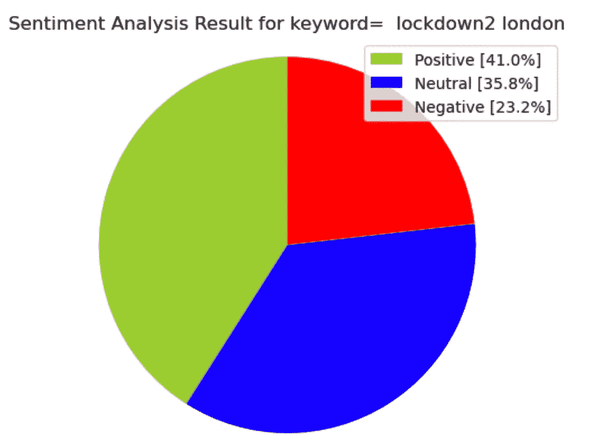

作者图片

让我们看看推文列表。

```
tweet_list
```

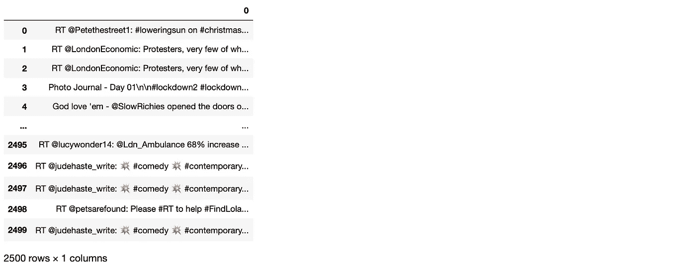

作者图片

# 第四步:清理推文以分析情绪

当你查看 tweet 列表时，你可以看到一些重复的 tweet，所以你需要使用 **drop_duplicates** 函数删除重复的记录。

```
tweet_list.drop_duplicates(inplace = True)
```

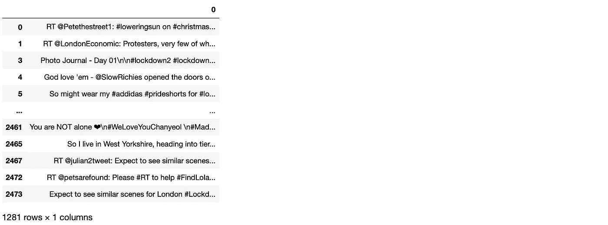

作者图片

我们的新数据框有 **1281** 条独特的推文。

首先，我创建一个新的数据框(tw_list)和一个新的特征(text)，然后使用 lambda 函数清洗文本，清洗 RT、link、标点符号字符，最后转换成小写。

```
#Cleaning Text (RT, Punctuation etc)#Creating new dataframe and new features
tw_list = pd.DataFrame(tweet_list)
tw_list[“text”] = tw_list[0]#Removing RT, Punctuation etc
remove_rt = lambda x: re.sub(‘RT @\w+: ‘,” “,x)
rt = lambda x: re.sub(“(@[A-Za-z0–9]+)|([⁰-9A-Za-z \t])|(\w+:\/\/\S+)”,” “,x)
tw_list[“text”] = tw_list.text.map(remove_rt).map(rt)
tw_list[“text”] = tw_list.text.str.lower()
tw_list.head(10)
```

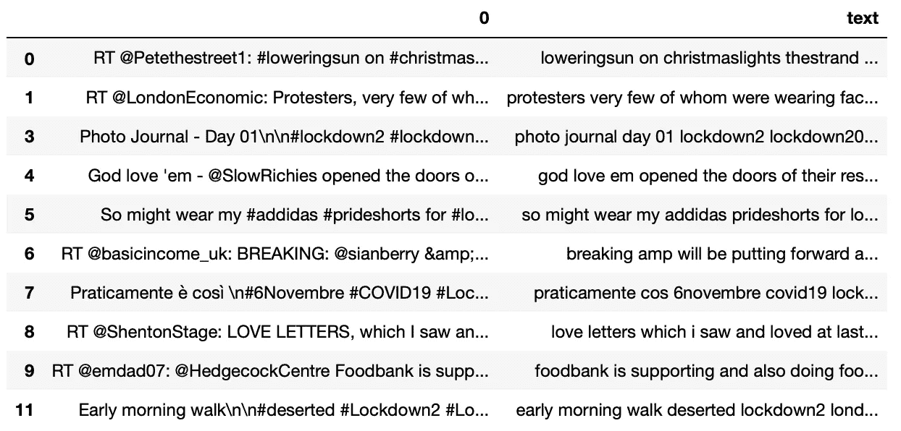

作者图片

# 第五步:情感分析

现在，我可以使用清理后的文本再次计算极性、主观性、情绪、负面、正面、中性和复合参数。对于所有计算的参数，我在数据框中创建新要素

```
#Calculating Negative, Positive, Neutral and Compound valuestw_list[[‘polarity’, ‘subjectivity’]] = tw_list[‘text’].apply(lambda Text: pd.Series(TextBlob(Text).sentiment))
for index, row in tw_list[‘text’].iteritems():
 score = SentimentIntensityAnalyzer().polarity_scores(row)
 neg = score[‘neg’]
 neu = score[‘neu’]
 pos = score[‘pos’]
 comp = score[‘compound’]
 if neg > pos:
 tw_list.loc[index, ‘sentiment’] = “negative”
 elif pos > neg:
 tw_list.loc[index, ‘sentiment’] = “positive”
 else:
 tw_list.loc[index, ‘sentiment’] = “neutral”
 tw_list.loc[index, ‘neg’] = neg
 tw_list.loc[index, ‘neu’] = neu
 tw_list.loc[index, ‘pos’] = pos
 tw_list.loc[index, ‘compound’] = comptw_list.head(10)
```

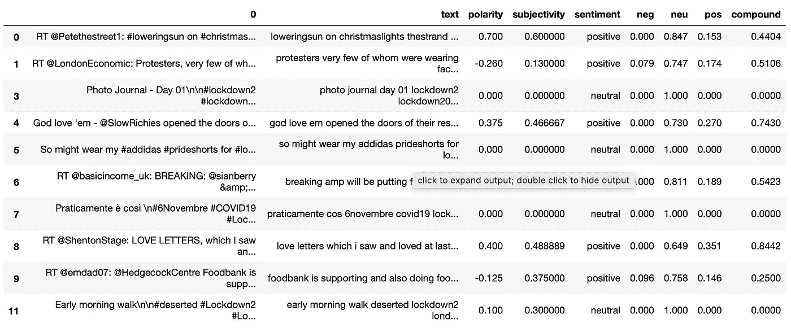

作者图片

您可以根据情绪将数据框分为 3 组。对于这一个，创建 3 个新数据帧(tw_list_negative、tw_list_positive、tw_list_neutral)并从原始 tw_list 数据帧导入

```
#Creating new data frames for all sentiments (positive, negative and neutral)tw_list_negative = tw_list[tw_list[“sentiment”]==”negative”]
tw_list_positive = tw_list[tw_list[“sentiment”]==”positive”]
tw_list_neutral = tw_list[tw_list[“sentiment”]==”neutral”]
```

让我们计算情感特征的值，并查看总百分比。

#单列中 count _ values _ 的函数

```
def count_values_in_column(data,feature):
 total=data.loc[:,feature].value_counts(dropna=False)
 percentage=round(data.loc[:,feature].value_counts(dropna=False,normalize=True)*100,2)
 return pd.concat([total,percentage],axis=1,keys=[‘Total’,’Percentage’])#Count_values for sentiment
count_values_in_column(tw_list,”sentiment”)
```

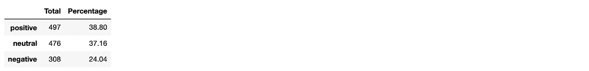

作者图片

你可以通过使用情绪推文的数量来创建一个图表。

```
# create data for Pie Chart
pichart = count_values_in_column(tw_list,”sentiment”)
names= pc.index
size=pc[“Percentage”]

# Create a circle for the center of the plot
my_circle=plt.Circle( (0,0), 0.7, color=’white’)
plt.pie(size, labels=names, colors=[‘green’,’blue’,’red’])
p=plt.gcf()
p.gca().add_artist(my_circle)
plt.show()
```

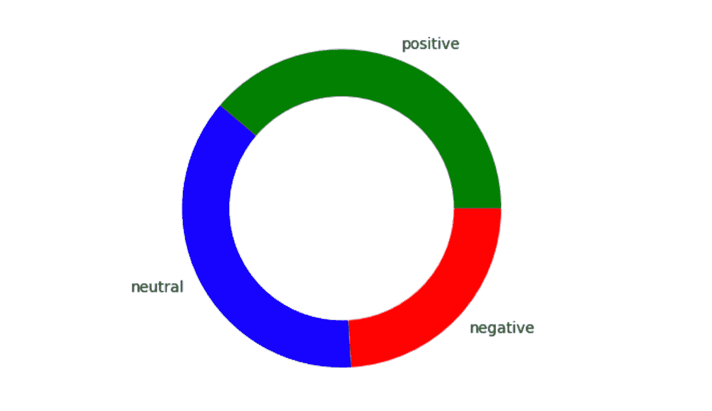

作者图片

现在你可以准备使用 1281 条推文创建 worcloud，这样你就可以知道哪些词在这些推文中使用得最多。要创建 worcloud，首先让我们定义下面的函数，这样你就可以再次使用 wor cloud 来处理所有的推文，正面推文，负面推文等等。

```
#Function to Create Wordclouddef create_wordcloud(text):
 mask = np.array(Image.open(“cloud.png”))
 stopwords = set(STOPWORDS)
 wc = WordCloud(background_color=”white”,
 mask = mask,
 max_words=3000,
 stopwords=stopwords,
 repeat=True)
 wc.generate(str(text))
 wc.to_file(“wc.png”)
 print(“Word Cloud Saved Successfully”)
 path=”wc.png”
 display(Image.open(path))
```

定义了这个函数后，你就可以查看所有推文的 wordcloud 了

```
#Creating wordcloud for all tweets
create_wordcloud(tw_list[“text”].values)
```


作者图片

针对具有积极情绪的推文的词云；

```
#Creating wordcloud for positive sentiment
create_wordcloud(tw_list_positive[“text”].values)
```


作者图片

针对带有负面情绪的推文的词云；

```
#Creating wordcloud for negative sentiment
create_wordcloud(tw_list_negative[“text”].values)
```

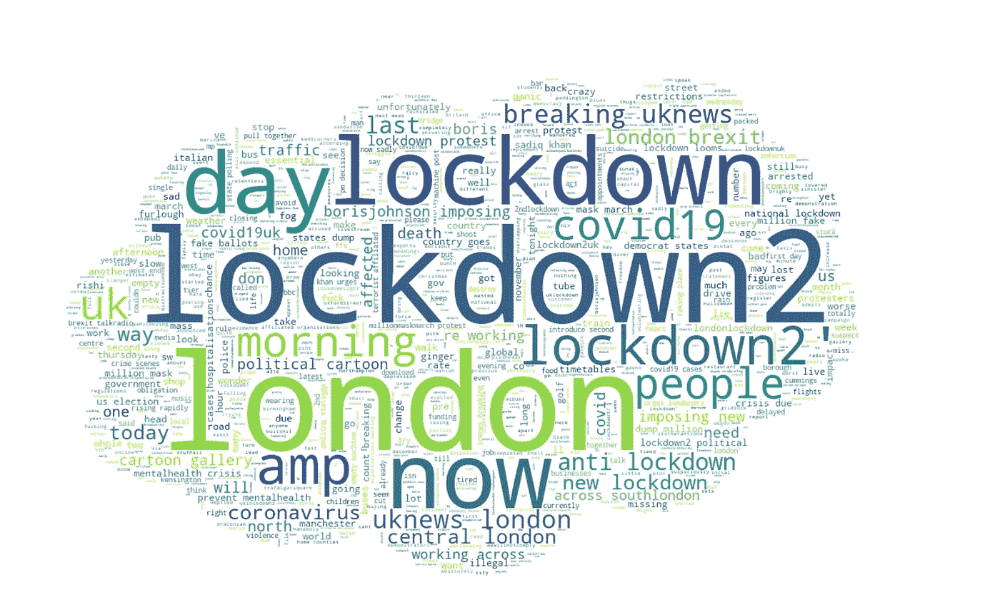

作者图片

我们来计算一下推文长度和字数。因此，你可以看到基于不同情绪的推文中使用的单词和字符的密度。

```
#Calculating tweet’s lenght and word count
tw_list[‘text_len’] = tw_list[‘text’].astype(str).apply(len)
tw_list[‘text_word_count’] = tw_list[‘text’].apply(lambda x: len(str(x).split()))round(pd.DataFrame(tw_list.groupby("sentiment").text_len.mean()),2)
```

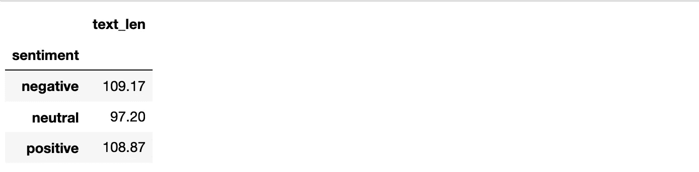

作者图片

```
round(pd.DataFrame(tw_list.groupby(“sentiment”).text_word_count.mean()),2)
```

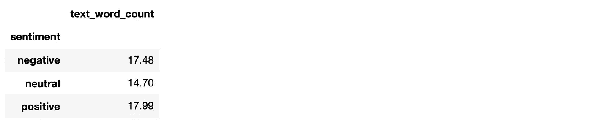

作者图片

应用计数矢量器可在生成矢量表示之前对文本数据进行预处理，使其成为高度灵活的文本特征表示模块。在计数矢量器之后，可以用两个或三个或者任何你想要的来分析单词。

应用词干分析器还可以提供单词的词根。所以你可以排除来自同一个词根的单词，比如；

*   连接
*   关系
*   连接的
*   连接
*   连接

来源于**“连接”。如果您应用词干分析器功能，您可以认为这些单词是相同的**

```
#Removing Punctuation
def remove_punct(text):
 text = “”.join([char for char in text if char not in string.punctuation])
 text = re.sub(‘[0–9]+’, ‘’, text)
 return texttw_list[‘punct’] = tw_list[‘text’].apply(lambda x: remove_punct(x))#Appliyng tokenization
def tokenization(text):
    text = re.split('\W+', text)
    return texttw_list['tokenized'] = tw_list['punct'].apply(lambda x: tokenization(x.lower()))#Removing stopwords
stopword = nltk.corpus.stopwords.words('english')
def remove_stopwords(text):
    text = [word for word in text if word not in stopword]
    return text

tw_list['nonstop'] = tw_list['tokenized'].apply(lambda x: remove_stopwords(x))#Appliyng Stemmer
ps = nltk.PorterStemmer()def stemming(text):
    text = [ps.stem(word) for word in text]
    return texttw_list['stemmed'] = tw_list['nonstop'].apply(lambda x: stemming(x))#Cleaning Text
def clean_text(text):
    text_lc = "".join([word.lower() for word in text if word not in string.punctuation]) # remove puntuation
    text_rc = re.sub('[0-9]+', '', text_lc)
    tokens = re.split('\W+', text_rc)    # tokenization
    text = [ps.stem(word) for word in tokens if word not in stopword]  # remove stopwords and stemming
    return texttw_list.head()
```

应用 countverctorizer 后，两个结果显示所有 1281 条 tweets 有 2966 个独特的单词。

如果您看一下我们的数据框，您会看到一些新功能，如点状、标记化、不间断、词干化。

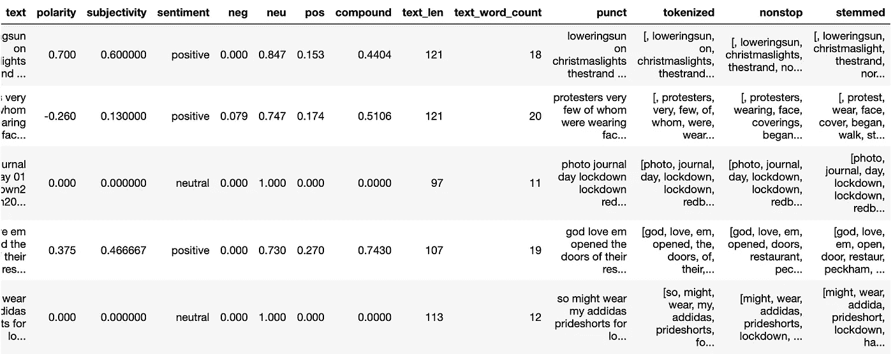

作者图片

现在，您可以应用 coun 矢量器将所有 2966 个唯一的单词视为一个新功能。

```
#Appliyng Countvectorizer
countVectorizer = CountVectorizer(analyzer=clean_text) 
countVector = countVectorizer.fit_transform(tw_list[‘text’])
print(‘{} Number of reviews has {} words’.format(countVector.shape[0], countVector.shape[1]))
#print(countVectorizer.get_feature_names())1281 Number of reviews has 2966 wordscount_vect_df = pd.DataFrame(countVector.toarray(), columns=countVectorizer.get_feature_names())
count_vect_df.head()
```

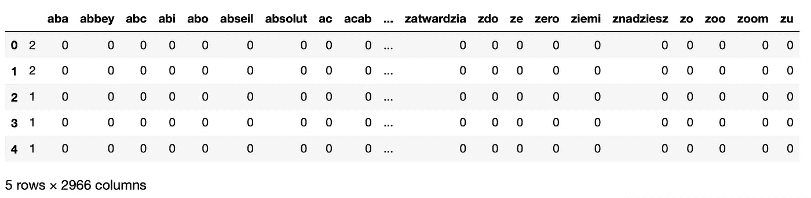

作者图片

您可以按降序对值进行排序，以查看最常用的单词

```
# Most Used Words
count = pd.DataFrame(count_vect_df.sum())
countdf = count.sort_values(0,ascending=False).head(20)
countdf[1:11]
```

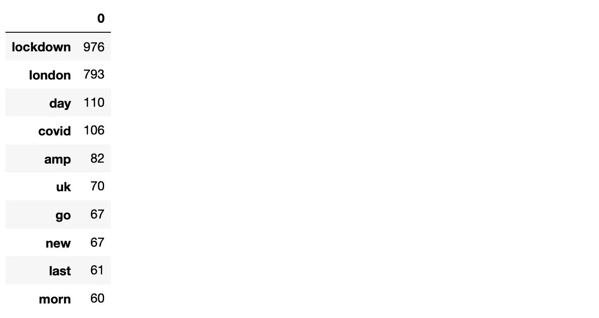

作者图片

建立 n 元模型有助于我们预测最有可能出现在这个序列之后的单词。首先让我们创建一个函数，然后构建 n2_bigram，n3_trigram 等。

```
#Function to ngram
def get_top_n_gram(corpus,ngram_range,n=None):
 vec = CountVectorizer(ngram_range=ngram_range,stop_words = ‘english’).fit(corpus)
 bag_of_words = vec.transform(corpus)
 sum_words = bag_of_words.sum(axis=0) 
 words_freq = [(word, sum_words[0, idx]) for word, idx in vec.vocabulary_.items()]
 words_freq =sorted(words_freq, key = lambda x: x[1], reverse=True)
 return words_freq[:n]#n2_bigram
n2_bigrams = get_top_n_gram(tw_list[‘text’],(2,2),20)n2_bigrams
```

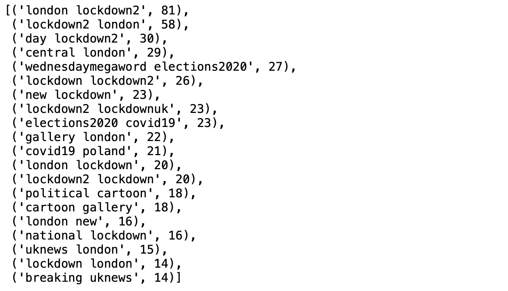

作者图片

```
#n3_trigram
n3_trigrams = get_top_n_gram(tw_list[‘text’],(3,3),20)n3_trigrams
```

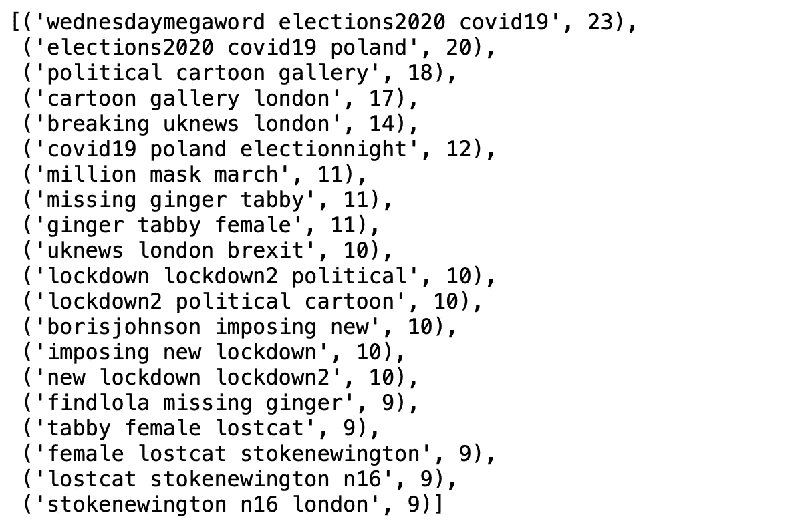

作者图片

最后，你可以使用 tweets 来分析情绪，你可以意识到哪些词最常用，哪些词一起使用。

感谢你阅读我的帖子，希望你喜欢。如果您有任何问题或想要分享您的意见，请随时联系我。