# Python 中使用 Selenium 的分步 Web 抓取项目

> 原文：<https://towardsdatascience.com/step-by-step-web-scraping-project-using-selenium-in-python-3be887e6e35c?source=collection_archive---------17----------------------->

## 选择网站，在 Python 中设置 Selenium，抓取数据并分析。

Selenium 是数据科学中的一个强大工具。它的用途之一是自动收集网站上公开的数据。使用 Python 中的 Selenium，您可以自动化 web 浏览器访问网站上的数据，收集并存储在 MySQL、CSV 文件等中。

> 这个项目是在华沙大学数据科学研究生学习期间与 T2 的 Jorge Bueno Perez 和 T4 的 Noam Shmuel 一起完成的。

在这个分步指南中，您将看到如何使用 Selenium Python 从网站[**www.openaq.org**](https://openaq.org/#/?_k=l3sffn)获取数据，并创建如下图所示的箱线图。

## 最终结果将是这样的:

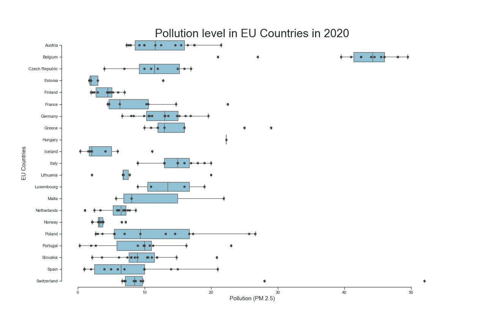

显示 2020 年不同欧盟国家空气污染的箱线图

> 箱线图显示了欧盟国家 PM 2.5 空气污染水平的数据。 [PM 2.5 是在空气中测量的颗粒物](https://en.wikipedia.org/wiki/Particulates)。简而言之，数字越大，空气质量越差。

## 我们将通过 Selenium 实现什么自动化:

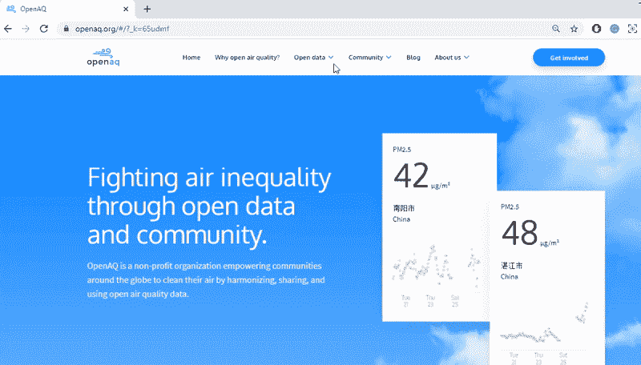

从网站收集 PM 2.5 数据的手动过程

# 本文涵盖以下主题:

1.  选择网站
2.  在 Python 中设置 Selenium
3.  从网站抓取数据并存储
4.  使用 Python 中的 Seaborn boxplot 分析数据

# 1.选择网站

在你决定删除哪个网站之前，一个自然的问题来了——从网站上删除数据合法吗？

如果你想知道网站上是否允许抓取，首先你应该检查链接上的信息:在网站的末尾添加“robots.txt”。例如:[www.examplewebsite.com**/robots . txt**](http://www.website.come/robots.txt)

让我们看看我们是否能废弃 Facebook.com。当你打开链接[www.Facebook.com**/robots . txt**](https://www.facebook.com/robots.txt)你会看到以下信息:

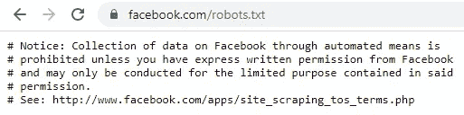

上面明确写着你需要脸书的特别授权才能销毁这些数据。为了更好地理解 Robots.txt，请点击查看更多信息。

总是建议在知识共享协议下许可的、有开放数据源的或在 Robots.txt 中不禁止抓取的网站上使用抓取。

由于这个项目是非商业性的，并且网站[**【www.openaq.org】**](http://www.openaq.org)有开放的数据，可以通过多种方式访问，我们决定用它来进行抓取。他们甚至鼓励人们[在他们令人敬畏的 FAQ 中使用数据做好事](https://github.com/openaq/openaq-info/blob/master/FAQ.md#whatis),值得一查！

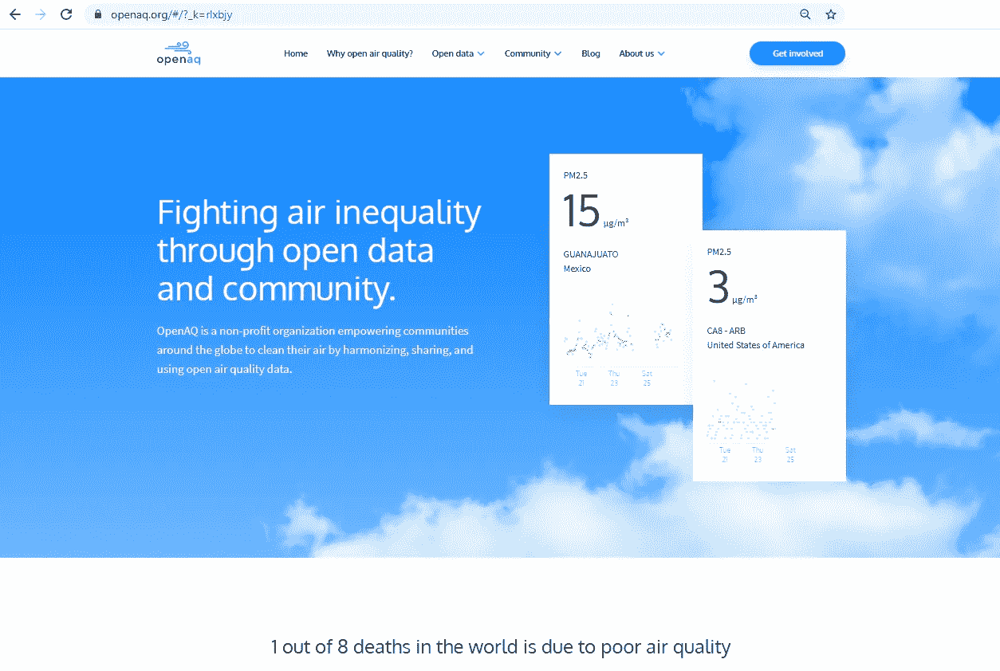

[www.openaq.org](https://openaq.org/#/?_k=rlxbjy)

## 收集什么数据？

在这个网站上，我们决定删除关于国家和 PM 2.5 信息的数据。为了做到这一点，我们希望过滤 PM 2.5，并为每个国家访问位置卡。然后复制 PM 2.5 数据(是一个数字)。**基本上，我们想做的和下面的 gif 一样。**

从网站收集 PM 2.5 数据的手动过程

看起来很累很无聊吧？访问大约 100 个国家的页面，每个国家有多达 15 个位置。喔喔喔！！！不会吧。**但好消息是 Selenium 可以为我们实现自动化**。但是！我们需要设置这个。

# 2.在 Python 中设置 Selenium

你应该在你的电脑里安装 Selenium。只需在命令提示符下键入***pip install selenium***(对于 Windows)并按回车键。有关安装的更多详细信息，请参见 [Selenium 文档](https://selenium-python.readthedocs.io/installation.html)。

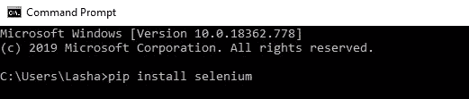

从命令提示符安装 Selenium

然后你需要一个驱动程序，作为 Selenium 访问你的浏览器的桥梁。就我而言，我为 Mozilla Firefox 下载了一个 ***geckodriver*** 。取决于您的版本，您可以从这里下载:

**火狐**:[https://github.com/mozilla/geckodriver/releases](https://github.com/mozilla/geckodriver/releases)

考虑到你下载了 ***geckodriver*** ，将其解压，并复制粘贴***geckodriver.exe***到你的 python 所在的文件夹中。

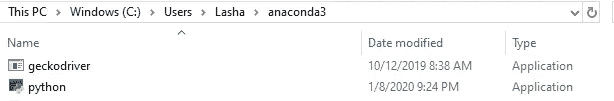

将 geckodrive.exe 复制粘贴到 python app 所在的文件夹中(我的案例)

创建一个. py 文件并导入主库和包。

Selenium 的主要库和包

然后我们需要找到到我们的***geckodriver.exe***的路径，并用 python 代码设置 webdriver，如下所示。

Python 中的 WebDriver 设置

# 3.从网站抓取数据并存储

抓取工作流程如下所示:

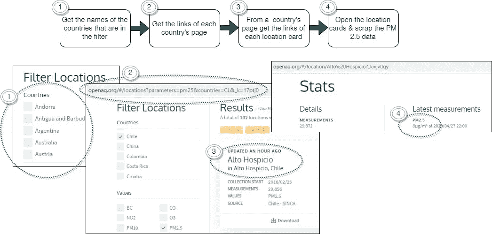

刮擦 4 步工作流程

## 3.1 获取过滤器中的国家名称

我们需要与过滤器中的国家名称完全相同的拼写。从过滤器中获取值似乎有点困难。相反，我们可以从这个[链接](https://openaq.org/#/countries?_k=t0gtqr)中获得所有国家的名称。它们将具有相同的拼写。

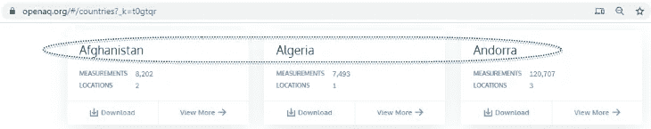

如果您右键单击国家名称并转到 Inspect 元素，您将看到国家名称保存在 class **card__title 中。**

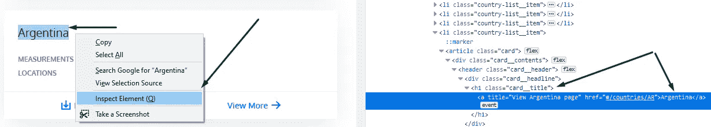

废弃国名代码的主要部分如下所示:([全称](https://github.com/LashaGoch/SeleniumPythonProject/blob/master/Code/Get1Countries.py))

结果是一个保存在 CSV 文件中的国家列表。

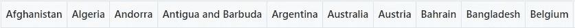

## 3.2 获取每个国家页面的链接

我们希望有网站时，每个国家都在过滤器中选择迭代。我们将使用刚刚生成的 CSV 文件中的国家名称。

我们要删除的链接:

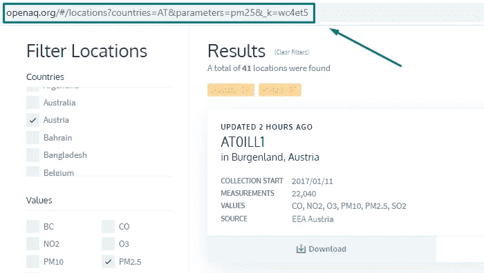

以奥地利网站为例

代码:

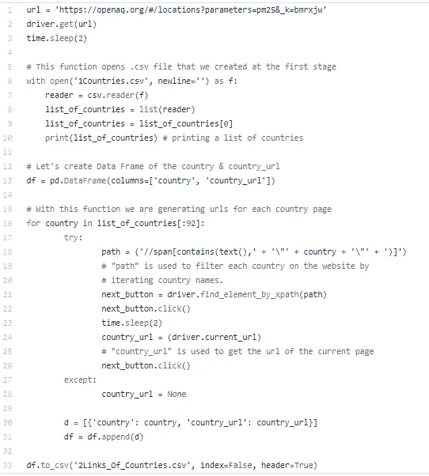

[Github Gist 上的代码](https://gist.github.com/LashaGoch/da23c5b089ddc9c4c45d643226f2986c)

此步骤的结果是生成包含国家/地区& country_url(某个国家/地区的网站)的 CSV 文件。完整的代码是[这里是](https://github.com/LashaGoch/SeleniumPythonProject/blob/master/Code/Get2LinksOfCountries.py)。这些链接将在下一步中使用。

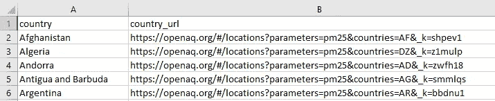

在步骤 3.2 中生成的 CSV 文件

## 3.3 从一个国家的页面，获取每个位置卡的链接

基本上，我们希望获得访问每个位置卡的链接:

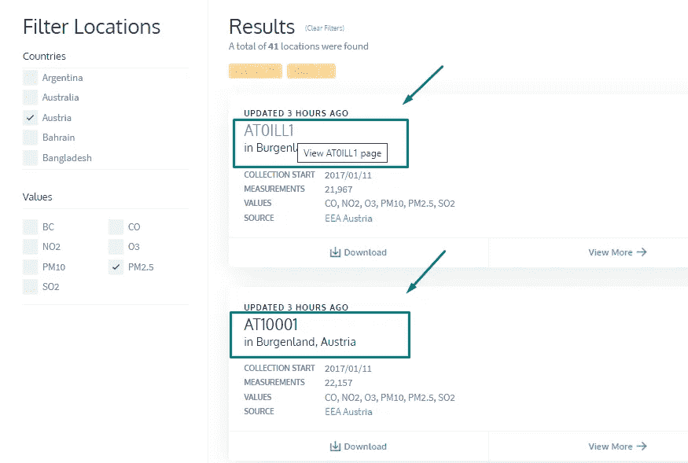

访问每个位置卡的链接

我们可以通过类名删除位置卡的链接，并检索 href。

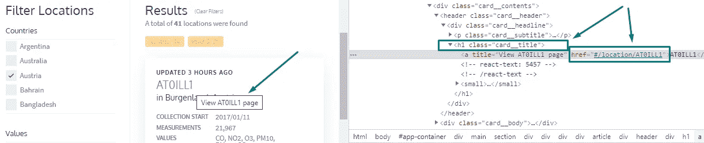

检查位置卡标题、类名和 href 的元素

刮位置卡链接功能及代码:([全代码](https://github.com/LashaGoch/SeleniumPythonProject/blob/master/Code/Get3LinksOfCards.py))

## 3.4 打开位置卡，废弃 PM 2.5 数据

这是刮的最后一步。由于我们有每个位置卡的链接，我们可以访问每个卡上的 PM 2.5 数据并将其废弃。此外，我们将废弃同一页上的位置城市和国家。

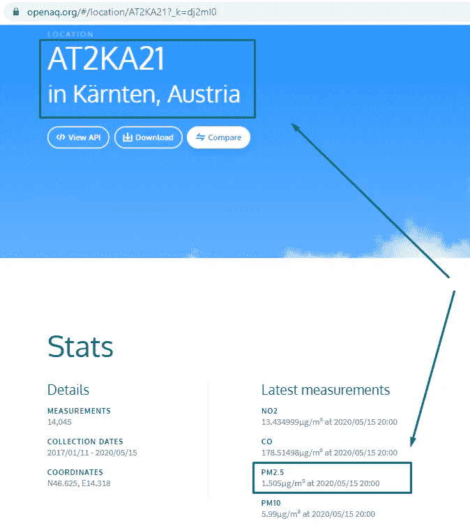

AT2KA21 的位置卡

用 XPath 获取 PM 2.5 数据并分成不同的变量:([完整代码](https://github.com/LashaGoch/SeleniumPythonProject/blob/master/Code/Get4Details.py))

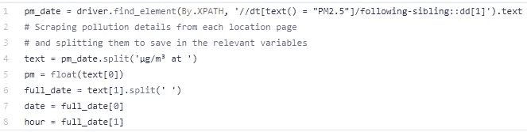

用 XPath 获取 PM 2.5 数据，Github Gist 上的[代码](https://gist.github.com/LashaGoch/457ab1abcde7ff4da53045b7e6f75e55)

获取位置细节并分解成变量:

获取位置细节，Github Gist 上的[代码](https://gist.github.com/LashaGoch/8b324cde91440e52451863db8d4b901b)

如果您看到完整的代码，我们会将在这一步收集的所有数据保存到 CSV 文件中。

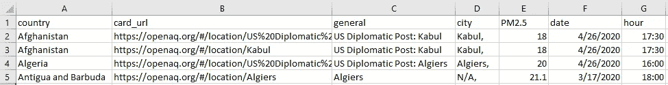

步骤 3.4 的结果

# 4.使用 Python 中的 Seaborn boxplot 分析数据

在我们创建 Seaborn 箱线图之前，有几个数据操作步骤。过滤数据 PM 2.5 > 0；日期创建于 2020 年，仅限欧盟国家:

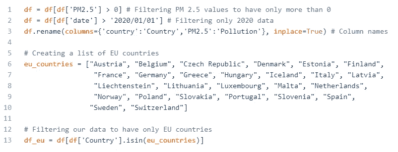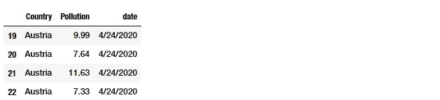

[Github Gist 上的过滤代码](https://gist.github.com/LashaGoch/c789e228dc48b3b55b28f96cf7922f57)

Seaborn Boxplot 的背景:

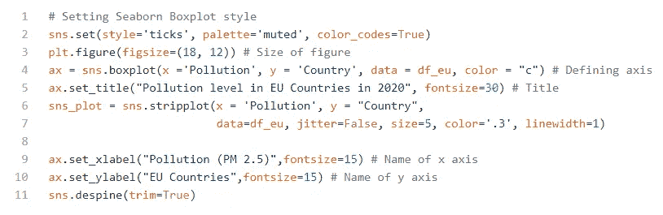

[Github Gist 上的 Seaborn Boxplot 代码](https://gist.github.com/LashaGoch/b83bb861746f464990169c0a7d5292f5)

# 结果是:

显示 2020 年不同欧盟国家空气污染的箱线图