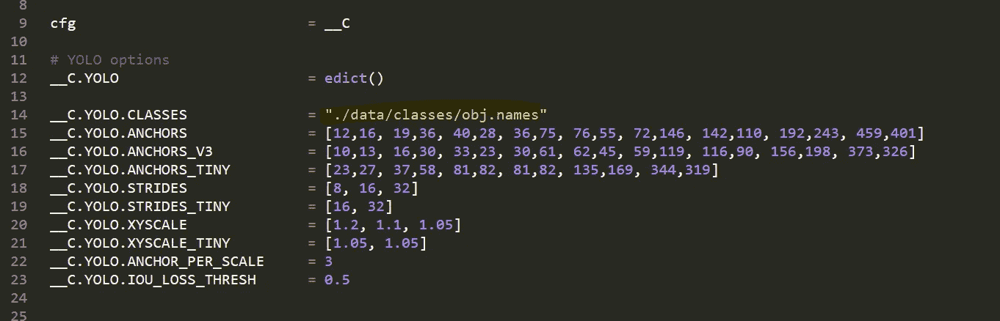
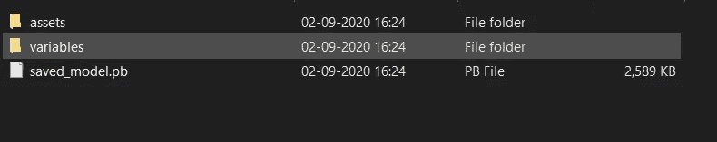

# 逐步使用 Flask & Python 部署自定义对象检测

> 原文：<https://towardsdatascience.com/step-by-step-yolo-model-deployment-in-localhost-using-python-8537e93a1784?source=collection_archive---------2----------------------->

## *自定义对象检测本地主机部署*


照片由[埃米尔·佩龙](https://unsplash.com/@emilep?utm_source=medium&utm_medium=referral)在 [Unsplash](https://unsplash.com?utm_source=medium&utm_medium=referral) 上拍摄

你只看一次(YOLO)是一个最先进的，实时对象检测系统。最新版本是 YOLOV5。这些 YOLO 型号以速度著称。他们可以在几秒钟内检测到视频帧中的多个对象。与 EfficientDet 和 RetinaNet 等模型相比，YOLO 模型的推理时间更短。YOLO 以其检测图像/视频中物体的速度而闻名。如果您的使用案例更关注多个对象的实时检测，那么 YOLO 是最合适的。现在，我们有 YOLO V5，它的小型版本大约有 **476 FPS** 。

在本文中，我将带您完成在 localhost 中部署您自己的定制 YOLO 模型的步骤。

> 那我们开始吧

在这里，我将简要介绍所有其他步骤，因为我们的议程是部署模型并在我们的网站上使用它。

1.  **抓取图像进行标注:**这是第一步。在这里，你可以去谷歌搜索你想要定制的图片。或者，您可以四处查看并单击对象的照片，然后为模型收集这些照片。这是你的选择，你希望你的模型有多好。
2.  **给你的图片贴标签。**为这一步提供大量数据，因为这对您的准确性至关重要。您可以使用任何工具来标注数据。没有自动标记自定义数据的方法。你必须手动操作。这是客体滞留中最令人沮丧也是最费时的部分，但是如果你把你的奉献给这一部分，你肯定会得到一个丰硕的成果。我使用了“LabelImg”工具进行标注。要了解更多关于“LabelImg”工具如何工作的信息，请阅读本文[如何为对象检测标记图像](https://medium.com/@pranjalAI/how-to-label-images-for-object-detection-step-by-step-7ee317f98583)。
3.  **选择物体检测算法**这里，我们将使用 YOLO-泰尼。并且，您可以在此处参考自定义对象检测代码。[https://github.com/pranjalAI/Yolo-tiny-insurance](https://github.com/pranjalAI/Yolo-tiny-insurance)还有许多其他方法用于对象检测，如 SSD、Yolo 等。
4.  从第 3 步获得 Yolo 权重文件后，您需要转换 Yolo 生成的暗网模型。权重文件到 TensorFlow 服务，以便我们可以使用 TensorFlow 服务到我们的网页。

如果你已经到达这里。干杯！！你做得很好。您已经准备好将您的模型投入生产。


威尔·斯图尔特在 [Unsplash](https://unsplash.com?utm_source=medium&utm_medium=referral) 上拍摄的照片

皈依。重量文件是暗网格式到 TensorFlow 格式，你需要按照以下步骤。

> **暗网转张量流**

克隆这个目录[https://github.com/pranjalAI/tensorflow-yolov4-tflite](https://github.com/pranjalAI/tensorflow-yolov4-tflite)

使用命令提示符进入目录。


照片由[沙哈达特·拉赫曼](https://unsplash.com/@hishahadat?utm_source=medium&utm_medium=referral)在 [Unsplash](https://unsplash.com?utm_source=medium&utm_medium=referral) 上拍摄

现在，您需要安装一些依赖项/库。

> **安装库**

如果您安装了 anaconda，那么您需要按照这个步骤在一个环境中安装所有需要的库。这将创造一个新的环境。环境名可以在。yml 文件。

```
# Tensorflow CPU
conda env create -f conda-cpu.yml
conda activate yolov4-cpu# Tensorflow GPU
conda env create -f conda-gpu.yml
conda activate yolov4-gpu
```

如果您没有安装 conda，那么请使用 pip 命令。我建议使用康达。

```
# TensorFlow CPU
pip install -r requirements.txt# TensorFlow GPU
pip install -r requirements-gpu.txt
```

因此，创建了具有各自依赖性的新环境。现在，要使用新创建的环境，您需要激活它。(这一步是为那些正在使用康达创造环境的人准备的。)


[粘土堤](https://unsplash.com/@claybanks?utm_source=medium&utm_medium=referral)在 [Unsplash](https://unsplash.com?utm_source=medium&utm_medium=referral) 上拍照

> 激活环境

> **康达激活 yolov4-gpu**

这里“yolov4-gpu”是环境名。您可以在中更改它。yml 文件。(这一步是为那些正在使用康达创造环境的人准备的。)如果您正在使用 pip，则直接进行下一步。

现在，如果您进入了刚刚克隆的文件夹，并且已经激活了环境，最后，您需要在克隆的文件夹中进行两项更改。

首先，复制并粘贴您的自定义。重量文件，你用你的 Yolo 模型训练，到'数据'文件夹，并复制和粘贴您的自定义。“数据/类/”文件夹中。

其次，您需要对代码进行的唯一更改是在“core/config.py”文件的第 14 行。更新代码以指向您的自定义。名称文件如下所示。(我的习俗。names 文件称为 custom.names，但您的名称可能不同)



**注意:**如果你使用的是预先训练好的 yolov4，那么确保第 14 行仍然是 **coco.names** 。

开始了。！现在，我们需要一个命令行来使代码 TensorFlow 兼容

[](https://medium.com/better-programming/9-handy-python-functions-for-programmers-cc391a59acc7) [## 程序员的 9 个方便的 Python 函数

### 根据我个人的脚本编写经验

medium.com](https://medium.com/better-programming/9-handy-python-functions-for-programmers-cc391a59acc7) 

python save_model.py - weights。/data/your _ weight _ file . weights-output。/check points/yolo-tiny-416-input _ size 416-型号 yolov4

这里，416 是您在训练 yolo-tiny 时在配置文件中定义的图像大小。运行上述命令后，您将获得一个. pb 文件



现在，您需要在检测对象时给出这个文件夹的位置。现在，喝杯茶。搜索您可以使用的任何 HTML 模板。我们可以在这里讨论一些 HTML 的东西，但是，我们将在下次做。这里，我假设您已经准备好了一个演示网页。


照片由[曼基·金](https://unsplash.com/@kimdonkey?utm_source=medium&utm_medium=referral)在 [Unsplash](https://unsplash.com?utm_source=medium&utm_medium=referral) 上拍摄

> **使用 flask 服务 TensorFlow 模型**

现在我们有了 TensorFlow 服务模型。现在，我们需要使用 flask 将它提供给我们的网页。

现在，将这个最终的对象检测和裁剪代码粘贴到您获得 TensorFlow 服务模型的同一个根文件夹中(检查上面的步骤)。

现在，您的 flask 应用程序将调用它来检测图像。

> **最终演示**

工作演示

所以，恭喜你！您刚刚使用 Flask 在本地主机上部署了第一个自定义对象检测模型。尝试使用您的自定义对象，并对您部署的自定义对象检测模型进行注释。

> *在你走之前……*

如果你喜欢这篇文章，并且想继续关注更多关于 **Python &数据科学**的**精彩文章**——请点击这里[https://pranjalai.medium.com/membership](https://pranjalai.medium.com/membership)考虑成为一名中级会员。

请考虑使用[我的推荐链接](https://pranjalai.medium.com/membership)注册。通过这种方式，会员费的一部分归我，这激励我写更多关于 Python 和数据科学的令人兴奋的东西。

还有，可以随时订阅我的免费简讯: [**Pranjal 的简讯**](https://pranjalai.medium.com/subscribe) 。