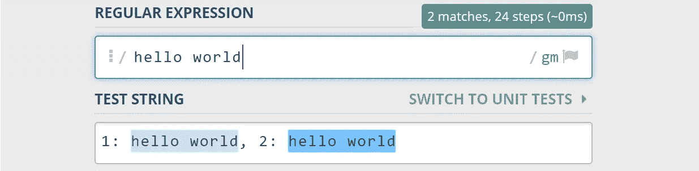
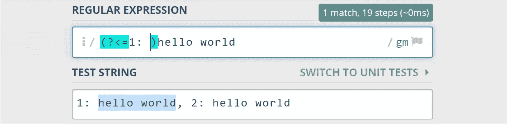
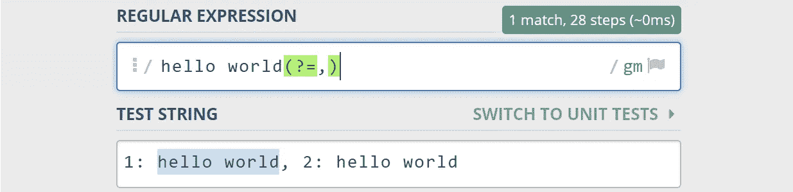
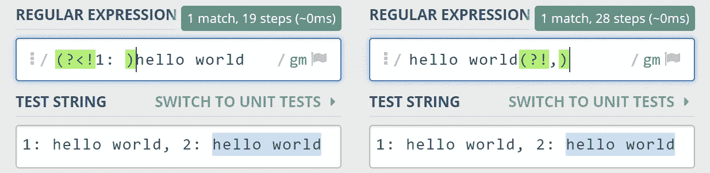
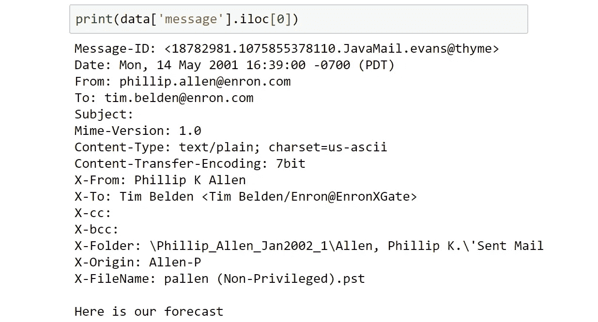
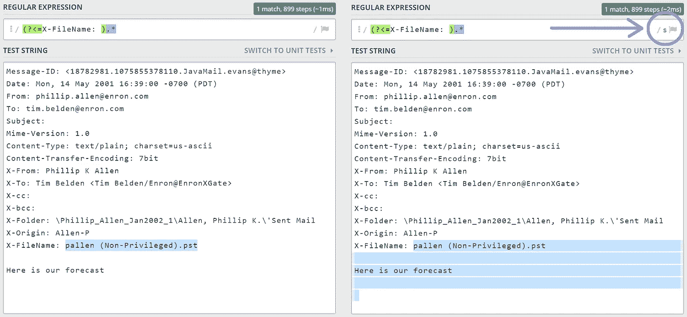
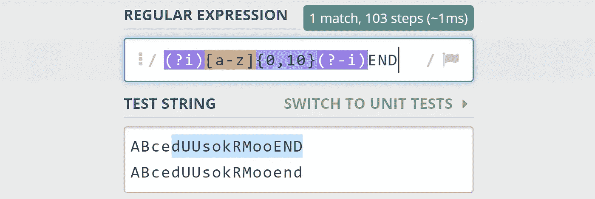
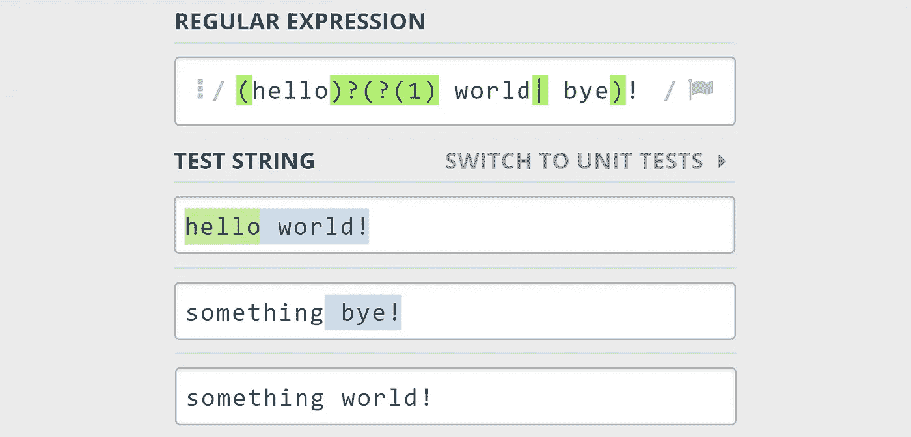
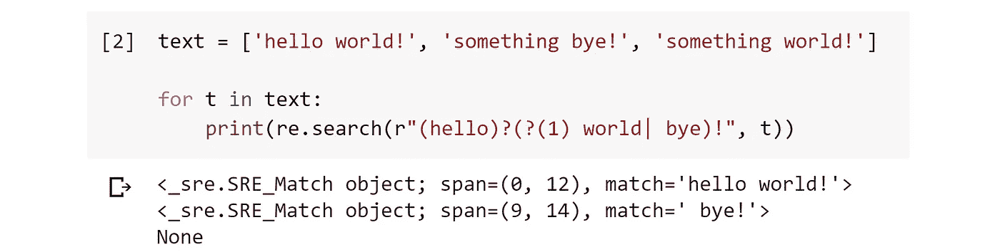

# 用 Python 升级你的正则表达式游戏

> 原文：<https://towardsdatascience.com/step-up-your-regex-game-in-python-1ec20c5d65f?source=collection_archive---------13----------------------->

## Python 中使用正则表达式的高级文本操作


照片由[本·怀特](https://unsplash.com/@benwhitephotography?utm_source=medium&utm_medium=referral)在 [Unsplash](https://unsplash.com?utm_source=medium&utm_medium=referral) 上拍摄

正则表达式(RegEx)是最好的工具之一。我可能有偏见，因为我的大部分工作都集中在自然语言处理(NLP)上，但是不管有没有 NLP，我发现自己一次又一次地求助于正则表达式。

我绝不是专家，有很多东西我不知道——但是我已经经常使用正则表达式好几年了，所以我对它们足够了解。

在这篇文章中，我想分享一些 regex 方法，我认为它们稍微高级一些，但是非常有用。我们还将包含实际的代码，以便我们能够正确地理解正在发生的事情。我们将涵盖:

```
**Look-ahead/behind Assertions** - (?>= ) | (?= ) | (?>! ) | (?! )
**Modifiers** - (?sm)
**Conditionals (If|Else)** - (...)?(?(1)True|False)
```

# 前瞻/后见断言

这些是我用过的最有用的正则表达式方法。

靠近页面顶部是我的名字，在 HTML 中是我的用户名。看起来是这样的:

```
<a href="/**@jamescalam**?source=post_page-----22e4e63463af----------------------" class="cg ch au av aw ax ay az ba bb it be ck cl" rel="noopener">James Briggs</a>
```

假设我们现在感兴趣的是从页面的 HTML 中提取用户名，我们已经提取了所有的`<a>`元素，并将使用 RegEx 来识别和提取用户名。

我们可以做一些乱七八糟的事情，像这样:

```
if '<a href"/@' in a:
    username = a.replace('<a href="/', '')
    username = username.split('?source')[0]
```

但是使用后视和前瞻断言，我们会得到更动态、更灵活的逻辑，如下所示:

```
if bool(re.search(r'**(?=<\/)'@.*(?=\?source)**', a)):
    username = re.search(r'**(?=>\/)'@.*(?=\?source)**', a).group()
```

这里将从这个(或任何文章)页面上的`<a>`元素中提取任何用户名。但是它看起来很复杂——所以让我们把问题简化一点。

## 向后看

后视断言告诉我们的 regex to **assert** 任何潜在的匹配都是在**之前**给出给断言的模式。让我们比较有和没有这个断言的正则表达式:



这里，我们**没有**使用回顾断言——因为我们只搜索 **hello world** ，我们返回**两个**匹配。截图来自 [Regex101](https://regex101.com/) 。



通过为' **1:** '添加一个回顾断言(突出显示)，我们只匹配前面有' **1:** '的 **hello world** 。截图来自 [Regex101](https://regex101.com/) 。

在这里，我们告诉我们的断言，断言`1:` 先于`hello world`。

当然，我们也可以仅将第一个 hello world 与`"1: hello world"`匹配，但是这将在我们的匹配中包括`"1: "`——无论什么包含在我们的断言中，在匹配的输出中都不包括**。**

*   回顾过去——我们在回顾我们的模式。
*   **断言** —我们断言这个其他模式的存在，但是我们并不匹配它(例如包含在我们输出的文本中)。

## 向前看

我确信，在理解了“看- **后面的**断言之后，一个“看- **前面的**断言的行为是可以预见的。让我们确保我们的 hello world 后面跟着一个`**,**`:



通过为'**、**'添加一个前瞻断言(突出显示)，我们只匹配后面跟有逗号的 **hello world** 。截图来自 [Regex101](https://regex101.com/) 。

## 底片

我们刚刚讨论的两个断言都是肯定的断言——我们断言我们的匹配模式在我们的断言模式之前/之后。

然而，我们经常需要断言我们的模式是**而不是**紧挨着另一个。为此，我们分别使用回顾和前瞻断言的否定形式— `**(?<! )**`和`**(?! )**`。



负的后视断言(左)和负的前视断言(右)。截图来自 [Regex101](https://regex101.com/) 。

## 在实践中

为此，我们将使用安然电子邮件数据集。我们有两列，`file`和`message`——我们想要的一切都在`message`中。如果我们看一下第一个`message`列，我们会发现:



我们希望从这些数据中提取出`Message-ID`和`Date`。

我们可以这样写:

```
def boring_extract(msg):
    msg = msg.splitlines()
    **msg_id** = ''.join(
                 msg[0].replace(
                     'Message-ID: <', ''
                 ).split('.')[:2]
             )
    **time** = msg[1].replace('Date: ', '')[-5:]
```

现在，这看起来很糟糕，并且将需要很长时间来运行——它也根本不是动态的，如果由于某种原因，数据或`Date`和`From`开关位置中的某个字段丢失了，该怎么办？—代码会被破解。

这就是我们使用正则表达式的地方，严重依赖于前瞻和后视断言。让我们比较使用和不使用正则表达式的代码:

`**Message-ID**`

```
**No RegEx**
msg = msg.splitlines()
msg_id = msg[0].replace('Message-ID <', '')
msg_id = msg_id[0].split('.')[:2]
msg_id = ''.join(msg_id)**With RegEx**
msg_id = re.search(r'**(?<=Message-ID: <)**\d+.\d+**(?=.)**', msg).group()
```

`**Date**`

```
**No Regex**
msg = msg.splitlines()
time = msg[1].replace('Date: ', '')[-5:]**With RegEx**
time = re.search(r'**(?<=Date: )**.***(?= \(\w\w\w\))**', msg).group()
```

在`Message-ID`和`Date`正则表达式中，我们都以`**(?<= )**`开始，以`**(?= )**`结束——分别是积极的后视和前瞻断言。对于上面的例子，我们为`msg_id`和`time`输出如下:

`**[Out]:** 18782981.1075855378110`

`**[Out]:** Mon, 14 May 2001 16:39:00 -0700`

# 修饰语

同样，RegEx 的一个非常有用的特性。修饰符允许我们修改正则表达式的行为。

例如，以**单行**修饰符`**s**`为例——这将把`.*`的行为从**不**包括新行**改为包括新行**:



不带单行全局修改器(左)和带单行全局修改器(右)—右上角的标志 s 表示我们已经应用了该修改器。截图来自 [Regex101](https://regex101.com/) 。

只需添加这个标志就可以改变正则表达式的行为。有一大堆不同的修改器，我们甚至可以合并它们来创建更具体和独特的行为。这些改性剂中最常见的包括:

```
**Single line [s]** - Allows the **.** metacharacter (which matches everything **except** newlines) to match newlines too**Multi-line [m]** - **^** and **$** now match the **beginning/end of lines**, rather than default behavior of matching beggining/end of entire string**Insensitive [i]** - Upper **and** lower-case characters are matched, e.g. **A = a****Extended [x]** - **Ignores whitespace**. To include spaces, they must be escaped using **\**. Also allows comments inside the regex with **#****ASCII [a]** - Match to **ASCII-only** characters, rather than the full Unicode character set
```

在 Python 中，我们可以用两种方式实现这些修饰符。

**(1)修饰符标志**在表达式之外实现，作为函数的附加参数，它们应用于整个正则表达式。添加单行修饰符和不敏感修饰符将如下所示:

```
re.match('[a-z]+01.*', text, **re.S|re.I**)
```

注意，我们使用按位 OR (|)将多个修饰符串在一起。

**(2)行内修饰符**在表达式中使用`(? )`语法——其中修饰符标记跟在`?`后面。实现单行和不敏感修饰符只需要`(?**si**)`，就像这样:

```
re.match('**(?si)**[a-z]+01.*', text)
```

根据语言的不同，RegEx 实际上可以支持模式子部分中的修改行为——使用内联修饰符`(? )`来启动行为，使用`(?- )`来关闭修饰符:



使用内联修饰符修改正则表达式的一个子部分——注意这在 Python 中**不会**起作用。

然而，这个负的内联修饰符**在 Python 中不受**支持，一个内联修饰符(放在任何地方)将影响整个模式——而不仅仅是它的一部分。

我从未遇到过这样有用的问题——所以我不认为我们在这方面错过了什么。

# 条件句(If | Else)

RegEx 中的条件语句真的很酷——尽管可能有点特殊。

就像 Python 中的`if else`语句一样，我们可以在正则表达式中集成相同的逻辑。它的工作原理是说:

> 好吧，我们的模式匹配吗？`(hello)?(?(1)`
> 
> 如果是这样——现在我们匹配模式 A，`(?(1) world|`
> 
> 否则—我们匹配模式 b。`bye)`

合在一起，这给了我们`(hello)?(?(1) world| bye)`。



使用条件语句的正则表达式示例。截图来自 [Regex101](https://regex101.com/) 。

第一部分是我们的**捕获组**，`**(hello)**`——分配给`(1)`，因为它是我们的正则表达式中的第一个捕获组。通过添加`?`,我们使这个匹配成为可选的(否则，它将只在 true 时匹配)。

然后我们问一个**问题**、`?(1)`——意思是捕获组`(1)`匹配吗？

如果匹配，我们的正则表达式将尝试匹配逻辑语句中的第一个参数`world`。

或者，如果捕获组`(1)`不匹配—我们的正则表达式将尝试匹配语句中的第二个参数`bye`。

如果我们在 Python 中测试，我们会看到相同的结果:



本文到此为止，在处理文本时，在 RegEx 中使用这三个特性可以给代码带来巨大的变化。它们都是我生活中不可或缺的特征。

我希望您从这篇文章中学到了一些东西，并且会像我一样发现这些特性很有用。如果您有任何建议或问题，请随时通过 Twitter 或在下面的评论中联系我们。

感谢阅读！

有兴趣学习更多的正则表达式吗？我写了这篇关于使用正则表达式解析 Python 代码来构建自动文档工具的文章，请随意尝试一下！

[](/auto-docs-for-python-b545ce372e2d) [## Python 的自动文档

### 编写代码很无聊，为什么要浪费时间呢？

towardsdatascience.com](/auto-docs-for-python-b545ce372e2d)