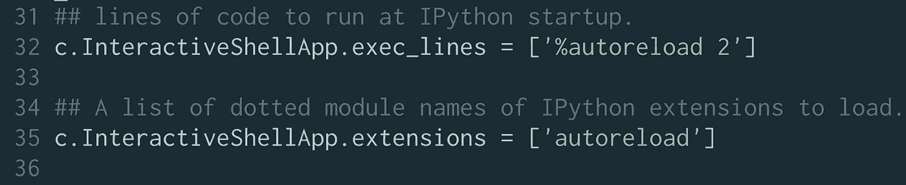
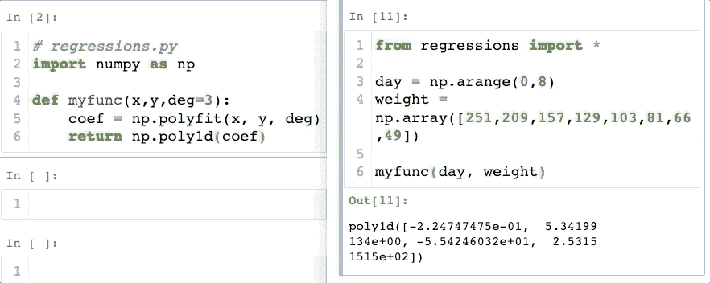
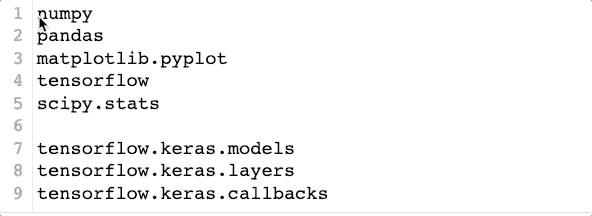
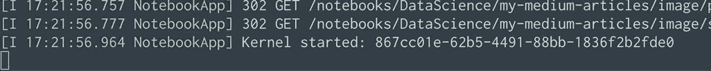
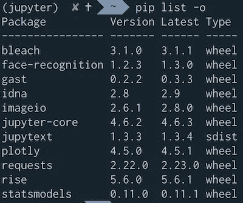
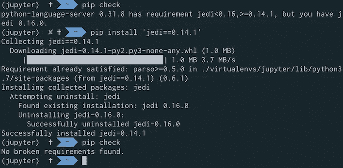
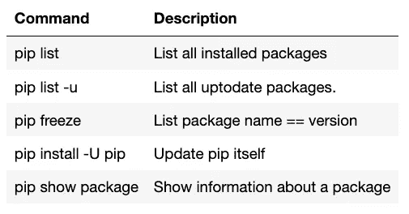
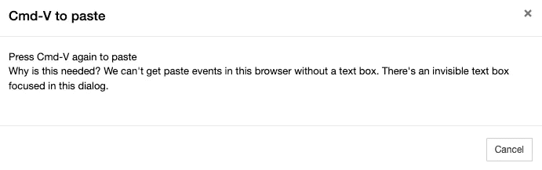

# Jupyter 用户的生产力提示

> 原文：<https://towardsdatascience.com/stepping-into-intermediate-with-jupyter-f6647aeb1184?source=collection_archive---------21----------------------->

## 数据科学

## 使用 Jupyter 笔记本和 JupyterLab 让您的工作流程更加高效


里卡多·戈麦斯·安吉尔在 [Unsplash](https://unsplash.com/@ripato?utm_source=unsplash&utm_medium=referral&utm_content=creditCopyText) 上的照片

```
**Table of Contents**[**Introduction**](#6439)1\. [Startup files](#9431)
2\. [Auto reload](#809c)
3\. [Multi-cursor](#fe1b)
4\. [Exit confirmation](#e064)
5\. [Update you python packages](#4b45)
6\. [Copying cells from another file](#83e1)
```

# 介绍

要成为一个高效的 Jupyter 用户，有几件事你需要知道。在这篇文章中，我将通过六个技巧来提高你的工作效率。这些提示在 Jupyter 笔记本和 Jupyter 实验室都有效。

有关 Jupyter hacks 和版本控制的更多信息，请阅读这些文章。

# 启动文件

如果你一次又一次地输入同样的东西，启动文件就是你的解决方案。Jupyter 笔记本将自动访问启动文件夹中的文件。一般 Mac 中默认位置是`/Users/<your_profile>/.ipython/profile_default/startup`。

您可以通过在 Jypyter 笔记本单元中运行这个命令来找到您的启动目录。

```
get_ipython().profile_dir.startup_dir
```

输出可以是这样的。

```
'/Users/<your_profile>/.ipython/profile_default/startup'
```

当您启动 Jupyter Notebook 时，可以在此目录下创建一个或多个要运行的文件。

例如，创建一个名为 00-startup.py 的文件，并添加以下代码。

```
import pandas as pd
import numpy as np
import matplotlib.pyplot as plt
get_ipython().magic('matplotlib inline')
```

当你使用魔法`%`时，你需要使用如上图所示的`get_ipython().magic()`。

重启你的 Jupyter 笔记本。可以不用进口熊猫或者 Numpy。

您可以根据需要添加更多库。[示例](https://gist.github.com/shinokada/010050a0d38ff8c7aeb06d7779fb7f73)

[](/how-to-run-jupyter-notebook-on-docker-7c9748ed209f) [## 如何在 Docker 上运行 Jupyter 笔记本

### 不再有 Python 环境和包更新

towardsdatascience.com](/how-to-run-jupyter-notebook-on-docker-7c9748ed209f) 

# 自动重新加载

当你修改一个导入的文件时，你必须重启内核。但是`autoreload`在进入执行单元之前会自动重新加载模块。

您可以将它添加到其中一个单元格中并执行它。

```
%load_ext autoreload
%autoreload 2
```

通过保存修改后的文件，它可以在另一个文件中自动重新加载。

如果您想一直启用此设置，您可以将其添加到`~/.ipython/profile_default/ipython_config.py`。

如果没有文件，可以先打`ipython profile create`。

```
ipython profile create
[ProfileCreate] Generating default config file: '/Users/yourname/.ipython/profile_default/ipython_config.py'
[ProfileCreate] Generating default config file: '/Users/yourname/.ipython/profile_default/ipython_kernel_config.py'
```

第 31 行左右:

```
# ~/.ipython/profile_default/ipython_config.py

c.InteractiveShellApp.exec_lines = ['%autoreload 2']

c.InteractiveShellApp.extensions = ['autoreload']
```



自动重新加载正在运行。



# 多光标

您可以用光标选择多个位置。点按您想要开始的位置，按下 Option 键，拖移光标，开始键入。您可以使用 Cmd+右箭头键跳到每一行的最右边。



# 退出确认

有多少次你在按 Ctrl+C 键关机后输入 y 并按下 return 键？您可以通过按 Ctrl+C 两次来跳过它。



# 更新您的 python 包

你是否定期更新 python 包？

检查您需要更新的软件包。这将列出过时的软件包。

```
pip list -o
# or
pip list --outdated
```



你可以运行`install -U`来更新一个包。

```
pip install -U package
```

如果你想一次更新所有的包，在你的终端上运行这个。

```
pip list --outdated --format=freeze | grep -v '^\-e' | cut -d = -f 1  | xargs -n1 pip install -U
```

`pip check`验证哪些已安装的软件包具有兼容的依赖关系。如果发现问题，需要使用`pip install 'packagename==0.14.1'`安装正确的版本。



其他有用的命令有:



[pip 参考](https://pip.pypa.io/en/stable/reference/)

# 从另一个文件复制单元格

在 Jupyter Notebook 中，您可以通过按 cmd+v 两次从另一个文件复制粘贴。如果你只按一次，你会得到下面的警告。在 JupyterLab 中，您需要使用`c`来复制一个或多个单元格，并使用`v`将其粘贴到另一个文件中。



我希望这些建议能帮助你提高工作效率。你最喜欢的小费是什么？

**通过** [**成为**](https://blog.codewithshin.com/membership) **会员，获得媒体上所有故事的访问权限。**


[https://blog.codewithshin.com/subscribe](https://blog.codewithshin.com/subscribe)

# 关于 Jupyter 的更多文章

[](/version-control-with-jupyter-notebook-b9630bc5996e) [## 使用 Jupyter 笔记本进行版本控制

### Jupytext 分步指南

towardsdatascience.com](/version-control-with-jupyter-notebook-b9630bc5996e) [](https://medium.com/series/jupyter-hacks-and-tips-1b1a3a10bc79) [## Jupyter 的技巧和窍门

### Jupyter 技巧和提示的集合

medium.com](https://medium.com/series/jupyter-hacks-and-tips-1b1a3a10bc79) [](/how-to-create-an-attractive-bubble-map-5cf452c244e9) [## 如何在 Jupyter 中创建一个有吸引力的气泡图

### 从 Github repo 抓取数据的分步指南

towardsdatascience.com](/how-to-create-an-attractive-bubble-map-5cf452c244e9) [](/hands-on-jupyter-notebook-hacks-f59f313df12b) [## 手把手的 Jupyter 笔记本黑客

### 您应该使用的技巧、提示和快捷方式

towardsdatascience.com](/hands-on-jupyter-notebook-hacks-f59f313df12b) [](/7-essential-tips-for-writing-with-jupyter-notebook-60972a1a8901) [## 用 Jupyter 笔记本写作的 7 个基本技巧

### 第一篇数据科学文章指南

towardsdatascience.com](/7-essential-tips-for-writing-with-jupyter-notebook-60972a1a8901)