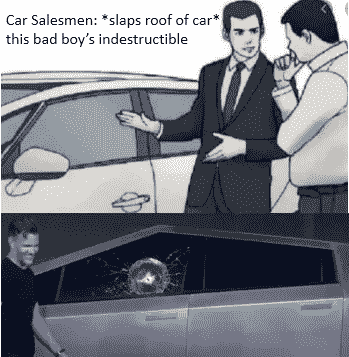
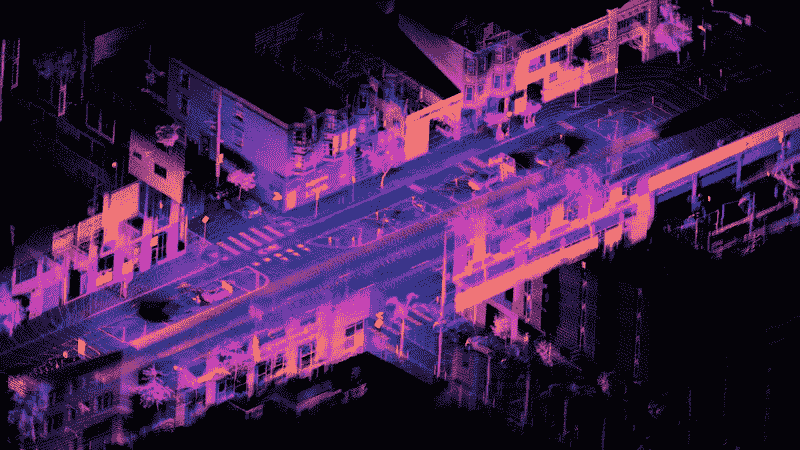
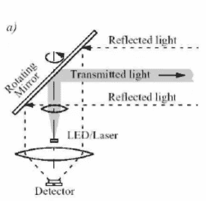
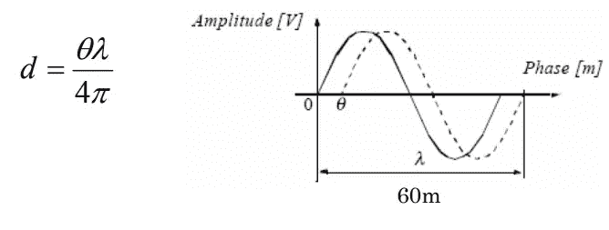
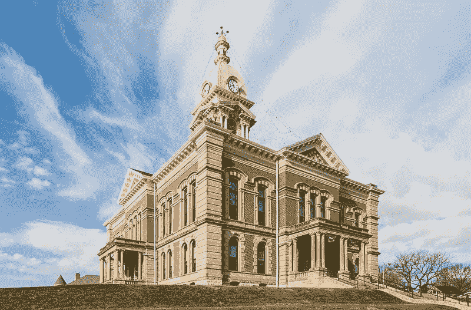
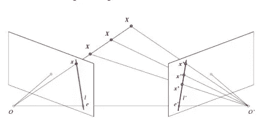
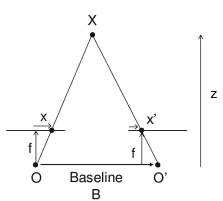
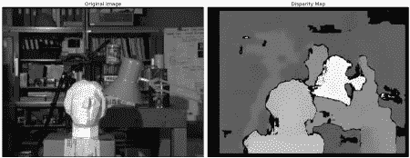
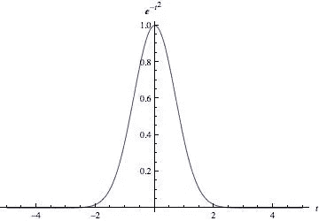

# 神经网络、计算机视觉和自动驾驶汽车之间的关系

> 原文：<https://towardsdatascience.com/stereo-vision-neural-nets-and-demand-in-autonomous-vehicles-6a9b6e6de41c?source=collection_archive---------41----------------------->

自动驾驶汽车(AV)正在大力发展，许多公司在这方面投资了数百万美元。2017 年，福特投资 Argo AI 生产自动驾驶技术。Argo AI 随后与卡耐基梅隆大学合作，在 T2 投资了 1500 万美元用于 AV 研究。

其他公司也纷纷效仿，包括[韩国汽车制造商现代和日本巨头丰田](https://emerj.com/ai-adoption-timelines/self-driving-car-timeline-themselves-top-11-automakers/)分别投入[17 亿](http://www.koreaherald.com/view.php?ud=20160317000551)和[6 . 67 亿](https://www.reuters.com/article/uber-softbank-group-selfdriving/uber-lands-1-billion-from-softbank-toyota-for-self-driving-unit-idUSL1N22100A)。

来源:Self，[特斯拉网络卡车大会](https://www.youtube.com/watch?v=dbNN1OgYGTE) via Carscoops |有些公司确实比其他公司更挣扎

管理咨询公司麦肯锡公司(Mckinsey & Company)估计，2015 年至 2030 年将是以研发为重点的 AVs 商业化应用的第一个时代。据预测，从 2030 年及以后，消费者将更频繁地购买 AVs。目前，随着买家的疲惫，公司正努力与目标市场建立联系，需求增加可能还需要一段时间。

研究兴趣和资金随时可用，因此现在是试验各种 AV 技术的最佳时机，如视觉系统。当前的视觉系统通过用景深数据辅助其运动估计算法来充当车辆的眼睛。最大的两个竞争对手是**激光雷达**(光探测和测距)和**立体视觉**。

# 什么是**激光雷达**为什么要用？

激光雷达是一种激光扫描仪，它产生点云，提供周围环境的 3D 重建，允许深度和海拔估计。

来源:[丹尼尔 l 卢 via 维基媒体](https://commons.wikimedia.org/wiki/File:Ouster_OS1-64_lidar_point_cloud_of_intersection_of_Folsom_and_Dore_St,_San_Francisco.png)；**旧金山十字路口的点云**

*激光雷达的工作原理是将一束光射到一面旋转的镜子上*，光线被反射到多个方向。一旦*射线返回*，它被反射回*扫描仪*，扫描仪*测量物体*有多远。

来源: [Steven Waslander via ME597 在滑铁卢大学](http://wavelab.uwaterloo.ca/sharedata/ME597/ME597_Lecture_Slides/ME597-4-Measurement.pdf)；**图**用于**激光雷达**的旋转镜和扫描仪

由于光的波粒二象性，光线可以表示为正弦函数。发出的光线和返回的光线会产生相移。给定相移和已知射线波长，计算距离；这个过程重复得非常快，并产生一个详细的地图。

来源: [Steven Waslander via ME597 在滑铁卢大学](http://wavelab.uwaterloo.ca/sharedata/ME597/ME597_Lecture_Slides/ME597-4-Measurement.pdf)；**激光雷达扫描仪**应用的**相移&距离**推导演示

由于扫描仪和反射镜所需的精度，激光雷达系统可能会很贵，根据所需的自主性和应用水平，市场价格从 1 000 美元到 75 000 美元不等。

# 立体视觉呢？

立体视觉是一种有趣的替代方式，它使用多相机设置来估计深度，令人惊讶的是，它是基于人类如何做到这一点的！

# 实验时间到了

现在试试这个:闭上你的右眼，把你的手指放在你的面前，集中注意力。现在闭上另一只眼睛，重复这个动作。

> 如果你很难做到这一点，不要担心，有一个 [Wikihow 可用](https://www.wikihow.com/Estimate-Distances-(by-Using-Your-Thumb-and-Eyes))！

好了，现在你做完了，你的手指动了一下，对吗？

别担心，你的眼睛工作正常，这是它们的几何学的结果。你所经历的现象被称为**视差**，当从两条不同的视线看到一幅图像时，这种现象就会发生，因此，图像看起来会移动。在这种情况下，两条视线就是你的眼睛。

# 将几何学用于视差的动机

用双眼正面盯着一个物体会产生深度，因为我们自己的视觉似乎是会聚的。这类似于一张透视照片，所有平行线相交于某个遥远的地平线点。

来源:[Diego Delso via Wikimedia](https://commons.wikimedia.org/wiki/File:Cortes_del_Condado_de_Wabash,_Wabash,_Indiana,_Estados_Unidos,_2012-11-12,_DD_01.jpg)|**透视信息丢失**，相机需要额外处理才能重现

然而，相机拍摄的图像不能像我们的眼睛那样创造深度。

图像将世界的 3D 视图转换成 2D 投影。更正式地说，这导致一条*线转变成一个点*。在**欧几里得空间**，即包含在 2D 平面中的几何空间中，[平行线不能像在透视图像中那样与](http://www.songho.ca/math/homogeneous/homogeneous.html)相交(透视图像属于**射影空间**)。这由左边所示的线*或*表示，尽管它对应于不同距离处的独特点，但相机无法分辨。从摄像机的角度来看，它看到的是一个点 *x* 而不是线 *OX* 。

来源: [OpenCV 文档](https://docs.opencv.org/master/da/de9/tutorial_py_epipolar_geometry.html) |立体设置涉及**极线几何**到**关联**两个**相机投影；**注意**尾线如何穿过**可能解决方案**处的**l’

相机*不能像我们的大脑一样相互通信*，以帮助我们的眼睛产生图像。这导致在不同角度拍摄的同一图像的两个平面投影。所有深度信息都已丢失。然而，通过对两个投影进行三角测量，应用一些几何图形，并使用视差，相机可以相互关联以解析地求解距离。

上面显示的双摄像头设置是深度估计的基础，它被称为立体视觉。

有关坐标转换和相机的更多信息，请阅读这篇关于相机校准的[文章](https://www.learnopencv.com/camera-calibration-using-opencv/)。

# 数学估算深度

推导和量化深度的视差效果是数学密集型的。如果你只对主公式感兴趣，请跳到这一小节的末尾。

*有关推导，请参考上一小节中的图表。*

假设两个摄像机都位于中心 *O* 和*O’*处，它们在 *X* 处会聚。

线 *OX* 在左投影平面上显示为一个点 *x* 。然而，当从右投影平面观察时，有一组对应的点，*x’*，它们在称为**极线**，*l’*的平面中形成一条线。这表示深度并证明点 *x* 实际上是一条线*OX；现在的任务是确定 x T21 在哪里。*

沿着 *OX* 可以画出称为**延长线**的特殊线条，在*O’*处汇合。通过检查每条核线可以找到点 *x* ，直到找到一条与 *x* 相交的核线，这个解就是**核线约束。**多个 *X* 的指示，每一个都与一个特定的外延线相匹配，暗示该点的可能解决方案 *x.*

来源: [OpenCV 文档](https://docs.opencv.org/master/dd/d53/tutorial_py_depthmap.html) | **通过外极线 O'X 解决**的**外极线约束**；注意在 ***xOf、x’o’f 和 OO’x***处形成的三个**相似三角形**

现在，这个问题可以从自上而下的角度重新审视。

给定对极线约束的特定解， *x* ，其在相对平面中的对应点，*x’*，视线 *OX* 和相对相机的对极线，*O’x，*深度可以被求解。

点 *x 和 x’*在不同的深度。

两条线， *OX* 和*O’x*处于不同的角度，但是可以通过等价的三角形来关联，这就是为什么差(*x-x’*)等于参数: *B，f，Z(下面等式中的*)。(*x—x’*)的差值就是**视差** : *视差误差的数值度量。*

更正式地，视差指的是两个相似区域的坐标距离(从任一图像投影来看)。*视差与* ***深度*** *、Z、*成反比关系，通过求解等价三角关系得到证明。

对于更近的物体，视差更明显，这表明当同一点出现在两个投影的不同位置时，视差很大。由于反比关系，它必须对应于一个短的深度。

用前面一节中展示的实验来验证上述假设。你的观察应该与定义的数学关系相匹配。

来源: [OpenCV Docs](https://docs.opencv.org/master/dd/d53/tutorial_py_depthmap.html) | **视差计算**用于隔离，**求解深度:Z**

*x* 的值通过极线约束求解，并且*x’*通过检查对面摄像机的图像投影得知。给定相机、 *B* 和**焦距**、 *f* 之间的一些**距离，然后可以计算出 *Z* 。**

将此应用于场景的所有像素产生一个**视差图**，它通过颜色指示深度。

来源: [OpenCV 文档](https://docs.opencv.org/master/dd/d53/tutorial_py_depthmap.html) |浅灰色物体更近，深灰色物体更远**视差图**

有关立体视觉和 3D 重建的更多信息，请访问 [OpenCV 的文档](https://docs.opencv.org/master/dd/d53/tutorial_py_depthmap.html)和[Rich Radke 博士的 ECE6969 课程](https://www.youtube.com/watch?v=rE-hVtytT-I&list=PLuh62Q4Sv7BUJlKlt84HFqSWfW36MDd5a)。

# 立体视觉的缺陷与改进

虽然立体视觉不贵，但它的主要问题是处理时间。理想情况下，在 AVs 中，大多数系统将接近实时工作。然而*由于解决极线约束需要很长时间，立体视觉系统本身无法足够快地工作*。为了减少计算时间，正在研究使用*机器学习*来改进立体声系统并*加速*它们。

# 通过机器学习的立体视觉

在深入神经网络的细节之前，理解什么是图像是关键:一个**图像**是一个 *2D 数字数组，每个数组元素是一个像素值。*

由于这种结构，**卷积神经网络**(CNN)是理想的，因为它们在图像上应用滑动过滤器，将图像下采样为代表其可能值的单个向量。向量被传递到一个完全连接的网络，该网络为每个值分配概率，并输出最可能的匹配作为预测。

来源: [Aphex34 via Wikimedia](https://commons.wikimedia.org/wiki/Category:Convolutional_neural_networks#/media/File:Typical_cnn.png) |典型的**神经网络架构:**对图像进行子采样，馈入全连通层并输出预测

为了了解更多关于 CNN 和神经网络的知识，[迈克·庞德博士](https://www.youtube.com/watch?v=py5byOOHZM8)提供了简短的解释，正式的概念可以在[斯坦福大学的视频讲座](https://www.youtube.com/watch?v=py5byOOHZM8)中找到。

[罗，G. Swing，Urtasun Via 多伦多大学计算机科学系](https://www.cs.toronto.edu/~urtasun/publications/luo_etal_cvpr16.pdf)暹罗 CNN 架构学习分发

至于立体系统，图像被分割成左右两个投影，一次分析一个小区域。两个投影都被馈送到一个 [**连体 CNN**](https://www.cs.toronto.edu/~urtasun/publications/luo_etal_cvpr16.pdf) ，其同时为左右投影中的*对应区域上的*视差*创建一组*可能的*概率分布。然后，该组可能性被传递到一个*全连接层*，该层*输出*在*原始*图像的单个片上*最可能的视差分布*。*

这意味着*网络以被称为*概率分布*的*连续函数*的形式输出*差异*的可能值的*范围*。*

**概率分布**代表结果发生的*可能性，其中*组结果*显示在 *x 轴*上。随机变量包含这些结果作为可能的值。每个结果都有相应的可能性显示在 y 轴上。*

来源: [Atakbi1 via Wikimedia](https://commons.wikimedia.org/wiki/File:Gaussian_distribution_2.jpg) |一种叫做高斯分布的概率分布，最大值在中心(平均值)。以上 CNN 产生独特的概率分布

按照上面的 CNN，x 轴将填充视差值，y 轴填充这些差异是正确的可能性。CNN 学习并预测分布的*形状。*通过找到分布的最大值点，使用单独的算法来找到最可能的视差。

暹罗 CNN 设计允许对应于不同图像区域的*差异被关联*，这可能表明那些区域是同一表面的一部分。

# 暹罗 CNN 架构的扩展

先前的网络比较了左右投影并优化了匹配成本。这意味着在两个投影中搜索指向同一部分的补片。一旦找到，每个补片将被用于计算视差，给出该补片相对于平面的位置。由于已经找到了精确的点，这些网络围绕着解决极线约束的过程工作。

上面讨论的连体 CNN 是对过去网络的改进。通过改变优化参数来学习可能差异的分布，消除了计算差异的*需要。*取而代之的是，选择最有可能的视差，这使得连体 CNN 架构比其前身运行得更快。

[Martin thoma via Wikimedia](https://commons.wikimedia.org/wiki/File:EmiMa-099-semantic-segmentation.png)|扩展深度估计，共同解决语义分割等其他视觉任务

在过去，网络已经实现了组合解决方案，其中统一解决了对象识别和深度估计。因此，*找到相关的差异可以扩展连体 CNN* 设计，以允许*其他视觉任务*。

# 自主视觉的未来

行业领导者 *Waymo 使用激光雷达系统*，特斯拉创始人埃隆·马斯克[发表评论](https://www.youtube.com/watch?v=HM23sjhtk4Q)，

> "..任何依赖激光雷达的人都注定要失败..”

双方显然存在激烈的竞争和相互矛盾的观点。康奈尔大学的研究人员支持立体视觉，尽管公众担心它在无人驾驶汽车中的功效和安全性。

特斯拉不仅仅使用立体视觉；它的车辆实现了立体摄像机、雷达和地图绘制，以提供具有竞争力的精确度。尽管需要更多的技术，立体声系统的运行成本仍然低于激光雷达。

虽然安全至关重要，但企业必须盈利才能继续运营。对消费者来说,*最大的障碍之一是市场价值*,它直接*将*与用于汽车设计的技术*联系起来。正如开头提到的，AVs 还处于起步阶段，随着更多的研究和开发，很多东西都会改变。只有时间能证明哪种视觉系统更胜一筹。*