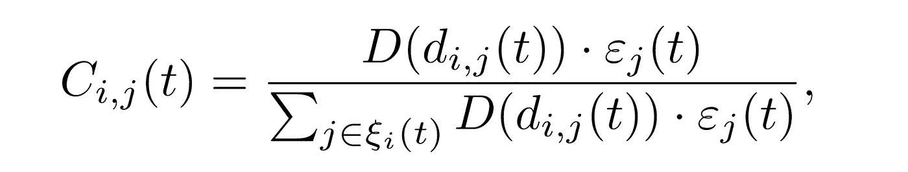
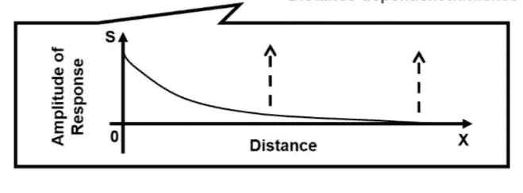
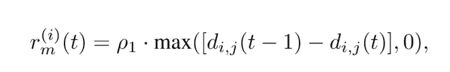
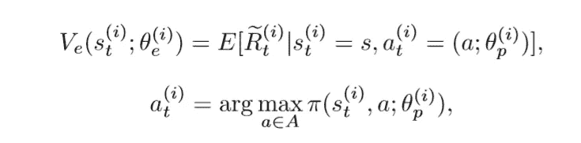
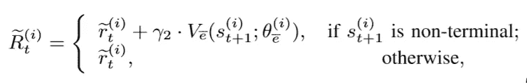
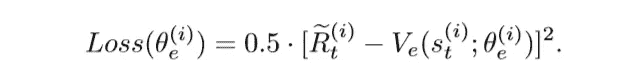
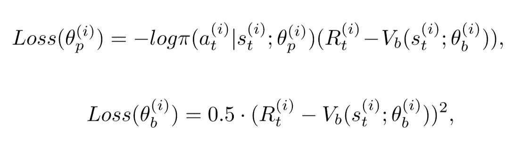
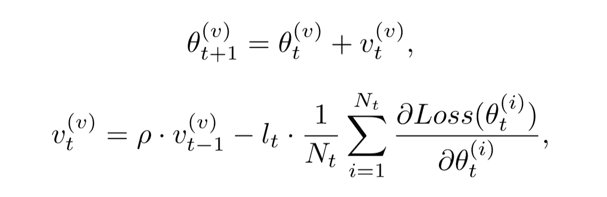
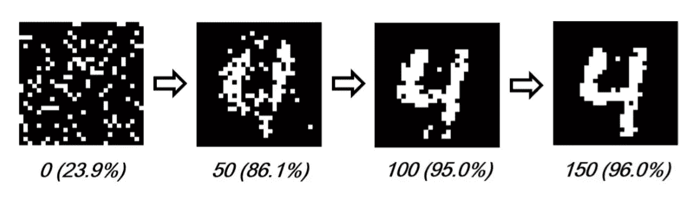
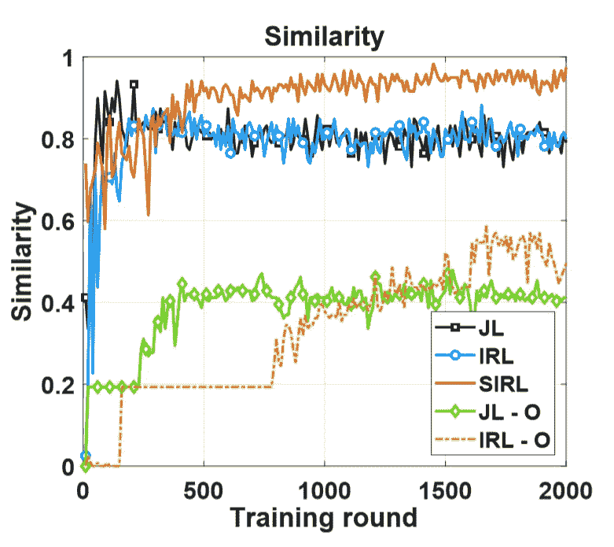

# 解开 Stigmergic 独立强化学习

> 原文：<https://towardsdatascience.com/stigmergic-reinforcement-learning-why-it-tells-us-1-1-3-4d50dfa9cb19?source=collection_archive---------50----------------------->

## 因为 1+1=3

[JESHOOTS.COM](https://unsplash.com/@jeshoots?utm_source=medium&utm_medium=referral)在 [Unsplash](https://unsplash.com?utm_source=medium&utm_medium=referral) 上拍照

群优化是“多智能体学习”保护伞下的众多子领域之一。它信奉“人多力量大”的理念我们的代理人越多，我们能完成的就越多。这个领域试图使用极其大量的*简单*智能体来解决问题，每个智能体都为一个比自身更大的目标做出贡献。换句话说，群体优化利用了一个概念:

> 多主体系统比其单个组成部分的总和具有更大的灵活性、健壮性和潜力。

群体优化最流行的分支之一是 stigmergy。Stigmergic 算法允许代理通过环境使用**本地信息**和**间接协调**。一个主体的行为会在环境中留下“痕迹”,并刺激其他主体的后续行为。然后，我们重复。

我们可以把斯蒂格利茨看作一种使用简单规则的方法论。每个代理都有一个很小的、全面的规则手册可以遵循，指导他们如何修补周围环境或与他人互动。如果每个规则书都设计正确，那么它们动作的*组合*最终会完成一些任务。

这种“级联动作”的想法在自然界中经常可以找到。蚂蚁和白蚁利用信息素间接相互交流，让它们能够搭建桥梁或建造复杂的巢穴。甚至在细菌中也观察到了群体行为，特别是粘细菌，其中群体行为由复杂的控制系统指导。

在这篇文章中，我们探索了 Stigmergic 独立强化学习，一种新的大规模多智能体学习方法。

由[萨阿德·萨利姆](https://unsplash.com/@saadx?utm_source=medium&utm_medium=referral)在 [Unsplash](https://unsplash.com?utm_source=medium&utm_medium=referral) 上拍摄的照片

# 动机

可扩展性是多智能体强化学习(MARL)的最大障碍之一，因为状态和动作空间随着智能体数量的增加呈指数增长。虽然已经提出了独立的学习算法来应对这一挑战，但是这些方法往往会遇到非平稳性问题。要了解更多关于 MARL 及其障碍的背景，请随意查看这篇文章:

 [## 多主体强化学习:要点

### 好像一个机器人学习一切还不够

medium.com](https://medium.com/swlh/the-gist-multi-agent-reinforcement-learning-767b367b395f) 

斯蒂格利茨独立强化学习(SIRL)提出了一种算法，它在显式**联合**学习和其**独立**对应学习之间提供了一种平衡。换句话说，该算法在大范围内协调不同的独立学习代理。

照片由[埃里克·沃德](https://unsplash.com/@ericjamesward?utm_source=medium&utm_medium=referral)在 [Unsplash](https://unsplash.com?utm_source=medium&utm_medium=referral) 拍摄

# 系统结构

斯蒂格利茨由四个主要部分组成:

*   **媒介:**代理间接相互通信的方法或环境的一部分
*   **动作:**原语，允许代理与环境或其他代理交互，通常改变其状态
*   **痕迹:**一个特工留下的信号，用来和其他人间接交流
*   **条件:**触发或允许执行某些动作的事件

使用这些公式，我们可以比经典的强化学习更容易地表示代理之间的间接协调。

> 在给定的条件下，代理在执行动作之后在介质中留下痕迹。

当这些痕迹由于许多起作用的因素而在介质中积累和混合时，它们各自根据应用相应地响应这些信号。在一个位置累积的轨迹越大，代理对特定信号的响应越剧烈。

照片由[陈乐德](https://unsplash.com/@mero_dnt?utm_source=medium&utm_medium=referral)在 [Unsplash](https://unsplash.com?utm_source=medium&utm_medium=referral) 上拍摄

在 SIRL 的表述中，*环境*和*媒介*是分离的实体。我们可以把环境想象成一个物理状态的集合，在这个集合中代理可以表现、描述和定位他们自己。另一方面，媒介可以被认为是环境的一个特定部分，通过它传播信息。这种分离用于区分 SIRL 和经典的 RL 算法。SIRL 框架的其他部分将在随后的章节中概述。

## 避免冲突

冲突避免用于隐式协调代理，即使每个代理只有本地信息。这里有一个想法:让代理竞争动作机会，只允许一部分代理在给定的时间内执行动作。为此，每个代理都有一个**评估**模块和一个**行为**模块，每个模块都有自己的一套神经网络。

[李灿明](https://unsplash.com/@brock222?utm_source=medium&utm_medium=referral)在 [Unsplash](https://unsplash.com?utm_source=medium&utm_medium=referral) 上拍照

**评估**模块测量代理的*动作优先级*给定其当前本地状态。换句话说，从评估模块获得更高回报的代理人更有可能执行他们的行动。

**行为**模块在给定本地状态和评估模块许可的情况下选择要执行的适当动作。因此，在确定行动时，总有两个步骤*和*:

1.  将本地状态传递给相应的评估模块，并使用协调信道与附近的代理进行比较
2.  仅当代理在第一步中拥有足够高的动作优先级时，将相同的本地状态传递给相应的行为模块以选择适当的动作

这些数学公式将在本文后面讨论。

## 介质及其属性

在 SIRL，数字信息素(trace)用于代理之间的间接通信。这些信号存储在包含信息素分布的地图(介质)中，并向代理提供相关的状态空间信息。我们可以把这种表示想象成一个热图，由虚拟代理集中存储或者在指定代理之间分开。

数字信息素只是数字。数字越大，信号越强。如前所述，它们可以组合、混合和累积。SIRL 通过引入三个属性对此进行建模。当不同的信息素结合时，它使用线性叠加。此外，这些信息素不局限于单一空间，而是扩散到周围区域。最后，信息素的量级**随着时间的推移而衰减**。扩散率和衰减率是可调的超参数。

由 [Katarzyna Urbanek](https://unsplash.com/@kati_ur?utm_source=medium&utm_medium=referral) 在 [Unsplash](https://unsplash.com?utm_source=medium&utm_medium=referral) 拍摄的照片

# 数学

## 吸引子选择

我们假设每一个智能体都能在有限的范围内感知数字信息素。让我们将**吸引子**定义为信息素图中包含非零数量数字信息素的任何块。该块将对附近的代理有效地探索本地状态空间具有吸引人的效果。然而，对于代理选择一个动作，他们首先需要选择一个吸引子来进行它的动作(即。向吸引子移动)。代理选择特定吸引子的概率由下式给出:

概率代理 I 选择吸引子 j

其中 d_ij 是从代理 I 到吸引子 j 的距离。ε是位置 j 处的信息素的大小，xi 是范围内所有吸引子的集合，D 是某个单调函数。例如，在论文的实验中，函数 D 看起来像这样:

[1]中使用的 d 函数示例

这个概率值直观上是有意义的。我们可以看到，随着距离的增加，选择吸引子的概率降低。类似地，随着信息素数量的减少，概率也减少。所选吸引子的位置被连接到代理的本地状态，并被传递到评估和行为模块。

然而，有些人可能会问，为什么我们不简单地选择信息素强度和距离的最佳组合的吸引子呢？我们不希望我们的代理人聚集在一起，因为这违背了避免冲突的目的。实际上，最理想的是**随机地**选择吸引者。

## 信息素放置

在将本地状态传递给评估和行为模块之后，我们决定是否执行一个动作。如果有，我们就在环境中放置信息素:

信息素更新方程

其中 a 代表由一个代理投放的数字信息素的**固定**数量，b 是衰减率，如果一开始没有代理的话就应用。衰变有助于去除无用的吸引子久而久之。

## 奖励

我们假设传统的 RL 框架，试图最大化预期的累积回报。因此，我们将状态转换的奖励定义如下:

过渡奖励

其中 *p* 是比例因子。给定代理 I 和选择的吸引子 j，我们奖励使代理更接近吸引子的行为。

## 动作优先级

请记住，每个代理都有一个评估网络，它输出与它所拥有的操作优先级成比例的值。该值越高，越有可能允许执行某个操作。

由于我们希望最大化我们的总体预期回报，我们直觉地**希望给予给定其本地状态下具有较高预期回报的代理行动优先权。**因此，我们将我们的行动优先级定义为价值函数(V):

价值函数与政策

代理的状态值越高，它获得的操作优先级越高。随后，行为模块根据其策略选择一个概率最高的动作。我们还将 R_tilde 定义为:

其中该价值函数(V)表示**目标价值网络**的输出。目标价值网络定期复制价值网络的参数，并用于在训练时增加稳定性。同样，行为模块除了其政策网络之外，也同时拥有价值网络和目标价值网络。

## 定义所有的损失

我们快到了！接下来，我们定义每个代理中评估和行为模块的损失函数。评估模块的价值损失定义为:

评估网络损耗函数

代表代理 I 的 TD 误差平方。行为模块的值损失与上面类似。此外，它的政策损失类似于优势行动者批评家的损失，我们用计算出的优势函数来衡量负概率:

行为模块更新

注意变量 R 不再有波浪号。这些奖励由**行为模块的目标值函数**而不是评估模块的目标值函数定义，使其成为不同于以前的变量。

现在我们有了所有这些损失，我们可能会试图单独优化*每个代理的模块。*然而，这将有效地将算法简化为代理之间的独立学习。换句话说，每个代理人只优化自己的政策，而不考虑其他人，失去了我们最初开始优化的协调概念。

## 联邦培训

但是等等！我们的建筑还有最后一部分！在这里，我们解释联邦培训模块。虽然这是一个虚拟代理，但它包含与其他代理相同的体系结构和部件。它负责通过**平均优化来优化每个智能体的神经网络模块。**更正式地说:

“*v”*上标表示属于联邦培训模块的参数。此外，“*p”*表示动量项，“*l”*表示学习率。更新仅对在该时间步中执行动作的代理求和**。**结果，θ表示那些代理的每个相应模块的参数。在这里，我们通过对这些代理的梯度进行平均来更新联邦教练的参数。然后，因为联邦训练器具有相同的模块结构，我们能够将这些**新参数发送回代理。**实际上，我们已经做了几件事:

*   **更新了**执行动作的每个代理的参数
*   **允许**单个代理不仅根据他们的表现，还根据其他代理的表现来更新他们的策略
*   **在通常具有指数增长的状态和动作空间的上下文中，将更新缩小到*线性* 梯度组合**

# 结果

论文中进行的实验涉及到像素组，每个像素组都是一个代理，它们按照数字的形状排列。例如，像素在 150 次迭代后学会了如何形成数字“4 ”,如下所示:

实验结果如[1]所示

SIRL 与其他四种方法进行了比较。

*   JL:仅使用行为模块共同学习最佳行为
*   IRL:类似于 JL，但输入向量只包含自相关本地状态
*   JL-O:类似于 JL，但是用代理的精确坐标代替吸引子
*   IRL-O:类似于 IRL，但是用代理的精确坐标代替了吸引子

SIRL 与它的竞争对手相比表现良好，在较少的训练周期内教会它的特工形成精确的队形。

数字 4 的相似性度量，如[1]所示

# 结束语

SIRL 提出了一种新的方法来解决多智能体系统的可扩展性问题。它为超大型系统中的强化学习提供了一种有前途的分散方法，并可以被视为从多机器人运动到交通信号控制等更复杂领域中基于群体的强化学习的起点。不管怎样，很明显，代理人通过合作所能完成的要比他们个人潜力的总和更大。它可能只是告诉我们，有时候，1 + 1 = 3。

## 参考

[1] X. Xu，R. Li，Z. Zhao，和 H. Zhang，[用于多智能体协作的 Stigmergic 独立强化学习](https://arxiv.org/pdf/1911.12504.pdf?fbclid=IwAR2d19jkD67GlfKW0rt_JvHzGiYaalY-Im0lgEPa43wzTnbtZOr9lGOW-34) (2019)。

[2] F. Heylighen，[stigmargy 作为一种普遍的协调机制:组成、种类和应用](https://www.researchgate.net/publication/279058749_Stigmergy_as_a_Universal_Coordination_Mechanism_components_varieties_and_applications) (2015)。

> 从经典到最新，这里有讨论多代理和单代理强化学习的相关文章:

 [## 纳什均衡介绍:朋友还是敌人 Q 学习

### 让机器人打破平衡

towardsdatascience.com](/multi-agent-rl-nash-equilibria-and-friend-or-foe-q-learning-4a0b9aae3a1e)  [## 分层强化学习:封建网络

### 让电脑看到更大的画面

towardsdatascience.com](/hierarchical-reinforcement-learning-feudal-networks-44e2657526d7)