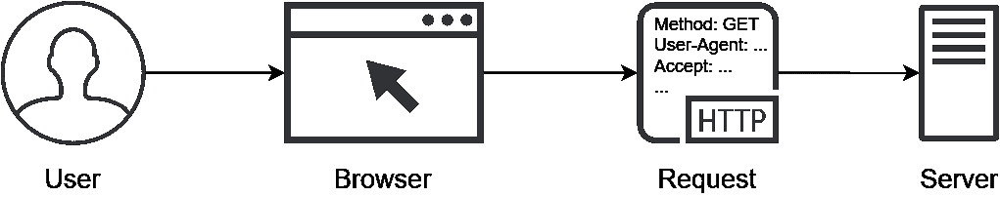
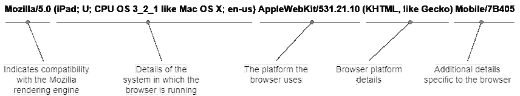
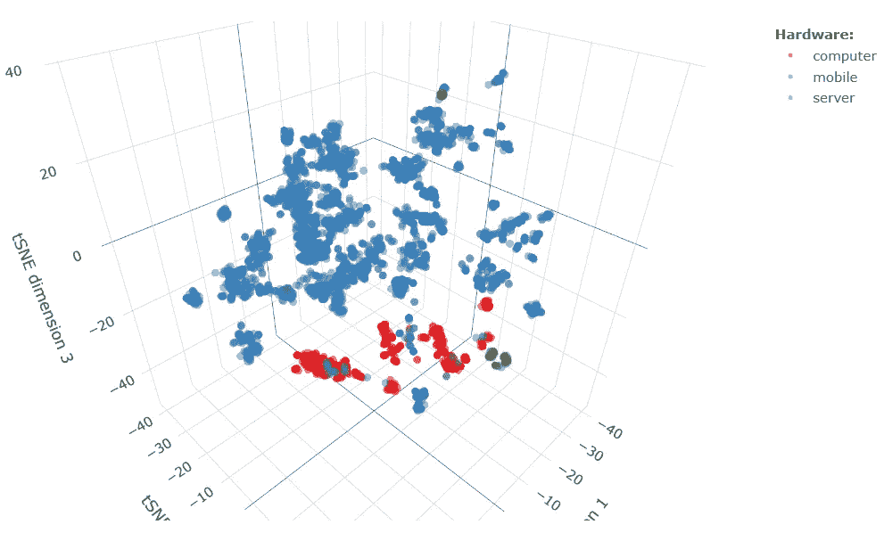
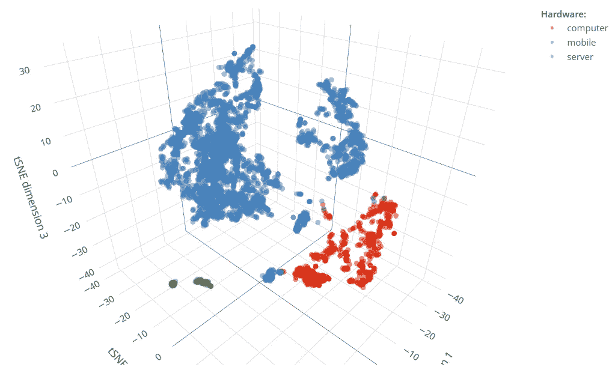

# 还在为你的机器学习模型解析用户代理字符串吗？

> 原文：<https://towardsdatascience.com/still-parsing-user-agent-strings-for-your-machine-learning-models-use-this-instead-8928c0e7e74f?source=collection_archive---------31----------------------->

## 用这个代替


Emile Perron 在 [Unsplash](https://unsplash.com?utm_source=medium&utm_medium=referral) 上的照片

> 包含在用户代理字符串中的信息可以使用低维嵌入来有效地表示，然后在下游的机器学习任务中使用。

# 究竟什么是用户代理字符串？

当用户与网站交互时，浏览器向服务器发送 HTTP 请求，以获取所需的内容、提交数据或执行其他操作。这种请求通常包含几个[头](https://developer.mozilla.org/en-US/docs/Glossary/Request_header)，即指定给定请求参数的字符键值对。一个[用户代理字符串](https://en.wikipedia.org/wiki/User_agent)(下面称为“UAS”)是一个 HTTP 请求头，它描述了代表用户的软件(图 1)。



图一。当向服务器发送请求时，浏览器充当用户的代理。用户代理字符串描述浏览器的属性。

UAS 的最初目的是 [*内容协商*](https://developer.mozilla.org/en-US/docs/Web/HTTP/Content_negotiation) ，即根据各自 UAS 中包含的信息(例如，图像格式、文档语言、文本编码等)确定提供给用户的最佳内容的机制。).这些信息通常包括浏览器运行环境的详细信息(设备、操作系统及其版本、地区)、浏览器引擎和版本、布局引擎和版本等等(图 2)。



图二。典型 UAS 及其元素的示例。

虽然为不同的浏览器提供不同的网页被 T2 认为是一个坏主意，但是现在，UAS 仍然有许多实际的应用。最常见的是*网络分析*，即报告流量构成以优化网站的有效性。另一个用例是 web *流量管理*，包括阻止讨厌的爬虫，减少网站上不需要的访问者的负载，防止[点击欺诈](https://en.wikipedia.org/wiki/Click_fraud)，以及其他类似的任务。由于它们包含丰富的信息，UAS 也可以作为机器学习应用的数据源。然而，后一种用例至今没有得到太多的关注。在这里，我解决了这个问题，并讨论了一种从机器学习模型的 UAS 创建信息特征的有效方法。这篇文章是我最近在两个会议上演讲的摘要— [*为什么是 R？*](https://2020.whyr.pl/) 和[*R 语言的企业应用*](https://info.mango-solutions.com/earl-online-2020) 。下述示例中使用的数据和代码可从 [GitHub](https://github.com/ranalytics/uas_embeddings) 获得。

# 作为机器学习模型特征的 UAS 元素

UAS 元素通常可以作为用户特征的有用代理，例如生活方式、技术成熟度，甚至富裕程度。例如，通常从高端移动设备访问网站的用户可能不同于从运行 Windows XP 的台式计算机上的 Internet Explorer 访问同一网站的用户。当没有其他人口统计信息可用于用户时(例如，当一个新的、未被识别的人访问一个网站时)，具有针对这些特征的基于 UAS 的代理可能特别有价值。

在某些应用中，区分人类和非人类 web 流量也是有用的。在某些情况下，这很容易做到，因为自动化网络爬虫使用包括单词“bot”(例如，`Googlebot/2.1 (+http://www.google.com/bot.html)`)的简化 UAS 格式。然而，一些爬虫不遵循这个惯例(例如，脸书机器人[在其 UAS 中包含](https://developers.whatismybrowser.com/useragents/explore/software_name/facebook-bot/)和`facebookexternalhit`两个字)，识别它们需要一个查找字典。

从 UAS 创建机器学习功能的一个看似简单的方法是*应用一个解析器*，提取单个 UAS 元素，然后一次性编码这些元素。这种方法在简单的情况下可以很好地工作，当只有高级的和容易识别的 UAS 元素需要转换成特征时。例如，确定用户代理的硬件类型相对容易(移动对桌面对服务器，等等)。).几个高质量的、基于正则表达式的解析器可以用于这种特性工程(例如，参见[“ua-parser”项目](https://github.com/ua-parser)及其语言选择的实现)。

然而，当想要使用组成 UAS 的*所有* *元素*并从中提取最大信息时，上述方法很快变得不切实际。这有两个主要原因:

*   现有的[关于用户代理头](https://tools.ietf.org/html/rfc7231#section-5.5.3)格式的建议没有以任何方式实施，在现实世界中，人们可能会遇到各种各样的 UAS 规范。因此，众所周知，对 UAS 的一致解析非常困难。此外，每天都有新的设备、新版本的操作系统和浏览器出现，这使得维护高质量的解析器成为一项艰巨的任务。
*   可能的 UAS 元素及其组合的数量是天文数字。即使有可能对它们进行一次性编码，得到的数据矩阵也会非常稀疏，而且太大，不适合目前数据科学家通常使用的计算机的内存。

为了克服这些挑战，可以应用*降维*技术，将 UAS 表示为固定大小的向量，同时最小化原始信息的损失。当然，这个想法并不新颖，因为 UAS 只是简单的文本串，这可以通过使用各种自然语言处理方法来实现。[在我的项目](http://nextgamesolutions.com/)中，我经常发现脸书研究人员开发的 fastText 算法( [Bojanowski 等人，2016](https://arxiv.org/abs/1607.04606) )产生了特别有用的解决方案。

描述 fastText 算法超出了本文的范围。然而，在我们继续举例之前，有必要提一下这种方法的一些实际好处:

*   它不需要数据，也就是说，一个运行良好的模型只需要几千个例子就可以训练出来；
*   它适用于短的结构化文档，如 UAS；
*   顾名思义，训练快；
*   它可以很好地处理“词汇之外的单词”，也就是说，它可以生成有意义的向量表示(嵌入)，即使是在训练期间没有看到的字符串。

# fastText 实现:选择您的武器

fastText 的[官方实现](https://github.com/facebookresearch/fastText)可以作为独立的 C++库和 Python 包装器获得。这两个库都有很好的文档记录，并且易于安装和使用。广泛使用的 Python 库`gensim`有自己的算法实现。下面我将演示如何在 r 中训练快速文本模型。

围绕 fastText C++库有几个 R 包装器(参见`[fastText](https://github.com/mlampros/fastText)`、`[fastrtext](https://github.com/pommedeterresautee/fastrtext)`和`[fastTextR](https://cran.r-project.org/web/packages/fastTextR/index.html)`)。然而，可以说在 R 中训练和使用 fastText 模型的最简单的方法是通过`[reticulate](https://rstudio.github.io/reticulate/)`包调用官方的 Python 绑定。将`fasttext` Python 模块导入到 R 环境中可以按如下方式完成:

```
# Install `fasttext` first 
# (see [https://fasttext.cc/docs/en/support.html)](https://fasttext.cc/docs/en/support.html))# Load the `reticulate` package 
# (install first, if needed):
require(reticulate)# Make sure `fasttext` is available to R:
py_module_available("fasttext")
## [1] TRUE# Import `fasttext`:
ft <- import("fasttext")# Then call the required methods using 
# the standard `$` notation, 
# e.g.: `ft$train_supervised()`
```

# 用快速文本学习 R 中的 UAS 嵌入

下面描述的例子基于来自[whatismybrowser.com](https://developers.whatismybrowser.com/useragents/database/)数据库的 200，000 个独特的 UAS 样本(图 3)。

图 3。本文示例中使用的 UAS 示例。数据存储在纯文本文件中，其中每行包含一个 UAS。注意，所有 UAS 都被标准化为小写，且没有应用其他预处理。

在 R 中训练一个无监督的 fastText 模型就像调用类似下面的命令一样简单:

```
m_unsup <- ft$train_unsupervised(
   input = "./data/train_data_unsup.txt",
   model = "skipgram",
   lr = 0.05, 
   dim = 32L, *# vector dimension*
   ws = 3L, 
   minCount = 1L,
   minn = 2L, 
   maxn = 6L, 
   neg = 3L, 
   wordNgrams = 2L, 
   loss = "ns",
   epoch = 100L, 
   thread = 10L
)
```

上述命令中的`dim`参数指定了嵌入空间的维数。在这个例子中，我们希望将每个 UAS 转换成大小为 32 的向量。其他参数控制模型训练的过程(`lr` —学习速率、`loss` —损失函数、`epoch` —历元数等)。).要理解所有参数的含义，请参考官方的 [fastText 文档](https://fasttext.cc/docs/en/options.html)。

一旦模型被训练，就很容易计算新案例的嵌入(例如，从测试集中)。下面的例子展示了如何做到这一点(这里的关键命令是`m_unsup$get_sentence_vector()`，它返回一个向量，该向量是由构成给定 UAS 的单个元素的嵌入的平均值):

```
test_data <- readLines("./data/test_data_unsup.txt")

emb_unsup <- test_data %>% 
  lapply(., function(x) {
    m_unsup$get_sentence_vector(text = x) %>%
      t(.) %>% as.data.frame(.)
  }) %>% 
  bind_rows(.) %>% 
  setNames(., paste0("f", 1:32)) # Printing out the first 5 values
# of the vectors (of size 32)
# that represent the first 3 UAS
# from the test set:emb_unsup[1:3, 1:5]
##      f1       f2    f3    f4      f5
## 1 0.197 -0.03726 0.147 0.153  0.0423
## 2 0.182  0.00307 0.147 0.101  0.0326
## 3 0.101 -0.28220 0.189 0.202 -0.1623
```

但是，我们如何知道经过训练的无监督模型有没有用呢？当然，测试它的一种方法是将通过该模型获得的 UAS 的矢量表示插入到下游的机器学习任务中，并评估最终解决方案的质量。然而，在跳到下游建模任务之前，人们还可以直观地评估 fastText 嵌入有多好。众所周知的 tSNE 地块([Maaten&hint on 2008](https://www.jmlr.org/papers/volume9/vandermaaten08a/vandermaaten08a.pdf)；参见[这个 YouTube 视频](https://www.youtube.com/watch?v=RJVL80Gg3lA)可能特别有用。



图 4。通过无监督快速文本模型获得的嵌入的 3D tSNE 可视化。该图中的每个点对应于测试集中的一个 UAS。根据用户代理的硬件类型对点进行颜色编码。

图 4 显示了使用上面指定的 fastText 模型从测试集中为 UAS 计算的嵌入的 3D tSNE 图。尽管该模型是以无监督的方式训练的，但它能够产生反映原始用户代理字符串的重要属性的嵌入。例如，人们可以看到关于硬件类型的点的良好分离。

根据定义，训练受监督的快速文本模型需要标记的数据。这就是现有的 UAS 解析器通常可以提供很大帮助的地方，因为人们可以使用它们来快速标记数以千计的训练样本。fastText 算法支持多类和多标签分类器。标签的预期(默认)格式是`__label__<value>`。以这种方式格式化的标签(在多标签模型的情况下，可能由空格分隔)将被预先添加到训练数据集中的每个文档。

假设我们对强调 UAS 硬件类型差异的嵌入感兴趣。图 5 示出了适于训练相应模型的标记数据的例子。

图 5。适用于训练监督快速文本模型的标记数据示例。

在这种标记数据上训练监督快速文本模型所需的 R 命令类似于我们之前看到的:

```
m_sup <- ft$train_supervised(
    input = "./data/train_data_sup.txt",
    lr = 0.05, 
    dim = 32L, *# vector dimension*
    ws = 3L, 
    minCount = 1L,
    minCountLabel = 10L, *# min label occurence*
    minn = 2L, 
    maxn = 6L, 
    neg = 3L, 
    wordNgrams = 2L, 
    loss = "softmax", *# loss function*
    epoch = 100L, 
    thread = 10L
)
```

我们可以通过在标记的测试集上计算精度、召回率和 f1 分数来评估所得到的监督模型。这些指标可以跨所有标签计算，也可以针对单个标签计算。例如，以下是与标签“移动”相对应的 UAS 的质量指标:

```
metrics <- m_sup$test_label("./data/test_data_sup.txt")
metrics["__label__mobile"]## $`__label__mobile`
## $`__label__mobile`$precision
## [1] 0.998351
##
## $`__label__mobile`$recall
## [1] 0.9981159
##
## $`__label__mobile`$f1score
## [1] 0.9982334
```

对这个监督模型的 tSNE 图的视觉检查也证实了它的高质量:我们可以看到关于硬件类型的测试用例的清晰分离(图 6)。这并不奇怪，因为通过训练监督模型，我们提供了支持信息，帮助算法创建特定于任务的嵌入。



图 6。使用监督模式下训练的 fastText 模型获得的嵌入的 3D tSNE 可视化，标签对应于硬件类型。

# 结论

本文证明了 UAS 中包含的丰富信息可以使用低维嵌入来有效地表示。生成这种嵌入的模型可以在无监督和有监督模式下训练。无监督嵌入是通用的，因此可以用于任何下游机器学习任务。然而，只要有可能，我会建议训练一个特定任务的监督模型。将 UAS 表示为固定大小的向量的一个特别有用的算法是 fastText。它的实现可以在当今数据科学家使用的所有主要语言中获得。

# 在你走之前

寻找类似的数据分析或建模？我提供数据科学咨询服务，所以[联系](mailto:info@nextgamesolutions.com)！