# 随机、批量和小批量梯度下降

> 原文：<https://towardsdatascience.com/stochastic-batch-and-mini-batch-gradient-descent-demystified-8b28978f7f5?source=collection_archive---------14----------------------->

## **为什么我们在实现深度神经网络时需要随机、批量和迷你批量梯度下降？**

资料来源:www.unsplash.com

**这是一个详细的指南，它应该回答我们在实现深度神经网络时为什么以及何时需要随机、批量和小批量梯度下降的问题。**

**简而言之** : *我们需要这些不同的实现梯度下降的方法来解决我们在训练神经网络时肯定会遇到的几个问题，这些问题是损失函数和噪声梯度的局部最小值和鞍点。*

关于这一点的更多内容将在下面的文章中解释——nice；)

# 目录

1.  1.简介:让我们回顾一下梯度下降
2.  2.训练神经网络时的常见问题(局部最小值、鞍点、噪声梯度)
3.  3.分批梯度下降
4.  4.随机梯度下降
5.  5.小批量梯度下降
6.  6.带回家的信息

# 1.简介:让我们回顾一下梯度下降

在我们讨论实现梯度下降的不同方法之前，我认为最好先回忆一下梯度下降到底是什么。

当我们训练神经网络时，我们希望它学习执行特定的任务。这项任务可以简单到预测某一特定市场对某一产品的预期需求，或者对皮肤癌进行分类。

不管这个任务，我们在训练期间的唯一目标是最小化目标/损失函数。对于预期需求的预测，这是一项回归任务，该损失函数将是均方误差(MSE)损失函数:

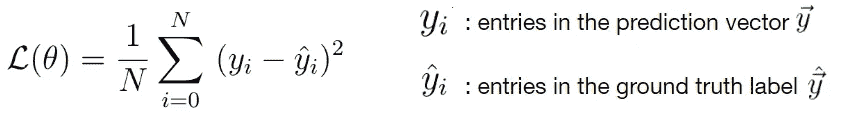

等式 1 均方误差损失函数

对于分类任务，我们希望最小化交叉熵损失函数:

等式 2 交叉熵损失函数

然而，在我们能够最小化损失函数之前，神经网络必须计算输出。这是在前向传播步骤中完成的，此时网络接收输入特征向量，在隐藏层中执行若干点积和非线性运算，并输出预测*。(关于正向传播步骤* [*的更详细解释，请参考本文*](https://www.deeplearning-academy.com/p/ai-wiki-what-is-deep-learning) *)。*该步骤如下图所示:

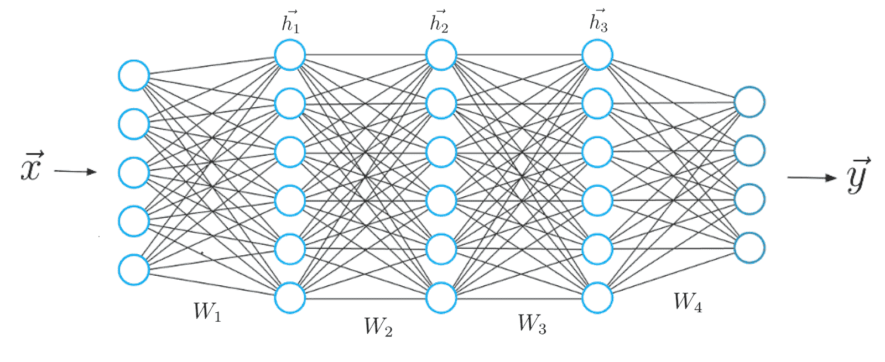

图一。深度神经网络。图片来源:自己的作品

计算隐藏值以及最终预测向量 ***y*** 的方程式如下:

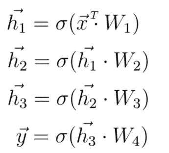

情商。3 正向传播

预测 ***y*** 和基本事实标签(我们实际想要预测的值)都包含在损失函数中，以计算指示网络预测准确度的定量度量。

损失函数的较低值导致预测和标签之间的较低误差，反之亦然。

为了获得损失函数的最低可能值，我们必须调整神经网络的参数，即权重和偏差。

这就是梯度下降发挥作用的地方。

我们必须计算损失函数相对于这些权重和偏差的负导数(梯度)。在下一步中，这些参数朝着该梯度的方向更新。以下等式表示任意权重矩阵的更新步骤。

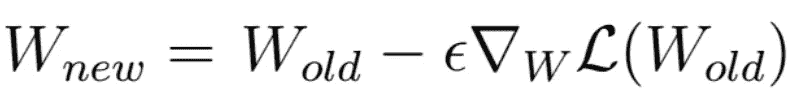

情商。4 更新步骤

每次执行更新时，权重和偏差越来越接近损失函数将具有全局最小值的最优值集。这种预测将尽可能接近我们想要预测的真实标签。

> 梯度下降是神经网络训练和整个深度学习领域的支柱。这种方法使我们能够教会神经网络执行任意任务，而无需为其显式编程。

只要神经网络能够最小化损失函数，网络最终将能够做我们想要它做的事情。

***梯度下降训练时会遇到问题***

当然，和往常一样，说起来容易做起来难。当沿着损失函数的负梯度下降到最佳权重时，我们肯定会面临多个问题，例如**局部最小值**、**鞍点、**和**噪声梯度**，这些问题会使我们的训练过程更加困难。

常规梯度下降的不同方法，即**随机梯度下降、**批量梯度下降和*小批量梯度下降，可以正确处理这些问题，尽管不是每种方法都能解决所有问题*。由您决定哪种方法最适合您当前的问题。

正因为如此，我们将在下面更详细地讨论实现梯度下降算法的不同方法以及它们独特的优点和缺点。

但是首先我想简要地解决局部最小值、鞍点和噪声梯度的问题，让你们更好地理解为什么我们首先需要这些不同种类的梯度下降。

# 2.训练神经网络时的常见问题

## 局部最小值和鞍点

不幸的是，损失函数并不总是有好的形状。事实上，它们可以呈现非常复杂的形状，例如:

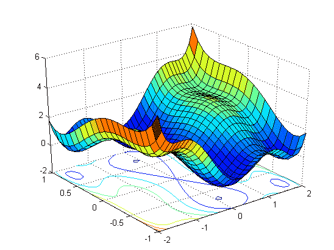

图 2 三维损失函数。资料来源:www.mathworks.com

因此，损失函数通常具有局部最小值和鞍点。

这些 2D 图形示意性地显示了局部最小值和鞍点在二维空间中的样子:

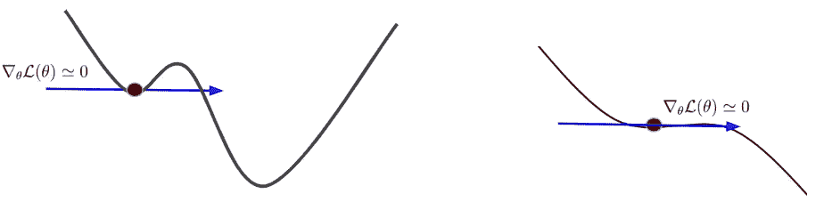

图三。局部最小值和鞍点。来源:自己的作品。

x 轴是任意权重值，而 y 轴是损失函数值。假设我们在神经网络的训练期间获得权重，该权重产生鞍点或局部最小值所在的损失函数值。

在这种情况下，你可以清楚地看到，斜率，或者说损失函数的梯度，变得无限小，因为损失函数在这一点上是平坦的。这种情况的直接后果是梯度陷入局部最小值或鞍点，并且由于权重保持不变，学习无法进一步进行。

在实践中，鞍点是一个比局部最小值大得多的问题，尤其是在处理成千上万个权重参数时。

**为什么会这样？**

损失函数所在的对应维度空间具有与权重参数数量相同的维度数量。鞍点意味着在高维空间中的当前点，损耗在一个方向下降，而在另一个方向上升。如果你在十万维空间，你可以想象这种情况会经常发生。

> 相反，一个局部最小值意味着损失函数在我当前点的所有方向上增加。

可以想象，这在高维空间是不太可能的。不管你是否有一个鞍点或局部最小值，梯度下降的常规实施将在训练中遇到困难。

> ***即将推出*** : *面向软件开发人员、数据分析师、学者和行业专家的高级深度学习教育，旨在加速向人工智能职业的过渡。*
> 
> *更多详情请看:*[*www.deeplearning-academy.com*](https://www.deeplearning-academy.com/)

[www.deeplearning-academy.com](https://www.deeplearning-academy.com/)

# 嘈杂的梯度

训练神经网络时的另一个问题和限制因素是，我们计算的梯度可能变得非常嘈杂。当进行梯度下降时，我们(通常)计算训练集中每个单个特征标签实例对的损失，并通过推导关于权重参数的损失函数来获得梯度。

这样做的结果是，单个数据样本上的每个计算梯度只是指向损失函数的最高增长率的真实梯度的粗略估计。

> 这导致数据集中每个要素-标注实例对的计算梯度的方向和值略有不同。我们说这些梯度是有噪声的或者具有很高的方差。

结果，在训练期间，我们不直接走向损失函数的全局最小值，而是梯度做一些之字形运动。梯度的噪声会导致网络的训练时间更长。

为了更好地理解这一点，让我们来看一个嘈杂的梯度视觉例子。下面的视频展示了带噪声梯度的梯度下降过程。

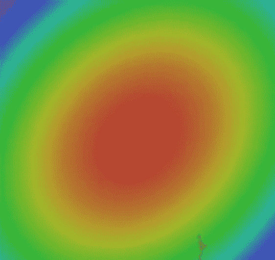

噪声梯度向损失函数的局部最小值移动。来源:自己的作品。

梯度朝着位于三维空间中的损失函数的全局最小值移动。您可以注意到，在训练集中的每个单个数据实例上计算的负梯度并不直接指向损失函数的全局最小值。

相反，梯度在方向和值上略有不同。正因为如此，我们正在做这些曲折的运动，而不是直接走向全球最小值。

在下一节中，我们将看看如何使用梯度下降来更新神经网络的权重的不同变化。虽然我们仍然要使用我们以前学过的梯度下降法，但是有几种方法可以使用计算出的梯度来更新网络权重。

在下文中，我将向您介绍三种技术，即*、**、*小批量梯度下降*** 。每种权重更新技术都有其优点和缺点。*

*根据问题的不同，您可能更喜欢一种方法。先说批量梯度下降。*

# *3.批量梯度下降*

*请考虑一个数据集，其中我们有 *N=6* 个标记的数据实例。每个实例都有 4 个特征(*****学历******武学*** )和一个标签 **y** 。***

**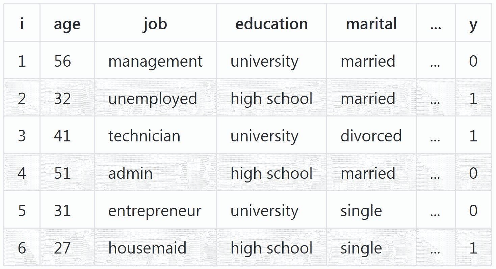**

**在训练过程中，神经网络为每个实例计算一个预测，该预测与地面真实标签进行比较。给定预测和标签，我们可以将两者都放入损失函数，并计算给定样本的损失函数的梯度。**

**到目前为止，一切顺利。在这一点上，我们可以使用计算出的梯度来更新我们的网络权重，使之接近最优权重，从而最小化损失函数。**

**然而，在批量梯度下降过程中，我们不会马上进行。**

**相反，在处理完数据集的所有数据实例后，权重只更新一次。具体来说，在批量梯度下降期间，计算并求和数据集中每个实例的梯度。**

**最后，累积的梯度除以数据实例的数量，即 6。这样，我们得到了数据集中所有数据实例的**平均梯度。权重现在在该平均梯度的负方向上更新。****

**对于我们的数据集，我们必须计算并求和该数据集中六个样本的梯度。然后，我们将梯度的总和除以 6，并用这个平均梯度执行单梯度下降，以更新神经网络的权重。**

**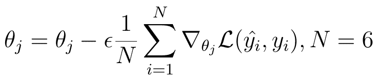**

**情商。5 用批量梯度下降更新步骤。**

**在这个等式中， **θ** 代表任意的权重值。**

# **批量梯度下降的优势**

*   ****计算效率高**:正如你可能已经猜到的，这种技术的计算要求较低，因为每次采样后都不需要更新。**
*   ****稳定收敛**:另一个优点是权重收敛到最优权重是非常稳定的。通过计算和平均数据集中每个样本的所有单独梯度，我们得到了真实梯度的非常好的估计，指示损失函数的最高增加。**

# **Barch 梯度下降的缺点**

*   ****较慢的学习**:批量梯度下降的缺点是学习过程要慢得多，因为我们在处理完 *N 个*样本后只执行一次更新。**
*   ****局部极小值和鞍点**:另一个缺点是，在学习过程中，我们可能会陷入损失函数的局部极小值，永远不会达到神经网络获得最佳结果的全局最优值。这是因为我们计算的梯度或多或少是一样的。我们实际上需要的是一些噪声梯度。方向值的这种小偏差将允许梯度跳出损失函数的局部最小值，并继续向全局最小值更新。另一方面，干净的梯度更容易陷入局部最小值。**

# **4.随机梯度下降**

**与批量梯度下降相反，我们可以执行随机梯度下降。这种方法可以被认为是批次梯度的对立面。**

**请考虑我之前介绍的数据集。对于每个实例，在数据中，我们再次进行预测，将预测与标签进行比较，并计算损失函数的梯度。**

**然而，在这种情况下，我们在每个数据实例已经被神经网络处理之后更新权重**。这种方法也经常被称为在线学习。****

**对于我们的小数据集，我们计算每个数据实例的梯度，并更新神经网络的权重六次:**

**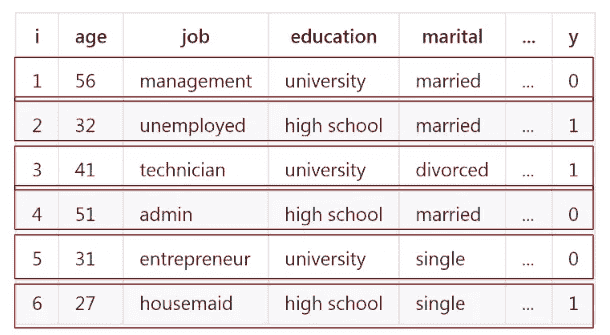****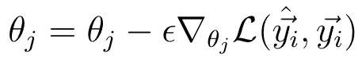**

**情商。5 用随机梯度下降更新步长。**

**换句话说:这个等式执行六次——每个数据实例一次。**

# **随机梯度下降的优势**

*   ****即时性能洞察**:随机梯度下降让我们立即洞察神经网络的性能，因为在这种情况下，我们不必等到数据集结束。**
*   ****更快的学习**:相应地，随机梯度下降可以导致更快的学习，因为在处理每个数据实例之后执行更新。**

# **随机梯度下降的缺点**

*   ****噪声梯度**:与我们平均梯度以获得最终梯度的批量梯度下降相反，在随机梯度下降中，我们使用每个单独的梯度来更新权重。这些梯度可能非常嘈杂，并且在方向和值方面有很大的差异。这意味着我们对每个样本计算的梯度仅仅是指向损失函数增加的真实梯度的粗略估计。换句话说，在这种情况下，我们有很多噪声。然而，这一事实可以避免训练期间的局部最小值，因为高方差会导致梯度跳出局部最小值。**
*   ****计算密集**:随机梯度下降比批量梯度下降计算密集得多，因为在这种情况下，我们更频繁地执行权重更新。**
*   ****无法确定全局最小值:**另一个缺点可能是梯度下降法无法确定损失函数的全局最小值。由于这种噪音，要找到并保持一个全局最小值会更加困难。**

# **5.小批量梯度下降**

**第三种也是最后一种重量更新技术称为小批量梯度下降。想象一下，这种方法结合了其他两种方法的优点。对于小批量梯度下降，我们必须将我们的训练集分成大小为 *n* 的批量**

**例如，如果我们的数据集包含 10，000 个样本，那么合适的大小 *n* 应该是 8，16，32，64，128。**

**类似于批量梯度下降，我们计算并平均小批量数据实例中的梯度。梯度下降步骤在每个小批量样品处理后进行。**

**请再次考虑我们的小数据集。在小批量梯度下降的情况下，我们可以将这六个数据实例分成大小为 n=2t 的批量，总共留给我们三个小批量:**

**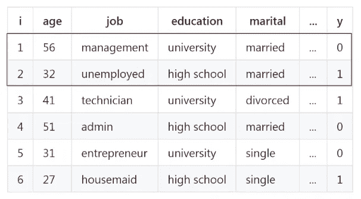**

**我们为每个小批量中的两个数据实例计算两个梯度，将它们相加，然后除以 2，得到该小批量的梯度平均值:**

**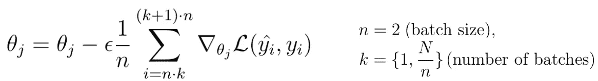**

**情商。7 用小批量梯度下降更新步骤。**

**我们将使用这个平均梯度来执行梯度下降步骤。在这种情况下，我们将做梯度步骤总共三次。**

*****小批量方法是实现深度学习中梯度下降算法的默认方法*****

# **小批量梯度下降的优势**

*   ****计算效率**:就计算效率而言，该技术介于之前介绍的两种技术之间。**
*   ****稳定收敛:**另一个优点是更稳定地收敛到全局最小值，因为我们计算 n 个样本的平均梯度，这导致更少的噪声。**
*   ****更快的学习**:由于我们比随机梯度下降更频繁地执行权重更新，在这种情况下，我们实现了更快的学习过程。**

# **小批量梯度下降的缺点**

*   ****新的超参数**:该技术的一个缺点是，在小批量梯度下降中，引入了一个新的超参数 *n* ，称为小批量。已经表明，学习率之后的小批量大小是 ***神经网络整体性能的第二个最重要的超参数*** 。出于这个原因，有必要花时间尝试许多不同的批量大小，直到找到一个最终的批量大小，它与其他参数(如学习速率)一起工作得最好。**

# **带回家的信息**

*   **在训练神经网络时，局部最小值、鞍点和噪声梯度是常见的问题**
*   **批量梯度下降可以防止梯度的噪声，但我们会陷入局部最小值和鞍点**
*   **对于随机梯度下降，我们很难确定全局最小值，但通常情况下，不要陷入局部最小值**
*   **小批量方法是实现深度学习中梯度下降算法的默认方法。它结合了其他方法的所有优点，而没有它们的缺点**

***原载于 https://www.deeplearning-academy.com***。****