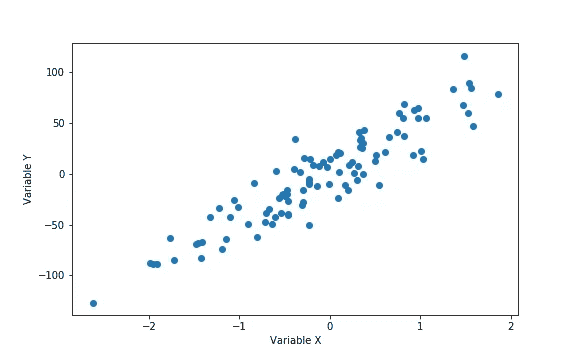
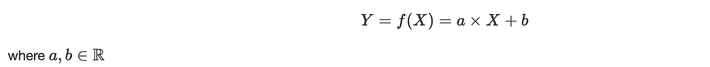
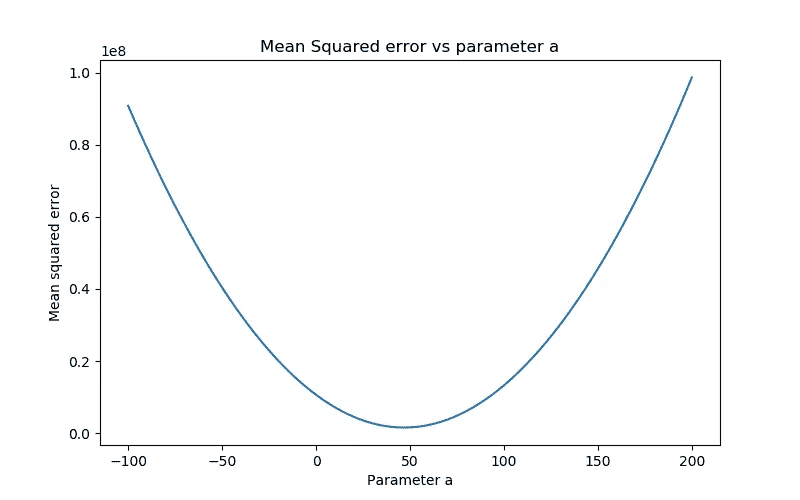
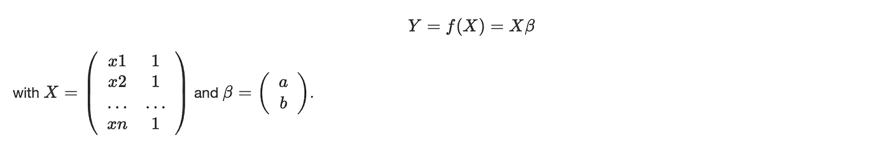
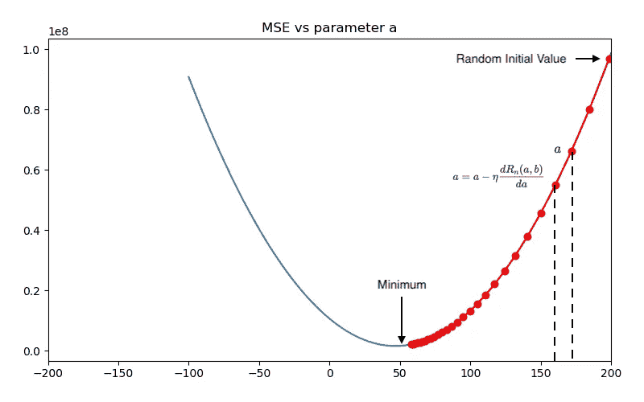
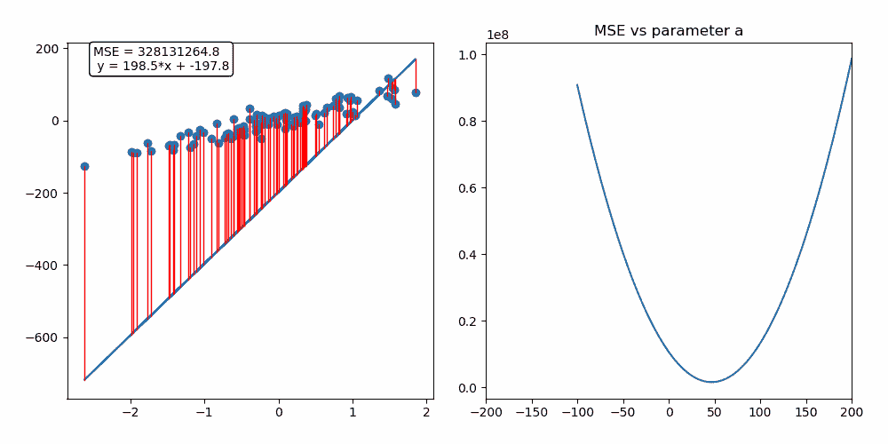
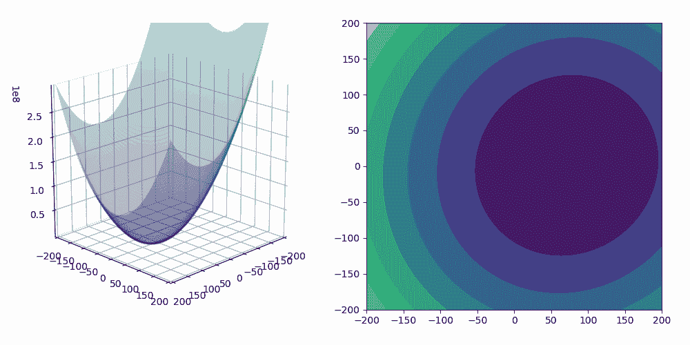
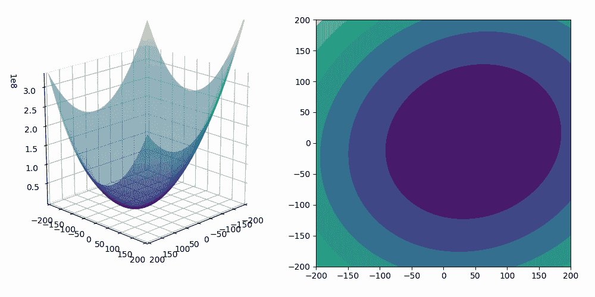

# 机器学习的随机梯度下降解释清楚

> 原文：<https://towardsdatascience.com/stochastic-gradient-descent-for-machine-learning-clearly-explained-cadcc17d3d11?source=collection_archive---------49----------------------->

## 随机梯度下降是当今大规模机器学习问题的标准优化方法。它用于从逻辑回归到人工神经网络的各种模型的训练。在本文中，我们将用线性回归来说明梯度下降和随机梯度下降的基本原理。

# **形式化我们的机器学习问题**

正如你可能知道的，监督机器学习在于找到一个函数，称为决策函数，它最好地模拟数据的输入/输出对之间的关系。为了找到这个函数，我们必须将这个学习问题公式化为一个最优化问题。

让我们考虑以下任务:找到将输入空间、变量 *X* 映射到输出空间、变量 *Y* 的最佳线性函数。

Y 变量对 X 变量的绘图(图片作者: [GitHub 链接](https://github.com/baptiste-monpezat/stochastic_gradient_descent/blob/master/Stochastic_Gradient_Descent.ipynb))

当我们试图通过线性函数来模拟 *X* 和 *Y* 之间的关系时，允许学习算法选择的函数集合如下:

术语 *b* 就是截距，在机器学习中也叫**偏差**。
这组函数就是我们的**假设空间**。但是我们如何选择参数 a，b 的值，以及我们如何判断这是否是一个好的猜测？

我们定义了一个叫做**损失函数**的函数，它在结果 *Y.* 的上下文中评估我们的选择

我们将损失定义为平方损失(我们可以选择另一个损失函数，如绝对损失) :

平方损失惩罚实际 *y* 结果和通过选择参数组 *a、b* 的值估计的结果之间的差异。这个损失函数在单个点上评估我们的选择，但是我们需要在所有的训练点上评估我们的决策函数。

因此，我们计算误差平方的平均值:**均方误差**。

其中 *n* 是数据点的数量。
该函数取决于定义我们假设空间的参数，称为**经验风险**。

*Rn(a，b)* 是参数的二次函数，因此其最小值总是存在，但可能不是唯一的。

(图片作者: [GitHub 链接](https://github.com/baptiste-monpezat/stochastic_gradient_descent/blob/master/Stochastic_Gradient_Descent.ipynb))

最终，我们达到了最初的目标:**将学习问题公式化为优化问题！**

事实上，我们所要做的就是找到决策函数，即 *a，b* 系数，使这种经验风险最小化。

这将是我们可能产生的最好的决策函数:我们的**目标函数**。

在简单线性回归的情况下，我们可以简单地对经验风险进行微分，并计算 *a，b* 系数来抵消衍生产品。用矩阵符号来计算这个解更容易。方便的是将常量变量 1 包含在 *X* 中，并将参数 *a* 和 *b* 写成单个向量 *β。*因此，我们的线性模型可以写成:

我们的损失函数变成了:

最小化我们的等式的向量*β*可以通过求解下面的等式来找到:

我们的线性回归只有两个预测器( *a* 和 *b* ，这样 ***X*** 就是一个***n*X*2****矩阵(其中 *n* 是观测值的个数，2 是预测值的个数)。如你所见，要解这个方程，我们需要计算矩阵**(*x^t**x)***然后求逆。*

*在机器学习中，观察值的数量通常非常多，预测值的数量也非常多。因此，该操作在计算和存储方面非常昂贵。*

*梯度下降算法是一种迭代优化算法，它允许我们在保持低计算复杂度的同时找到解决方案。我们将在本文的下一部分描述它是如何工作的。*

# *潜入梯度下降原理*

*梯度下降算法可以用下面的类比来说明。想象一下，你半夜在山里迷路了。你什么也看不见，因为一片漆黑，你想回到位于谷底的村庄(你试图找到均方误差函数的局部/全局最小值)。为了生存，你制定了以下策略:*

1.  *在你当前的位置，你感觉到了山的陡度，找到了坡度最陡的方向。最陡的斜率对应于均方误差的梯度。*
2.  *你沿着这个方向下山，走一段固定的距离，然后停下来检查你是否还在正确的方向上。这个固定距离就是梯度下降算法的学习速率。如果你走得太久，你可能会错过这个村庄，最终会在山谷另一边的斜坡上。如果你走得不够，到达村庄将需要很长时间，并且有陷入小洞的风险(当地的最小值)。*
3.  *你重复这些步骤，直到满足你设定的标准:例如，两个步骤之间的高度差非常低。*

*最终，你会到达谷底，或者你会陷入局部最小值…*

*既然你已经用这个寓言理解了原理，那就让我们深入到梯度下降算法的数学中去吧！
为了找到使均方误差最小的 *a* 、 *b* 参数，该算法可以实现如下:*

1.  *初始化 *a* 和 *b* 的值，例如 *a* =200，b=-200*
2.  *计算相对于 *a* 和 *b* 的均方误差的梯度。坡度是当前位置最陡坡度的方向。*

**

*然后通过减去梯度乘以步长来更新 *a* 和 *b* 的值:*

**

*用 *η* ，我们的固定步长。*

*用 *a* 和 *b* 的更新值计算均方损失。*

***重复这些步骤**，直到满足停止标准。例如，均方损失的减少低于阈值 *ϵ.**

**

*梯度下降算法图解(图片作者: [GitHub Link](https://github.com/baptiste-monpezat/stochastic_gradient_descent/blob/master/Stochastic_Gradient_Descent.ipynb) )*

*在下面的动画中，您可以看到由梯度下降算法执行的参数 *a* 的更新，以及我们的线性回归模型的拟合:*

**

*梯度下降算法的动画(图片作者: [GitHub 链接](https://github.com/baptiste-monpezat/stochastic_gradient_descent/blob/master/Stochastic_Gradient_Descent.ipynb))*

*由于我们正在拟合具有两个预测值的模型，我们可以在 3D 空间中可视化梯度下降算法过程！*

**

*渐变下降 3D 动画(图片作者: [GitHub 链接](https://github.com/baptiste-monpezat/stochastic_gradient_descent/blob/master/Stochastic_Gradient_Descent.ipynb))*

# ***梯度下降:这会扩展到大数据吗？***

*在梯度下降算法的每次迭代中，我们必须查看所有的训练点来计算梯度。*

*因此，该算法的时间复杂度为 O(n)。计算一个非常大的数据集需要很长时间。也许我们可以计算梯度的估计值，而不是查看所有的数据点:这种算法被称为**迷你批次梯度下降**。*

*小批量梯度下降包括使用大小为 *N* 的随机子集来确定每次迭代的步进方向。*

*   *对于一个大的数据子集，我们得到一个更好的梯度估计，但算法较慢。*
*   *对于一个小的数据子集，我们得到一个更差的梯度估计，但算法计算解决方案更快。*

*如果我们使用一个大小为 *N=1* 的随机子集，称之为**随机梯度下降**。这意味着我们将使用一个随机选择的点来确定步进方向。*

*在下面的动画中，蓝线对应随机梯度下降，红线是基本梯度下降算法。*

**

*随机梯度下降 3D 动画(图片作者: [GitHub 链接](https://github.com/baptiste-monpezat/stochastic_gradient_descent/blob/master/Stochastic_Gradient_Descent.ipynb))*

*我希望这篇文章能帮助你理解这个基本的优化算法，如果你喜欢它，或者如果你有任何问题，请不要犹豫发表评论！*

*你可以在我的 GitHub 上找到我做的实现随机梯度下降和创建动画的代码:[https://GitHub . com/baptiste-monpezat/random _ gradient _ descent](https://github.com/baptiste-monpezat/stochastic_gradient_descent)。*

*你也可以在我的博客上找到原帖:[https://baptiste-monpezat . github . io/blog/random-gradient-descent-for-machine-learning-clearly-explained](https://baptiste-monpezat.github.io/blog/stochastic-gradient-descent-for-machine-learning-clearly-explained)*