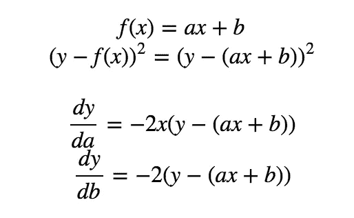
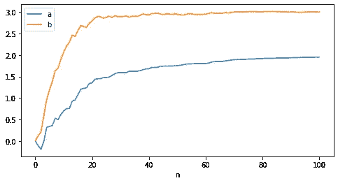
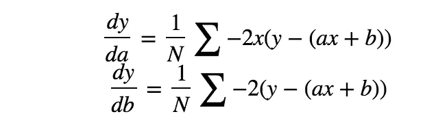
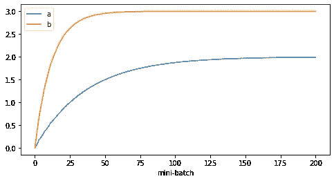
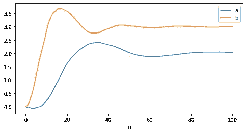

# 随机梯度下降&动量解释

> 原文：<https://towardsdatascience.com/stochastic-gradient-descent-momentum-explanation-8548a1cd264e?source=collection_archive---------19----------------------->

## 实施随机梯度下降

先说随机梯度下降法(SGD)，这可能是我们听过最多的第二著名的梯度下降法。正如我们所知，传统的梯度下降法通过将每个参数推向其梯度的相反方向来最小化目标函数(如果您对普通梯度下降法有困惑，可以查看此处的[以获得更好的解释)。](/gradient-descent-explanation-implementation-c74005ff7dd1)

尽管批量梯度下降保证了凸函数的全局最优，但是考虑到您正在训练具有数百万样本的数据集，计算成本可能会非常高。随机梯度下降通过给数据集增加一些随机性来拯救。*在每次迭代中，SGD 随机洗牌并更新每个随机样本上的参数，而不是完全批量更新。*

# SGD 实施

让我们来看一个具体例子的实现。我们的优化任务被定义为:

这里，我们试图用两个参数`a, b`最小化`y — f(x)`的损失，上面计算了它们的梯度。

样本生成将是:

我们生成了 100 个`x`和`y`的样本，我们将使用它们来找到参数的实际值。

SGD 的实现很简单:

只有一行加法`np.random.shuffle(ind)`，它在每次迭代中打乱数据。我们还设置`a_list, b_list`来跟踪每个参数的更新轨迹，优化曲线将是:

签名于

SGD 降低了计算成本，并可能避免停留在局部最小值，因为它可以通过每次随机选择新样本跳到另一个区域。但这样做的缺点是，如果不适当降低学习速率，它会持续超调。所以在实际用例中，SGD 总是和一个衰减的学习率函数耦合在一起(更多解释[此处](http://d2l.ai/chapter_optimization/sgd.html))。

为了使更新跟踪更加平滑，我们可以将 SGD 与小批量更新结合起来。

# 小批量 SGD

这里所说的[小批量](/gradient-descent-explanation-implementation-c74005ff7dd1)是基于一小批渐变而不是每一项来更新参数。这有助于减少差异，并使更新过程更加顺畅:

每次我们再次混洗数据，但是这次按照以下公式对每批的梯度进行平均更新:

通过将批量大小设置为 50，我们得到了更平滑的更新，如下所示:

小批量 SGD

# 动力

最后，还有一个概念，动量，与 SGD 相结合。它通过引入一个额外的术语`γ`来帮助加速收敛:

在上面的等式中，`θ`的更新受上次更新的影响，这有助于在相关方向上加速 SGD。

实现是不言自明的。通过设置学习率为 0.2，γ为 0.9，我们得到:

动量-新加坡元

# 结论

最后，这绝对不是探索的终点。动量可以与小批量相结合。而且你还测试了更灵活的学习率函数，它随着迭代而变化，甚至在不同的维度上变化的学习率(完全实现[这里](https://github.com/MJeremy2017/Machine-Learning-Models/tree/master/Optimisation))。

到目前为止，我们在所有维度上使用统一的学习率，但是对于不同维度上的参数以不同频率出现的情况，这将是困难的。接下来，我将介绍[自适应梯度下降](/introduction-and-implementation-of-adagradient-rmsprop-fad64fe4991)，它有助于克服这个问题。

参考:

1.  [https://ml-cheat sheet . readthedocs . io/en/latest/gradient _ descent . html](https://ml-cheatsheet.readthedocs.io/en/latest/gradient_descent.html)
2.  [http://d2l.ai/chapter_optimization/sgd.html](http://d2l.ai/chapter_optimization/sgd.html)
3.  [https://ruder . io/optimization-gradient-descent-descent/index . html # gradient descent optimizationalgorithms](https://ruder.io/optimizing-gradient-descent/index.html#gradientdescentoptimizationalgorithms)
4.  [http://d2l.ai/chapter_optimization/momentum.html](http://d2l.ai/chapter_optimization/momentum.html)