# 随机模拟帮助你掌握统计学的概念

> 原文：<https://towardsdatascience.com/stochastic-simulation-helps-you-grasp-concepts-of-statistics-befdba517404?source=collection_archive---------27----------------------->

## 统计学的概念可能很难理解。不要绝望。简单的基于 Python 的模拟可以帮助提炼概念。

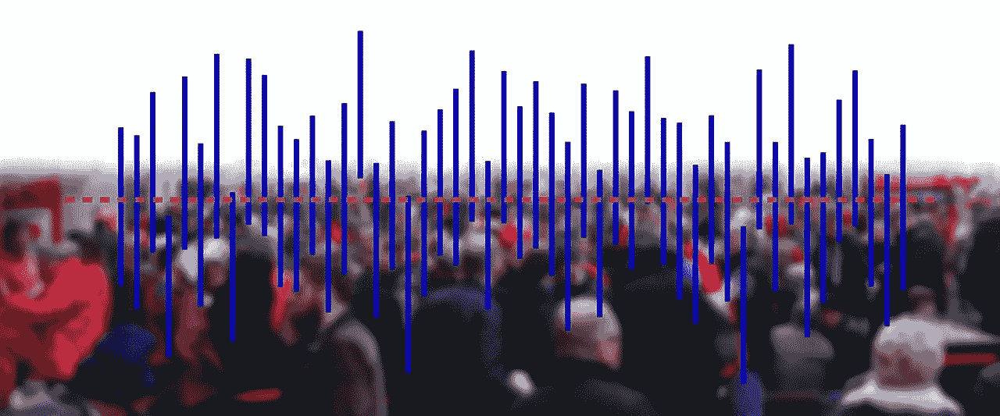

图片来源: [Pixabay](https://pixabay.com/illustrations/population-statistics-human-1282377/) (免费用于商业用途)

# 模拟有助于提炼概念

## 掌握与统计相关的概念可能很难

你是否觉得掌握统计分析的概念——*大数定律*、*期望值*、*置信区间*、 *p 值*——有些困难和麻烦？

你并不孤单。

**我们人类的大脑和精神还没有进化到能够处理严格的统计方法**。事实上,[一项关于人们为什么努力解决统计问题的研究](https://www.sciencedaily.com/releases/2018/10/181012082713.htm)揭示了人们对复杂而非简单、更直观的解决方案的偏好——这常常导致问题完全无法解决。

你可能从诺奖得主丹尼尔·卡内曼的名著《思考，快与慢》中知道，我们的直觉并不存在于我们的理性所在的同一个系统中(见下面的视频)。

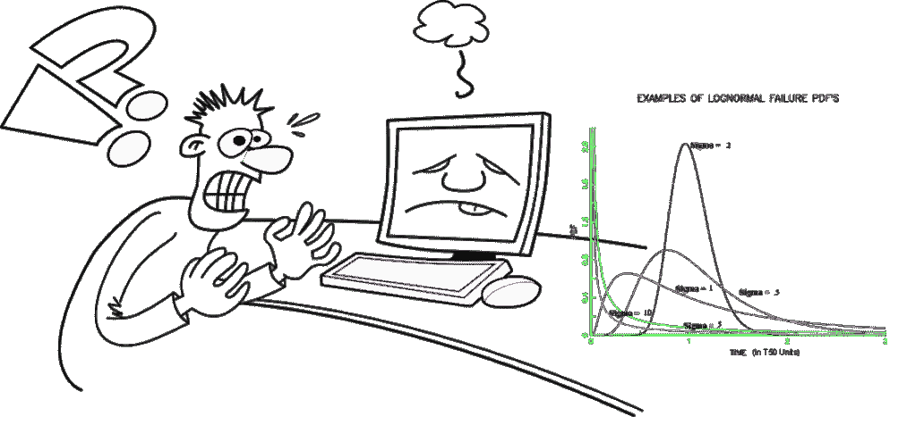

图片来源:作者用 [Pixabay](https://pixabay.com/vectors/computer-problem-computer-problem-152211/) 制作的拼贴画

我们擅长处理少量的数字。人脑的短期工作记忆大约在[7–8 项/数](https://human-memory.net/short-term-working-memory/)左右。

因此，**每当一个过程以数千或数百万的规模出现时，我们** [**往往会对那个过程的‘固有性质’失去把握**](https://www.livescience.com/26870-ginormous-numbers-boggle-the-mind.html)**。那些只表现在大数极限的规律和模式，在我们看来是随机的，毫无意义的。**

**统计学处理的是大数，统计建模和分析中几乎所有的理论和结果都只在大数极限下有效。**

** [## 巨大的数字会产生一个心理黑洞

### 一万亿。一个古戈尔。一个亿。树(3)。在零和无限之间的某个地方有许多有限的东西，但是…

www.livescience.com](https://www.livescience.com/26870-ginormous-numbers-boggle-the-mind.html) 

## 数据科学/机器学习植根于统计学——怎么办？

在这个数据科学和机器学习的时代，核心统计概念的知识被认为是在这些领域取得成功的关键，这可能会让数据科学从业者和正在学习该行业的人感到担忧。

但是不要绝望。有一个非常简单的方法可以解决这个问题。而且它叫‘模拟’。特别是离散的、随机的、基于事件的模拟。

> 因此，**每当一个过程以数千或数百万的规模出现时，我们往往会失去对那个过程的“内在本质”的把握**。

# 让我给你看一个最简单的例子

图片来源: [Pixabay](https://pixabay.com/illustrations/cube-random-luck-eye-numbers-1655118/)

## 掷骰子的期望值

假设我们掷出一个(公平的)骰子，有 6 个可能的面——1 到 6。骰子面从集合{1，2，3，4，5，6}中取值的事件由随机变量**表示。在正式的设定中，任意随机变量*的所谓‘期望值’(用 **E[ *X* ]** 表示)由下式给出:***

*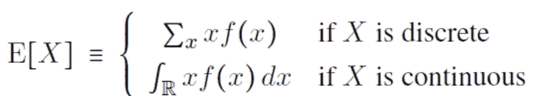*

*其中 ***f(x)*** 是*的**概率分布函数** (PDF)或**概率质量函数** (PMF)，即描述*可能取值分布的数学函数。***

***对于掷骰子的情况，随机变量 ***X*** 是离散的，即它只能假定离散值，因此它有一个 PMF(而不是一个 PDF)。这是一个非常简单的 PMF，***

**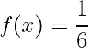**

**这是因为随机变量在样本空间{1，2，3，4，5，6}上具有“**均匀概率分布**”，即任何骰子投掷都可以产生这些值中的任何一个，完全随机，并且不会偏向任何特定值。因此，**期望值**为，**

**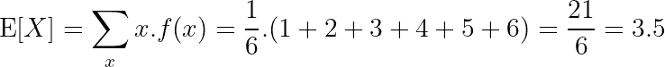**

**因此，根据理论，3.5 是掷骰子过程的期望值。**

****是最可能的值吗？**不会。因为一个骰子连 3.5 的面都没有！那么，这个量是什么意思呢？**

****是某种概率吗？**否。因为该值明显大于 1，并且概率值始终介于 0 和 1 之间。**

****这是否意味着我们可以预期这张脸最多出现 3 次或 4 次(3.5 次是 3 次和 4 次的平均值)**？不。因为 PMF 告诉我们，所有的面孔出现的可能性都是一样的。**

**幸运的是，统计学的一个基本原则提供了答案，即[大数定律](https://en.wikipedia.org/wiki/Law_of_large_numbers)，该定律认为，从长远来看，**期望值就是随机变量将取的所有值的平均值**。**

**注意短语“从长远来看*”。我们如何证实这一点？我们能模拟这样的场景吗？***

***我们当然可以。简单的 Python 代码可以帮助我们模拟场景，验证[大数定律](https://en.wikipedia.org/wiki/Law_of_large_numbers)。***

## ***拯救巨蟒***

***定义一个有骰子面的数组和一个模拟单掷的函数。***

***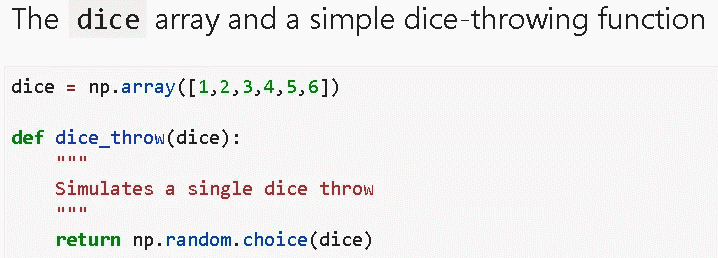***

***扔几次骰子，***

***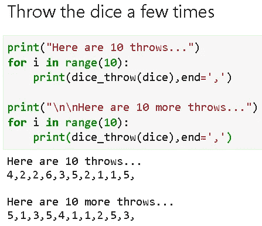***

***您可能已经注意到，对于每次调用`dice_throw()`，我都使用`np.random.choice()`函数从数组`dice`中随机选取一个项目。如果您运行这段代码，您将在您的机器上得到一个完全不同的序列。***

## ***我们留下了统计数据，我们在一个模拟区***

******

***图片来源: [Pixabay](https://pixabay.com/illustrations/cosmos-matrix-tech-strange-5056646/) (免费用于商业用途)***

***停下来，意识到正在发生什么。***

***我们不再处理形式概率和定义。我们正在模拟一个随机事件——掷骰子——就像在现实生活中一样。这就是模拟的诱惑。它在你的计算硬件上构建了一个真实生活的复制品:-)***

***我们可以把所有的编码留在身后，就这么做——掷骰子，记下面部，冲洗并重复——真的。但要验证遵循这条路线的大数定律，将需要大量的时间。***

***这就是为什么我们有了计算机和 Python 编程语言，不是吗？***

***所以，我们只是模拟它足够长的时间，保持一个运行平均值，并绘制它。这是我得到的。***

***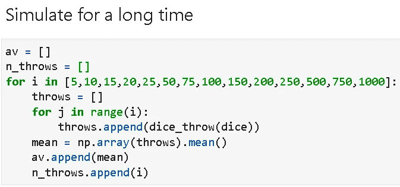******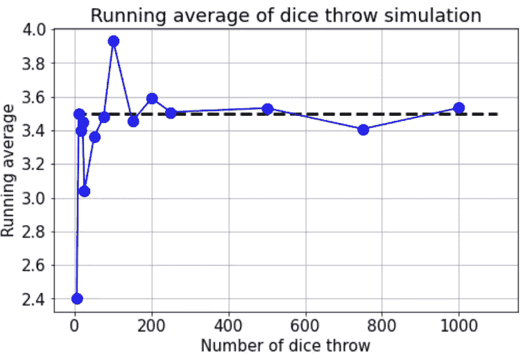***

> ***我们不再处理形式概率和定义。我们正在模拟一个随机事件——掷骰子——就像在现实生活中一样。***

***最初，移动平均线相当疯狂，四处移动。随着模拟次数的增加，平均值收敛到 3.5，正如理论所预期的那样。***

***这样，**我们再回来统计，借助模拟**。大数定律可以通过重复刺激随机事件来验证——只需很少的编程。***

# ***用模拟处理置信区间***

## ***一些基本定义***

******人口*** :我们要测量某个属性的全部集合。我们(几乎)永远无法获得足够的总体数据。因此，我们永远无法知道人口属性的真实值。***

*****样本*** :我们可以收集的总体数据的一部分(子集)，它有助于我们估计总体的特性。因为我们不能测量总体属性的真实值，所以我们只能估计它们。这是统计学家的中心工作。**

*****统计量*** :统计量是样本的函数。这是一个随机变量，因为**每次你取一个新的样本(来自同一人群)你将得到一个新的统计值**。例如样本均值或样本方差。这些是对人口的良好(无偏)估计。**

**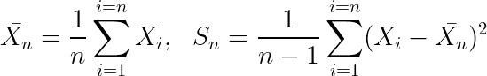**

*****置信区间*** :统计量的一个范围/界限(由我们选择)。我们需要这个最小/最大界限来量化我们抽样的随机性质的不确定性。让我们以平均值的*置信区间为例进一步阐明这一点。***

**根据我们抽取样本的地点和方式，我们可能会得到很好的总体代表性，也可能得不到。所以，如果我们 ***多次重复抽取样本的过程*** ，在某些情况下样本会包含总体的真实均值，而在另一些情况下，它会漏掉它。**

**我们能说一下我们成功抽取包含真实均值的样本的比例吗？**

**这个问题的答案在置信区间里。如果满足一些假设，那么我们就可以计算出包含某个分数的真实均值(当我们大量采样时)的置信区间。**

**下面给出了必要的公式。我们不会讨论这个公式的细节，也不会讨论为什么在这个公式中使用特殊的 [t 分布](https://en.wikipedia.org/wiki/Student%27s_t-distribution)。读者可以参考任何本科水平的统计文本或优秀的在线资源来理解基本原理。**

** [## z 和 t 分布的置信区间

### 1)理解置信区间的概念，并能够为均值构建一个置信区间 2)理解何时(为了什么…

pages.wustl.edu](https://pages.wustl.edu/montgomery/articles/2757#:~:text=The%20t%2Ddistribution%20incorporates%20the,less%20than%20the%20sample%20size.) 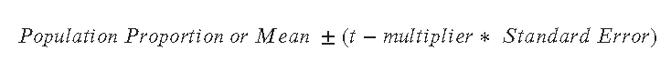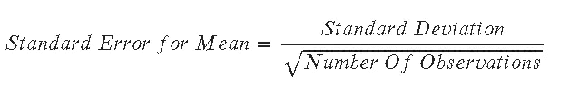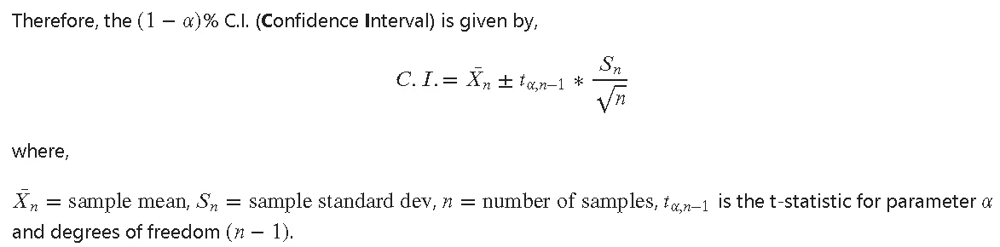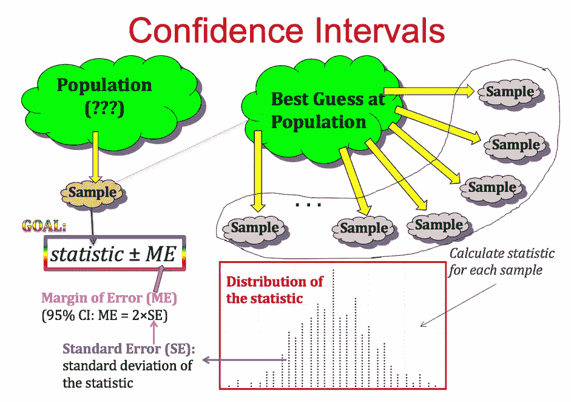

置信区间图解:[图片来源](https://psu.instructure.com/courses/1844486/pages/chapter-3-confidence-intervals)(公立大学课程资料)

> 我们能说一下在抽取包含真实均值的样本时成功的**比例吗？这个问题的答案在置信区间里。**

## 实际效用如何？

请注意定义和过程，以了解置信区间的真正实际用途。

当你计算均值的 95%置信区间时，你不是在计算任何概率(0.95 或其他)。*您正在计算两个特定的数字*(样本均值的最小和最大界限)，如果我们重复这个过程，它将创建一个包含真实总体均值(未知)*的值范围。*

这就是实用之处。我们不会重复这个过程。我们只是抽取一次样本，构建这个范围。

如果我们可以重复这个过程一百万次，我们将能够*验证声称*在 95%的情况下，真实平均值位于这个范围内。

但是在现实生活中，采样一百万次是非常昂贵的，而且是完全不可能的。因此，置信区间的**理论计算为我们提供了最小/最大范围，仅来自样本的一次抽取**。这太神奇了，不是吗？

## 但是在模拟中，我们可以实验一百万次！

是的，模拟是神奇的。我们可以重复抽样过程一百万次，并验证我们的理论置信区间真正包含总体均值(大约 95%的时间)的说法。

让我们用一个工厂生产的真实例子来验证一下。假设在一个工厂中，某台机器平均生产 20 吨产品，标准差为 5 吨。**这些是真实的总体均值和标准差**。因此，我们可以编写简单的 Python 代码来生成一年(52 周)的典型生产运行，并绘制它。

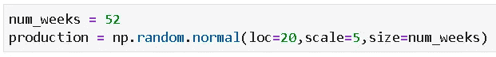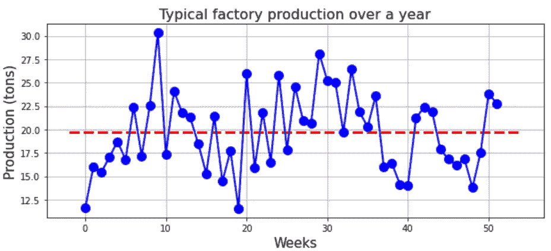

然后，我们可以编写以下函数对**过程进行任意次模拟，以计算置信区间真正包含总体均值的次数。**记住，我们知道这种情况下的总体均值——是 20。

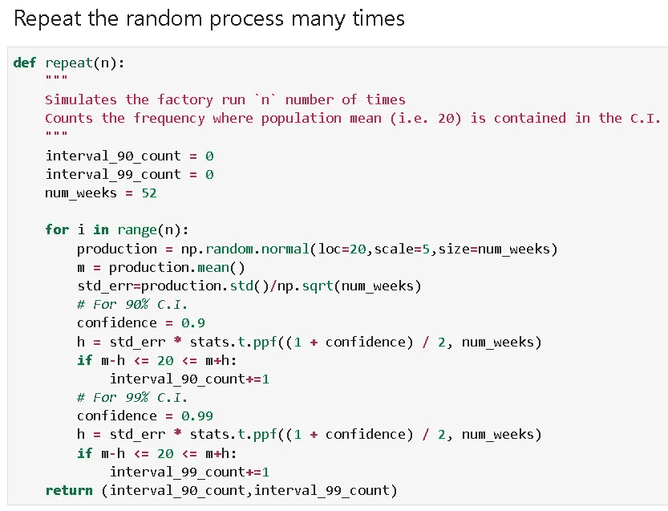

如果我们运行这个函数 10，000 次，每次都计算 C.I .是否包含真实平均值，然后检查频率/比率，我们得到以下结果。

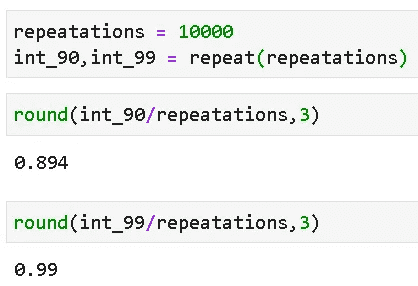

这些比率惊人地接近理论计算值 0.9 (90%)和 0.99 (99%)，不是吗？

> 我们可以重复抽样过程一百万次，并验证我们的理论置信区间确实包含总体均值的说法。

## 模拟是大规模数据科学的有力工具

在上面的例子中，我们讨论了均值的置信区间。但我们可以围绕任何其他统计数据构建 C.I .比如方差或 T2 分位数。我们甚至可以构建两个实验之间的平均差异的*的置信区间。在每种情况下，确切的公式和计算可能略有不同，但想法是相同的。*

随着流程复杂性的增加，我们处理的不是一个而是多个相互关联的流程，在实践中计算简单的汇总统计数据可能并不总是可行的。对于大型数据科学和分析任务，我们必须掌握随机模拟的艺术来处理这种情况。

# 仿真综述与思考

在本文中，我们展示了模拟理解统计估计概念的能力，如*期望值*和*置信区间*。事实上，我们没有机会重复统计实验数千次，但我们可以在计算机上模拟这个过程，这有助于我们以清晰直观的方式提取这些概念。

一旦你掌握了模拟随机事件的艺术，你就可以用一种新的分析武器来研究随机变量的性质和它们背后深奥的统计理论。

例如，你可以用随机模拟来研究，

*   许多随机事件的均值收敛于正态分布(用数值实验验证中心极限定理)
*   看看当你以这种或那种方式将许多统计分布混合或转换在一起时会发生什么？你会得到什么样的分布呢？
*   如果一个随机事件不遵循理论假设，结果会是什么样的异常行为？在这种情况下，模拟可能是你唯一的朋友，因为如果假设不成立，标准理论就会失效。
*   深度学习网络的运行会出现什么样的统计特性？

对于学习数据科学和机器学习的基本原理来说，这些练习的重要性怎么强调都不为过。

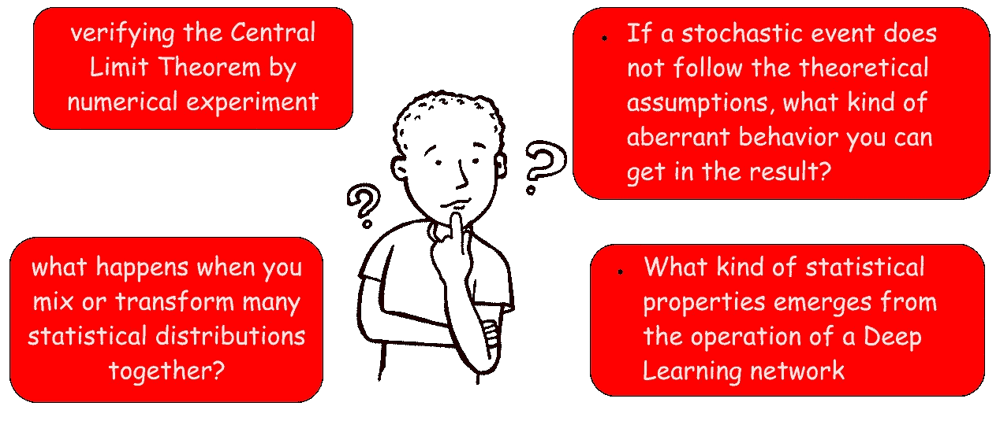**

**如果你喜欢这篇文章，你可能也会喜欢我关于随机模拟和使用 Python 的统计概念的其他文章。**

** [## Python 中的蒙特卡罗集成

### 一个著名的赌场启发的数据科学，统计和所有科学的把戏。用 Python 怎么做？

towardsdatascience.com](/monte-carlo-integration-in-python-a71a209d277e)  [## 用 Python 实现布朗运动

### 我们展示了如何模拟布朗运动，在广泛的应用中使用的最著名的随机过程，使用…

towardsdatascience.com](/brownian-motion-with-python-9083ebc46ff0)  [## 如何从头开始生成随机变量(不使用库)

### 我们通过一个简单的伪随机生成器算法，并显示如何使用它来生成重要的随机…

towardsdatascience.com](/how-to-generate-random-variables-from-scratch-no-library-used-4b71eb3c8dc7)  [## 用简单的 Python 例子揭开假设检验的神秘面纱

### 假设检验是数据科学的基础。我们使用简单的真实例子来演示这个概念，使用…

towardsdatascience.com](/demystifying-hypothesis-testing-with-simple-python-examples-4997ad3c5294) 

喜欢这篇文章吗？成为 [***中等会员***](https://medium.com/@tirthajyoti/membership) *继续* ***无限制学习*** *。如果您使用下面的链接，* ***，我将收取您的一部分会员费，而不会对您产生额外费用*** *。*

 [## 通过我的推荐链接加入媒体

### 作为一个媒体会员，你的会员费的一部分会给你阅读的作家，你可以完全接触到每一个故事…

medium.com](https://medium.com/@tirthajyoti/membership)****