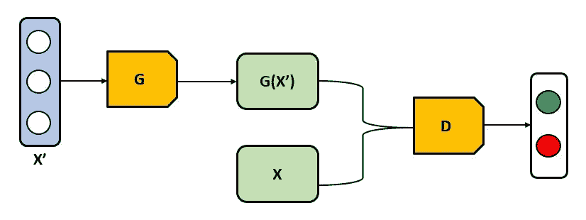
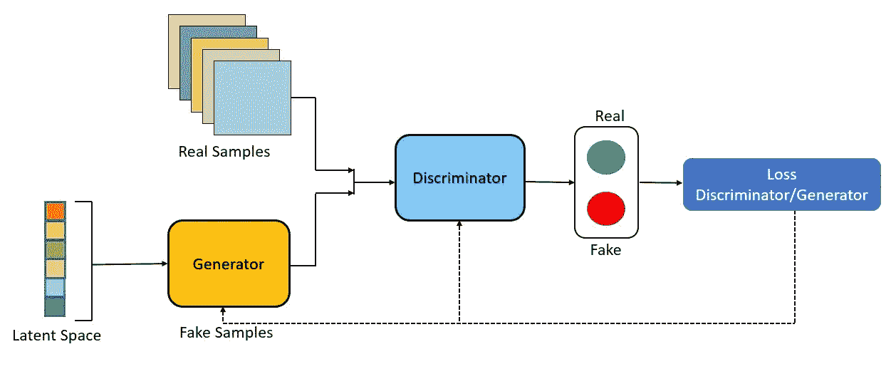
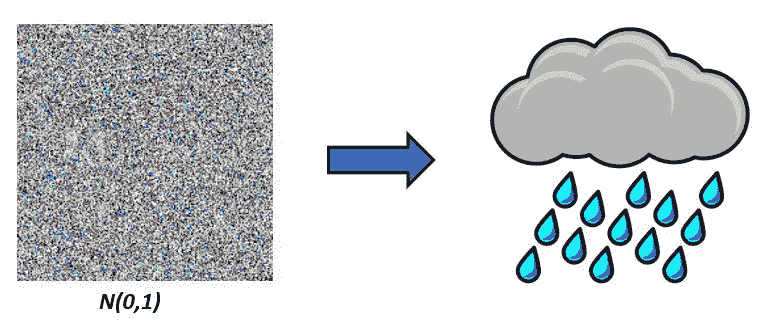
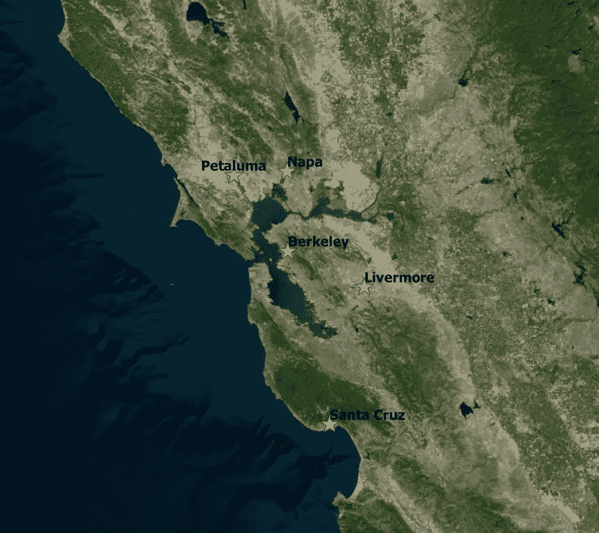
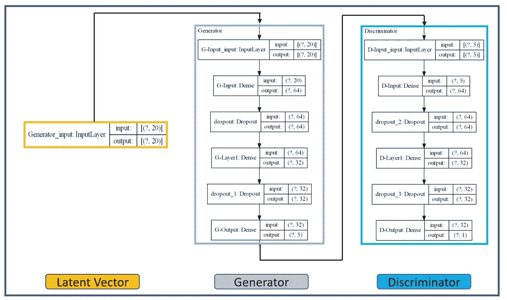
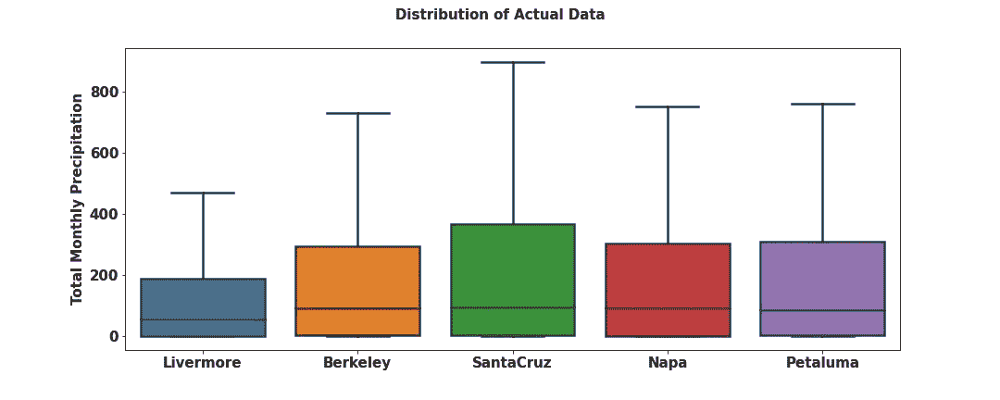
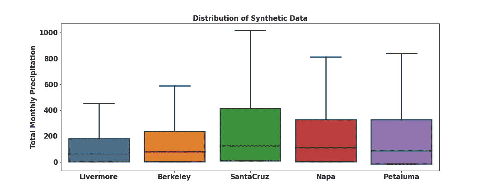
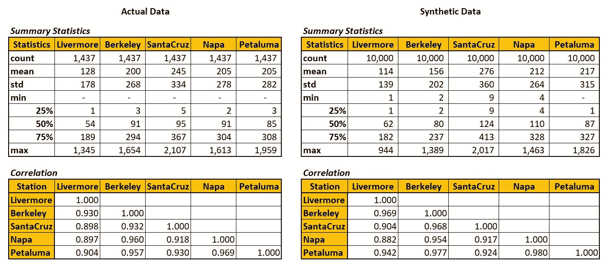

# 使用生成对抗网络的随机天气生成器

> 原文：<https://towardsdatascience.com/stochastic-weather-generator-using-generative-adversarial-networks-a9856b0f83ef?source=collection_archive---------33----------------------->

## 使用 GANs 对多元分布建模

作者图片

被困在付费墙后面？点击[这里](/stochastic-weather-generator-using-generative-adversarial-networks-a9856b0f83ef?sk=87f42f965189c2a1ffe821d3d33e0bd8)使用我的朋友链接阅读这个故事！

G 世代模型已经被用于不同领域的无数应用中——从定量金融到水文气候研究的建模和最小化尾部风险，再到研究极端天气的联合影响。生成模型的强大之处在于它能够封装整个依赖结构和数据集的潜在概率分布。这非常有用，因为使用生成模型，我们不仅可以创建数据集的未来表示，还可以对新的真实数据点进行采样，从而保持原始训练数据集之间的交叉相关性。

生成对抗网络(GANs)是由[*good fellow et al .(2014)*](https://arxiv.org/abs/1406.2661)首先提出的一类新的生成模型。从那时起，GANs 在机器学习社区中被广泛采用，以解决无监督的机器学习问题，包括图像/文本生成和翻译。在本文中，让我们探索如何使用 GANs 来模拟离散时间随机过程，并按需创建可信的样本来构建天气数据的合成时间序列。

# 甘小说简评:

**生成性对抗网络的架构示意图**(图片由作者提供)

GANs 架构由两个子模式组成，称为 ***生成器(G)*** 和 ***鉴别器(D)*** ，它们相互竞争，目标是通过训练过程达到[纳什均衡](https://en.wikipedia.org/wiki/Nash_equilibrium)。生成器学习将潜在空间(例如，Noise ~ *N(0，1)* )映射到给定数据样本分布的数据空间，并且鉴别器评估生成器完成的映射。生成器的主要作用是生成模拟训练数据集的合成数据，达到鉴别器不能区分合成数据和真实数据的程度。

发生器的输入是一个随机噪声向量*x’*(通常是均匀或正态分布)。噪声向量通过生成器映射到一个新的数据空间，得到一个伪样本*G(x’)*，它是一个多维向量。鉴别器是一个二元分类器，它接受合成的*G(x’)*和训练( *x* )数据集，并学习将它们分类为假的和真的。当鉴别器不能确定数据是来自真实数据集还是来自发生器时，达到 GAN 模型的最佳状态。

随着时间的推移，GANs 的几种变体被开发出来，以解决手头问题的特定需求，但是所有这些变体都采用分两个阶段进行的对抗性训练:

**第一阶段:**训练鉴频器，冻结发电机。这是通过将真实和虚假数据的样本传递给模型并评估鉴别器是否能够正确预测它们来实现的。在训练过程的第一阶段，网络将只进行正向传递，不进行误差的反向传播。

**第二阶段:**在此阶段，我们训练发电机，并冻结鉴别器。这可以通过优化发生器来实现，以创建逼真的样本来欺骗第一阶段中经过训练的鉴频器。

一旦训练完成，GANs 模型将被优化以生成足够真实的合成时间序列，从而模拟真实的时间序列数据。训练后，生成模型可用于按需创建新的可信样本。

# 什么是随机天气发生器？

作者图片

随机天气生成器是一种统计模型，旨在通过分析某个地区的天气统计特征，生成该地区无限长的天气数据合成时间序列。大多数随机天气生成器使用马尔可夫过程和不同天气变量的频率分布的组合。

在气候建模中，传统上使用[连接函数](https://en.wikipedia.org/wiki/Copula_(probability_theory)#:~:text=In%20probability%20theory%20and%20statistics,the%20dependence%20between%20random%20variables.)对多元分布进行建模。copula 函数是具有标准一致边缘的多元分布。任何多元分布都可以写成它的边际分布和它的 copula 的组合。例如，在二元情况下，给定两个连续的随机变量***【x】***和***【y】***，具有边际分布***【F】***和***【G】***，以及联合分布***【Q】***，存在一个系词**【C】**使得

**GANs 提供了一个完全不同的框架来模拟多元分布。结合使用生成性和鉴别性模型，以及对抗性训练，我们将能够将噪音转化为现实的天气数据。**

# **数据:**

**在这项研究中，我们将使用位于加州湾区的五个气象站的月总降水量。为了训练 GAN 模型，我们将使用从 [NOAA 的 USHCN 数据库](https://cdiac.ess-dive.lbl.gov/ftp/ushcn_v2.5_monthly/)获得的 1893 年至 2012 年的月降水量数据。降水量的单位是百分之一英寸。我们将重点关注 GANs 通过模拟月总降水量来获取五个气象站之间的空间相关性的能力。**

****

****湾区气象站**(图片由作者提供)**

# **型号:**

**对于 GAN 的发生器和鉴别器组件，我们将采用三层顺序模型。潜在向量将包括从正态分布中采样的 20 个值。我们将在隐藏层中使用流行的 ReLU 激活函数，并使用平均绝对百分比误差(MAPE)损失和随机梯度下降的 Adam 版本来训练模型。为了防止模型过拟合，我们将采用剔除正则化技术。本研究中使用的 GANs 架构示意图如下所示**

****

****甘建筑**(图片作者提供)**

**我们的模型输出将有 10，000 个合成数据样本，其中 5 个输出特征对应于利弗莫尔、伯克利、纳帕、佩塔卢马和圣克鲁斯地区的月总降水量。该模型是使用 Python 中的 Keras 库实现的，下面提供了代码片段。**

# **结果:**

**正如本文介绍部分所提到的，GANs 最大的优势之一是它能够按需生成数据。使用经过训练的 GANs 模型，为五个气象站中的每一个生成了 10，000 个新的合成数据点。下图和下表比较了用于训练模型的实际数据和 GANs 模型生成的合成数据的描述性统计数据。**

****

****不同气象站降水数据的箱线图(实际)****

****

****不同气象站降水数据的箱线图(合成)****

****

****实际(训练)和合成数据的描述性统计和相关性比较****

**对模型结果的快速回顾表明，GAN 模型能够相对较好地了解每个气象站的数据分布，同时保持站之间的交叉相关性。对于圣克鲁斯站，模型估计值略高于观测值。但一般来说，合成数据的样本最小值、下四分位数(25%)、中值(50%)、上四分位数(75%)和样本最大值与实际数据的相应统计数据匹配良好。通过优化潜在向量的大小、层数、代价函数、训练算法和激活函数，可以进一步提高 GAN 模型的性能。**

# **基于 GANs 的数据增强；**

**对于大多数现实世界的应用程序来说，数据稀缺是需要解决的最大瓶颈之一。在保险和风险分析领域尤其如此，数据质量进一步加剧了数据稀缺的问题。GANs 提供了一个强大的预训练建模框架，可以人工合成新的标记数据，用于开发更好的模型和风险分析。这项研究只是触及了 GANs 在风险建模中的潜在应用的表面。敬请关注更多内容。**

**感谢阅读这篇文章！感谢所有反馈。如有任何问题，请随时联系我。**

****如果你喜欢这篇文章，这里还有一些你可能喜欢的文章:****

** [## 使用深度学习的飓风路径预测

### 每年 6 月 1 日到 11 月 30 日之间的时间窗标志着北大西洋飓风季节。在此期间…

medium.com](https://medium.com/@kap923/hurricane-path-prediction-using-deep-learning-2f9fbb390f18)  [## 通过数据科学解读气候变化

### 用 FB Prophet 预测未来 CO₂水平

towardsdatascience.com](/interpreting-climate-change-through-data-science-321de6161baf)  [## 飓风佛罗伦萨——建立一个简单的风暴路径预测模型

### 飓风佛罗伦萨是 2018 年大西洋飓风季节的第一场主要飓风。从它在海角附近的起源…

towardsdatascience.com](/hurricane-florence-building-a-simple-storm-track-prediction-model-1e1c404eb045)**