# 股票基本面分析:SEC 季度数据汇总的 EDA

> 原文：<https://towardsdatascience.com/stock-fundamental-analysis-eda-of-secs-quarterly-data-summary-455e62ff4817?source=collection_archive---------34----------------------->

## 大熊猫 2020 SEC 申报的探索性数据分析


马库斯·斯皮斯克在 [Unsplash](https://unsplash.com?utm_source=medium&utm_medium=referral) 上的照片

许多投资者认为基本面分析是他们战胜股市的秘密武器。您可以使用许多方法来执行它，但是它们有一个共同点。他们都需要关于公司财务报表的**数据**。

幸运的是，所有在美国股票市场交易的股票都必须向证券交易委员会提交季度报告。每季度 SEC 都会准备一份舒适的 CSV 文件，帮助所有投资者寻找投资机会。让我们来探讨如何从这些中获得有价值的见解。csv 文件。

在本教程中，我们将使用 [python 的 pandas](https://pandas.pydata.org/) 库来解析 CSV 文件，我们将学习如何:

*   [探索季度转储](#c382)的**结构**
*   [确定我们**感兴趣的记录**在](#bc41)
*   [了解有多少**提交表格**存在](#bc41)
*   [钻研 **10-K、8-K 或 40-F** 表格](#f0e0)的内容
*   [分析是否每个公司每个季度只报告一个文件](#991a)
*   [检查提交文件是否符合 SEC 的截止日期](#cb50)

我们将处理数据并:

*   浏览**秒转储**中的文件
*   查看这些文件的每一栏，并讨论与**最相关的**
*   移除按关键列或多列分组的**重复的**数据
*   使用交互式 Plotly 图表可视化数据以支持我们的探索
*   还有更多

和往常一样，你可以按照 [GitHub](https://github.com/vaclavdekanovsky/data-analysis-in-examples/blob/master/SEC%20Quarterly%20Data%20Dump/EDA_of_SEC_2020Q1_Filling_sub.ipynb) 上分享的笔记本里的代码。

[](https://github.com/vaclavdekanovsky/data-analysis-in-examples/blob/master/SEC%20Quarterly%20Data%20Dump/EDA_of_SEC_2020Q1_Filling_sub.ipynb) [## vaclavdekanovsky/数据分析示例

### permalink dissolve GitHub 是超过 5000 万开发人员的家园，他们一起工作来托管和审查代码，管理…

github.com](https://github.com/vaclavdekanovsky/data-analysis-in-examples/blob/master/SEC%20Quarterly%20Data%20Dump/EDA_of_SEC_2020Q1_Filling_sub.ipynb) 

# SEC 季度数据

好像没什么问题。你只需从 [SEC 数据集页面](https://www.sec.gov/dera/data/financial-statement-data-sets.html)下载季度包，按降序排列财务报表中的数值，并挑选顶部的股票。现实并没有那么简单。让我们来看一看 2020 年第一季度所有 SEC 备案的 45.55MB 大 zip 文件。

每个季度的包包含 5 个文件。这里有一个 [2020 Q1](https://www.sec.gov/files/node/add/data_distribution/2020q1.zip) 的例子:

*   **readme.htm**—描述文件的结构
*   **sub.txt** —关于提交文件的主要信息，包括公司标识符和文件类型
*   **num.txt** —每份财务报表和其他文件的数字数据
*   **tag.txt** —标准分类标签
*   **pre.txt** —关于 num.txt 中的数据如何显示在在线演示文稿中的信息

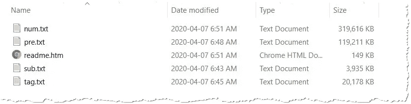

SEC 季度数据转储中的解压缩文件

本文将只讨论 submission master，因为它包含的信息对于一篇文章来说已经足够了。后续报道将更详细地研究这些数据。我们开始吧。

## 2020Q1 提交文件

2020 年第一季度，这些公司已经提交了`13560`文件，sub.txt 收集了关于它们的 36 个专栏。

```
# load the .csv file into pandas
sub = pd.read_csv(os.path.join(folder,"sub.txt"), sep="\t", dtype={"cik":str})# explore number of rows and columns
sub.shape[Out]: (13560, 36)
```

我总是从一个简单的函数开始，该函数检查数据框的每一列，检查空值的百分比，以及有多少唯一值出现在列中。

浏览 sub.txt 文件，查看每列包含的数据

让我强调一下 SEC submission master 中的几个重要栏目。

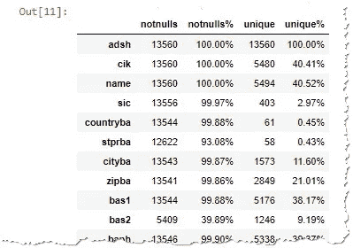

pandas 中的快速文件概览示例

*   **adsh** — EDGAR 登录号唯一标识每份报告。该值**在 sub.txt 中从不重复**，例如 0001353283–20–000008 是 [Splunk](https://investors.splunk.com/sec-filings/sec-filing/10-k/0001353283-20-000008) 的 10-K(年度备案)代码。
*   **cik** —中央索引键，识别每个 SEC 注册人的唯一键。例如，Splunk 的 0001353283。如您所见，adsh 的第一部分是 cik。
*   **名称** —提交季度财务数据的公司名称
*   **表格** —提交报告的类型

# 表格 s—提交给 SEC 的提交类型

根据分析，我们看到 2020 年第一季度提交的报告包含 **23 种独特的财务报告**。投资者的主要兴趣在于涵盖上市公司年度业绩的 [**10-K**](https://en.wikipedia.org/wiki/Form_10-K) 报告。因为这份报告预计每年只提交一次，所以显示公司财务季度变化的报告也很重要。

*   `10-K`美国公司年报
*   `10-Q`季度报告和也许
*   `20-F`外国公司的年度报告
*   `40-F`外国公司的年度报告(加拿大)

让我们看看哪些表单在数据集中最常见。2020Q1 中表格类型的绘制将显示此图片:

使用 Plotly 的低级 API 生成条形和饼形支线剧情

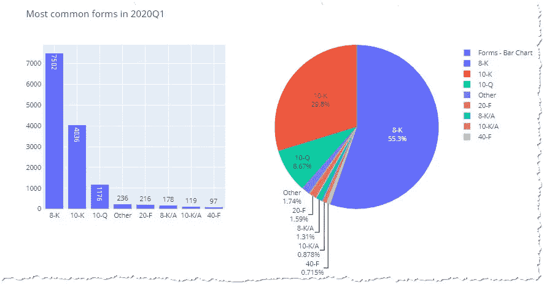

各公司在 2020 年第 1 季度使用 Plotly 中的可视化功能报告了不同的提交类型

该数据集包含超过 7000 份 [8-K 报告](https://en.wikipedia.org/wiki/Form_8-K)，通知重要事件，如协议、裁员、材料使用、股东权利修改、高级职位变更等(参见 [SEC 的指导方针](https://www.sec.gov/fast-answers/answersform8khtm.html))。因为它们是最常见的，我们应该花些时间来探索它们。

## 8k 唱片公司

仅过滤`8-K`表单，我们看到数据集包含这种类型的`7502`记录。

```
[In]:
# let's filter adsh, unique report identifier of the `8-K`s
eight_k_filter = sub[sub["form"]=="8-K"][["name","adsh"]]
eight_k_filter.shape[Out]: (7502, 2)
```

如果我们将包含详细财务数据的`num.txt`合并，我们只能得到`2894`行。有些记录似乎没有细节。

```
[In]:
# load the num.txt file containing detailed data
num = pd.read_csv(os.path.join(folder,"num.txt"),sep="\t")# merge the file headers with the detailed data 
eight_k_nums = num.merge(eight_k_filter)
eight_k_nums.shape[Out]: (2894, 10)
```

除此之外，这些记录仅涵盖`20`份独特的报告(每份报告由`adsh`号标识)。

```
[In]: len(eight_k_nums["adsh"].unique())
[Out]: 20
```

这是因为`num.txt`只包含财务细节，而大多数`8-K`用文字描述事件。只有像[0001262976–20–000015](https://sec.report/Document/0001262976-20-000015/)这样的罕见事件，这种特殊情况会声明额外的财务报表作为`8-K`报告的一部分。

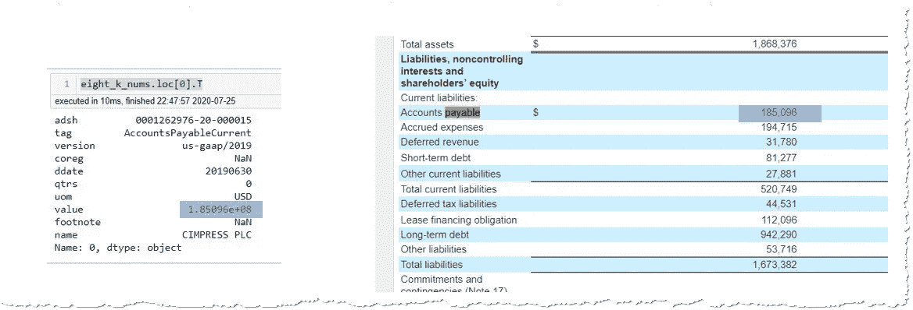

num.txt 中的每一行正好包含财务报表中的一行

> `8-K`以纯文本描述事件，这不是转储的一部分。只有在包括财务报表的情况下才会出现详细信息，这种情况很少见

## 8-K 没有财务明细，其他表格有吗？

我们很少在`num.txt`中看到任何与`8-K`表单相关的数据。让我们用图表显示所有的表格类型，看看其他归档是否有所不同。我们将把`num.txt`左连接到`sub.txt`，并使用`indicator`参数来查看哪个`adsh`键出现在两者中。

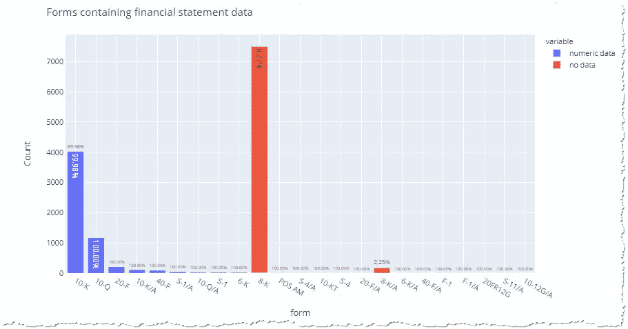

只有 8-K 和 8-K/A 与财务详细信息无关

当我们连接这两个文件时，我们可以看到只有`8-K`和`8-K/A`缺少财务细节，这很好，因为现在我们将研究年度`10-K`和季度`10-Q`报表

# 10K 和 10 Q

在 8-K 文件中，只有 20 份包含 SEC 季度数据转储中的额外信息，这并没有带来多少好处。让我们将注意力转移到更有趣的提交类型——年度报告和季度报告，然后我们将简要地看一下其他的形式。

SEC 在 2020 年 4 月初发布了数据集，因此我们很有可能在记录中看到一些日期为 2019-12-31 的年度报告。如果我们只过滤`10-K`和`10-Q`，我们会发现 2020Q1 转储中的大部分数据都是年度报告。

```
# filter only 10-K and 10-Q forms
tens = sub[sub["form"].isin(["10-Q","10-K"])]# count how many forms of each type are in the dataset
tens_counts = tens["form"].value_counts().reset_index().rename(columns={"index":"form type", "form": "count"})# using Plotly.Express create a bar chart
fig = px.bar(tens_counts,
            x="form type",
            y="count",
            barmode='group', 
            text="count", 
            title="Number of Annual and Quarterly forms in 2020Q1"
           )
fig.show()
```

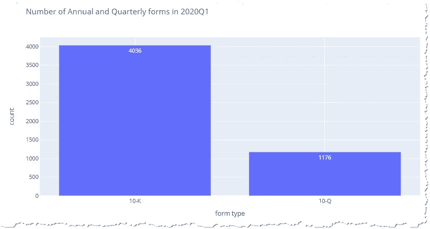

Q1 的 SEC 数据转储主要包含年度报告

但是所有的公司都在一年的最后一天报告年度报表吗？

**财政年度**

数据集包含列`fy`和`fp`，它们表示财务报表所代表的财政年度和季度。我们绘制了最典型的图表。(有关代码，请参见完整的笔记本“财政年度”部分)

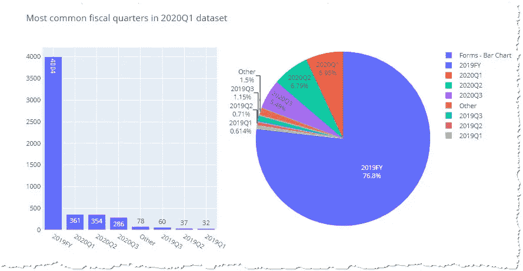

2019 年的年度报表是最典型的，但我们看到一些 Q1、Q2 甚至 2020 年第三季度的报表

它揭示了一个有趣的事实，即 2020 年第一季度的数据包含 2020 财年的第二季度和第三季度。我们怎么可能在第一季度就已经知道夏季和秋季的财务结果呢？

让我们来看一下[雷克斯诺德公司](https://www.sec.gov/ix?doc=/Archives/edgar/data/1439288/000143928820000090/rxn-20200331.htm)的财务报表。

> 本报告中 2020 财年之前(含)的财年是指相应日历年的 4 月 1 日至 3 月 31 日。例如，我们的 2020 财年，即 2020 财年，是指 2019 年 4 月 1 日至 2020 年 3 月 31 日这段时间。— Rexnord 公司

财政年度不必与日历年度完全相同。有些公司在 1 月份结束了 2020 财年，大部分数据都进入了 2019 年。意味着一个公司的财政收入和其他公司没有可比性。

> 2020 财年将从 2 月 19 日持续到 2020 年 1 月

## 2019 年营收如何确定？

为了使价格与基本面特征一致，我们必须确定收入何时获得，现金何时流入。我们用什么变量来找出财务数据的真实时间框架？它是数据集中另一个名为`period`的变量。再来看剧情。

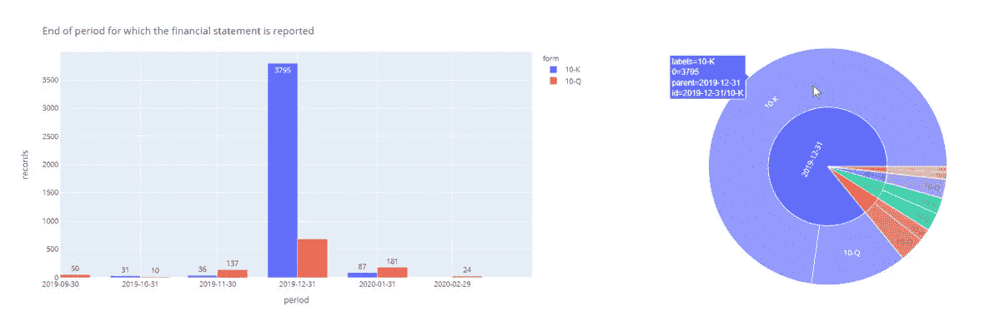

period 变量表示表单财务周期的结束日期。

我使用了 Plotly 的高级 API，所谓的 **Plotly.express** 。它在数据集方面非常强大，然而，它却在不同类型的支线剧情中挣扎，比如本例中的[条形图](https://plotly.com/python/bar-charts/)和[旭日 char](https://plotly.com/python/sunburst-charts/) t。

```
fig=**px.bar**(tens_period_stats_1, # preproces statistics in a DataFrame
           **x="period"**, # on x-axis display the period
           **y="records"**, # on y-axis count of the records
           **color="form"**, # split the bar chart by form (10-K, 10-Q)
           # created groupped bar-chart (not stacked)
          ** barmode="group"**, 
           **text="records"**, # label the bars with counts
           # show only period from Sept-2019 to March-2020
           # you can zoom-out the chart by double click
           **range_x=['2019-09-30','2020-03-31']** 

          )# plotly also struggles a bit with date-time variables,
# to make sure I see end of the months a specify that I really want ticks at these values
fig.update_xaxes(
    ticktext=tens_period_stats_1["period"].astype('str'),
    tickvals=tens_period_stats_1["period"].astype('str')
)fig.show()
```

如果您想要显示类别的详细信息，旭日图是饼图的有用替代物。

```
fig=**px.sunburst**(tens_period_stats_1,
                path=["label","form"],
                values="records")
fig.show()
```

我们可以看到，大部分报表都落入了 2019 年底 2020 年初的预期期。还有一些来自 2019 年 9 月、10 月和 11 月的申请。为什么它们不属于 2019 年第四季度的前一次转储？

> 注意:周期似乎在一个月的最后一天结束，但这是由 SEC 引入的舍入引起的。有些公司，如 [John Deere](https://www.deere.com/en/index.html) 使用 52/53 周财年，其会计年度于 2019 年 11 月 3 日结束([参见 SEC 文件](https://www.sec.gov/ix?doc=/Archives/edgar/data/315189/000155837019011614/de-20191103x10k.htm))。然而，大多数公司都会在月底前提交报表。

## 处理这些报表需要多长时间？平均处理时间。

SEC 规定季度报表的最后期限为 40-45 天，年度报表的最后期限为 60-90 天(参见 [SEC 指南](https://www.sec.gov/fast-answers/answers-form10khtm.html))。小公司 60 天，大公司 3 个月。这意味着在 1 月初发布 2019 年第四季度数据时，一些公司还没有上传 10 月、11 月甚至 9 月的数据。这就是为什么它们会出现在 2020 年的第一批垃圾中。

让我们看看是否每个人都设法满足这些期限。我们将`accepted`(SEC 接受数据时)的值与财政期结束时的`period`进行比较。

```
# we subtract `period` from `accepted` and turn into days
tens_latest_period["delivery_time"] = (tens_latest_period["accepted"] - tens_latest_period["period"]).dt.days
```

我们关注基本的统计参数:

```
[In]: df["delivery_time"].agg(["mean","median","min","max"])
[Out]: 
mean        78.115119
median      58.000000
min         11.000000
max       2929.000000
```

最快的会计师在 11 天内提交报表，但平均值和中间值都接近 60 天。使用 Plotly 创建直方图的能力，我们可以检查通常的交付时间。

```
**px.histogram**(df, 
             x="delivery_time", 
             color="form", 
             # maximum is 2929 days, but most of the values appear in the first fifth of the chart
             range_x=[0,200])
```

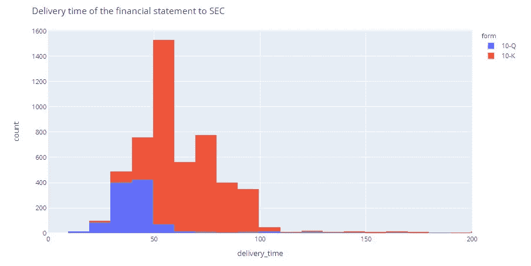

我们看到季度报告的交付时间大多长达 50 天，而年度报表的交付时间则长达 90 天

你注意到 90 天后提交的表格数量突然下降了吗？它承认，大多数公司都能在截止日期前提交，只有少数公司提交晚了。还可以有一些修正，我们将在下一节中探讨。

> 典型的年度报告超过 50 页。见[亚马逊的 10k](https://www.sec.gov/ix?doc=/Archives/edgar/data/1018724/000101872420000004/amzn-20191231x10k.htm)

## 大家都只报一个 10-K 还是 10-Q？

我们希望每家公司每个季度只报告一份报告，但是一个勤奋的分析师会仔细检查。我们根据公司的唯一`cik`号分组，并标出有多少公司提交了一份申请，以及是否有一些公司提交了更多的申请。

```
# Is 10-K/Q reported once by each company or more times? 
tens = sub[sub["form"].isin(["10-Q","10-K"])]# using `.value_counts().value_counts()` combo will tell us
# how many companies have 1, 2 or more records
tens_counts_by_company = tens["cik"].value_counts().value_counts().sort_index().to_frame()
```

然后我们可以直接从熊猫创建一个情节，如果你设置了

```
pd.options.plotting.backend = "plotly"
```

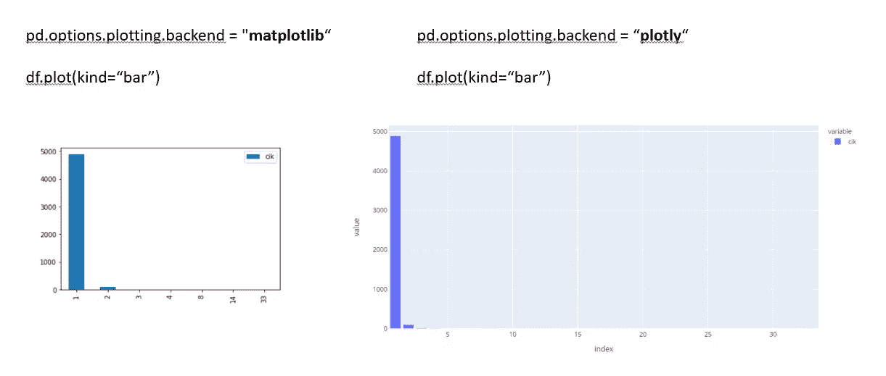

你可以使用不同的“后端”选项直接从熊猫绘图。查看 Matplotlib 如何仅显示输入的 xticks，同时 Plotly 填充 x 轴上缺失的值

我们预计所有的`cik`都只提交了一份报告，对于大多数公司来说，这是事实。然而，有一些张贴了更多的记录。

```
[In]: tens["cik"].value_counts()[Out]: 
1191334    33
1165639    14
1624985     8
1481504     4
...
1517681     1
```

公司为什么要这么做？这些错误是对以前提交的错误还是更正？他们是否将信息分成多个文件？我们不会知道，除非我们看看多次提交的例子。

我们过滤重复的行:

```
# we filter the "cik"'s which appear more than once
companies_reporting_more_tens = tens["cik"].value_counts()[tens["cik"].value_counts()>1]# we look on few columns with relevant data
columns_to_see = ["adsh","cik","name","period","fy","fp","filed", "form"]
tens[tens["cik"].isin(companies_reporting_more_tens.index)].sort_values(by=["cik","period"])[columns_to_see]
```

上面的代码显示了 321 行，按`cik`和`period`排序，简单看一下就会告诉我们，实际上，大多数公司都提交了一些历史更正。拥有`cik=1191334`的公司似乎报告了包含 24 份季度报告和 9 份年度报告的全部历史，但大多数只发送了一两份额外的文件。

```
# preprocess the data
df = tens[["form","cik"]].groupby(["cik","form"]).size().to_frame("submitted 10-K/Q")\
.reset_index().groupby(["form","submitted 10-K/Q"]).size().to_frame("company count").reset_index()# Create a bar chart with two series, one for 10-K and one for 10-Q
fig = px.bar(df[df["submitted 10-K/Q"]>1], 
            x="submitted 10-K/Q", 
            y="company count",
            barmode="group", 
            color="form", 
            title="Number of companies having more than 1 submission in 2020Q1")# update the tickers to each each one starting from 1 with step of 1
fig.update_layout(
    xaxis_type='category'
)
fig.show()
```

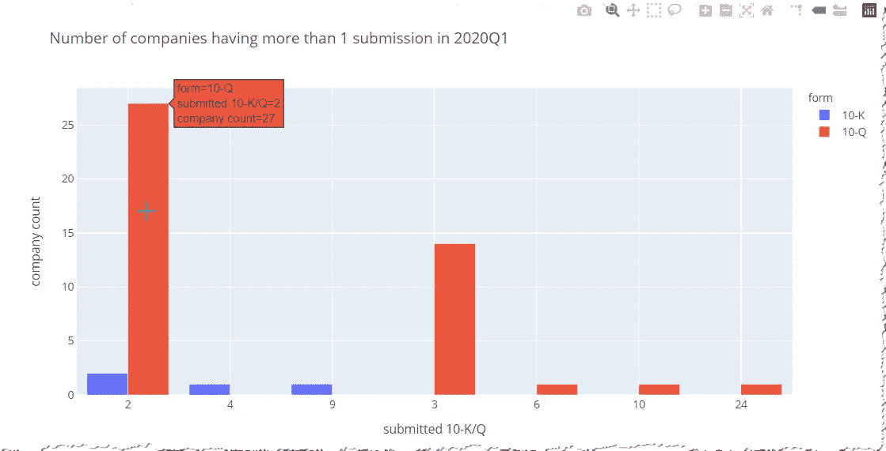

设置 xaxis_type='category '将强制 Plotly 以发送的方式显示值，并且不使用从 1 到 len(df)的线性值。不幸的是，一个范围接一个范围，所以所有的 10-K 在左边，剩下的 10-Q 在右边。

现场检查没有发现任何公司会在同一时期发送两种填充物。我们能证明他们真的不存在吗？

```
[In]: tens.groupby(["cik","period"]).size().max()
[Out]: 2
```

对分组`cik&period`组合的检查发现，有一些公司将同一时期的数据上传给 SEC 两次。

让我们通过使用`groupby`作为过滤器来观察它们:

```
[In]: tens.groupby(["cik","period"]).size()[tens.groupby(["cik","period"]).size()>1][Out]:
cik      period    
1191334  2013-09-30    2
1635748  2019-06-30    2
```

详细的观察表明，它们在`filed`、`accepted`或两者上有所不同。

## 删除重复项

重复的线是每个数据集的祸根。它们导致许多问题，因为它们扭曲了度量标准，污染了机器学习模型，并且随着每个连接而成倍增加。一旦我们发现它们，我们应该立即决定如何去除它们。

在我们的情况下，我们将只接受后来填写的表格(更高的`filed`)，如果所有记录都相同，我们将采用较新的`accepted`。熊猫的`.cumcount()`功能将帮助我们完成任务。这相当于 SQL 的`ROW_COUNT()`,我们将只选取每条记录的第一次出现。详细步骤如下:

*   按决定性字段`filed`和`accepted`对数据进行排序
*   按分区列分组— `cik`和`period`
*   使用`.cumcount()`对行 0，1，2 进行排序...
*   仅过滤具有该值的行`==0`

```
# for all the `10-K` and `10-Q` we reduce the number of rows from 5212 to 5210
tens = tens.loc[tens.sort_values(by=["filed","accepted"],ascending=False).groupby(["cik","period"]).cumcount()==0]
```

在 [Github](https://github.com/vaclavdekanovsky/data-analysis-in-examples/blob/master/SEC%20Quarterly%20Data%20Dump/EDA_of_SEC_2020Q1_Filling_sub.ipynb) 上查看完整的代码和详细的分解。

类似的算法将帮助我们仅获得 2020 年第一季度提供的最新提交:

```
tens_latest_period = tens.loc[tens.sort_values(by="period", ascending=False).groupby("cik").cumcount()==0]
```

# 外国公司

`10-K`和`Q`对所有在股票市场交易的美国公司都是强制性的。但 SEC 收集从美国市场受益的外国企业的信息。他们必须按照`20-F`和`40-F`表格提交财务报表。它们有什么不同？

让我们使用列`countryba`和`cityba`来保存注册人的业务地址信息。我们把这些信息转换成地址。

[](/pythons-geocoding-convert-a-list-of-addresses-into-a-map-f522ef513fd6) [## Python 的地理编码-将地址列表转换为地图

### 如何使用地理定位 API 接收绘制客户、工厂、车队地图所需的数据…

towardsdatascience.com](/pythons-geocoding-convert-a-list-of-addresses-into-a-map-f522ef513fd6) 

有了这些地方的纬度和经度，我们就可以在世界地图上显示出来。Plotly 的`.scatter_geo()`是我们需要的图表类型:

```
# set up the chart from the df dataFrame
fig = px.scatter_geo(twenties, 
                     # longitude is taken from the df["lon"] columns and latitude from df["lat"]
                     lon="lon", 
                     lat="lat", 
                     # choose the map chart's projection
                     projection="natural earth",
                     # columns which is in bold in the pop up
                     hover_name = "name",
                     # format of the popup not to display these columns' data
                     hover_data = {"name":False,
                                   "lon": False,
                                   "lat": False,
                                   "countryba": True
                                     },
                     color="form",
                     size_max=20
                     )
# fit the map to surround the points
fig.update_geos(fitbounds="locations", showcountries = True)fig.show()
```

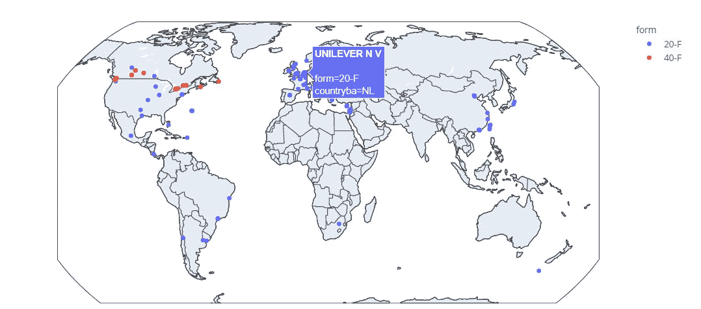

40-F 专用于在加拿大注册的公司，而 20-F 则用于其他外国公司

# 自己试试

你想自己试试吗？没有比这更简单的了。SEC 最近公布了 [2020Q2 数据](https://www.sec.gov/files/dera/data/financial-statement-data-sets/2020q2.zip)。下载它们，解压缩并运行笔记本中的脚本，看看表单的结构在第二季度是否发生了变化。

[](https://github.com/vaclavdekanovsky/data-analysis-in-examples/blob/master/SEC%20Quarterly%20Data%20Dump/EDA_of_SEC_2020Q1_Filling_sub.ipynb) [## vaclavdekanovsky/数据分析示例

### permalink dissolve GitHub 是超过 5000 万开发人员的家园，他们一起工作来托管和审查代码，管理…

github.com](https://github.com/vaclavdekanovsky/data-analysis-in-examples/blob/master/SEC%20Quarterly%20Data%20Dump/EDA_of_SEC_2020Q1_Filling_sub.ipynb) 

# 结论

在本文中，我们回顾了 SEC 季度数据转储中提供的提交类型。我们已经看到，最常见的`8-K`在转储中没有附加信息。因此，我们重点关注年度和季度报表，并探索这些报表在提交后的 180 天内出现在数据集中。大多数公司在一个季度报告一份报表，但我们已经看到一些历史文件和一些副本。

通过删除重复项，我们为分析的下一步——探索财务状况——准备了数据集。但是对于本文来说，这些信息已经足够了，我们将在下次讨论。

如果您喜欢这篇介绍，请随意查看我的其他文章:

[](/dealing-with-extra-white-spaces-while-reading-csv-in-pandas-67b0c2b71e6a) [## 阅读熊猫 CSV 时处理多余的空格

### 为什么我们关心空白？内置熊猫功能，自定义处理。创建 1M 测试数据和…

towardsdatascience.com](/dealing-with-extra-white-spaces-while-reading-csv-in-pandas-67b0c2b71e6a) [](/unzip-update-and-zip-again-xmls-in-a-folder-7d57f9710ddb) [## 在一个文件夹中解压缩、更新和再压缩 XML

### 使用 python 自动化办公程序

towardsdatascience.com](/unzip-update-and-zip-again-xmls-in-a-folder-7d57f9710ddb)