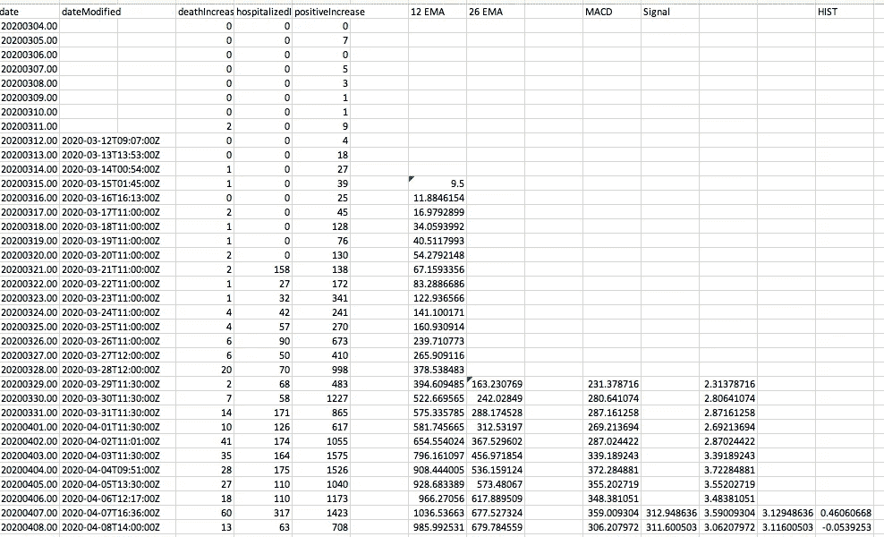
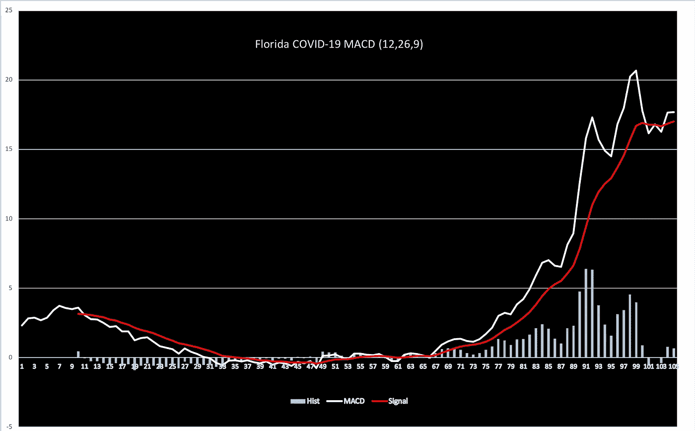
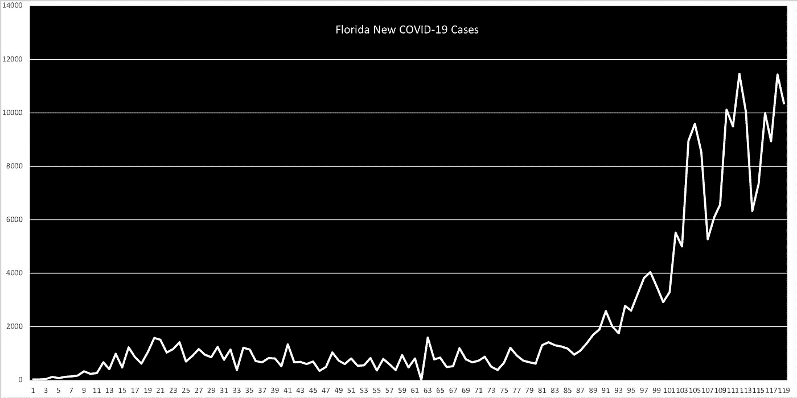
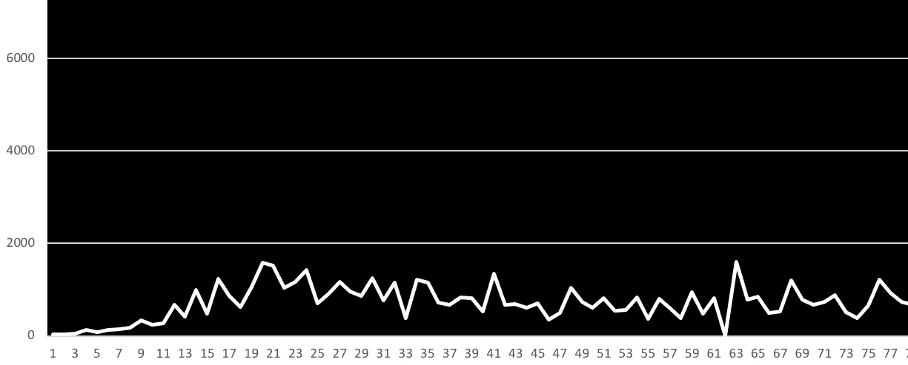
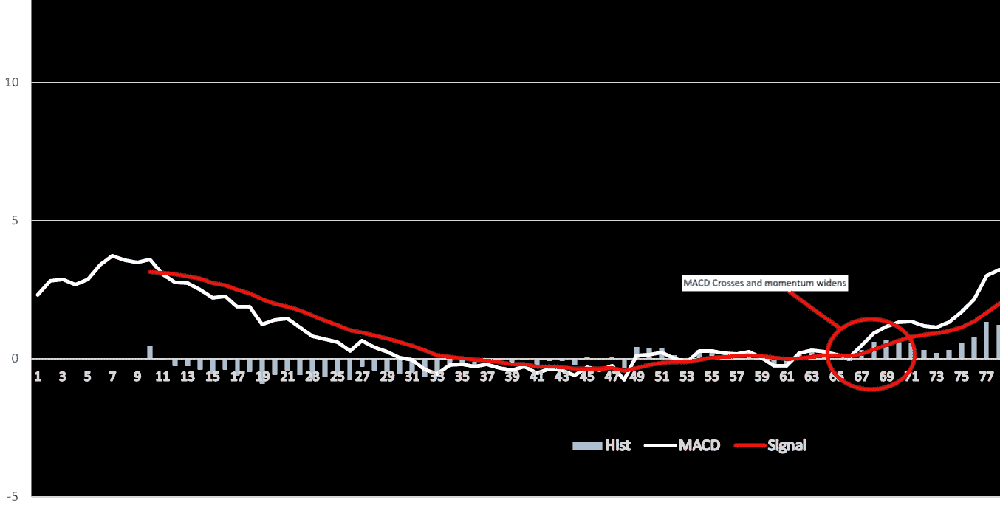

# 该股票指标可能是预测 COVID 突破的最佳方式

> 原文：<https://towardsdatascience.com/stock-indicators-may-be-the-best-way-to-predict-covid-breakouts-9b6939d9fc0c?source=collection_archive---------54----------------------->

## MACD 等交易指标帮助交易员预测股票的技术方向。这些数学技术对于预测新冠肺炎病毒的爆发同样有用吗？

美国 MACD 指标新冠肺炎新病例

随着 2020 年继续带来一个又一个全球性挑战，我们经常发现自己似乎与这些威胁无关，因为它们给人一种逐渐消失的错觉。不幸的是，我们面临的挑战没有确定的结束日期或完美的解决方案。与我们面临的其他问题不同，新冠肺炎不会简单地消失，一旦它对经济和生计“太长”或“太具破坏性”。换句话说，我们无法通过与病毒的交易或让步来立即解决这个问题。

由于这种动态，我们所能做的最好的事情是尝试执行缓解方法，如社会距离和戴口罩，直到病例的指数轨迹足够低，直到固体疫苗上市为止。这听起来直截了当，但正如我们在美国各地看到的那样，当病例数开始减少时，我们会产生一种错觉，以为我们没事了，只是在我们回到正常生活后不久，病例就会大量增加。那么，我们如何预测什么时候我们是安全的，什么时候我们又处于危险之中，而不是简单地用我们的后见之明来解释我们当前的处境呢？

世界各地的数据科学家正在研究这个问题，以预测下一次爆发。方法范围从简单的统计，图形网络，接触追踪，有时甚至涉及经典的方法扔在一个“神经网络”的问题。这些方法中有许多是为人群和病毒病例量身定制的，可以快速实施。与此同时，数据科学的一个领域(可能是最古老的)还没有被开发到可以提供帮助的水平。这当然是量化的股票交易或技术交易。近 100 年来，预测股票爆发的方法一直在不断改进，主要是因为用例是即时的，而金钱是一个相当普遍的动机。技术交易指标有一点比其他统计模型做得更好——它们使用当前的环境。这有助于提供更多的确定性，并允许人根据算法做出决定，而不是仅仅从屏幕上读取预测的数字。在众多指标中，有一个指标的工作本质上是指示股票的潜在突破，所以为什么不试一试，就像我们试图预测爆发一样。介绍 **MACD。**

# MACD

移动平均收敛发散或 MACD 是技术交易中使用的二阶到三阶衍生指标，有助于了解短期动量变化和方向。

指数移动平均线

MACD(EMA short-EMAlong)的工作原理是跟踪长期均线的短期指数移动平均线。通过这样做，我们能够看到短期趋势何时开始收敛或偏离长期趋势。如果我们开始看到短期移动平均线背离，我们可以推断一个潜在的突破正在进行中。另一方面，当这两个平均值接近时，我们开始看到盘整和表现不佳。总的来说，MACD 是动量的量度。

为了做出更精细的决策，还可以绘制一条**信号**线。信号线跟踪 MACD 的动量，所以另一个导数水平下降。这让我们可以看到 MACD 何时高于或低于均线。简而言之，当 MACD 穿过向上移动的信号时，我们认为这是一个“买入”信号，当它穿过向下移动时，我们认为这是一个“卖出”信号。

TSLA 600 万的价格(上)MACD(下)—由 E*Trade Pro 精英会员提供

为了将此付诸实践，我们可以看看特斯拉股票最近突破(或爆发)的 MACD 是什么样子的。这里的红线是信号(MACD 的 9 日均线)，白线是 MACD(12 日均线——26 日均线)。图表上的直方图是 MACD 和信号之间的差异的直观显示，我发现它对跟踪最有用。在大多数情况下，MACD 和信号是平坦的，几乎没有直方图的作用。在图表右侧附近，我们看到标记线，MACD 穿过信号，随后直方图快速增加。这是在大约 1 个月左右的时间里从大约 800 美元突破到 1700 美元的时候。事后很容易看出这是如何发生的，但重要的是要注意，当线交叉或接近交叉时，有非常微妙的运动。如果你仅仅根据 MACD 忠实地接受买入信号，你会在一两个月内赚到超过 100%的钱！我们可以看到，目前，MACD 已经脱离了巨大动量的信号。即使涨势放缓，我们也要记住，直到白线向下穿过红线，我们才应该认为涨势结束了。*免责声明:我不是在给股票建议。

通过理解 MACD 是如何在没有明显动作的情况下发出突破信号的，我意识到我们和新冠肺炎有着相同的目标。案例数据类似于股票价格(显然我们的希望是相反的)。考虑到这一点，我们也许能够在疾病爆发前发现潜在的疾病，并更加努力地阻止直方图失控。

# MACD 代表新冠肺炎

正如所讨论的，通过将相同的 EMA 方程及其导数应用于 COVID 病例，我们可以更好地预测和应对在典型病例图中不可见的潜在爆发。为了解决这个问题，我从 https://covidtracking.com/data/download 下载了美国、我的家乡密歇根州和佛罗里达州的 COVID 病例数据。从这里开始，我在 Excel 中建立模型，并计算每个导数值。请注意，从住院到病例，任何情况都可以这样做，但为了简化这些示例，将使用病例。

Excel 电子表格—由[智力建设者 AI](https://www.mindbuilderai.com) Research 提供

正如你所看到的，第一组 MACD 值只能开始 26 天的数据，而信号只能开始 35 天的数据。这显然会影响数据的长度，因为每个数据集只有大约 170 天的价值。为了对结果有个大概的了解，并与上面的图表相似，让我们来看看美国 MACD 的图表。

美国 MACD COVID 案例(1 月 26 日—7 月 12 日)—由 [MindBuilder AI](https://www.mindbuilderai.com) Research 提供

在接下来的两个例子中，我将更深入地介绍与 MACD 相比的案例数，如果您愿意，可以将此图表与美国的新案例进行交叉引用。我们在这里看到的是 2 月中旬的初始峰值。直到大约 3 月底，病例继续增长势头，直到最终稳定下来，并最终得到适度控制，此时势头减弱。只是提醒一下，此图表并不显示病例数，而是显示趋势，因此 y 轴值为零实质上意味着每天都有相同数量的病例增加，而低于 0 则意味着新病例在减少。这里的负面部分是关于各州何时开始重新开放的。不幸的是，在数据的第 112 天，我们看到 MACD 穿过了信号，这可能是人们开始感到舒适的时候。随着这一势头的增长，我们已经看到美国继续增加比以往更多的病例。如果这个信号被当作一个缓和的触发器，我们可能不会处于现在的状态。为了更细致地观察，让我们看看基于状态的数据，以及相对于病例数据，疫情是如何被缓解或忽略的。

佛罗里达州 MACD 的 COVID 病例(3 月 1 日-7 月 12 日)——由智力建设者 AI 研究公司提供

佛罗里达案例(3 月 1 日至 7 月 12 日)

众所周知，美国许多州都在努力应对新新冠肺炎病例的激增。其中一个州是佛罗里达。在今年的大部分时间里，佛罗里达州的 COVID 病例低于平均水平。不幸的是，这给了他们一种错觉，认为他们是清白的，这反过来又让他们可以推迟采取措施来缓解病毒。很明显，他们并不清楚，但在上图中爆发之前，这一点并不明显。让我们仔细看看，了解佛罗里达州可以看到 MACD。

佛罗里达案例到第 77 天

想象我们生活在第 79 天。正如我们在上面看到的，直到第 79 天，病例几乎没有变化。这将导致大多数人认为病毒受到控制，无论规则和缓解措施如何变化，都不会有太大变化。MACD 在这一点上发现了一些微妙的信号，并讲述了一个不同的故事。

第 67 天 MACD 十字路口

让我们回顾一下第 67 天和第 79 天之间的病例数据。肉眼看起来，每天有 500-700 例的稳定增长，没有变化可担心，但是小的稳定增长显示在 MACD 图表上，变化不仅仅是细微的。在完整的图表中，我们看到这变成了病例的爆炸，昨天 7 月 12 日增加了 15，000 例。这表明，在原始数据之下，一定有更好的指标，可以预示和阻止如此可怕的疫情。在第 67-69 天的那一刻，没人能预测到我们看到的增长，但 1970 年的一个交易指标做到了。这些隐藏在众目睽睽之下的简单数字本可以拯救生命，并有望在未来拯救生命。

# 结束语

COVID cases 的密歇根 MACD(3 月 1 日-7 月 12 日)——由智力建设者 AI 研究公司提供

这是我的家乡密歇根州的图表。我们从一开始就受到了沉重的打击，但是正如我们从数据中看到的，我们的努力粉碎了势头，使短期均线大部分时间低于信号。从这个数据来源来看，早期的 COVID 没有一个时刻显示出 MACD 的爆炸性势头(这应该是在 2 月中旬)。不幸的是，有趣的夏季在第 79 天左右创造了一个适度倾斜的十字。幸运的是，案件数量还没有爆炸性增长。这一势头刚刚变得积极，似乎已经得到遏制。但是，图表显示的正是我们在佛罗里达看到的情况，这有点令人不安。积极的一面是，我们仍然有时间采取行动，创造我们都在等待的“卖出”信号(红色下面的白色十字)。如果我的状态戴着面具，负责任地社交，并着眼于没有 COVID 的生活的长期利益，而不是短期的快乐，我们可以创造“出售”信号，并很快发现我们的生活超越了 COVID。

有了 MACD 这样强大的指标，这不再是一场猜谜游戏。我们可以在病例出现之前看到势头的变化，这意味着我们可以采取行动拯救最脆弱人群的生命。这可能是我们对付病毒形式的敌人的唯一手段之一。我希望这种方法至少能为对抗 COVID 做出一点小小的贡献，并能帮助人们认识到，遵循数据永远是最佳选择。

***编者按:*** [*走向数据科学*](http://towardsdatascience.com/) *是一份以数据科学和机器学习研究为主的中型刊物。我们不是健康专家或流行病学家，本文的观点不应被解释为专业建议。想了解更多关于疫情冠状病毒的信息，可以点击* [*这里*](https://www.who.int/emergencies/diseases/novel-coronavirus-2019/situation-reports) *。*

*在*[*LinkedIn*](https://www.linkedin.com/in/ian-rowan/)*或*[*Twitter*](https://twitter.com/ianrowan29)*上与我连线继续对话。*

*看看我目前在 https://www.mindbuilderai.com 做什么*