# 基于卷积神经网络的股票买卖预测

> 原文：<https://towardsdatascience.com/stock-market-action-prediction-with-convnet-8689238feae3?source=collection_archive---------2----------------------->

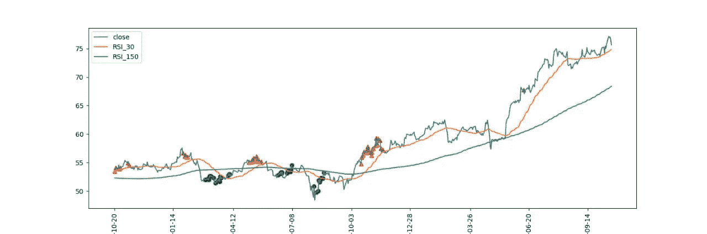

## 灵感来自题为“深度卷积神经网络的算法金融交易:时间序列到图像转换”的研究论文

这个项目大致基于一篇名为“ [*深度卷积神经网络的算法金融交易:时间序列到图像转换方法*](https://www.researchgate.net/publication/324802031_Algorithmic_Financial_Trading_with_Deep_Convolutional_Neural_Networks_Time_Series_to_Image_Conversion_Approach) ”的研究论文。我说“不严格”是因为尽管我从论文中借用了核心思想，但我做的(或必须做的)一些事情与我们稍后将看到的不同。我上面分享的链接是论文的预印本。付费/主文可能会有更多的细节。这篇文章是我的[上一篇关于股票价格预测的文章](/predicting-stock-price-with-lstm-13af86a74944)的一位读者建议的，它立即引起了我的注意。**这里是 Github**[**repo**](https://github.com/paranoiac-coder/stock_cnn_blog_pub)**和主培训笔记本上** [**Kaggle**](https://www.kaggle.com/darkknight91/predicting-stock-buy-sell-signal-using-cnn/) 的链接。

有一件事我想让读者知道——我不是在这里宣称我有一个现成的交易模型(尽管我正在为我个人的使用进一步探索这个方法)。将传统的表格或时间序列数据转换为图像，并在此基础上训练分类模型的想法，似乎太令人兴奋了，以至于无法抗拒尝试并与社区共享。像我的 [*上一篇*](/predicting-stock-price-with-lstm-13af86a74944) *这是一篇记述我与这个项目的经历。*

## 1.研究论文怎么说？

在这一节中，我将解释论文中提出的观点。我将在下一节讨论代码和实现。

> 这个想法很简单:在你的交易数据中，每天用 15 个不同的周期长度(解释如下)计算 15 个技术指标。然后将 225 (15*15)的新特征转换成 15×15 的图像。根据文中提供的算法，将数据标记为买入/卖出/持有。然后像任何其他图像分类问题一样训练一个卷积神经网络。

如果你不知道什么是技术指标，我建议你查看上面的链接。我会用[简单移动平均线(SMA)](https://www.investopedia.com/terms/s/sma.asp) 来解释技术指标和时间周期的概念，因为它更简单。这应该足够让你理解这个想法了。

数字列表的移动平均值类似于算术平均值，但我们不是计算所有数字的平均值，而是计算前“n”个数字的平均值(n 是指窗口大小或时间段)，然后将窗口移动(或滑动)1 个索引，从而排除第一个元素并包括 n+1 个元素，然后计算它们的平均值。这个过程还在继续。这里有一个例子来说明这一点:

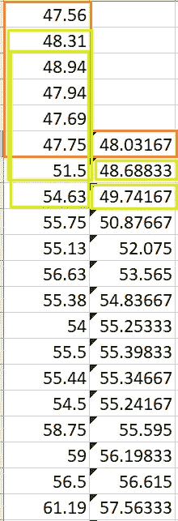

excel 表中的 SMA 示例

这是一个窗口大小为 6 的 SMA 示例。前 6 个元素的形状记忆合金以橙色显示。现在把上面的第一列当作你选择的股票的收盘价。现在计算 sma_6 右侧连接的 14 个其他窗口尺寸(7 到 20)的收盘价 SMA。现在，数据集的每一行都有 15 个新要素。对其他 14 个技术指标重复这一过程，删除空行。

使用的一些指标是 SMA 的延伸。例如，WMA(加权移动平均线)是前“n”天的平均值，最近几天的权重较大。类似地，HMA(赫尔移动平均线)是 WMA 的延伸，有以下步骤:

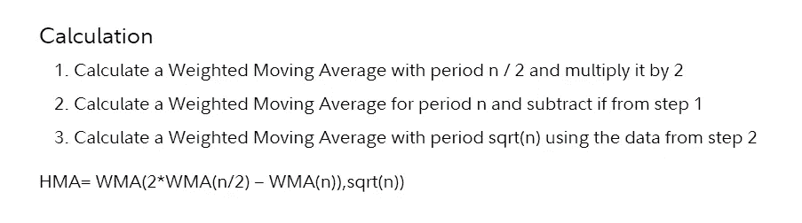

图片来源:【Fidelity.com 

现在你有 225 个新功能。如果你把这些数字重组为一个 15x15 的数组，你就有一个图像了！(虽然，在这一点上，它是一个单一的渠道。稍后将详细介绍)。不过，有一件事要记住。在构建这些图像时，我们应该保持相关技术指标在空间上接近。直觉是，当训练人脸识别时，如果一张照片的一只眼睛在鼻子下面，你不会把它标为人脸。相关像素应该在附近。为了简洁起见，我不公布计算所有指标的代码。您可以在 utils.py 文件中找到它们。

**标注:**现在剩下的就是标注这个数据集。为此，作者使用了以下算法:

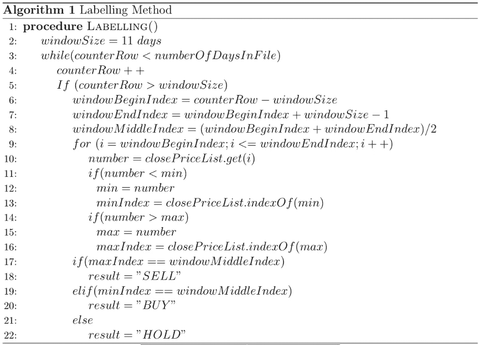

用于将数据集标记为买入/卖出/持有的算法

乍一看，这似乎令人生畏，但它说的就是:在收盘价上使用 11 天的窗口。如果中间数是窗口内的最大值，则将中间日标记为“卖出”，或者，如果中间数是最小值，则将中间日标记为“买入”，否则标记为“持有”。像前面解释的那样滑动窗户，然后重复。这个想法是在任何 11 天的窗口期内，在波谷买入，在波峰卖出。这个算法的能力是一个不同的问题，我将在最后讨论这个问题。

**训练:**作者使用了滚动窗口训练，类似于我们上面看到的滑动窗口概念。如果您有 2000 年到 2019 年的股票历史数据，并且您决定对 5 年的数据进行训练，对 1 年的数据进行测试，那么，从数据集中分割 2000-2004 年的数据用于训练，2005 年的数据用于测试。根据这些数据训练和测试您的模型。接下来选择 2001–2005 作为训练数据，2006 作为测试数据。使用相同的模型对此数据进行重新训练。重复直到你到达终点。

**计算性能评估:**作者在论文中提供了两种类型的模型评估，计算和财务评估。计算评估包括混淆矩阵、F1 分数、类精度等。财务评估是通过将模型预测应用于真实世界交易并测量所获得的利润来完成的。我将只讨论计算评估。财务评估可以通过真实世界的交易或对持有的数据进行回溯测试来完成，我将在以后的文章中讨论这一点。

## 2.履行

正如本文开头提到的，我没有严格遵循研究论文，因为它没有产生预期的结果。当它们出现时，我会提到它们的不同之处。但是随着我所做的改变，结果与论文持平，在某些情况下甚至更好。

数据处理相关代码可以在 **data_generator.py** 中找到

**数据来源:**我通常从 [Alpha Vantage](https://www.alphavantage.co/) 获取股票数据，该公司免费提供历史股票数据。我在之前的[项目](/predicting-stock-price-with-lstm-13af86a74944)中也用过它。以下是下载数据的方法。

```
url = "[https://www.alphavantage.co/query?function=TIME_SERIES_DAILY_ADJUSTED&outputsize=full&apikey=api_key&datatype=csv&symbol=company_code](https://www.alphavantage.co/query?function=TIME_SERIES_DAILY_ADJUSTED&outputsize=full&apikey=api_key&datatype=csv&symbol=company_code)"
urllib.request.urlretrieve(url, path_to_save)
```

数据是这样的:

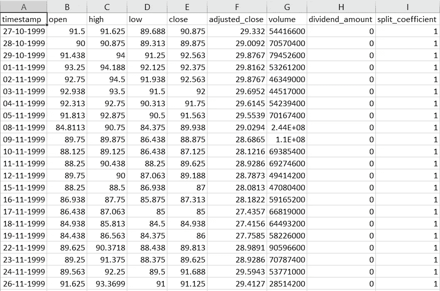

**特色工程:**第一个偏离论文的是我用的技术指标。我找不到论文中提到的一些指标的库/实现，比如 PSI。有些指标就是不清楚；例如， [PPO](https://www.investopedia.com/terms/p/ppo.asp) 是用周期 12 和 26 的 [EMA](https://www.investopedia.com/terms/e/ema.asp) 计算出来的。如何才能计算出不同时期的 PPO？我尝试使用论文中提到的大多数指标，我发现这些指标的开源实现可以避免任何编程错误。我已经实现了一些指标，如 WMA，HMA 等，虽然他们很慢，需要优化。因为我只需运行一次并保存数据，所以这对我来说不成问题。不过，你可以选择不同的指标。他们还用调整比率调整了价格(开盘价、最高价、最低价等)。但我没有遵循这一条，因为我找不到任何关于如何调整的参考资料。构建这些特性的所有函数都在 **utils.py** 文件中。

**标注数据:**对于这篇博客，我使用了作者们用过的原始标注算法。下面是它的一个直接实现:

要素构造和标注后的数据集如下所示:

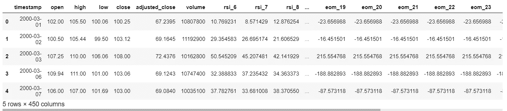

**归一化:**我用的是 Sklearn 的 MinMaxScaler 对[0，1]范围内的数据进行归一化，虽然论文用的是[-1，1]范围(二次偏差)。这只是个人喜好。

**特征选择:**在计算了这些指标，根据它们的类型(动量、振荡器等)在图像中对它们进行分组，并训练了许多 CNN 架构之后，我意识到模型只是学习不够。也许功能不够好。因此，我决定采用许多其他指标，而不严格遵循用不同时期计算它们的规则。然后我使用特征选择技术选择了 225 个高质量的特征。事实上，我使用了两种特征选择方法 f_classif 和 mutual_info_classif，并从它们的结果中选择了共同的特征。原论文中没有提到特征选择，所以第三个偏差。

最后，我在排序索引列表时发现了 f_classif 和 mutual_info_classif 的交集。这是为了确保相关特征在图像中非常接近，因为我已经附加了相似类型的指示器。特征选择显著提高了模型的性能。

**将数据重塑为图像:**到目前为止，我们有一个包含 225 个特征的表格数据。我们需要把它转换成这样的图像:

这是图像的样子:

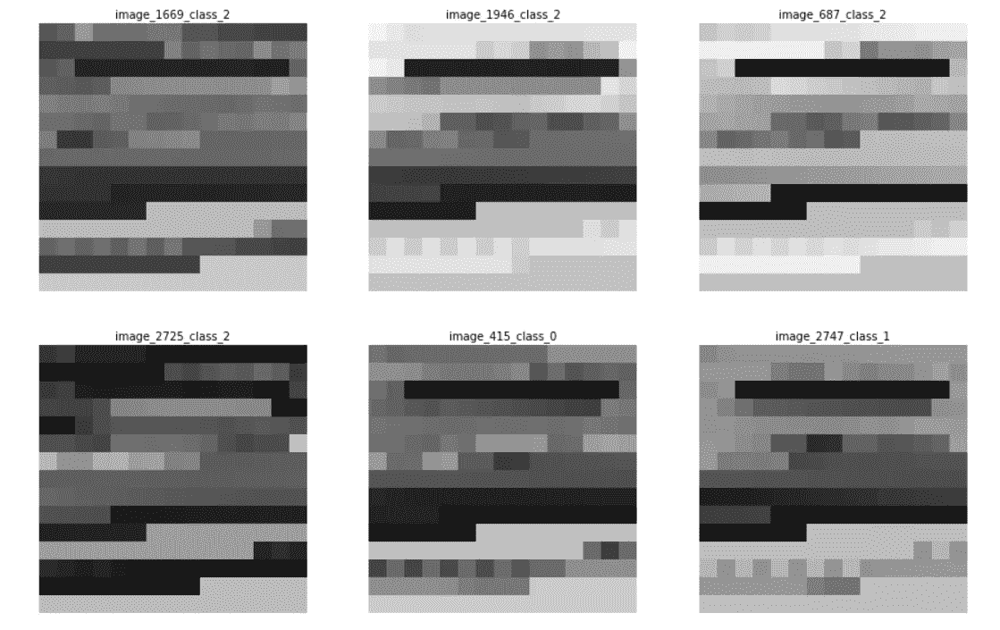

训练图像

**处理类别不平衡:**这类问题难以解决的另一个原因是数据严重不平衡。“持有”操作的实例数量将总是比“买入/卖出”多得多的*。事实上，论文中提出的标记算法产生了相当多的买/卖实例。任何其他现实世界的策略都会产生更少的实例。更复杂的是,“暂停”事件的分类并不简单(在最后会有更多介绍)。*

*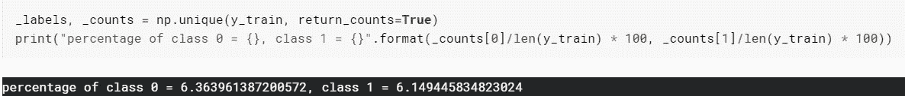*

*对于模特来说，这真的很难学到任何有意义的东西。这篇论文只提到“重采样”是解决这个问题的一种方法。我尝试过过采样，合成数据生成(SMOTE，ADASYN)，但没有一个给出任何满意的结果。最后，我满足于“样本权重”，其中你告诉模型更多地关注一些样本(第四个偏差)。这在处理阶级不平衡时很方便。以下是计算样品重量的方法:*

*然后将这个样本权重数组传递给 Keras 的“拟合”函数。您还可以查看“class_weights”参数。*

***培训:**所有与培训相关的代码都可以在 **stock_keras.ipynb** 中找到。论文中提到的模型架构缺少一些要点。例如，他们没有提到他们使用的步幅。但是在 stride=1 和 padding=same 的情况下，我发现这个模型太大了，尤其是对 5 年的数据进行训练。无论我使用多么小的网络，我在滑动窗口训练中都没有任何运气。所以我用交叉验证的全训练数据训练(第五偏差)。但是我已经在项目中包含了滑动/滚动窗口训练的代码(在“train.py”文件中)。所以，我用了一个非常相似的模型，有一些小的不同，比如辍学等等。这是我用来训练的模型(我没有尝试过大范围的超参数调优):*

*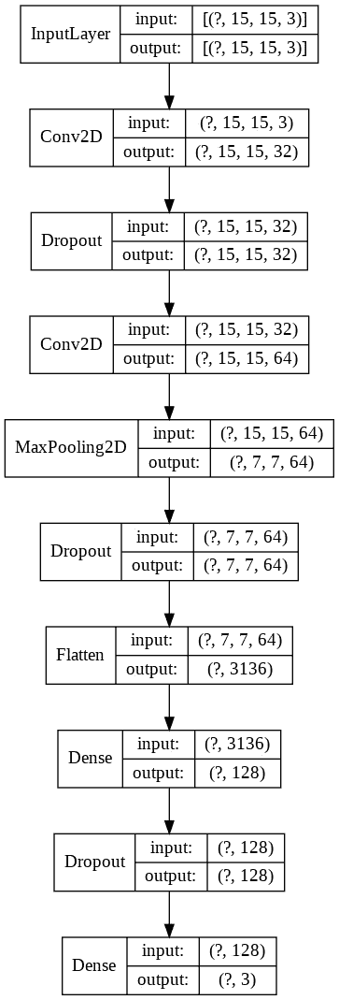*

*Keras 模型训练是通过 EarlyStopping 和 ReduceLROnPlateau 回调完成的，如下所示:*

*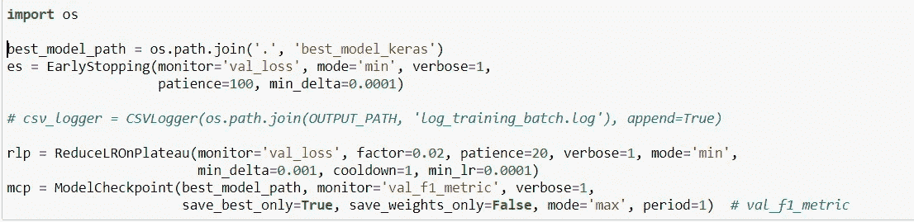*

*正如你在上面看到的，我用 F1 分数作为衡量标准。对于测试数据评估，我还使用了混淆矩阵、Sklearn 的加权 F1 分数和 Kappa(这是我最近才知道的，必须深入挖掘)。*

*在沃尔玛的数据上，上述模型给出了以下结果:*

*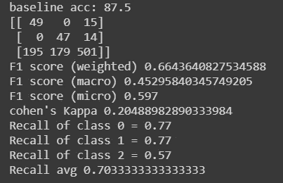*

*每次运行时，这个结果都会有些变化，这可能是由于 Keras 权重初始化造成的。这实际上是一个众所周知的行为，这里有一个很长的讨论线索。简而言之，你必须为 numpy 和 tensorflow 设置随机种子。我只为 numpy 设置了随机种子。所以我不确定它是否能解决这个问题。我会在这里更新，一旦我尝试了。但大多数时候，对于我尝试过的大多数其他 CNN 架构，0 类和 1 类(买入/卖出)的精度低于 2 类(0/1 类为 70)。*

*作者得到了以下结果:*

*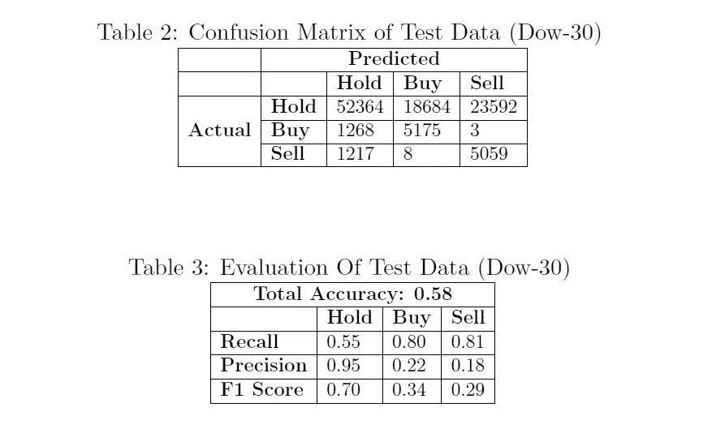*

*道琼斯 30 指数的结果在文件中提出*

*如果你注意到，“持有”类的分数明显比“买入/卖出”类的分数差，无论是在我们的结果中还是在论文中。我认为这个结果很有希望，因为模型可以识别大多数的买/卖实例。以下是作者对此的看法:*

> *“然而，也产生了许多虚假的入境和出境点。这主要是由于“买入”和“卖出”点出现的频率比“持有”点少得多，神经网络不容易捕捉“很少”的进入点和退出点而不危及主导“持有”值的一般分布。换句话说，为了能够捕捉到大多数“买入”和“卖出”点(回忆)，该模型通过为不存在的进入点和退出点(精度)生成错误警报来进行权衡。此外，持有点不像“买入”和“卖出”(山丘和山谷)那样清晰。神经网络很可能会将一些“持有”点与“买入”点和“卖出”点混淆，特别是当它们靠近滑动窗口上的山顶或谷底时。*

## *3.进一步的改进*

*   *在更好的网络架构和超参数调整方面，肯定有很大的空间。*
*   *在其他数据集上使用具有相同架构的 CNN 并没有给出令人印象深刻的买卖精确度。但通过摆弄超参数，我们肯定可以将其提高到与沃尔玛相似的数字。*
*   *虽然这些结果看起来足够好，但不能保证它会给你带来真实世界交易的利润，因为它会受到你选择标记数据的策略的限制。例如，我对上述交易策略进行了回溯测试(使用原始标签，而不是模型预测！)但是我没赚多少。但那取决于数据的标注。如果有人使用更好的策略来标记训练数据，它可能会表现得更好。*
*   *探索其他技术指标可能会进一步改善结果。*

## *4.结论*

*我带着怀疑的态度开始了这个项目。我不确定这些图像是否有足够的信息/模式供 ConvNet 查找。但由于结果似乎比随机预测好得多，这种方法似乎很有前途。我特别喜欢他们将时间序列问题转化为图像分类的方式。*

***UPDATE- 12/7/2020:** 重大更新-标签创建出现 bug，将标签分配给窗口最后一天，而不是中间项。我也用新的结果更新了这篇文章。在“stock_keras.ipynb”中更新了新模型*

*GitHub 上也有代码修复。请注意，由于我已经转移到 PyTorch，我不再有一个工作 Tensorflow 环境，我在云上训练这个模型，并且必须复制粘贴修复。所以，我无法完全测试最终代码(训练部分)。*

*插入了由于我的 GitHub 账户的改变而丢失的代码。*

***UPDATE- 23/2/2020:** 我刚刚在我的模型创建函数“create_model_cnn”中发现了一个 bug，在这里我使用下面的检查来添加 MaxPool 层:*

```
*if params["conv2d_layers"]['conv2d_mp_1'] == 1
replace this with
if params["conv2d_layers"]['conv2d_mp_1'] >= 0*
```

*对“conv2d_mp_2”也进行同样的操作。模型或程序本身没有任何问题，只是我一直在探索没有任何最大池的超参数搜索空间:-(。需要探索模型是否可以在 MaxPool 层中表现得更好。*

***更新- 09/02/2020** :增加了对“特性工程”章节中一些更复杂的技术指标的解释。*