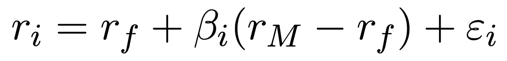
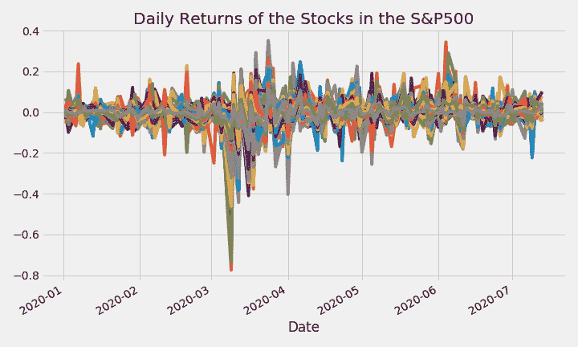
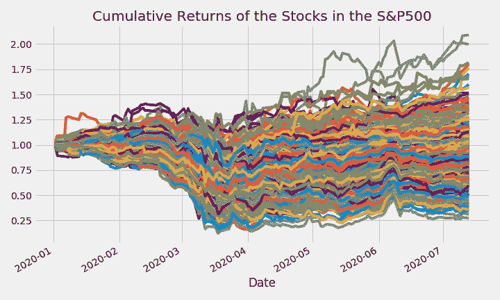
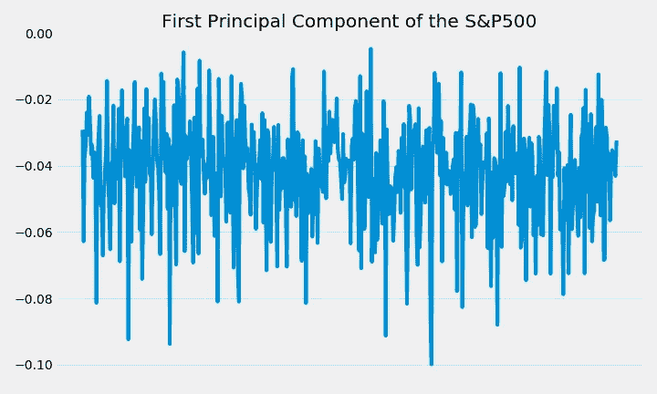
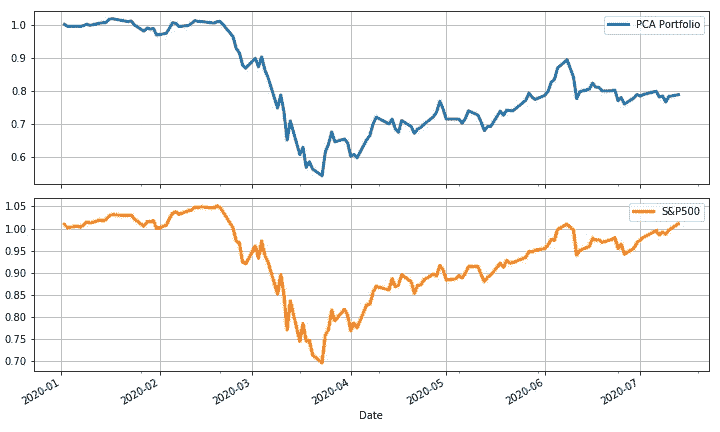
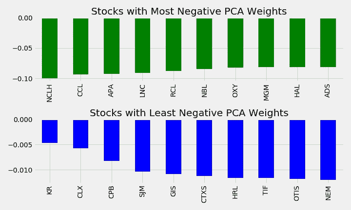
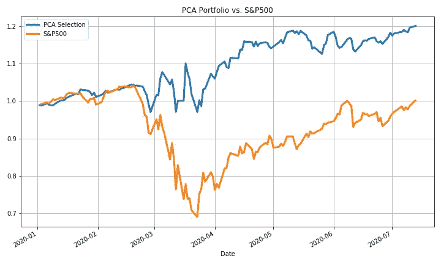

# 使用主成分分析进行股票市场分析

> 原文：<https://towardsdatascience.com/stock-market-analytics-with-pca-d1c2318e3f0e?source=collection_archive---------6----------------------->

## 从主成分分析到资本资产定价

主成分分析(PCA)是一种强大的数据分析工具，用于机器学习的许多领域。然而，尽管它的多功能性和有效性，它在金融中的应用并没有被广泛讨论。

今天，我将谈论 PCA 如何用于股票市场，它如何与资本资产定价模型(CAPM)相关，以及我们如何使用 PCA 来分析 COVID19 的影响。

([你可以在这里找到完整的代码和其他资源](https://www.yaoleixu.com/quant-finance)

# 1.PCA 快速回顾

> 第一个主成分解释了数据中的大部分差异。

简而言之，主成分分析(PCA)将数据分解成许多称为*主成分*的向量，这些向量实质上“总结”了给定的数据。更具体地说，这些摘要是输入特征的*线性组合*，试图尽可能多地解释数据中的差异。按照惯例，这些主成分按照它们能够解释的方差大小排序，第一个主成分解释了大部分数据。

# 2.资本资产定价模型快速回顾

> 股票的收益可以分解为:(1)无风险资产的收益，(2)市场因素的收益，以及(3)股票的特殊收益。总的来说，市场因素是所有股票回报的主要驱动力。

资本资产定价模型(CAPM)是一个著名的资产(如股票)收益定价框架，与现代投资组合理论有许多有趣的联系，我将在以后的文章中讨论。

在深入 CAPM 的细节之前，理解无风险资产和市场因素的概念是很重要的。无风险资产本质上是一种能给你带来几乎无风险回报的资产(如政府债券)。相反，市场因素监测整个股票市场的整体状况，通常通过 S&P500 等指数来衡量。一般来说，整个市场比政府债券更不稳定/风险更大，但它也为投资者提供了更多的回报。

记住这些定义，让我们看看 CAPM 的证券市场线(SML)的概念。在实践中，SML 将一只股票的收益分解为三个主要因素:

1.  ***r_f*** :无风险回报
2.  ***【beta _ I *(r _ m-r _ f)***:市场因子回报
3.  *:*特质回归**

****

**证券市场线方程 *—作者图片***

**这个等式背后的直觉是:**

**(1)一只股票的回报至少应该等于无风险资产的回报(否则为什么要冒额外的风险呢？)**

**(2)资产的收益也用市场因素来解释，市场因素用术语 **(r_m-r_f)** (衡量市场相对于无风险资产的超额收益)和***【β_ I】***(衡量资产受市场因素影响的程度)。**

**(3)股票的回报也受到特质因素的影响，特质因素是股票特有的因素(例如，股票的收益发布只影响该只股票，而不影响整体市场)。**

**从经验上来说，市场因素是股市回报的主要驱动力，因为它往往可以解释任何给定股票在任何给定日期的大部分回报。**

# ****3。PCA 和 CAPM 之间的联系****

> **W 当将 PCA 应用于每日股票收益时，第一个主成分近似于市场因子。**

**让我们考虑 S&P500 指数中的 500 只股票，并计算它们的日回报率，如下图所示。**

```
**rs = prices.apply(np.log).diff(1) 
rs.plot(title='Daily Returns of the Stocks in the S&P500')**
```

****

***S&P500 中股票的每日收益——图片由作者提供***

```
**crs = rs.cumsum().apply(np.exp)
crs.plot(title='Cumulative Returns of the Stocks in the S&P500')**
```

****

***S&P500 中股票的累计收益—图片由作者提供***

**上图显示了自 2020 年初以来，S&P500 500 只股票的每日回报率和累计回报率。原始数据的数量可能看起来非常庞大，因此让我们通过 PCA 计算日收益率的第一个主成分来处理它们。下图显示了第一个主成分的值，它实际上是一个维数为 500 的向量，包含 500 只股票中每只股票的值。**

```
**from sklearn.decomposition import PCApca = PCA(1).fit(rs.fillna(0))
pc1 = pd.Series(index=rs.columns, data=pca.components_[0])pc1.plot(xticks=[], title='First Principal Component of the S&P500')**
```

****

***S 的第一个主成分& P500 返回—作者图片***

**回想一下:( 1)第一个主成分代表解释大部分方差的输入数据的线性组合，以及(2)股票回报的主要驱动因素是整体市场因素。这意味着，如果我们通过将现金按比例分配到第一主成分(即输入数据的线性组合)来制定股票投资组合，我们可以近似复制 S&P500 的回报(即股票回报的主要驱动因素)。**

```
**weights = abs(pc1)/sum(abs(pc1)) # l1norm = 1
myrs = (weights*rs).sum(1)rs_df = pd.concat([myrs, market_rs], 1)
rs_df.columns = ["PCA Portfolio", "S&P500"]crs_df = rs_df.cumsum().apply(np.exp)
crs_df.plot(subplots=True);**
```

****

***用基于五氯苯甲醚的投资组合复制 S&P500—作者图片***

**如上图所示，我们的 PCA 投资组合可以作为市场因素的代理，市场因素是股票回报的主要驱动因素(因此解释了大部分差异！).请注意，虽然它们是相似的，但 PCA 组合并不完全复制 S&P500，因为 S&P500 是 500 只股票的市值加权平均值，而 PCA 组合中的权重受解释的方差的影响。**

# **4.使用 PCA 分析 COVID19 的影响**

> **使用主成分分析，我们可以将受 COVID19 疫情影响最大/最小的企业聚集在一起，而无需事先了解它们的基本面。**

**你可能知道，由于疫情飓风的影响，2020 年对股票市场来说是疯狂的一年。使用主成分分析，我们可以分析这个疫情如何影响个股。**

**例如，让我们看看第一个主成分，并选择具有最大和最小负 PCA 权重的股票，如下所示。**

```
**fig, ax = plt.subplots(2,1)pc1.nsmallest(10).plot.bar(ax=ax[0], color='green', grid=True, title='Stocks with Most Negative PCA Weights')pc1.nlargest(10).plot.bar(ax=ax[1], color='blue', grid=True, title='Stocks with Least Negative PCA Weights')**
```

****

***使用 PCA 权重分析股票—作者图片***

**请注意上图中最负面的股票是旅游和能源板块。这是有道理的，因为 COVID19 严重影响了旅游业务，以及为这些业务提供燃料的能源公司。另一方面，受影响最小的公司属于消费品行业，这也是有道理的，因为该行业受益于检疫措施带来的消费品销售增长。**

**因此，通过应用 PCA，我们能够将受 COVID19 疫情影响的最佳和最差企业聚集在一起，而无需事先了解它们的基本面！**

**此外，我们可以制定一个获胜的投资组合，即根据 PCA 权重排名前 10 位的公司。如下图所示，由此产生的投资组合的表现将明显好于市场，因为它投资于实际受益于疫情的公司。**

> **请注意，该投资组合带有前瞻性偏差，其中投资组合权重是使用市场低迷时期不可用的未来数据计算的。因此，以这种方式使用的 PCA 是一种回顾性的分析工具。关于前瞻偏差以及如何避免它们的更多信息，请查看这篇[文章](/backtest-trading-strategies-with-pandas-vectorized-backtesting-26001b0ba3a5)。**

```
**myrs = rs[pc1.nlargest(10).index].mean(1)
mycrs = myrs.cumsum().apply(np.exp)
market_crs = market_rs.cumsum().apply(np.exp)mycrs.plot(title='PCA Portfolio vs. S&P500')
market_crs.plot()plt.legend(['PCA Selection', 'S&P500'])**
```

****

***用 PCA 跑赢市场——作者图片***

**我希望你喜欢这篇文章！如果你想看更多这样的内容，请关注我。**

**此外，查看[我的网站](https://www.yaoleixu.com/quant-finance)的完整代码和其他资源。**