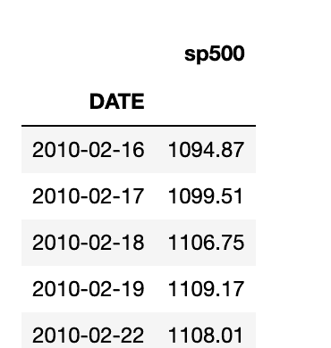
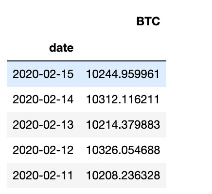
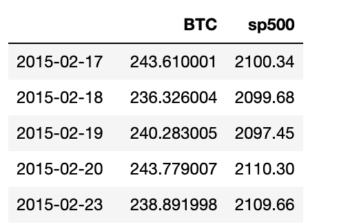
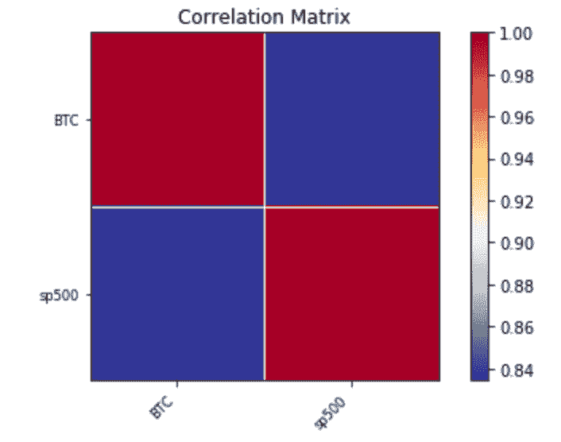

# 股票市场和比特币价格关系——Python 分析

> 原文：<https://towardsdatascience.com/stock-market-and-bitcoin-price-relationship-python-analysis-f39f992201c7?source=collection_archive---------19----------------------->

## 股票市场和比特币(BTC)价格之间有**关系吗？**

通过对 Python 和 Pandas 的分析，我们将能够在本文中回答这个问题。首先我们将**检索**，使用一个免费的 API，**过去几年的比特币和股票价格**。然后，我们将**计算**股市和比特币价格之间的相关性。最后，我们将通过 ***相关性矩阵图*** 来结束绘制相关性的分析。


照片由 [Rick 在](https://unsplash.com/@ricktap?utm_source=unsplash&utm_medium=referral&utm_content=creditCopyText) [Unsplash](https://unsplash.com/s/photos/stock-market?utm_source=unsplash&utm_medium=referral&utm_content=creditCopyText) 上轻拍

# 比特币在经济中的作用

自从比特币的*出现*之后，我就一直想知道比特币在我们的经济中有什么作用。以下是三个潜在角色:

*   比特币是否有类似黄金的作用？黄金被认为是安全的投资。也就是说，当经济步入衰退时，黄金价格往往会上涨，因为投资者会从股票转向黄金。这有助于投资者减少股市崩盘给他们的投资组合带来的潜在损失。如果比特币一直在投资界扮演安全天堂的角色，我们应该会看到股票和比特币价格之间的负相关关系。
*   另一个可能的作用是比特币跟随金融市场的趋势。也就是说，如果股票价格正在上涨，这种实证主义会传染吗，因此，在比特币价格中也是可见的吗？
*   我们分析的第三个潜在结果可能是，比特币价格与股市完全没有关系。

让我们用 Python 来了解一下吧！

# 用 Python 检索股票市场价格和比特币价格

为了获得数据来执行我们的分析，我将使用[financialmodelingprep](https://financialmodelingprep.com/developer/docs/)API 来**检索比特币价格**。他们还提供免费的股票数据，但为了向您展示两种不同的获取数据的方式，我将使用 Pandas DataReader 来检索股票数据。

作为我们市场数据的代理，我们将使用 [S & P 500 指数](https://en.wikipedia.org/wiki/S%26P_500_Index)。**标准普尔 500 指数是一个衡量在美国上市的 500 家最大公司股票表现的指数。我们将使用 [Pandas DataReader](https://pandas-datareader.readthedocs.io/en/latest/) 下载 SP500 价格和[美联储经济数据(FRED)](https://fred.stlouisfed.org/) 作为来源。**

如果你以前从未使用过*Pandas**DataReader*和 *Pandas* ，你将需要安装这些软件包。你可以通过使用 *pip* 命令来完成。

```
pip install pandas_datareader #Pandas data reader may not work with the latest Pandas version, therefore, I recommend you to install Pandas version 0.24: pip install pandas==0.24.2
```

太好了，现在我们可以用 Python 检索数据了。首先，我们将提取过去十年的 S&P500 股票价格。注意，通过使用 *web，我们可以很容易地获得我们称之为 *SP500* 的熊猫系列中的数据。DataReader* 并指定系列名称(即 *sp500* )和供应商(即 *fred* )

```
pd.core.common.is_list_like = pd.api.types.is_list_likeimport pandas_datareader.data as web
import datetimestart = datetime.datetime(2010, 1, 1)
end = datetime.datetime(2020, 2, 10)SP500 = web.DataReader(['sp500'], 'fred', start, end)
print(SP500)
```

上面的代码行将返回下面的标准普尔 500 熊猫系列，其中包含 S&P 过去 10 年的价格:



标准普尔 500 价格

现在让我们检索比特币价格。为此，我们将使用[financialmodelingprep API](https://financialmodelingprep.com/developer/docs/)。我们将向 API 端点发出一个 *http* *get* *请求*，该请求将返回一个包含历史 BTC 价格的字典:

```
import requests#BTCUSD contains a dictionary
BTCUSD = requests.get('[https://financialmodelingprep.com/api/v3/historical-price-full/crypto/BTCUSD'](https://financialmodelingprep.com/api/v3/historical-price-full/crypto/BTCUSD'))BTCUSD = BTCUSD.json()
BTCUSD = BTCUSD['historical']
```

我们解析包含在关键字名称*历史*中的字典。如果你不熟悉如何解析 API 响应，我推荐你阅读下面的[文章](https://techtutorialsx.com/2016/10/30/python-parsing-json/)。

```
print(BTCUSD)[{'date': '2020-02-15',
  'open': 10315.651367,
  'high': 10341.555664,
  'low': 10226.138672,
  'close': 10244.959961,
  'adjClose': 10244.959961,
  'volume': 42347495424.0,
  'unadjustedVolume': 42347495424.0,
  'change': 70.69141,
  'changePercent': 0.685,
  'vwap': 10270.88477,
  'label': 'February 15, 20',
  'changeOverTime': 0.00685},
 {'date': '2020-02-14',
  'open': 10211....
    ....
    ...]}
```

现在，通过查看 *BTCUSD* 变量的内容，我们可以看到 BTCUSD 是一个字典列表，列表中的每个元素都是包含比特币价格的不同日期。BTC 价格存储在*关闭*键下。

例如，我们看到在 2 月 15 日，比特币的价格是 10244 美元。

我们需要将字典列表转换成熊猫数据框架。我们可以使用 [*pd 轻松做到这一点。DataFrame.from_dict()*](https://pandas.pydata.org/pandas-docs/stable/reference/api/pandas.DataFrame.from_dict.html) :

```
BTC = pd.DataFrame.from_dict(BTCUSD)
BTC.set_index('date',inplace=True)#Keep only the close column
BTC = BTC[['close']]#Rename the column name to BTC
BTC.columns = ['BTC']
BTC
```



BTC 价格

最后，我们在两只熊猫数据框中给出了 BTC 和标准普尔 500 的价格。现在，我们只需要将它们合并在一起。幸运的是，对于 Python 和熊猫来说，这很容易做到。

我们可以使用 *pd.merge* 来连接索引上的两个数据帧，因为索引包含了*日期*。因此，我们想在比赛日加入 S & P500 和 BTC 价格。

我们可以通过参数 *right_index* 和 *left_index* 等于 *True* 来让 Pandas 知道我们想要使用该索引进行合并。更多细节见 [Pandas 合并文档](https://pandas.pydata.org/pandas-docs/stable/reference/api/pandas.DataFrame.merge.html)。

```
SP500BTC = BTC.merge(SP500, how='inner',right_index = True, left_index=True)#Drop NA since we have nan values for weekends. S&P500 only trades business days
SP500BTC.dropna(inplace=True)print(SP500BTC)
```



BTC 和标准普尔 500 的价格

# 比特币与标准普尔 500 价格的关系

太好了，我们已经为分析准备好数据了。现在，我们可以继续寻找股票和比特币价格之间的关系。

为此，我们可以使用 Pandas[*data frame . corr()*](https://www.geeksforgeeks.org/python-pandas-dataframe-corr/)来查找 Pandas DataFrame 列的相关性:

```
correlation = SP500BTC.corr()
print(correlation)###Result:BTC     sp500
BTC    1.000000  0.834106
sp500  0.834106  1.000000
```

## 如何解读 BTC 和标准普尔 500 房价的相关性？

相关矩阵的值范围从-1 到 1。更接近+1 意味着两个变量紧密地在一起，并且向同一个方向移动。值 0 表示变量之间没有关系。而负相关表示变量朝不同方向移动。越接近-1，反比关系越强。

通过研究我们的结果，我们发现比特币价格和标准普尔 500 指数之间存在 0.83 的强正相关性。这意味着当股票市场的价格上涨时，我们可以预计比特币也会跟随趋势上涨。

我们也可以通过使用 [*matplotlib* 和 *statsmodels*](https://www.statsmodels.org/stable/generated/statsmodels.graphics.correlation.plot_corr.html) 来可视化这种相关性:

```
from statsmodels import api as sm
import matplotlib.pyplot as pltsm.graphics.plot_corr(correlation,xnames=list(correlation.columns))
plt.show()
```



BTC 和 S&P500 相关矩阵

图表中的红色意味着这种关系是牢固和积极的。我们还可以使用*Lin regressive*和 *scipy.stats* 来检查这种关系在统计上是否显著:

```
#statistically significant?from scipy.stats import linregress
linregress(SP500BTC['sp500'],SP500BTC['BTC'])#H0: BTC and Stock prices are not related#Results:
LinregressResult(slope=8.956910705798713, intercept=-18068.59091142212, rvalue=0.8341059841835341, pvalue=0.0, stderr=0.1673358700767462)
```

由于我们的 p 值低于 0.05，我们可以拒绝 H0，因此，我们可以从统计上说，比特币和股票价格正在一起移动。

# 包扎

使用 Python 和 Pandas，我们分析了股票市场和比特币价格之间的关系。根据我们的分析结果，我们可以说 BTC 和标准普尔 500 价格同向移动。

我们很想知道这种关系在衰退的商业周期中是否也成立。为了进行这样的分析，我们可能需要等待一段时间，因为在过去几年中，我们一直生活在一个扩张的经济中。

请参见下面的完整脚本:

```
import pandas as pd
pd.core.common.is_list_like = pd.api.types.is_list_likeimport pandas_datareader.data as web
import datetimestart = datetime.datetime(2010, 1, 1)
end = datetime.datetime(2020, 2, 10)
SP500 = web.DataReader(['sp500'], 'fred', start, end)import requests
BTCUSD = requests.get('[https://financialmodelingprep.com/api/v3/historical-price-full/crypto/BTCUSD'](https://financialmodelingprep.com/api/v3/historical-price-full/crypto/BTCUSD'))
BTCUSD = BTCUSD.json()
BTCUSD = BTCUSD['historical']BTC = pd.DataFrame.from_dict(BTCUSD)
BTC.set_index('date',inplace=True)
BTC = BTC[['close']]
BTC.columns = ['BTC']SP500BTC = BTC.merge(SP500,how='inner',right_index = True, left_index=True)
SP500BTC.dropna(inplace=True)correlation = SP500BTC.corr()
print(correlation)from statsmodels import api as sm
import matplotlib.pyplot as plt
sm.graphics.plot_corr(correlation,xnames=list(correlation.columns))
plt.show()#statistically significant?
from scipy.stats import linregress
linregress(SP500BTC['sp500'],SP500BTC['BTC'])
```

*原载于 2020 年 2 月 15 日 https://codingandfun.com*[](https://codingandfun.com/stock-market-and-bitcoin-price-relationship/)**。**