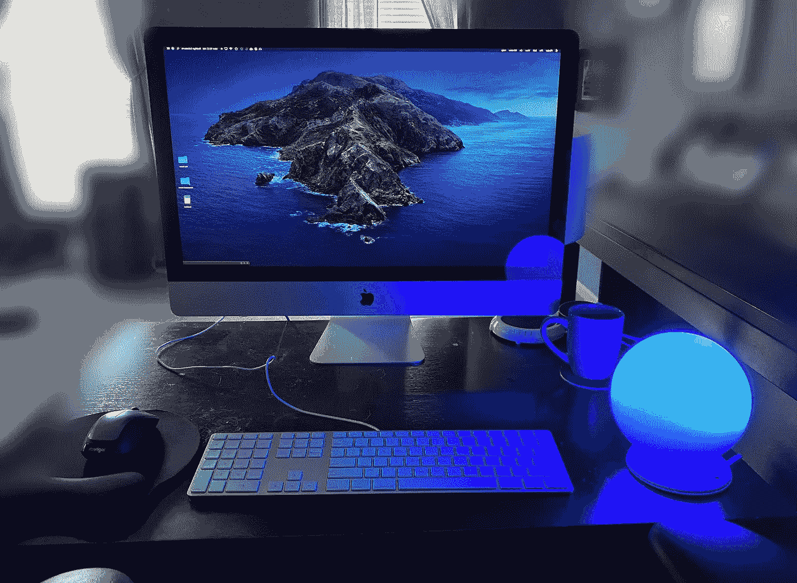

# 股市灯实时跟踪器

> 原文：<https://towardsdatascience.com/stock-market-lamp-real-time-tracker-b2d0562a71c3?source=collection_archive---------37----------------------->



## 如何使用 Python 实时跟踪自己的投资组合

不用说，在这个疫情，股票市场一直不稳定。由于我们大多数人都被困在家里，我决定建造一个很酷的彩灯来实时反映我的股票市场投资组合。这样，当股票市场开盘时，我的灯会打开，它的颜色会反映我的开仓头寸，并在一天内更新。这是一个很酷的小工具，我还没有看到购买，所以为什么不建立自己的。我不喜欢日内交易，因为很多原因，我坚信大多数人不应该日内交易。因此，灯与其说是焦虑的制造者，不如说是一个有趣的配件。

## 材料清单

这里是你需要建立你的股市灯实时追踪器。如果你已经拥有一个彩色灯泡，你可以检查是否有一个库或 API 来通过 http 发送命令。在这种情况下，我们使用一个 Yeelight，它有一个 Python 库。

黄色灯泡

*   [https://www . Amazon . com/gp/product/b 077 gcyct 7/ref = ppx _ yo _ dt _ b _ search _ asin _ title？ie=UTF8 & psc=1](https://www.amazon.com/gp/product/B077GCYCT7/ref=ppx_yo_dt_b_search_asin_title?ie=UTF8&psc=1)

灯泡球

*   [https://www . home depot . com/p/Westinghouse-6-in-handlown-Opal-Globe-with-3-1-4-in-Fitter-8150100/203066058](https://www.homedepot.com/p/Westinghouse-6-in-Handblown-Opal-Globe-with-3-1-4-in-Fitter-8150100/203066058)
*   [https://www . home depot . com/p/Leviton-Plastic-Keyless-Lamp-Holder-R50-08829-CW4/100356849](https://www.homedepot.com/p/Leviton-Plastic-Keyless-Lamp-Holder-R50-08829-CW4/100356849)

基本上，你会有一个 Wi-fi 智能灯和它的颜色变化从你的 Python 代码。地球仪是一个外壳，使它看起来很漂亮。

## Python 代码灯泡控件

创建新的 python 项目。安装我们将使用的两个主要库:

```
pip install yeelight investpy
```

安装 yeelight 手机 app，配置灯泡。在应用程序中，打开局域网控制。在灯泡->设置(右上角图标)->设备信息中获取灯泡的 IP 地址。检查灯泡是否工作。

```
from yeelight import Bulb, BulbException
BULB_IP = **'192.168.X.XXX'** bulb = Bulb(BULB_IP)
bulb.get_properties(requested_properties=[**'power'**, ])
```

## Python 代码股票市场

接下来，您可以创建一个函数来确定股票的 PnL

```
def daily_pnl(stock):
    stock_data = investpy.get_stock_historical_data(stock, **'united states'**, from_date=(date.today() +
        timedelta(days=-1)).strftime(**"%d/%m/%Y"**), to_date=date.today().strftime(**"%d/%m/%Y"**))
    stock_data.index = stock_data.index + timedelta(days=1)
    ytd = stock_data.iloc[0].Close
    tdy = stock_data.iloc[1].Close
    return ((tdy-ytd)/ytd)*100
```

简单地通过一只股票，如“AAPL”应该返回前一天的利润或损失。

最后，你所要做的就是将 PnL 范围转换成 RGB 颜色。

```
def refresh_bulb_color(bulb):
    pnl_to_color = {-1.0: **'#ff1100'**,  *# <1%+ loss* -0.5: **'#ff6a00'**,
                    0.0: **'#ffffff'**,  *# neutral* 0.5: **'#8fb2ff'**,
                    1.0: **'#0004ff'**,}  *# >+0.5% gain* pnl = daily_pnl(**'AAPL'**)
    print(**"{:.2f}%"**.format(pnl))
    pnl_idx = np.searchsorted(list(pnl_to_color.keys()), pnl, **'left'**).clip(0,4)
    color = list(pnl_to_color.values())[pnl_idx]
    rgb = tuple(int(color.lstrip(**'#'**)[i:i+2], 16) for i in (0, 2, 4))

    try:
        bulb.set_rgb(rgb[0], rgb[1], rgb[2])
    except BulbException:
        logging.error(**'bulb disconnected'**)
        return False

    return True
```

创建无限循环并设置刷新间隔。你可以调整 PnL 函数来反映你自己的投资组合，而不是单一的股票。

就是这样！你有自己的实时彩灯跟踪器。