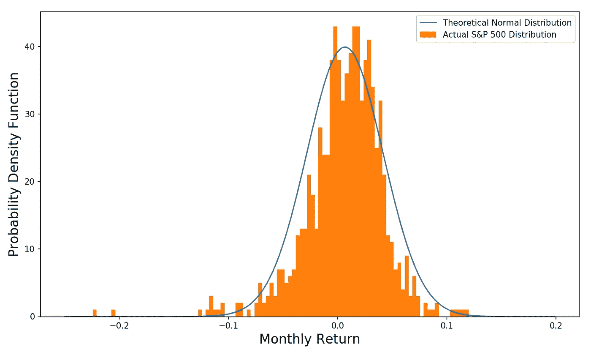

# 股票市场的结果目前是伯努利分布

> 原文：<https://towardsdatascience.com/stock-market-outcomes-are-currently-bernoulli-distributed-c2fbde004745?source=collection_archive---------40----------------------->


[西蒙](https://unsplash.com/@aurazon?utm_source=medium&utm_medium=referral)在 [Unsplash](https://unsplash.com?utm_source=medium&utm_medium=referral) 上的照片

## 这对股票风险意味着什么

***来自《走向数据科学》编辑的提示:*** *虽然我们允许独立作者根据我们的* [*规则和指导方针*](/questions-96667b06af5) *发表文章，但我们并不认可每个作者的贡献。你不应该在没有寻求专业建议的情况下依赖一个作者的作品。详见我们的* [*读者术语*](/readers-terms-b5d780a700a4) *。*

我们目前正站在十字路口。刺激还是不刺激？有疫苗还是没有疫苗？COVID 和住院治疗的增长趋势还是快速平台期？

这些问题目前无法回答——每个人都有自己的看法，但没有人知道答案。

这种对未来的巨大不确定性是 VIX(衡量标准普尔 500 回报的预期远期波动性，也就是年化标准差)在股市徘徊在历史高点附近的情况下仍然顽固走高的原因。我以前写过这种现象:

[](https://medium.com/alpha-beta-blog/whats-up-with-the-vix-88b0a724d9fb) [## VIX 怎么了？

### 了解 VIX 以及它想告诉我们什么

medium.com](https://medium.com/alpha-beta-blog/whats-up-with-the-vix-88b0a724d9fb) 

# 什么是 VIX，我们为什么要关注它？

金融和数据科学有很多重叠之处。我会在之前的链接中详细介绍，但是让我们快速回顾一下 VIX 是什么。

VIX 是标准普尔 500 的隐含波动率。换句话说，**是市场预期的标准普尔 500 指数(未来 30 天)收益的年化标准差**。它是通过标准普尔 500 指数上一篮子期权的价格计算出来的(隐含波动率是期权价格的一个关键驱动因素，因此给定价格，我们可以取消隐含波动率)。

尽管它声称是前瞻性的，但从历史上看，VIX 看起来很像标准普尔 500 在过去 30 天的*中的实际波动——所以它不是很有前瞻性:*

**

*VIX 与过去 30 天实现的波动性(来源:Sharadar，图形由作者创建)*

*但这并不意味着它完全没有信号。包括我自己在内的许多投资者抱怨说，在潜在的灾难性经济背景下，市场最近表现得自满。*

*尽管原始股价并没有反映出太多的担忧，但隐含波动率却反映了。看下面这个散点图。它绘制了标准普尔 500 指数相对于其历史高点(x 轴)和 VIX (y 轴)的交易位置。**它们之间有一个明显的负关系**——这意味着当标准普尔 500 指数接近其历史高点或创下新高时，VIX 往往较低(当出现大幅下跌时，VIX 往往较高)。*

****注:****VIX 水平比如说 50 可以解释为未来 30 天的预期年化波动率为 50%。这意味着预期的 30 天波动率为 50%/sqrt(12) = 14.4%。**

**

*标准普尔 500 从之前的峰值下降对 VIX(来源:沙拉达尔，图形由作者创建)*

*蓝色圆点是 2020 年 8 月 1 日之前的所有交易日(从 2010 年 1 月 1 日到 2020 年 7 月 31 日)，橙色圆点是 2020 年 8 月 1 日及以后的所有交易日。**注意对于给定的水位降深(在 x 轴上)，橙色点位于或超出蓝色点的顶部范围。***

*这意味着市场的行为有些反常——在股票市场水平的控制下，VIX 高于历史水平。*

*作为参考，今年 2 月，在所有的疯狂之前，SPY(一个受欢迎的标准普尔 500 ETF)的交易价格在 335 左右。与此同时，VIX 指数为 13.7(年化隐含波动率为 13.7%)。在我写这篇文章的时候，间谍的价值比二月份的时候高了 343，但是 VIX 的价值是 29——是以前的两倍多！换句话说，尽管股票价格已经完全恢复，但标准普尔 500 在未来一个月的波动性预计将增加一倍。*

***主要的实际影响是投资组合保险(VIX 看涨期权和标准普尔 500 看跌期权)今天比今年年初贵得多。这使得对冲股票风险变得更加困难。***

# *为什么会出现这种情况？*

*新闻会说些老一套——选举不确定性、经济焦虑、软银收购大量科技股看涨期权，等等。*

*没错，这些都会对边际利润产生影响。但我觉得答案更简单。通常，当我们展望未来时，市场回报预计大致呈正态分布(如果你想了解细节，请参见下面的链接博客)。*

*[](/are-stock-returns-normally-distributed-e0388d71267e) [## 股票收益是正态分布吗？

### 从概率分布中得出的预期与真实世界的股票回报匹配吗？

towardsdatascience.com](/are-stock-returns-normally-distributed-e0388d71267e) 

如果你把所有的日收益率绘制在柱状图上，它应该看起来或多或少像一条钟形曲线，事实确实如此:



实际回报分布与理论回报分布(来源:Sharadar，图片由作者创作)

目前，市场收益不是正态分布的。下面，我绘制了标准普尔 500 过去两个月的每日收益分布图(橙色)和 COVID 市场崩盘前两个月的收益分布图(蓝色)。**注意橙色分布看起来是双峰的。**


实际回报分布与理论回报分布(来源:Sharadar，图片由作者创作)

最近，市场行为可以被描述为——当市场参与者降低他们获得更多政府刺激的可能性时，市场下跌。当他们提高政府刺激的可能性时，市场就会上涨。

但最终，答案要么是肯定的，要么是否定的。要么是经济得到足够的刺激，在柯维德退出的同时启动它，要么是没有。换句话说，**我们要么得到一个快乐的结果，要么得到一个悲伤的结果，没有中间的**。

**那样的双峰结果可以用** [**伯努利分布**](https://en.wikipedia.org/wiki/Bernoulli_distribution) **来建模。伯努利分布随机变量的一个例子是掷硬币——要么你得到概率为 p 的正面，要么得到概率为 1-p 的反面。**

这就像现在的股票市场——要么事情变好(刺激、疫苗、经济复苏)，要么事情变坏(刺激不够、疫苗不起作用、经济灾难)。

伯努利分布随机变量的标准差为:

```
**Standard deviation of Bernoulli random variable
  = p*(1 - p)**Where p is the probability of success.
```

让我们想出一些数字，并计算一个标准差。假设以下情况:

*   事情有 75%的可能会好起来。
*   如果情况好转，市场将上涨 20%。
*   如果事情变得糟糕，市场将崩溃-50%。

我们可以计算股票市场的预期标准差如下:

```
stock market standard deviation**= (0.2-(-0.5)) * (0.75*(1-0.75))**0.5 = 30.3%
which implies of VIX of 30.3**** denotes exponent
```

这非常接近目前观测到的 VIX 水平 29.3。如果您想仔细检查上述计算，可以运行以下 Python 代码。它产生相同的答案。

```
import numpy as npresult = []
for i in range(100000):
    if np.random.random() > 0.75:
        result.append(0.2)
    else:
        result.append(-0.5)

np.std(result)
``` 

# *伯努利分布回报的风险更大*

*29.3 挺高的。作为参考，在过去十年中，标准普尔 500 的平均实现 30 天波动率为 16.5%。*

*我之前认为隐含波动率太高，因此期权溢价很高。我不再这么想了。抛硬币的结果很可怕，因为风险很大。你可能会对我在上面的计算中使用的输入数据提出异议，但很明显，如果健康和经济状况不能很快好转，情况将会变得更糟。美联储和 QE 能做的就这么多了。*

*为什么我说伯努利分布收益风险更大？想象两个游戏:*

1.  ***游戏 1:** 你掷 100 枚硬币。对于每枚硬币，如果是正面，你就赢 1500 美元，如果是反面，你就输 1000 美元。第一场**的结果将是正态分布的。***
2.  ***游戏二:**你只抛一枚硬币。如果是正面，你赢 15 万美元，如果是反面，你输 10 万美元。第二场比赛的结果将是伯努利分布。*

*这两款游戏的预期价值都是 25000 美元。但他们显然不平等。第二场比赛风险更大——要么你很富有，要么你损失了一大笔钱。我们可以用下面的代码模拟这两个游戏:*

```
*# 100K simulations of  Game 1 - Flip 100 coins
all_results = []
for j in range(100000):
    result = 0
    for i in range(100):
        if np.random.random() > 0.5:
            result += 1500
        else:
            result += -1000
    all_results.append(result)

print('Game 1:', np.mean(all_results), np.std(all_results))# 100K simulations of  Game 2 - Flip 1 coin
result = []
for i in range(100000):
    if np.random.random() > 0.5:
        result.append(150000)
    else:
        result.append(-100000)

print('Game 2:', np.mean(result), np.std(result))*
```

*从我的代码输出中，我可以看到第一场游戏(我们掷 100 枚硬币)的标准差是 12，500 美元。相比其 25，000 美元的预期价值，这已经相当不错了。*

***另一方面，游戏 2 的标准差为 125，000 美元！与预期值相比，这是一个巨大的数字。***

*我们可以用两个游戏模拟结果的直方图来形象化这一点。尽管预期收益相同，游戏 2 显然有更大的下跌风险。在第一场比赛中赔钱的可能性很小(即使这样，你也只输了一点点)。在第二场比赛中，你有 50%的概率会丢失大量的零钱。*

**

*游戏 1 和游戏 2 的结果直方图(图形由作者创建)*

*虽然这个例子是程式化的，但它在精神上类似于当前的市场形势。在面临抛硬币时，股市参与者目前面临着前所未有的不确定性。虽然它可能没有被计入股市估值，但它被计入了 VIX，这与投资保险的价格相对应。大家小心！*

## ****更多真实故事****

*[](https://medium.com/alpha-beta-blog/ibuyers-bring-convenience-and-liquidity-to-the-real-estate-market-fb1c99f9fcd6) [## iBuyers 为房地产市场带来便利和流动性

### 但是这些东西值得花几千块钱买吗？

medium.com](https://medium.com/alpha-beta-blog/ibuyers-bring-convenience-and-liquidity-to-the-real-estate-market-fb1c99f9fcd6) [](/understanding-linear-regression-94a6ab9595de) [## 了解线性回归

### 数据科学的主力

towardsdatascience.com](/understanding-linear-regression-94a6ab9595de)*