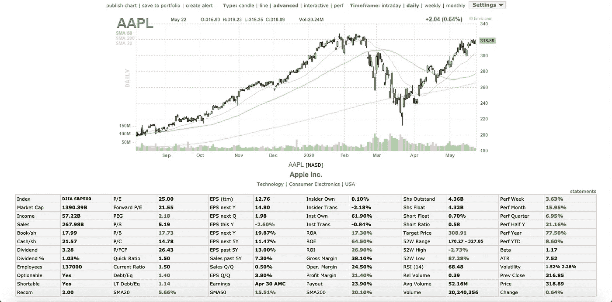
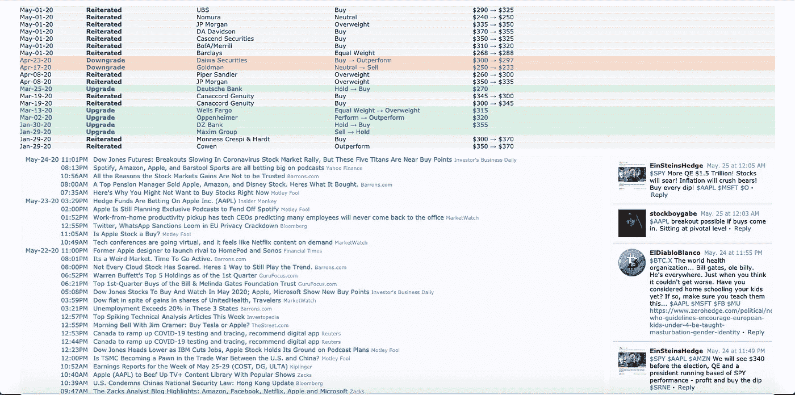

# 用 Python 进行股票新闻情绪分析！

> 原文：<https://towardsdatascience.com/stock-news-sentiment-analysis-with-python-193d4b4378d4?source=collection_archive---------6----------------------->

## 对财经新闻进行秒级情感分析！

跟上金融和特定股票的新闻对你的交易策略非常有益，因为它通常会决定价格的变化。因此，我创建了这个算法，可以轻松快速地解析 FinViz 股票筛选程序，并计算任何输入股票的新闻标题的情绪。

图片由 [StockSnap](https://pixabay.com/users/StockSnap-894430/?utm_source=link-attribution&amp;utm_medium=referral&amp;utm_campaign=image&amp;utm_content=2616931) 来自 [Pixabay](https://pixabay.com/?utm_source=link-attribution&amp;utm_medium=referral&amp;utm_campaign=image&amp;utm_content=2616931)

[FinViz](https://finviz.com/) 无疑是网络上最强大的股票筛选工具之一。它可以免费获取大量信息，包括交互式图表、70 多个基本比率、大型银行交易数据以及几乎任何股票的最新新闻标题。如果你以前从未使用过 FinViz，我在下面附上了苹果公司的数据截图，以及我们将在本文中收集的数据。

AAPL 的基本比率和互动图表。

FinViz 为 AAPL 提供内幕交易信息和最新新闻标题。

第二个屏幕截图中的蓝色信息是更新的新闻标题，这正是我们将要抓取和执行情感分析的内容。既然我们已经检查了我们将使用的数据，让我们进入代码！

导入和参数

要开始，首先导入以下模块，并根据您的喜好设置参数。变量 n 表示将为‘ticker’列表中的每个 ticker 显示的文章数量。代码的其余部分将不必手动更新，这些是您每次运行代码时必须更改的唯一参数。

从 FinViz 获取新闻数据

接下来，我们将使用模块 BeautifulSoup 和 requests 从 FinViz 网站获取新闻数据。该代码解析新闻 HTML 表的 URL，并遍历滚动条列表，收集每个滚动条最近的标题。对于每一只输入的股票，都会打印出“n”个最近的头条，以便于查看数据。

反复阅读新闻

为了执行情感分析，数据必须采用正确的格式，因此这段代码遍历收集到的新闻，并将其分类为一个列表，包括报价器、日期、时间和实际标题。

执行情感分析

使用功能强大的 nltk 模块，可以分析每个标题的极性分值，分值范围为-1 到 1，其中-1 表示高度负面，1 表示高度正面。

查看结果数据

最后，数据已经准备好以一种吸引人的方式进行操作和查看。对于输入列表中的每个跑马灯，将创建一个新的数据帧，包括其标题和各自的分数。最后，将创建一个最终的数据帧，其中包括每个报价器在所有最近解析的新闻中的平均情绪值。

解析算法的所有代码

上面的 GitHub 要点包含了这篇文章的所有代码。我希望这个算法将来对你有用。非常感谢您的阅读！

*免责声明:本文材料纯属教育性质，不应作为专业投资建议。自行决定投资。*

如果你喜欢这篇文章，可以看看下面我写的其他一些 Python for Finance 文章！

 [## 使用 Python 在几分钟内解析数千份股票推荐！

### 了解如何在不到 3 分钟的时间内解析顶级分析师的数千条建议！

towardsdatascience.com](/parse-thousands-of-stock-recommendations-in-minutes-with-python-6e3e562f156d)  [## 用 Python 制作股票筛选程序！

### 学习如何用 Python 制作一个基于 Mark Minervini 的趋势模板的强大的股票筛选工具。

towardsdatascience.com](/making-a-stock-screener-with-python-4f591b198261)  [## 在 3 分钟内创建一个财务 Web 应用程序！

### 了解如何使用 Python 中的 Streamlit 创建技术分析应用程序！

towardsdatascience.com](/creating-a-finance-web-app-in-3-minutes-8273d56a39f8)