# 使用最先进的转换器和时间嵌入进行股票预测

> 原文：<https://towardsdatascience.com/stock-predictions-with-state-of-the-art-transformer-and-time-embeddings-3a4485237de6?source=collection_archive---------0----------------------->

## 给交易机器人输入最新的股票预测

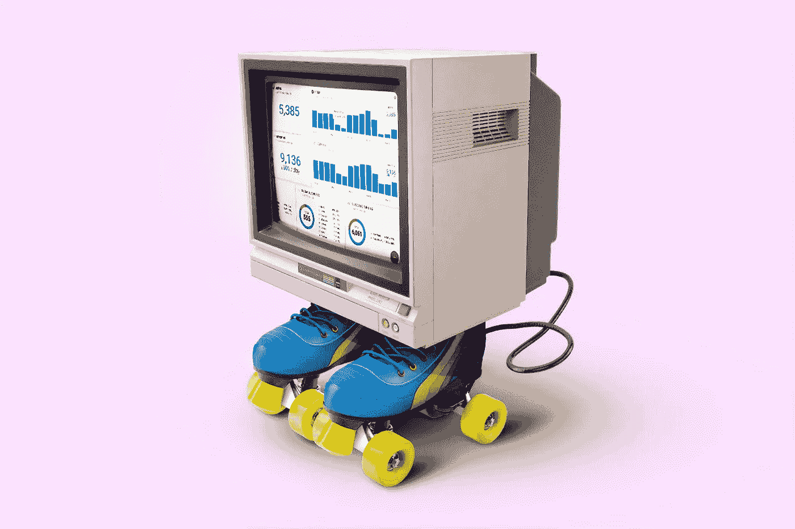

照片由[晨酿](https://unsplash.com/@morningbrew?utm_source=unsplash&utm_medium=referral&utm_content=creditCopyText)在 [Unsplash](/t/technology?utm_source=unsplash&utm_medium=referral&utm_content=creditCopyText) 拍摄

在我之前的文章中，我分享了我第一次预测股票价格的研究结果，这些结果随后将被用作深度学习交易机器人的输入。在将我的数据集升级到数以千计的股票报价机，相当于几乎**1tb 的股票价格历史和新闻文章**的同时，我开始意识到我最初使用由**LSTM**(**L**ONG-**S**short**T**erm**M**记忆模型和 **CNN** ( **C** 组成的神经网络的方法因此，为了克服这些限制，我必须实现一个专用于**股票**时间序列**的**转换器**。**

近年来，变压器因其出色的性能而广受欢迎。将**自我关注**机制、**并行化**和**位置编码**结合在一起，在处理需要语义特征提取和大型数据集的任务时，通常比经典的 LSTM 和 CNN 模型更具优势[1]。

由于我无法找到一个简单的转换器实现，它是为具有**多种特征的时间序列定制的，例如，我们股票数据的(开盘、盘高、盘低、收盘、成交量)**特征，所以我必须自己实现它。在这篇文章中，我将分享我对股票数据的**转换架构**，以及什么是**时间嵌入**，以及为什么必须将它们与时间序列结合使用。

# 数据

出于本文的解释目的，我们将使用 IBM 股票价格历史作为 1tb 股票数据集的简化版本。尽管如此，您可以轻松地将本文中的代码应用到更大的数据集。IBM 数据集从 1962 年 1 月 2 日开始，到 2020 年 5 月 24 日结束，总共包含 **14699 个交易日**。此外，每个交易日，我们都有 IBM 股票的**开盘价**、**高开**、**低开**和**收盘价**以及交易量**、**、**、**。

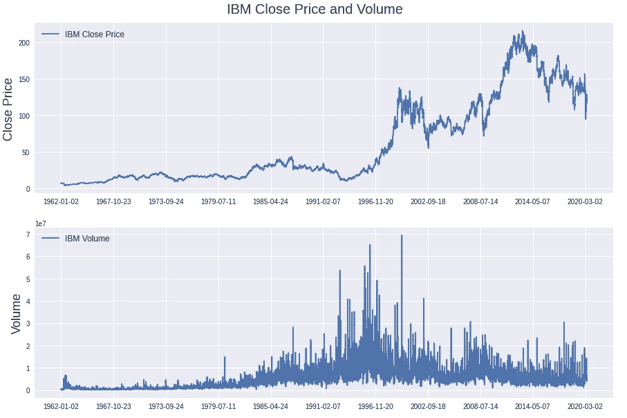

IBM 的每日收盘价和成交量

## 数据准备

价格和交易量特征被转换成每日**股票收益**和每日**交易量变化**，应用**最小-最大标准化**，并且时间序列被分成训练、验证和测试集。将股票价格和交易量转换为每日变化率增加了数据集的稳定性。因此，模型从我们的数据集中获得的知识对未来预测具有更高的有效性。这里概述了转换后的数据是什么样子。

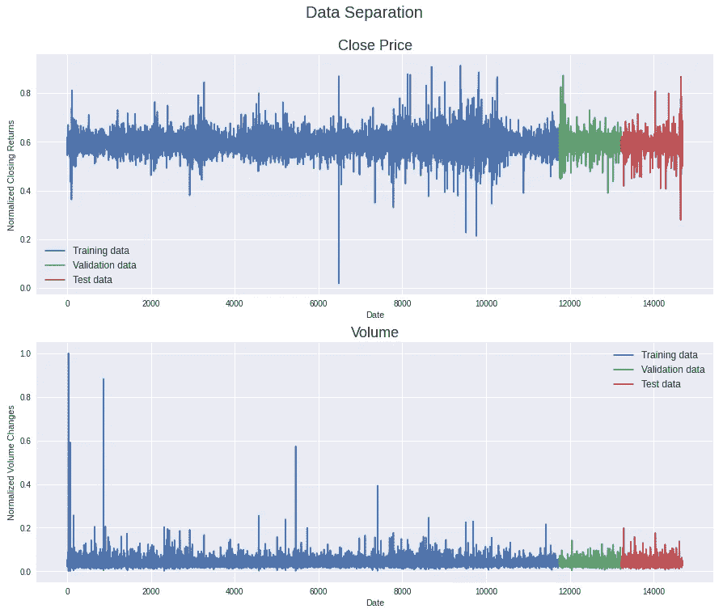

IBM 的每日收盘价回报和成交量变化

最后，训练集、验证集和测试集被分成长度为 128 天的单独序列。对于每个序列日，有 4 个价格特征(开盘价、盘高、盘低、收盘价)和交易量特征，每天有 5 个特征。在单个训练步骤中，我们的 Transformer 模型将接收 32 个序列 **(batch_size = 32)** ，它们是 128 天长的 **(seq_len=128)** ，并且每天有 **5 个特征**作为输入。

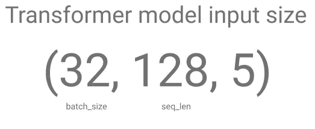

模型输入矩阵的大小

# 时间嵌入

作为 Transformer 实现的第一步，我们必须考虑如何将隐藏在股票价格中的时间概念编码到我们的模型中。

在处理时间序列数据时，时间是一个基本特征。然而，当使用转换器处理时间序列/顺序数据时，序列通过转换器架构一次转发，这使得提取时间/顺序依赖性变得困难。因此，与自然语言数据结合使用的转换器倾向于**利用位置编码**为模型提供词序的**概念。详细地说，位置编码是单词的值及其在句子中的位置的表示，允许转换器获得关于句子结构和单词相关性的知识。一个位置编码的例子可以在**BERT**[【2】](https://arxiv.org/abs/1810.04805)**模型的引擎盖下找到，该模型已经为许多语言任务实现了最先进的性能。****

**类似地，一个**转换器在处理我们的股票价格时需要一个时间概念**。如果没有时间嵌入，我们的转换器将不会收到任何关于股票价格时间顺序的信息。因此，2020 年的股票**价格对未来价格**预测的影响与 1990 年的**价格相同。当然，这将是可笑的。****

## **时间 2 向量**

**为了克服转换器的时间差异，我们将实现论文 **Time2Vec:学习时间的向量表示**[【2】](https://arxiv.org/pdf/1907.05321.pdf)**中描述的方法。**论文作者提出了“*一种与模型无关的时间向量表示，称为****time 2 vec******。*** 你可以把向量表示想象成普通的嵌入层可以添加到神经网络架构中，以提高模型的性能。**

**将这篇论文归结为它的要点，有两个主要观点需要考虑。**首先**，作者发现有意义的时间表示必须包括**周期性和非周期性模式**。周期性模式的一个例子是随不同季节而变化的天气。相反，非周期性模式的一个例子是一种疾病，随着患者年龄的增长，这种疾病发生的概率很高。**

****其次**，时间表示应具有对时间缩放的**不变性，**意味着时间表示不受不同时间增量(如天、小时或秒)和长时间范围的影响。**

**结合周期和非周期模式的思想以及对时间缩放的不变性，我们由下面的数学定义给出。别担心，这比看起来容易，我会详细解释的。😉**

**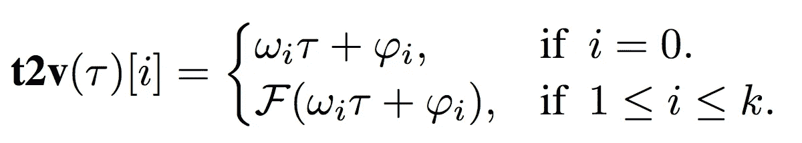**

**时间向量的数学表示— Time2Vec:学习时间的向量表示[3]**

**时间向量/表示法`***t2v***`由两部分组成，其中`***ωᵢτ + φᵢ***`表示时间向量的非周期性/线性特征，`***F(ωᵢτ + φᵢ)***`表示时间向量的周期性特征。**

**用一种更简单的方式重写`***t2v(τ) = ωᵢτ + φᵢ***`，新版本`***y = mᵢx + bᵢ***` 应该看起来很熟悉，因为它是你从高中就知道的线性函数的普通版本。`***ωᵢτ + φᵢ***`中的`***ω***`是定义我们的时间序列`***τ***`的斜率的矩阵，`***φ***` 简单来说就是定义我们的时间序列`***τ***` 与 y 轴的交点的矩阵。因此，`***ωᵢτ + φᵢ***`无非是一个线性函数。**

**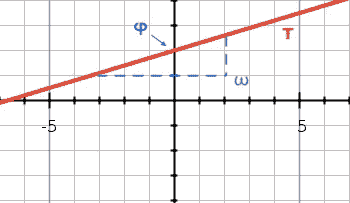**

**非周期时间特征的 2D 表示**

**第二分量`***F(ωᵢτ + φᵢ)***`代表时间向量的周期性特征。就像之前我们又有了线性项`***ωᵢτ + φᵢ***`，然而，这次线性函数被包装在一个额外的函数`***F()***`中。作者试验了不同的函数来最好地描述周期关系(sigmoid、tanh、ReLU、mod、triangle 等。).最终，一个**正弦函数**取得了最好和最稳定的性能(余弦函数取得了类似的结果)。当组合线性函数`***ωᵢτ + φᵢ***`和正弦函数**时，2D 表示如下。`***φ***` 沿 x 轴移动正弦函数，`***ω***` 决定正弦函数的波长。****

**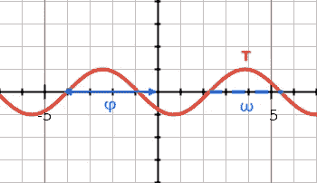**

**周期性时间特征的 2D 表示**

**让我们看一下 LSTM 网络的精度与时间向量(Time2vec)的不同非线性函数的组合是如何变化的。我们可以清楚地看到， **ReLU 函数执行**最差**最差**，相比之下，**正弦函数优于**所有其他非线性函数。ReLU 函数具有如此不令人满意的结果的原因是，ReLU 函数对于时间缩放不是不变的。函数对时间缩放的不变量越高，性能越好。**

**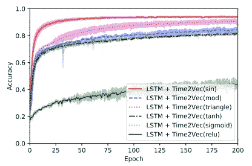**

**非线性函数的性能比较— Time2Vec:学习时间的向量表示[3]**

## **时间 2 矢量性能改进**

**在我们开始实现时间嵌入之前，让我们看看普通 LSTM 网络(蓝色)和 LSTM+Time2Vec 网络(红色)的性能差异。正如您所看到的，建议的时间向量不会导致多个数据集的性能下降，并且几乎总是会提高模型的性能。有了这些认识，我们就可以继续实现了。**

**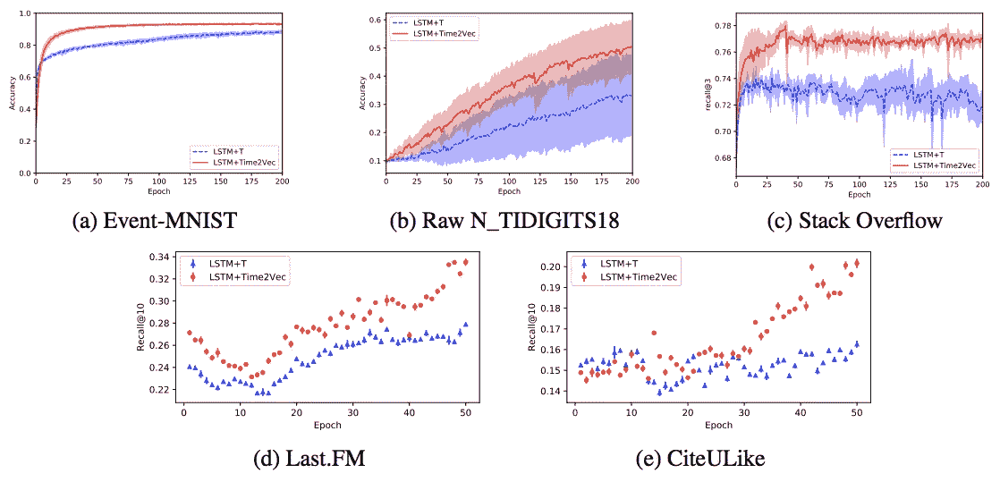**

**有和没有时间向量的 LSTM 网络的性能比较— Time2Vec:学习时间的向量表示[3]**

## **Time2Vector Keras 实施**

**好了，我们已经讨论了时间向量的周期和非周期分量在理论上是如何工作的，现在我们将在代码中实现它们。为了使时间向量易于集成到任何种类的神经网络架构中，我们将向量定义为 Keras 层。我们定制的 Time2Vector 层有两个子函数`def build():`和`def call():`。在`def build():`中我们初始化了 4 个矩阵，2 个为`***ω***` 和 2 个为`***φ***` 因为我们需要一个`***ω***` 和`***φ***`的矩阵来兼顾非周期性(线性)和周期性(正弦)的特性。**

```
seq_len = 128def build(input_shape):
   weights_linear = add_weight(shape=(seq_len), trainable=True)
   bias_linear = add_weight(shape=(seq_len), trainable=True) weights_periodic = add_weight(shape=(seq_len), trainable=True)
   bias_periodic = add_weight(shape=(seq_len), trainable=True)
```

**启动 4 个矩阵后，我们定义一旦调用该层将执行的计算步骤，因此有了`def call():`函数。**

**将由 Time2Vector 层接收的输入具有以下形状`(batch_size, seq_len, 5) → (32, 128, 5)`。`batch_size`定义了我们希望一次将多少股票价格序列输入模型/层。`seq_len`参数决定单个股票价格序列的长度。最后，数字`5`来源于这样一个事实，即我们有 IBM 每日股票记录的 5 个特征(开盘价、最高价、最低价、收盘价、成交量)。**

**第一个计算步骤排除了成交量，取开盘价、最高价、最低价和收盘价的平均值，得到形状`(batch_size, seq_len)`。**

```
x = tf.math.reduce_mean(x[:,:,:4], axis=-1)
```

**接下来，我们计算非周期(线性)时间特征，并再次将维度扩展 1。`(batch_size, seq_len, 1)`**

```
time_linear = weights_linear * x + bias_lineartime_linear = tf.expand_dims(time_linear, axis=-1)
```

**对周期性时间特征重复相同的过程，也产生相同的矩阵形状。`(batch_size, seq_len, 1)`**

```
time_periodic = tf.math.sin(tf.multiply(x, weights_periodic) + bias_periodic)time_periodic = tf.expand_dims(time_periodic, axis=-1)
```

**结束时间矢量计算所需的最后一步是连接线性和周期性时间要素。`(batch_size, seq_len, 2)`**

```
time_vector = tf.concat([time_linear, time_periodic], axis=-1)
```

## **时间 2 矢量层**

**将所有步骤组合成一个层函数，代码如下所示。**

# **变压器**

**现在我们知道了提供时间的概念以及如何实现时间向量是很重要的，下一步将是转换器。转换器是一种神经网络架构，它使用**自我关注**机制，允许模型**关注时间序列的相关部分**，以提高预测质量。自关注机构由**单头关注**和**多头关注**层组成。自我关注机制能够**立即将所有时序步骤**相互连接，导致**长期依赖理解**的创建。最后，所有这些过程都在 Transformer 架构中被**并行化**，从而加速了学习过程。**

## **结合 IBM 数据和时间特性——为转换器提供信息**

**在实现了时间嵌入之后，我们将结合 IBM 的价格和数量特性使用时间向量作为转换器的输入。 **Time2Vector 层接收**IBM**price**和 **volume** 特征作为输入，并计算**非周期性**和**周期性** **时间特征**。在随后的建模步骤中，计算出的时间特征与价格和数量特征连接在一起，形成一个形状为`(32, 128, 7)`的矩阵。**

**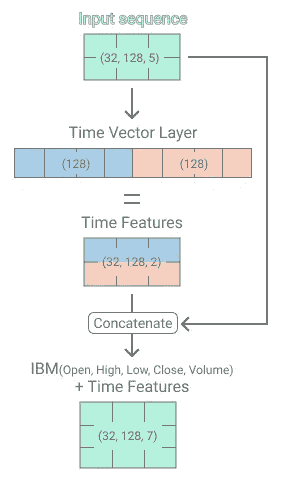**

**计算时间特性并与 IBM 价格和交易量连接**

## **单头注意力**

****IBM 时间序列加上我们刚刚计算的时间特征**，**形成第一单头注意层的初始输入**。单头关注层总共取 3 个输入**(查询，键，值)**。对我们来说，每个查询、键和值输入都代表了 IBM 的价格、数量和时间特性。每个查询、键和值输入都通过单独的密集层接受单独的**线性转换**。为密集层提供 96 个输出单元是个人的架构选择。**

**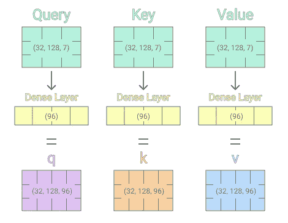**

**单头注意力-查询、键和值输入的线性转换**

**在初始的线性变换之后，我们将计算注意力得分/权重。注意力权重决定了**在预测未来股价时，对单个时间序列步骤**的关注程度。注意力权重通过取线性变换的查询和键输入的**点积**来计算，而变换的键输入已经被转置以使得点积乘法可行。然后**点积除以**先前密集层(96)的尺寸大小，以避免爆炸梯度。然后，被划分的点积通过 **softmax** 函数产生一组**权重，其总和为 1** 。作为最后一步，计算出的确定每个时间步焦点的 softmax 矩阵与转换后的 **v 矩阵**相乘，得出单头注意机制。**

**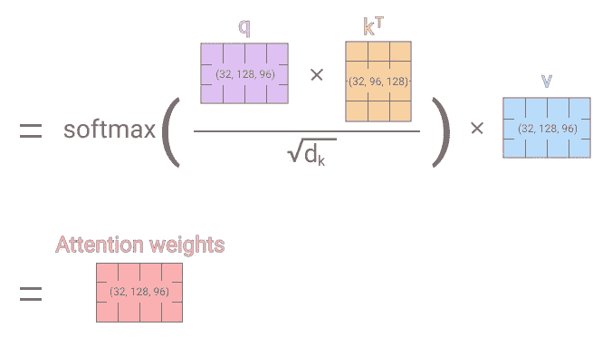**

**单头注意力—在对查询、键和值输入进行线性转换后计算注意力权重**

**由于插图对于最初的学习来说是很好的，但缺乏实现方面，我为你们准备了一个干净的单注意力 Keras 层函数🙂。**

## **多头注意力**

**为了进一步完善自我注意机制，论文作者**提出了实施多头注意**[【4】](https://arxiv.org/abs/1706.03762)。多头注意力层的功能是 c **对`***n***` **单头注意力层**的**注意力权重**进行**处理，然后对密集层应用**非线性变换**。下图显示了 3 个单头层的连接。**

**拥有`***n***`单头层的输出允许将多个独立的单头层转换编码到模型中。因此，该模型能够同时关注多个时间序列步骤。增加注意力头的数量会积极地影响模型捕捉远距离依赖性的能力。[1]**

**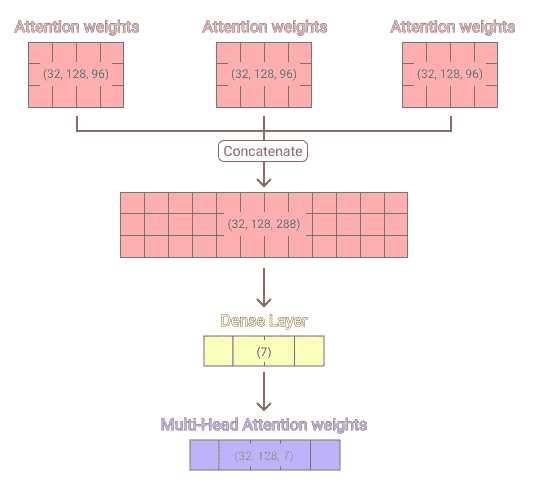**

**多头注意力层**

**同上，多头注意力层的干净实现。**

## **变压器编码器层**

**单头和多头注意机制(自我注意)现在被聚合到一个 transformer 编码器层中。每个编码器层包含一个自关注子层和一个前馈子层。前馈子层由两个致密层组成，其间有 ReLU 激活。**

**另一方面，如果 Conv 层的核大小和步距为 1，则密集层可以用 1 维卷积层代替。具有所述配置的密集层和卷积层的数学是相同的。**

**每个子层之后是一个丢失层，丢失后，通过将初始查询输入添加到两个子层输出来形成剩余连接。结束每个子层，在剩余连接附加之后放置一个标准化层，以稳定和加速训练过程。**

**现在我们有了一个现成的 Transformer 层，它可以很容易地堆叠起来以提高模型的性能。由于我们不需要任何变压器解码器层，我们实现的变压器架构与 BERT [2]架构非常相似。尽管不同之处在于时间嵌入，我们的转换器可以处理三维时间序列，而不是简单的二维序列。**

**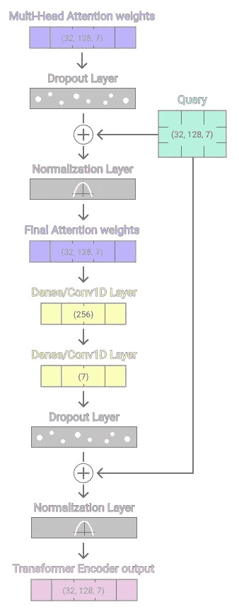**

**变压器编码器层**

**如果您想深入研究代码，我们开始吧。**

## **具有时间嵌入和转换器层的模型架构**

**总之，我们首先初始化时间嵌入层以及 3 个变换器编码器层。初始化之后，我们将一个回归头堆叠到最后一个 transformer 层上，训练过程开始。**

# **结果**

**训练过程总共有 35 个时期。在训练之后，我们可以看到，我们的转换模型只是预测了一条位于每日股价变化之间的平坦线。当仅使用 IBM 股票历史时，即使是变压器模型也仅仅能够预测股票发展的线性趋势。得出的结论是，股票的历史价格和交易量数据只包含足够的线性趋势预测的解释价值。然而，当将数据集升级到数千个股票报价机(1tb 数据集)时，结果看起来完全不同🙂。**

**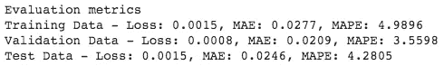****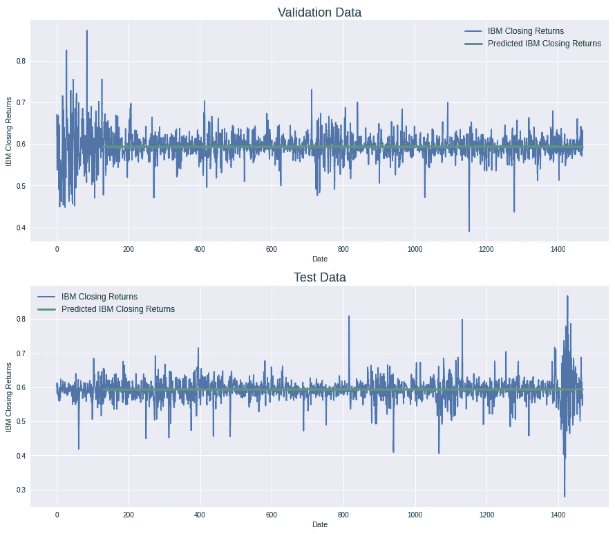**

**验证和测试数据集+预测**

## **将移动平均应用于股票数据—特征工程**

**如上所示，即使是最先进的模型架构也无法从历史股价和交易量中提取非线性股票预测。但是，当对数据应用简单的移动平均平滑效果时(窗口大小=10)，模型能够提供明显更好的预测(绿线)。该模型也能够预测涨跌，而不是预测 IBM 股票的线性趋势。然而，当仔细观察时，您仍然可以看到该模型在具有极端日变化率的日子中具有较大的预测增量，因此我们可以得出结论，我们仍然存在异常值问题。**

**应用移动平均效果的缺点是新的数据集不再反映我们的原始数据。因此，具有移动平均线效应的预测不能用作我们的交易机器人的输入。**

**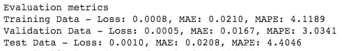****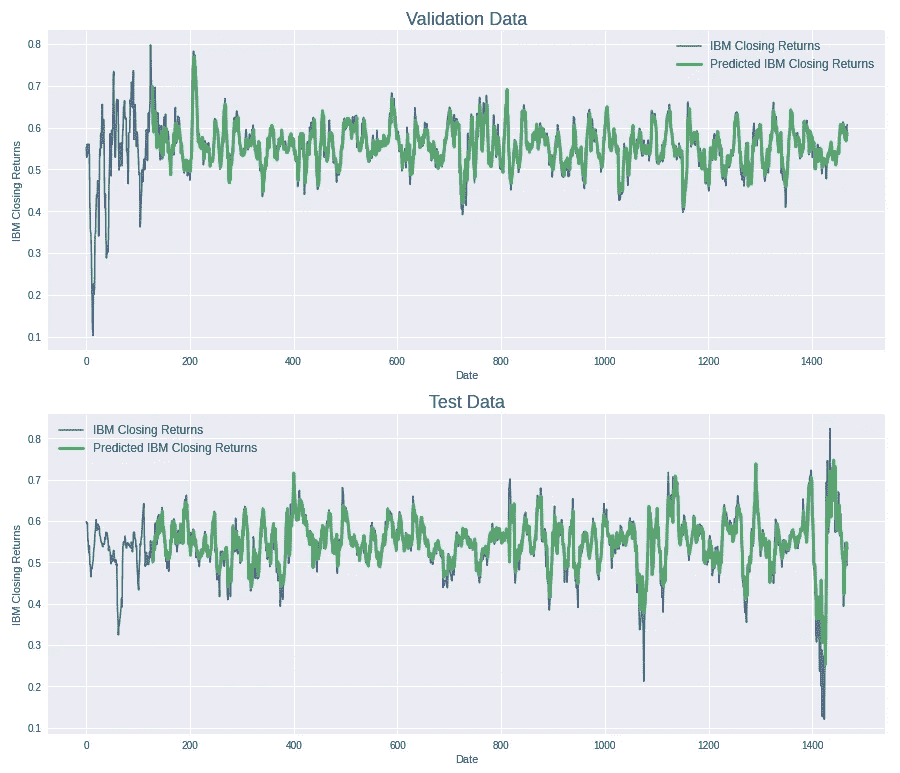**

**移动平均特征-验证和测试数据集+预测**

**然而，由于移动平均效果的平滑化，可以在不应用移动平均的情况下实现性能的提高。我的最新研究表明，当将数据集扩展到大量股票时，可以获得相同的表现。**

**本文给出的所有代码都是可以端到端运行的笔记本的一部分。笔记本可以在 [**GitHub**](https://github.com/JanSchm/CapMarket/blob/master/bot_experiments/IBM_Transformer%2BTimeEmbedding.ipynb) 上找到。**

*****来自《走向数据科学》编辑的提示:*** *虽然我们允许独立作者根据我们的* [*规则和指导方针*](/questions-96667b06af5) *发表文章，但我们并不认可每个作者的贡献。你不应该在没有寻求专业建议的情况下依赖一个作者的作品。详见我们的* [*读者术语*](/readers-terms-b5d780a700a4) *。***

> **谢谢你，**
> 
> **一月**

## **编辑于 2022 年 6 月 1 日:**

**在过去，我收到了一些反馈和请求，希望我的金融资产预测模型能够变得可用且易于使用。这将有助于人们回答以下问题:**

**有哪些好的资产可以投资？我应该把什么放入我的金融投资组合？**

> **我给你介绍一下**pink lion**www . pink lion . XYZ**

**[](https://www.pinklion.xyz/) [## 粉色狮子

### 我们把你从乏味和令人沮丧的工作中解脱出来。没有更多的清洁数据和模型试验和…

www.pinklion.xyz](https://www.pinklion.xyz/) 

PinkLion 是一款基于我的代码库之上的产品，它使成千上万只股票、基金/ETF 和加密货币的日常资产数据可用。此外，通过提供对基础预测模型的访问，它允许资产分析和投资组合的动态优化。

目前，注册人数仍然有限，因为单个计算需要大量的服务器资源。

请随意尝试并提供反馈。(目前还处于大致状态) [www.pinklion.xyz](http://www.pinklion.xyz)** 

# **放弃**

****本文中的任何内容都不构成任何特定证券、证券组合、交易或投资策略适合任何特定人士的建议。期货、股票和期权交易包含巨大的损失风险，并不适合每个投资者。期货、股票和期权的估值可能会波动，因此，客户的损失可能会超过他们的原始投资。****

# **参考**

**[1]为什么要自我关注？神经机器翻译架构的目标评估[https://arxiv.org/abs/1808.08946](https://arxiv.org/abs/1808.08946)**

**[2]伯特:语言理解深度双向转换器的预训练【https://arxiv.org/abs/1810.04805 **

**[3] Time2Vec:学习时间的向量表示法【https://arxiv.org/abs/1907.05321 **

**[4]你所需要的只是关注[https://arxiv.org/abs/1706.03762](https://arxiv.org/pdf/1706.03762.pdf)**