# 基于深度学习的股票价格预测

> 原文：<https://towardsdatascience.com/stock-price-prediction-based-on-deep-learning-3842ef697da0?source=collection_archive---------2----------------------->


照片由[杰米街](https://unsplash.com/@jamie452?utm_source=unsplash&utm_medium=referral&utm_content=creditCopyText)在 [Unsplash](/s/photos/stock-exchange?utm_source=unsplash&utm_medium=referral&utm_content=creditCopyText)

## 机器学习如何用于投资？

众所周知，如果人们能够破解*咒语*成功预测股票价格，股票市场就是一个可以发财的地方。尽管在大多数情况下不可能准确预测股票价格。所以，问题来了，如果人类可以估计并考虑所有因素来预测股票的走势或未来价值，为什么机器不能？或者，换句话说，我们如何让机器预测一只股票的价值？长期以来，全世界的科学家、分析师和研究人员一直在试图设计一种方法来回答这些问题。

在这篇文章中，我将尝试展示一种所谓的**算法交易**方法。这是一个完全基于研究目的的方法。请不要基于这种算法进行投资。那么，我们开始吧。

## 整个想法

股票价格可能取决于当前世界和股票市场中的几个因素。我们将尝试考虑两个主要因素的组合:

1.  其他公司股价的影响和相关性，即其他公司股价的涨跌如何影响特定目标公司的股价
2.  目标公司过去的业绩和记录

我看过几个博客，大多关注其中一个因素，主要是第二个因素。我认为，如果我们能设法将这两个因素都考虑进去，我们就能使我们的预测器更加可靠。

因此，我尝试使用三种深度学习模型的组合来实现这一点。首先，基于神经网络的回归模型考虑了其他公司对目标公司的影响。其次，一个递归神经网络模型来研究目标公司的过去行为并相应地给出结果。为此，我使用了 LSTM 层。最后，一个人工神经网络，接受他们的预测，并帮助达成一个坚定和稳健的结论。

## 资料组

在本文中，我们将使用标准普尔 500 公司数据库，尽管我只使用了 200 家公司的详细信息。我用网络清理从维基百科页面收集了 S&P 名单。我用这个作为一个来源，因为它是实时更新的。我在一些博客里看到过这个方法，所以我也用过。这似乎是一个可靠的来源。

```
import bs4 as bs
import pickle
import requestsdef save_tickers():
 resp=requests.get('[https://en.wikipedia.org/wiki/List_of_S%26P_500_companies'](https://en.wikipedia.org/wiki/List_of_S%26P_500_companies'))
 soup=bs.BeautifulSoup(resp.text)
 table=soup.find('table',{'class':'wikitable sortable'})
 tickers=[]
 for row in table.findAll('tr')[1:]:
  ticker=row.findAll('td')[0].text[:-1]
  tickers.append(ticker)with open("tickers.pickle",'wb') as f:
  pickle.dump(tickers, f)return tickerssave_tickers()
```

这个代码将帮助你放弃 500 强公司的股票。

然后我用熊猫网络数据阅读器从雅虎收集了他们的详细信息。

```
import bs4 as bs
import pickle
import requests
import datetime as dt
import os
import pandas as pd
import pandas_datareader.data as webdef fetch_data():
 with open("tickers.pickle",'rb') as f:
   tickers=pickle.load(f)if not os.path.exists('stock_details'):
  os.makedirs('stock_details')
 count=200start= dt.datetime(2010,1,1)
 end=dt.datetime(2020,6,22)
 count=0
 for ticker in tickers:
  if count==200:
   break
  count+=1
  print(ticker)

  try:
    df=web.DataReader(ticker, 'yahoo', start, end)
    df.to_csv('stock_details/{}.csv'.format(ticker))
  except:
    print("Error")
    continuefetch_data()
```

这段代码将有助于使用 web 阅读器从 Yahoo 收集数据。我保留了 200 个，因为我只想使用 200 个公司详细信息。在这 200 家公司中，我们将有一个目标公司和 199 家公司，这将有助于达成对我们的目标公司的预测。

该代码将生成一个“stock_details”文件夹，其中包含从 2010 年 1 月 1 日到 2020 年 6 月 22 日的 200 份公司详细信息。

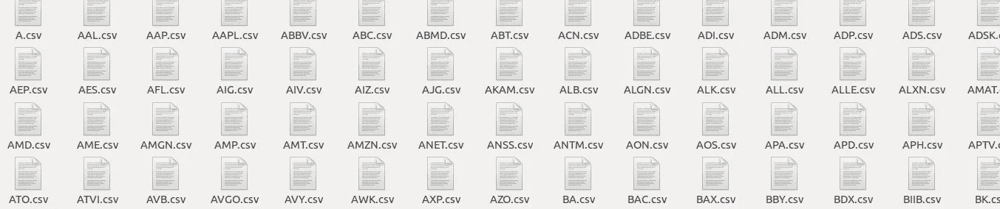

文件

每个细节文件都将被保存在它的股票代码中。我选择了亚马逊作为我的目标股票。因此，我将尝试预测亚马逊的股票价格。它的股票代码是 AMZN。

那么，让我们来看看细节文件的结构。

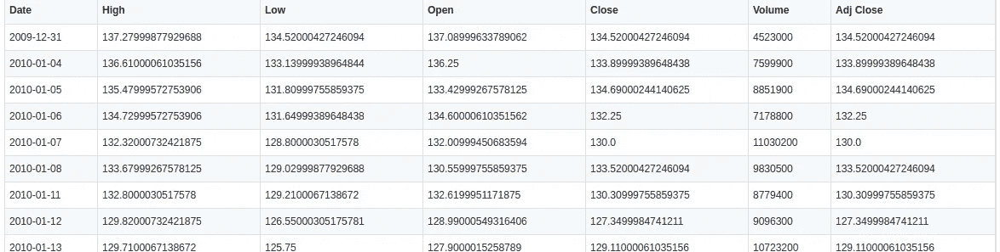

结构

这是结构。它将“日期”作为索引特征。“高”表示一天中的最高值。“低”表示最低。“开盘”是开盘价，“收盘”是当天的收盘价格。现在，有时公司会规定接近值。因此，最终值是“调整收盘”值，如果股票价格不受管制，它与“收盘”值相同。“交易量”是指该日该公司的股票交易量。

我们将把每只股票的这种“可调接近”价值视为每只股票对我们目标股票的贡献特征。因此，我们将把每只股票的 Adj Close 重命名为相应的股票代码，并将其包含在我们的特性集中。

```
import os
import pandas as pd
import pickledef compile():
 with open("tickers.pickle",'rb') as f:
   tickers=pickle.load(f)main_df=pd.DataFrame()for count,ticker in enumerate(tickers):
  if 'AMZN' in ticker:
   continue
  if not os.path.exists('stock_details/{}.csv'.format(ticker)):
   continue
  df=pd.read_csv('stock_details/{}.csv'.format(ticker))
  df.set_index('Date',inplace=True)df.rename(columns={'Adj Close': ticker}, inplace=True)
  df.drop(['Open','High','Low',"Close",'Volume'],axis=1,inplace=True)if main_df.empty:
   main_df=df
  else:
   main_df=main_df.join(df,how='outer')print(main_df.head())
 main_df.to_csv('Dataset_temp.csv')compile()
```

这个代码片段将帮助我们选择除了我们的目标股票 AMZN 之外的每只股票的调整后收盘列，将该列重命名为 ticker，并将其合并到我们的功能集中。

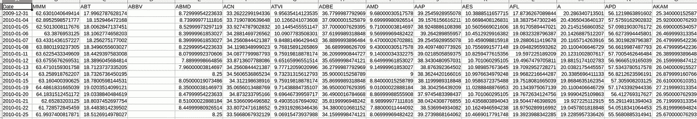

特征文件的结构

它会产生一个这样的特性集。日期是索引，与日期相对应的是每个收报机的“Adj Close”值。现在，我们将看到最初有几个空列。这是因为这些公司在 2010 年还没有开始参与股市。这将给我们一个包含 199 个公司值和日期的 200 列的特性集。

现在，让我们关注我们的目标股票 AMZN 股票。如果我们开始可视化目标股票的每个给定列值，我们将获得这些值。

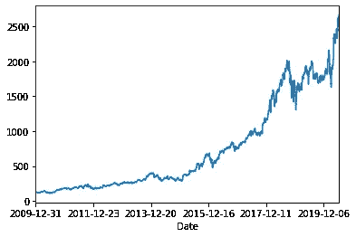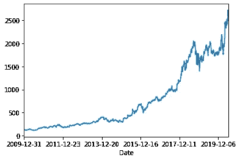

分别调整近、低和高可视化

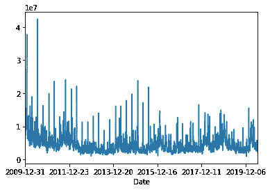

卷

现在，让我们用蜡烛线符号来想象我们的股票。我用的是熊猫 0.24.2 版本。可能存在一个问题，因为在当前版本中，此模块已被折旧。

```
import datetime as dt
import matplotlib.pyplot as plt
from matplotlib import style
from mpl_finance import candlestick_ohlc
import matplotlib.dates as mdates
import pandas as pd
df=pd.read_csv('stock_details/AMZN.csv',index_col=0,parse_dates=True)
df_ohlc= df['Adj Close'].resample('10D').ohlc()
df_volume=df['Volume'].resample('10D').sum()
df_ohlc.reset_index(inplace=True)
df_ohlc['Date']=df_ohlc['Date'].map(mdates.date2num)ax1=plt.subplot2grid((6,1), (0,0), rowspan=5, colspan=1)
ax2=plt.subplot2grid((6,1), (5,0), rowspan=1, colspan=1 , sharex=ax1)
ax1.xaxis_date()candlestick_ohlc(ax1,df_ohlc.values, width=2, colorup='g')
ax2.fill_between(df_volume.index.map(mdates.date2num),df_volume.values,0)plt.show()
```

这段代码将为我们提供烛台符号。

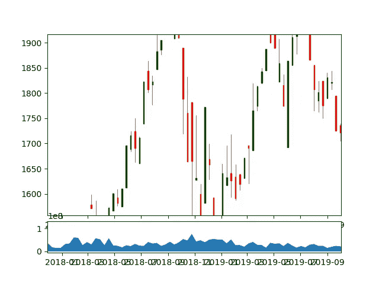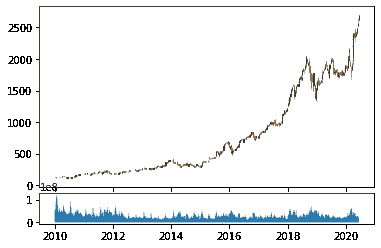

亚马逊股票的蜡烛棒符号

现在，让我们设计一些特征来帮助我们预测我们的目标。

我们将计算 50 移动平均线。这个特性被很多交易者用来做预测。

```
df['Moving_av']= df['Adj Close'].rolling(window=50,min_periods=0).mean()
```

这个片段将帮助我们生成移动平均线。实际上，它是第 I 个指数的“Adj Close”值的 i-50 到 I 值的平均值。

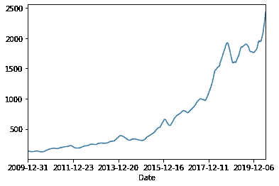

移动平均图

现在，我们将尝试获得另外两个特征，即我们股票的成交量增长率和调整后收盘价增长率

```
i=1
rate_increase_in_vol=[0]
rate_increase_in_adj_close=[0]while i<len(df):
    rate_increase_in_vol.append(df.iloc[i]['Volume']-df.iloc[i-1]['Volume'])
    rate_increase_in_adj_close.append(df.iloc[i]['Adj Close']-df.iloc[i-1]['Adj Close'])
    i+=1

df['Increase_in_vol']=rate_increase_in_vol
df['Increase_in_adj_close']=rate_increase_in_adj_close
```

这个片段将帮助我们获得这些特性。

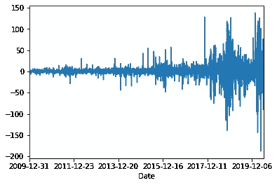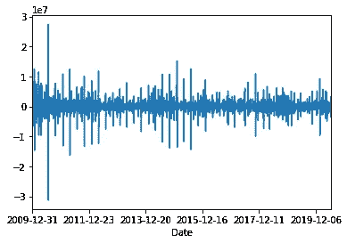

调整后收盘增长率和成交量增长率

现在，我们的目标股票的特征文件已经准备好了。

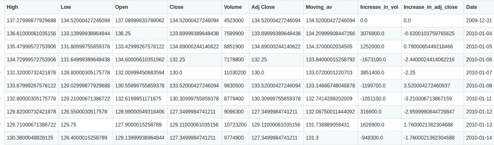

目标库存的特征文件结构

现在，我们将这两个特性文件合并成主特性集。

```
Index(['High', 'Low', 'Open', 'Close', 'Volume', 'Adj Close', 'Moving_av',
       'Increase_in_vol', 'Increase_in_adj_close', 'MMM',
       ...
       'FITB', 'FE', 'FRC', 'FISV', 'FLT', 'FLIR', 'FLS', 'FMC', 'F', 'Date'],
      dtype='object', length=207)
```

这些是我们主要特性集的列。

它有 207 列，其中 200 列来自其他公司列表，7 列来自我们的目标股票特性集，锚定在日期列上。所以，我们有 207 列。

## 回归

在这一部分，我们将研究其他股票对我们的目标股票的影响。我们将尝试预测亚马逊股票的最高价、最低价、开盘价和收盘价。

首先，让我们分析我们的数据。

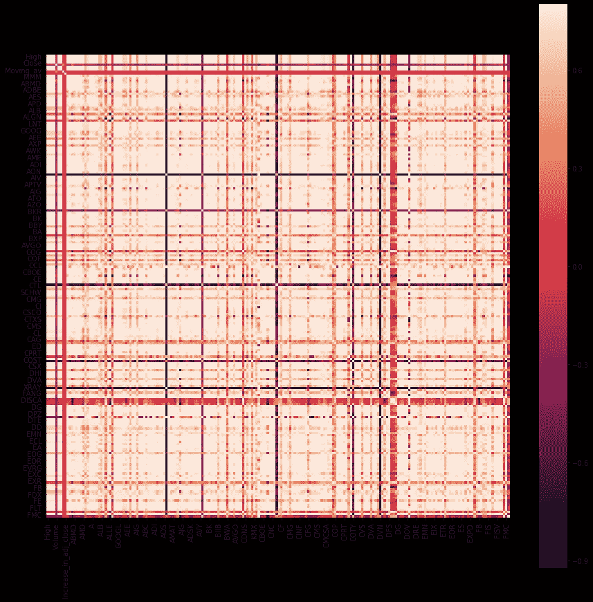

回归相关图。

在这里，我们可以看到我们已经发现了一些相关性。

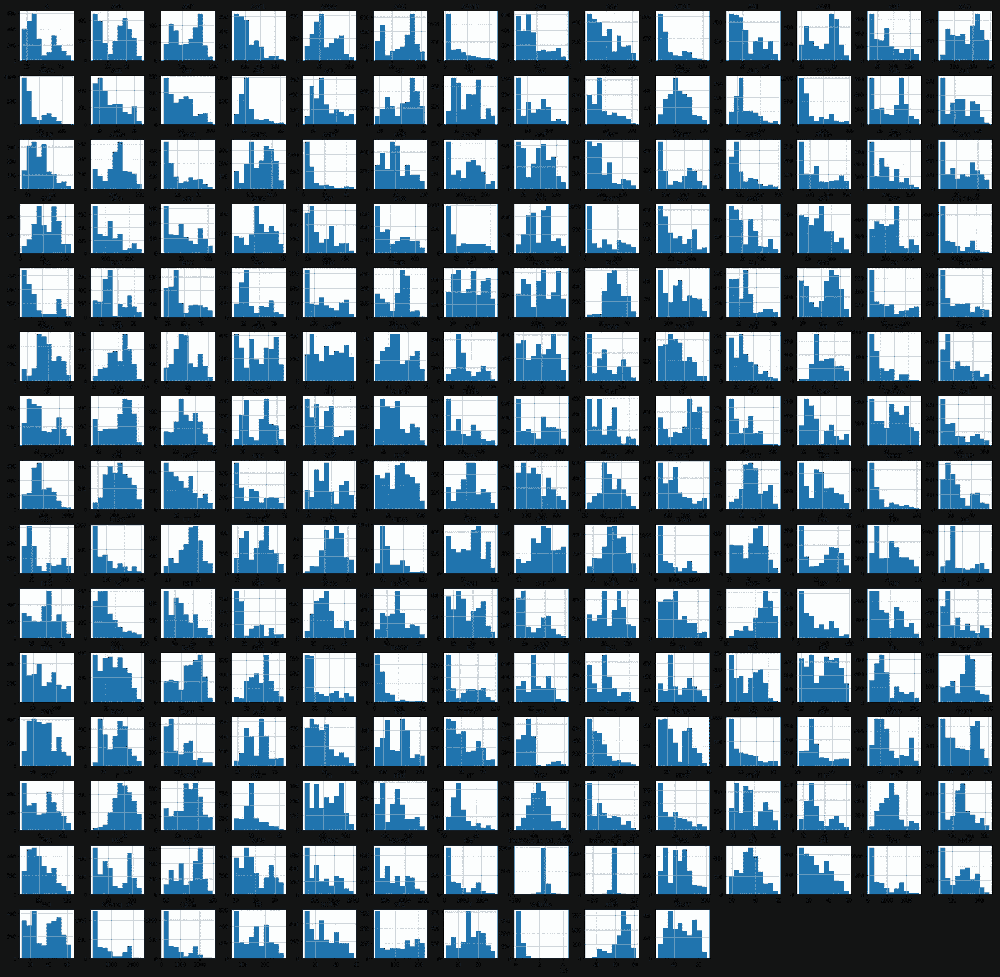

回归直方图。

因此，从我们的图来看，很明显，我们的数据集中会有一些相关性。因此，接下来，我们从训练数据集中删除开盘、收盘、盘高和盘低值，并将它们用作目标标签或值集。我们还删除了数量和日期，因为它们没有相关性。

```
from sklearn.model_selection import train_test_split
X_train, X_test, y_train, y_test = train_test_split(X, y, test_size=0.3)
```

我们把我们的组分成训练组和测试组。

```
from tensorflow.keras.callbacks import ModelCheckpoint
from tensorflow.keras.models import Sequential
from tensorflow.keras.layers import Dense, Activation, Flatten
from sklearn.model_selection import train_test_split
from sklearn.ensemble import RandomForestRegressor
from sklearn.metrics import mean_absolute_error 
from sklearn.metrics import accuracy_scoredef model():
    mod=Sequential()
    mod.add(Dense(32, kernel_initializer='normal',input_dim = 200, activation='relu'))
    mod.add(Dense(64, kernel_initializer='normal',activation='relu'))
    mod.add(Dense(128, kernel_initializer='normal',activation='relu'))
    mod.add(Dense(256, kernel_initializer='normal',activation='relu'))
    mod.add(Dense(4, kernel_initializer='normal',activation='linear'))

    mod.compile(loss='mean_absolute_error', optimizer='adam', metrics=['accuracy','mean_absolute_error'])
    mod.summary()

    return mod
```

这是我们将用于回归的模型。

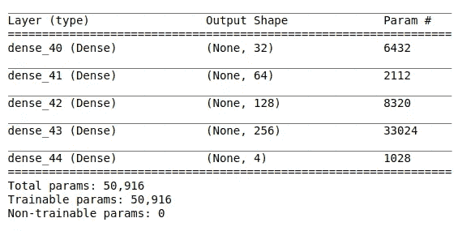

回归的模型摘要

可以使用以下代码片段运行它:

```
from tensorflow.keras.wrappers.scikit_learn import KerasRegressor
regressor = KerasRegressor(build_fn=model, batch_size=16,epochs=2000)
import tensorflow as tf
callback=tf.keras.callbacks.ModelCheckpoint(filepath='Regressor_model.h5',
                                           monitor='mean_absolute_error',
                                           verbose=0,
                                           save_best_only=True,
                                           save_weights_only=False,
                                           mode='auto')
results=regressor.fit(X_train,y_train,callbacks=[callback])
```

为此，我使用了 Keras 回归器。保存了最佳权重并使用了 2000 个纪元。平均绝对误差是我们的损失函数。删除列后，我们的输入为 200。我们将为每个输入获得四个值，高、低、开、闭。

```
y_pred= regressor.predict(X_test)
import numpy as np
y_pred_mod=[]
y_test_mod=[]for i in range(0,4):
    j=0
    y_pred_temp=[]
    y_test_temp=[]

    while(j<len(y_test)):
        y_pred_temp.append(y_pred[j][i])
        y_test_temp.append(y_test[j][i])
        j+=1

    y_pred_mod.append(np.array(y_pred_temp))
    y_test_mod.append(np.array(y_test_temp))
```

这给了我们测试集的预测值。这个代码片段有助于以解析的格式获取它们。

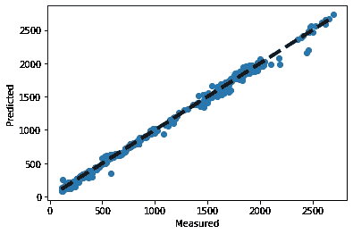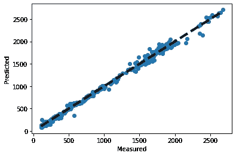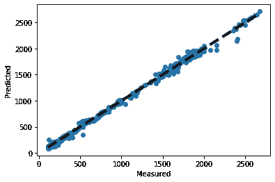

分别为高、低、开、闭的回归结果。

现在，我们可以看到我们的模型表现得相当好，考虑到大多数点位于回归线上，很少有异常值。

这里我们完成了回归部分。接下来，我们将移动到 RNN 部分。

## 递归神经网络

我们将使用 RNN 来分析我们的目标股票。所以我们将只使用目标库存特征文件。现在，这里我们将使用 LSTM 层的工作 RNN 原则，但工作在一个门控的方法。

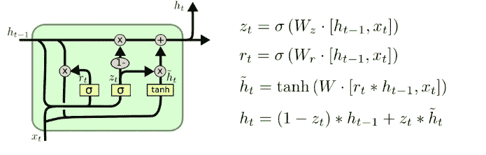

图片由 [Colah](https://colah.github.io/about.html)

LSTM 有助于 RNN 长时间保持记忆，解决渐变消失和爆炸问题。这里就不详细说了。详情[你可以在这里](https://colah.github.io/posts/2015-08-Understanding-LSTMs/)找到。

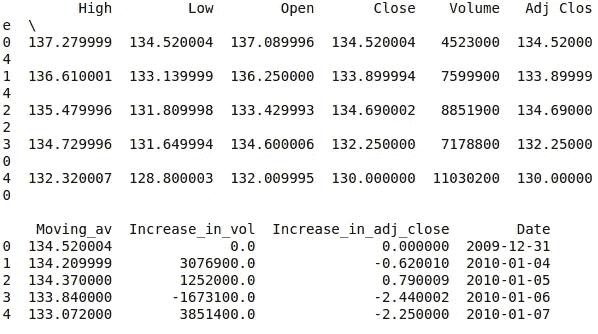

这是我们 LSTM 的数据集。

现在，我们需要预测高，低，开放，关闭。因此，现在，我们将删除“日期”,因为它没有相关性。

```
High         Low        Open       Close    Volume   Adj Close  \
0  137.279999  134.520004  137.089996  134.520004   4523000  134.520004   
1  136.610001  133.139999  136.250000  133.899994   7599900  133.899994   
2  135.479996  131.809998  133.429993  134.690002   8851900  134.690002   
3  134.729996  131.649994  134.600006  132.250000   7178800  132.250000   
4  132.320007  128.800003  132.009995  130.000000  11030200  130.000000       Moving_av  Increase_in_vol  Increase_in_adj_close  
0  134.520004              0.0               0.000000  
1  134.209999        3076900.0              -0.620010  
2  134.370000        1252000.0               0.790009  
3  133.840000       -1673100.0              -2.440002
```

现在，我们的输入将是这个数据帧的值。因此，我们的输入将有 9 列，相应地，我们的输出将有 4 列，高，低，开放，关闭我们的目标股票。

我们需要为 LSTM 模型创建训练和测试集。

为此，我们将把长度为 2636 条记录的数据分成两部分。我们将使用 0–2200 条记录作为训练集，2200–2636 条记录作为测试集。我们从我们的训练集中选择包含 4 个目标列的目标集。

```
df_train=df_main[:2200]
df_target=df_train[['High','Low','Open','Close']]
```

现在，我们缩放数据以使我们的模型易于收敛，因为我们的数据集中有大量不同的值。

```
sc = MinMaxScaler(feature_range = (0, 1))
target_set=df_target.values
train_set=df_train.values
training_set_scaled = sc.fit_transform(train_set)
target_set_scaled = sc.fit_transform(target_set)
```

这样，我们就获得了 LSTM 模型的定标数据。

LSTM 模型接受系列数据并产生输出。我们的 LSTM 是多对多的 RNN 模式。所以，我们需要为此产生一系列数据。为此，我们从第 50 个索引开始，并移动到训练集的长度。我们在列表中添加了 0–49，即 50 个值。我们已经为我们所有的功能创建了这样的列表。

因此，我们的输入有(n x 50 x 9)维数据用于我们的训练集。我们有 9 个特性，每个特性都是 50 天的特性值列表。n 是从给定数据集获得的此类序列的数量。现在，我们的目标集是第 51 天目标列的值。

我们通过使用，

```
X_train = []
y_train = []
for i in range(50,len(train_set)):
    X_train.append(training_set_scaled[i-50:i,:])
    y_train.append(target_set_scaled[i,:])

X_train, y_train = np.array(X_train), np.array(y_train)
```

现在，让我们观察火车和目标组的形状。

```
print(X_train.shape)(2150, 50, 9)print(y_train.shape)(2150, 4)
```

让我们设计我们的模型。

```
from sklearn.metrics import accuracy_score
from tensorflow.keras.layers import BatchNormalization
import datetime as dt
from sklearn import model_selection
from sklearn.metrics import confusion_matrix
from sklearn.preprocessing import StandardScaler
from sklearn.model_selection import train_test_split
import numpy as np
import pandas as pd
from sklearn.preprocessing import MinMaxScaler
from tensorflow.keras.models import Sequential
from tensorflow.keras.layers import Dense
from tensorflow.keras.layers import LSTM
from tensorflow.keras.layers import Dropoutdef model():
    mod=Sequential()
    mod.add(LSTM(units = 64, return_sequences = True, input_shape = (X_train.shape[1], 9)))
    mod.add(Dropout(0.2))
    mod.add(BatchNormalization())
    mod.add(LSTM(units = 64, return_sequences = True))
    mod.add(Dropout(0.1))
    mod.add(BatchNormalization())

    mod.add((LSTM(units = 64)))
    mod.add(Dropout(0.1))
    mod.add(BatchNormalization())
    mod.add((Dense(units = 16, activation='tanh')))
    mod.add(BatchNormalization())
    mod.add((Dense(units = 4, activation='tanh')))
    mod.compile(loss='mean_squared_error', optimizer='adam', metrics=['accuracy','mean_squared_error'])
    mod.summary()

    return mod
```

这是我们的 LSTM 模型。我在这里用过 Keras 层。损失函数是均方误差。我们已经使用了亚当优化。

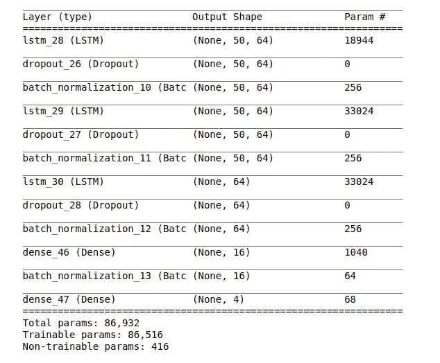

LSTM 模型形状

为了训练我们的模型，我们将使用这个片段。

```
import tensorflow as tf
callback=tf.keras.callbacks.ModelCheckpoint(filepath='./RNN_model.h5',
                                           monitor='mean_squared_error',
                                           verbose=0,
                                           save_best_only=True,
                                           save_weights_only=False,
                                           mode='auto',
                                           save_freq='epoch')
RNN_model.fit(X_train, y_train, epochs = 2000, batch_size = 32,callbacks=[callback])
```

我们的模型现在已经训练好了。

让我们专注于测试部分。

我们的测试值有 2200 到 2636 条记录。因此，我们通过选择股票的开盘价、收盘价、最高价、最低价这四列来获得目标值。

```
df_test=df_main[2200:]
df_target_test=df_test[['High','Low','Open','Close']]
target_set_test=df_target_test.values
test_set=df_test.values
```

为了进行测试，我们还需要转换我们的测试特征数据集，并为该数据集形成一系列 50 个特征值，就像我们在训练集的情况下所做的那样。

```
predicted_stock_price = RNN_model.predict(X_test)
predicted_stock_price = sc.inverse_transform(predicted_stock_price)
print(predicted_stock_price)
```

这个代码片段有助于获得我们想要的预测结果。

```
array([[1690.364 , 1610.5382, 1643.4277, 1643.8912],
       [1687.384 , 1607.5323, 1640.3225, 1640.7366],
       [1688.7346, 1608.965 , 1641.6777, 1642.0984],
       ...,
       [2567.6138, 2510.703 , 2522.8406, 2538.787 ],
       [2576.5056, 2519.5195, 2531.803 , 2547.9304],
       [2578.5886, 2521.65  , 2533.9177, 2550.0896]], dtype=float32)
```

结果就是这样获得的。

现在，如果我们用目标列的实际值相应地绘制它们，我们将获得下面的图。

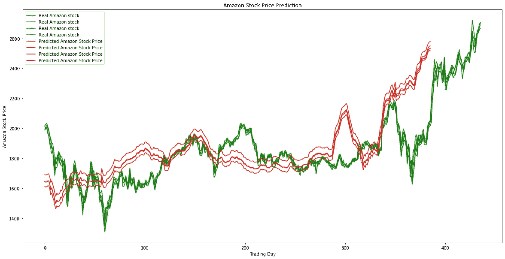

LSTM 取得了成果

如果我们观察，有 4 行，这是因为我们有 4 列作为目标。我们可以看到模型在大部分地方获得了曲线模式。

现在，如果我们分别绘制它们，我们将获得如下 4 幅图。

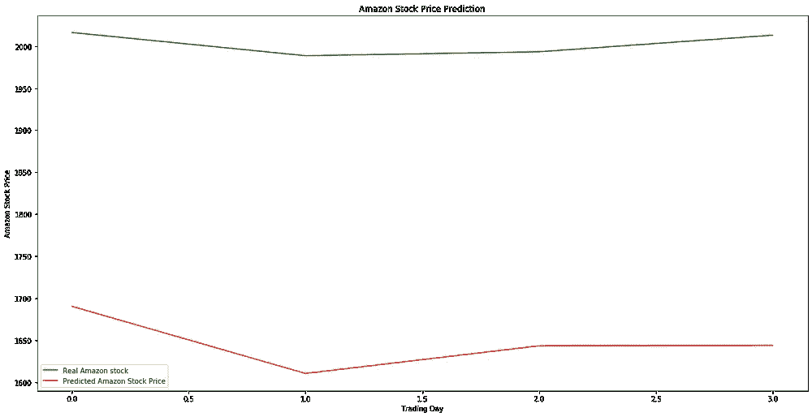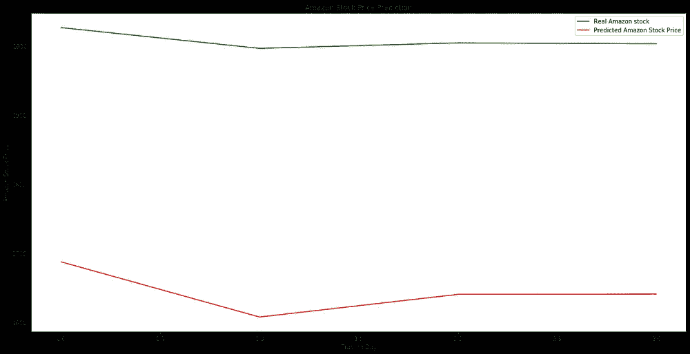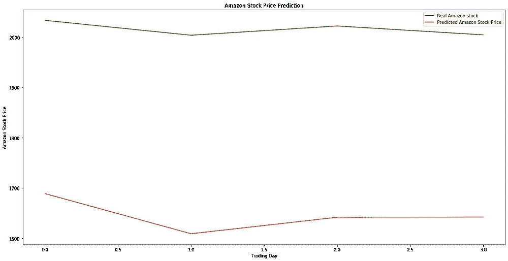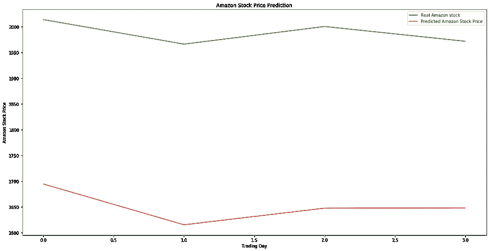

RNN 的高、低、开和关

因此，我们使用 LSTM，基于股票的过去价值来结束对单个目标股票的研究。现在，我们转到封面或结论部分。

## 覆盖人工神经网络

现在，这是结论部分。我们使用两个排他性模型研究了可能影响公司股票的两个不同领域，得出了两个不同的结果。现在，我们将尝试合并两个结果。我们将通过合并获得的结果并在整个过程中训练我们的人工神经网络来做到这一点。

对于上面讨论的两个模型，我们有 4 个目标列。对于最后的结论，我们将尝试只预测两列，我们的目标股票的高点和低点。

因此，为此，我们使用这两种模型来预测我们的完整数据集。回归模型产生 2636 个预测值。

代码片段和结果如下:

```
saved_model_regressor=tf.keras.models.load_model('Regressor_model.h5')
Regressor_prediction=saved_model_regressor(X)
import numpy as np
y_pred_mod=[]for i in range(0,4):
    j=0
    y_pred_temp=[]

    while(j<len(Regressor_prediction)):
        y_pred_temp.append(Regressor_prediction[j][i])

        j+=1

    y_pred_mod.append(np.array(y_pred_temp))
Y_pred=pd.DataFrame(list(zip(y_pred_mod[0],y_pred_mod[1],y_pred_mod[2],y_pred_mod[3])),columns=['High_regress','Low_regress','Open_regress','Close_regress'])
```

这是片段。它创建一个长度为 2636 的数据帧，包含四个预测值列。

```
Y_pred.head()
```

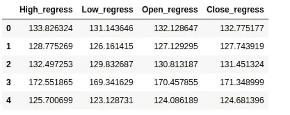

我们将其保存为 CSV 格式以备将来使用。

现在，类似地，我们为 LSTM 网络做这个。我们为前 50 个值获取一个值，因为前 50 个值是我们的第一个测试集。因此，除法是 0–49 获得第一个值，1–50 获得第二个值，依此类推。我们从 RNN 总共获得了 2586 个值。

片段:

```
saved_model_RNN=tf.keras.models.load_model('RNN_model.h5')
RNN_prediction=saved_model_RNN.predict(X_test)
import numpy as np
y_pred_mod=[]for i in range(0,4):
    j=0
    y_pred_temp=[]

    while(j<len(RNN_prediction)):
        y_pred_temp.append(RNN_prediction[j][i])

        j+=1

    y_pred_mod.append(np.array(y_pred_temp))
Y_pred=pd.DataFrame(list(zip(y_pred_mod[0],y_pred_mod[1],y_pred_mod[2],y_pred_mod[3])),columns=['High_RNN','Low_RNN','Open_RNN','Close_RNN'])
```

该代码片段使用目标值的 RNN 预测生成一个数据帧。

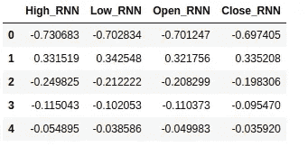

我们对两个模型的预测都准备好了。我们需要从回归预测中删除 0–50 指数，因为这些值没有 RNN 预测。我们现在准备合并结果。

因此，在合并结果之后，我们获得了具有 8 列的 2586 个值的数据帧。

```
df**=**pd.concat([df1,df2],axis**=**1)df.head()
```

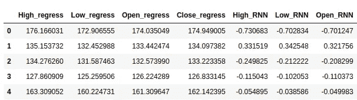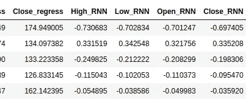

这是连接的结果。

整个事情将成为我们的人工神经网络模型的特征集。那么，我们的目标是什么？我们的目标集合将由原始数据集中亚马逊目标股票的原始高值和低值组成。

```
df1=pd.read_csv("dataset_target_2.csv")
target_high=[]
target_low=[]
i=50
while i<len(df1):
    target_high.append(df1.iloc[i]['High'])
    target_low.append(df1.iloc[i]['Low'])
    i+=1
df['Target_high']=target_high
df['Target_low']=target_lowdf.to_csv('feature.csv',index=False)
```

这个代码片段有助于合并我们特性集中的所有列。有 10 列。来自两个模型的 8 个特征列和目标股票的高低值作为目标值。

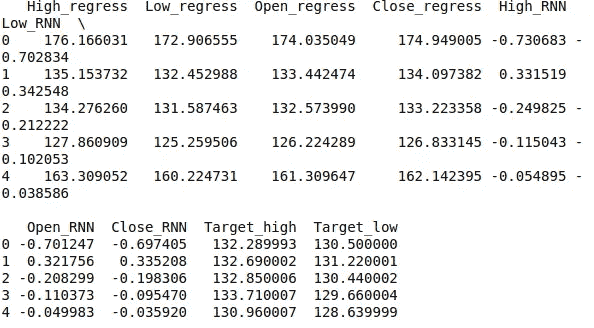

我们的新特性集如下所示。

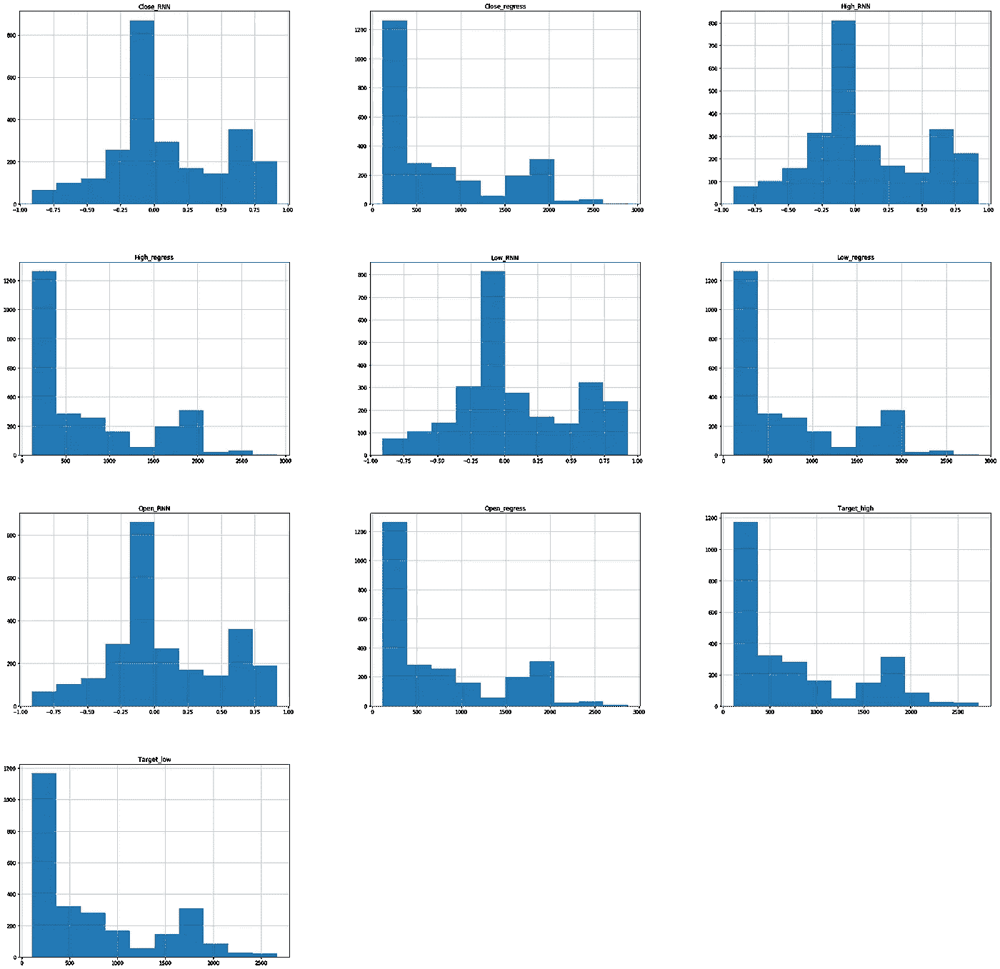

这是我们的特征直方图。这里，我们也从图中得到了很好的相关性。现在让我们设计和训练我们的人工神经网络模型。

```
X_Df=df_main[['High_regress','Low_regress','Open_regress','Close_regress','High_RNN','Low_RNN','Open_RNN','Close_RNN']].values
y_Df=df_main[['Target_high','Target_low']].values
from sklearn.model_selection import train_test_split
X_train, X_test, y_train, y_test = train_test_split(X_Df, y_Df, test_size=0.3)
```

现在，让我们看看我们的模型设计。

```
from tensorflow.keras.callbacks import ModelCheckpoint
from tensorflow.keras.models import Sequential
from tensorflow.keras.layers import Dense, Activation, Flatten
from sklearn.model_selection import train_test_split
from sklearn.ensemble import RandomForestRegressor
from sklearn.metrics import mean_absolute_error 
from sklearn.metrics import accuracy_scoredef model():
    mod=Sequential()
    mod.add(Dense(32, kernel_initializer='normal',input_dim = 8, activation='relu'))
    mod.add(Dense(64, kernel_initializer='normal',activation='relu'))
    mod.add(Dense(128, kernel_initializer='normal',activation='relu'))
    mod.add(Dense(2, kernel_initializer='normal',activation='linear'))

    mod.compile(loss='mean_absolute_error', optimizer='adam', metrics=['accuracy','mean_absolute_error'])
    mod.summary()

    return mod
```

这是我们的人工神经网络模型。正如我们看到的，我们模型的输入维度是 8。这是因为我们输入了 8 个特征列，其中 4 列来自每个模型的输出。输出层有两个节点，分别用于目标股票的高低栏。

我使用损失函数作为平均绝对误差，优化器作为亚当的优化器。

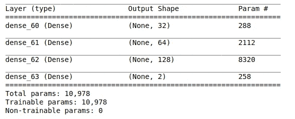

我们可以使用下面的代码片段运行模型:

```
import tensorflow as tf
model_ANN=model()
callback=tf.keras.callbacks.ModelCheckpoint(filepath='ANN_model.h5',
                                           monitor='mean_absolute_error',
                                           verbose=0,
                                           save_best_only=True,
                                           save_weights_only=False,
                                           mode='auto')
results=model_ANN.fit(X_train,y_train, epochs = 2000, batch_size = 32,callbacks=[callback])
```

在我们训练模型之后，我们将使用预测的模型来预测我们的测试集并检查性能。

```
y_pred=model_ANN.predict(X_test)
import numpy as np
y_pred_mod=[]
y_test_mod=[]for i in range(0,2):
    j=0
    y_pred_temp=[]
    y_test_temp=[]

    while(j<len(y_test)):
        y_pred_temp.append(y_pred[j][i])
        y_test_temp.append(y_test[j][i])
        j+=1

    y_pred_mod.append(np.array(y_pred_temp))
    y_test_mod.append(np.array(y_test_temp))
df_res=pd.DataFrame(list(zip(y_pred_mod[0],y_pred_mod[1],y_test_mod[0],y_test_mod[1])),columns=['Pred_high','Pred_low','Actual_high','Actual_low'])
```

我们的预测器为每个特征记录预测两个值。因此，这个代码片段有助于获得两列的预测值和测试值，并将它们表示为 Dataframe。

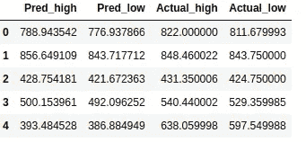

现在，让我们绘图并检查。

```
import matplotlib.pyplot as pltax1=plt.subplot2grid((4,1), (0,0), rowspan=5, colspan=1)ax1.plot(df_res_2.index, df_res_2['Pred_high'], label="Pred_high")
ax1.plot(df_res_2.index, df_res_2['Actual_high'], label="Actual_high")plt.legend(loc="upper left")
plt.xticks(rotation=90)plt.show()
```

这个片段有助于查看预测的和实际的变化。

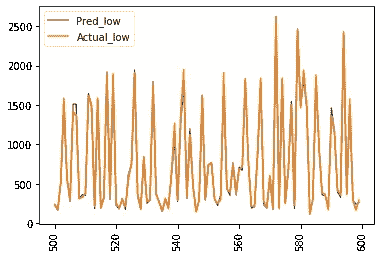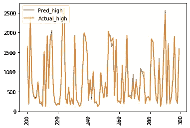

我们目标设定变化的高低。

如果我们想检查我们的模特表演。我们可以通过使用下面的代码片段来做到这一点:

```
fig, ax = plt.subplots()
ax.scatter(y_test_mod[0], y_pred_mod[0])
ax.plot([y_test_mod[0].min(),y_test_mod[0].max()], [y_test_mod[0].min(), y_test_mod[0].max()], 'k--', lw=4)
ax.set_xlabel('Measured')
ax.set_ylabel('Predicted')
plt.show()
```

这将获得:

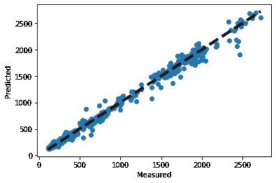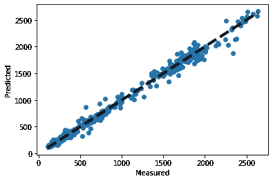

我们模型的低柱和高柱。

这些线性图表明，我们的模型预测值和实际值之间存在线性关系。

因此，我们的复合模型在预测我们的目标亚马逊股票的高低列值方面做得相当好。因此，我们在这里结束了我们的整个目的。

## 结论

在本文中，我们看到了如何基于复合神经网络构建算法交易模型。希望这篇文章能有所帮助。

整个 Github 代码是:[这里](https://github.com/abr-98/Stock_prediction_hybrid_model)。

请在这里找到关于这个主题的进一步任务:。