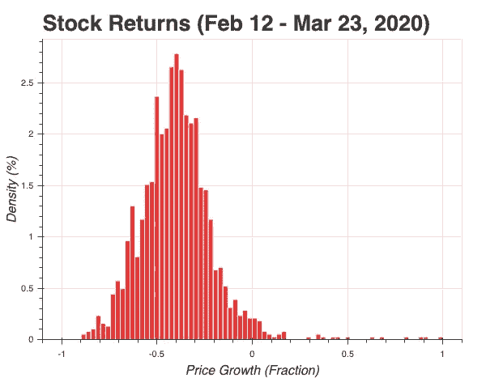
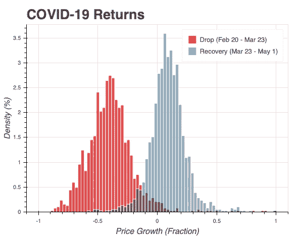

# 从新冠肺炎恢复的股票。机器学习来解释。

> 原文：<https://towardsdatascience.com/stocks-that-recovered-from-covid-19-machine-learning-comes-to-explain-ba712f62456d?source=collection_archive---------61----------------------->

[图片](https://stock.adobe.com/ca/images/rescued-from-drowning/218368808)由[凯文·卡登](https://stock.adobe.com/ca/contributor/202915633/kevin-carden?load_type=author&prev_url=detail)拍摄

## 亨尼投资

## 使用机器学习来识别新冠肺炎崩盘后恢复正常的股票中的共同因素。

***编者按:*** [*走向数据科学*](http://towardsdatascience.com/) *是一份以数据科学和机器学习研究为主的中型刊物。我们不是健康专家或流行病学家，本文的观点不应被解释为专业建议。想了解更多关于疫情冠状病毒的信息，可以点击* [*这里*](https://www.who.int/emergencies/diseases/novel-coronavirus-2019/situation-reports) *。*

在这篇文章中，我使用机器学习来研究像所有其他公司一样受到新冠肺炎打击的公司，这些公司现在已经恢复正常，而不像其他许多公司。为了更好地说明发生了什么，让我们来看看最近市场最动荡时期的标准普尔 500 指数。

这场新冠肺炎崩盘结束了长达十年的牛市，股价在 2020 年 2 月 20 日至 3 月 23 日之间下跌了 33%。虽然这次衰退对股票市场有整体的负面影响，但并不是所有的公司都受到同样的影响。以下是 **1500+** 美国上市公司在此期间的股票市场回报率分布。

[源代码](https://www.google.ca/finance)

在 X 轴上，我显示了 2020 年 2 月 20 日至 2020 年 3 月 23 日之间的价格增长。在 Y 轴上，我显示了报告增长的公司的百分比。

我们可以看到大多数公司出现负增长。分布看起来**正态**，平均值在 **-33%** 左右，在正回报范围内有一些异常值。一个**的好机会**出现在识别那些受到不公正打击的公司上。随着投资者开始恐慌并从市场上撤资，几乎所有公司的股价都下跌了。一旦**恐慌结束**，市场开始逐渐**自我修正**(一如既往)，在**新冠肺炎骚乱**之前定价合理的公司开始回到它们最初的价格水平，把那些应该修正的公司留在后面。

下图描绘了新冠肺炎危机**下降**和**复苏**阶段(截至 2020 年 5 月 1 日)的回报率。

[源代码](https://www.google.ca/finance)

直方图中的**下降**数据来自之前的图。**恢复**数据显示了 2020 年 3 月 23 日至 5 月 1 日市场触底后的回报率。与 2020 年 3 月 23 日相比，报告了**恢复**回报。这一点很重要，因为**下降**返回 **-50%** 和**恢复**返回 **50%** 是不一样的。例如，**下降**50%可能代表价格从二月份的 200 美元下降到三月份的 100 美元。在这种情况下，50%的回报率意味着从 3 月份的 100 美元涨到 5 月份的 150 美元，可以弥补一半的损失。

# 财务数据

在这项研究中，我使用的是来自 www.vhinny.com 的阿尔法数据集，它提供了 T42 的基本财务数据，包括过去八年的资产负债表、损益表和现金流量表。我还使用免费的 alpha vantage API 来访问每日股票价格。

# 问题陈述

在这项研究中，我希望找出那些在价格被新冠肺炎修正的**压低**后**迅速恢复**的公司背后的驱动因素。了解这些驱动因素会为那些希望在未来保护自己并利用这一机会的投资者增加价值。更具体的问题陈述如下:

> 找出在 2020 年 2 月 20 日至 3 月 23 日期间股价下跌至少 25%，在 3 月 23 日至 5 月 1 日期间股价上涨至少 25%的公司。

# 方法学

有很多方法可以解决这个问题，从**无监督聚类**到**预测建模**。我在这里使用的方法利用了预测建模的优势。我的目标不是训练一个预测未来衰退的模型。相反，我的目标是**了解过去**。带着这个目标，我发现简单的**决策树**分解是这项工作的最佳方法。

**决策树**因过度拟合训练数据而臭名昭著。由于这一特性，它们几乎从未用于预测建模，从而产生了**随机森林**和 **XGBoost** 。然而，与其他算法不同的是，**决策树**提供了对其决策过程的准确可见性，向研究人员展示了决策是如何做出的。

我把这个问题框定为一个分类任务，把那些价格下跌至少 25%的公司贴上标签，然后 T21 上涨至少 25%。数据中只有 **10%** 的公司符合这个条件。然后，我用以下参数拟合一个**决策树**:

*   最大深度:10
*   一片叶子上的最小样本数:5
*   最大叶节点数:10

因为我的目标是**解释过去**而不是预测未来，所以我没有像在典型的预测机器学习问题中那样将数据分成**训练和验证**组。我使用的参数也不是区分正反例的最佳参数。相反，我为**选择的参数将问题**限制在易于解释的范围内。这样，稍微牺牲一下性能，我就可以确定并可视化数据中的**基本趋势**，这正是我所寻找的。

# 实施情况和结果

下图显示了一个**决策树**，适合识别在 2 月 20 日至 3 月 23 日期间股价下跌至少 25%且在 2020 年 3 月 23 日至 5 月 1 日期间股价上涨至少 25%的公司。

[源代码](https://www.google.ca/finance)

这个决策树适合 1500 多家美国**上市公司**的**基本财务数据**。每个节点都有一个标签(类)，根据该节点上的大多数示例，将每个节点分类为正节点或负节点。我使用**红-白-蓝**的配色方案来帮助形象化每个节点上积极和消极的平衡。纯红色表示绝大多数例子都是正面的。纯蓝色表示大多数示例都是负面的。随着正面和负面例子的比例趋于相等，颜色变得更加淡化。如果正例的数量等于负例的数量，a 变成白色(**全透明**)。箭头表示基于节点本身记录的条件的分割。**左箭头**将符合条件的示例分开，不符合条件的示例留给**右箭头**。

# 全球趋势

[源代码](https://www.google.ca/finance)

该模型确定的最重要的分割是**市值**。它的第一个决定是隔离市值≥1 . 2 亿美元的公司。值得注意的是，它没有进一步追踪**中盘** **中盘**和**大盘**股票，只留下了**右盘**的 990 个负面例子和 77 个正面例子(150 个中)。虽然模型已经决定在第一次分割时将 65%的数据标记为阴性，但这并不意味着没有办法正确地识别右边叶子上的那些 **77** **阳性样本**。这意味着，考虑到我在**决策树**(参数)上设置的限制，识别它们并不是最佳选择。相反，给定**左叶中的约束，它有更好的机会优化目标。**

# 正叶

[源代码](https://www.google.ca/finance)

左分支有**六(6)个正节点。这些节点中的每一个都有自己独特的路径(一组条件)，投资者必须应用这些路径才能到达那里。通过阐述每条道路背后的故事，可以推断出总体趋势。**

# 国际风险和资本负债的变化

[源代码](https://www.google.ca/finance)

一旦公司被缩小到小盘股，汇率的**效应**就被确定为下一个分割点。鉴于数据的性质，**因**汇率**赚了多少钱**因**损失了多少钱**可能并不重要，重要的是一家公司是否在国际化经营，是否受到汇率的影响。在**有汇率风险**(国际化经营)并报告营运资本负债增加超过**400 万美元的公司中，发现了小盘股中的**正叶**。**营运资本负债的变化是现金流量表营运现金流部分的一部分。它本身并不具有很强的指示性，因为它通常由算法**未识别的**运营资产**的变化来平衡。从这里我唯一能得出的结论是公司的资产负债表上有些变化。**

# 债务

[源代码](https://www.google.ca/finance)

沿着上一节开始的道路，跟踪营运资本负债变化≤ **、400 万美元、**的公司，我们发现自己处于评估公司**债务偿还**的节点。虽然在不知道一家公司有多少债务的情况下评估债务偿还具有挑战性，但是评估债务与股本比率更加简单。**债转股**节点有 11 家公司，11 家中有 6 家为正。在这些积极的公司中，有五(5) 家公司的资产负债率超过 5%。这是一个有些违反直觉的结论，因为好公司通常被描述为负债较少的公司。然而，5%可能**好得令人难以置信**，因为它表明该公司几乎完全由股权出资，或者在其报告中有不寻常的事情**。追求 **5%+** 的负债权益比率，在这个节点上，我们得到了 6 个正面例子中的 5 个。**

# **超越破产**

****

**[源代码](https://www.google.ca/finance)**

**另一个**正叶**标识没有有形**国际风险**且具有负**Z1**破产分数的公司(例如，财务状况不佳)。在这种情况下，11 家库存增长至少达到 28 万美元的公司中，有 8 家被正确标记为积极。这一观察表明，投资者可能会将不断增长的库存视为新业务的迹象，尽管财务表现不佳，但仍会支持该公司。**

**另一个 leaf 列出了在上一个财政年度已经出售**价值**超过**价值**的**33 亿美元证券的公司。由于没有关于他们购买了什么的信息，因此很难合理解释它产生了什么样的净效应。鉴于这一条件正确地识别了 6 个正面例子中的 4 个，一种假设可能是这些公司在新冠肺炎让 T21 贬值之前抛售了证券，使得这些公司有足够的现金来获得投资者的信任。****

# ****结论****

**在这篇文章中，我分析了 1500 多家美国上市公司的财务状况，这些公司在 2 月 20 日至 3 月 23 日期间股价至少下跌了 25%，在 2020 年 3 月 23 日至 5 月 1 日期间股价至少上涨了 25%。我的发现表明，在**小盘股**中可能会发现相对**简单的关系**。小盘股中的**无负债**表现出违反直觉的关系，在 **5%左右划出一个**负债权益比**的界限。几乎所有低于 5%** **负债权益比**的公司的股价都没有那些高于 5%负债权益比的公司恢复得快。尽管财务表现不佳，但在上一个财年增加库存的公司能够迅速恢复股价。从上一财年**出售证券**中获得**有形收益**的公司也表现出**快速复苏**。**

**请在此找到支持本研究[的代码。](https://github.com/vhinny-investing/codebase)**

**感谢阅读我的文章！如果你喜欢，你可能想看看这个:**

** [## 新冠肺炎在股票市场上横冲直撞。机器学习来解释。

### 使用机器学习来识别新冠肺炎期间受打击最大的股票中的共同因素。

towardsdatascience.com](/covid-19-rampage-on-the-stock-market-machine-learning-comes-to-explain-3332707954af) 

# 我们连线吧！

我很高兴与和我有共同道路的人联系，这是对财务独立的追求。如果你也在寻求经济独立，或者你想和 T2 合作，交流想法，请随时联系我们！以下是一些可以找到我的地方:

*   【www.vhinny.com——投资研究平台，为您自己的分析提供金融数据
*   [https://www.linkedin.com/company/vhinny](https://www.linkedin.com/company/vhinny)——加入我们在 LinkedIn 上的社区，在那里我和其他贡献者分享与投资相关的内容

干杯！**