# “通用”数据科学生命周期

> 原文：<https://towardsdatascience.com/stoend-to-end-data-science-life-cycle-6387523b5afc?source=collection_archive---------5----------------------->

## 逐步分析:从业务理解到模型监控

安特·罗泽茨基在 [Unsplash](/s/photos/office?utm_source=unsplash&utm_medium=referral&utm_content=creditCopyText) 上的照片

为了使数据科学生命周期成功，很好地理解每个部分并区分所有不同的部分非常重要。具体来说，理解 ***开发阶段*** 与 ***部署阶段*** 之间的区别非常重要，因为它们在业务方面有不同的需求需要满足。

大多数数据科学项目都有类似的工作流/结构，您可以使用它们来构建您的项目。下面的生命周期概述了数据科学项目通常经历的主要阶段。它从来都不是一个线性的过程，尽管它会反复运行多次，以试图获得尽可能好的结果，一个既能满足客户又能满足业务的结果。

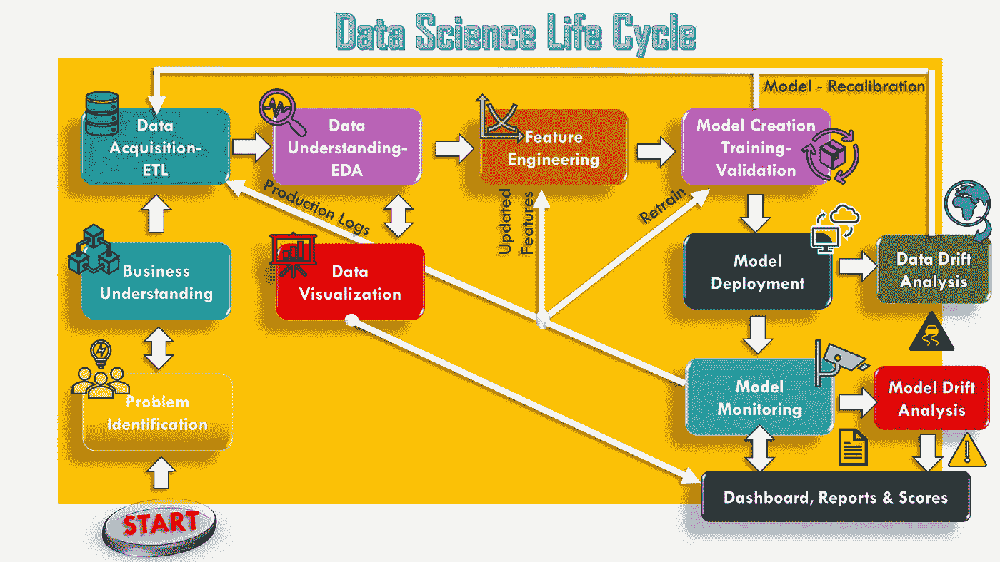

数据科学生命周期(图片由作者提供)

水平线代表典型的机器学习生命周期看起来像是从数据收集开始，到特征工程到模型创建: ***模型开发阶段*** 。左边的竖线代表任何类型项目的初始阶段:问题识别和业务理解，而右边的竖线代表 ***模型部署阶段*** 的所有方面。现在，事不宜迟，让我们去找出每个阶段。

# 问题识别:

像任何问题一样，首先要讨论的是所有业务场景的问题识别，这是我们:

1.  通过识别真正的潜在问题，清楚地识别问题的根本原因。
2.  制定详细的问题陈述，包括问题对目标客户/顾客的影响。

你是如何发现问题的？

我们通过收集信息，然后与利益相关者和行业专家交谈来确定问题的根本原因。接下来，*合并现有的研究和来自利益相关者的信息*可以提供一些对问题的洞察和可能的高级解决方案。考虑可以帮助您更清楚地定义问题的数据源。从做**文献回顾**开始，如有必要，在数据科学界进行调查。

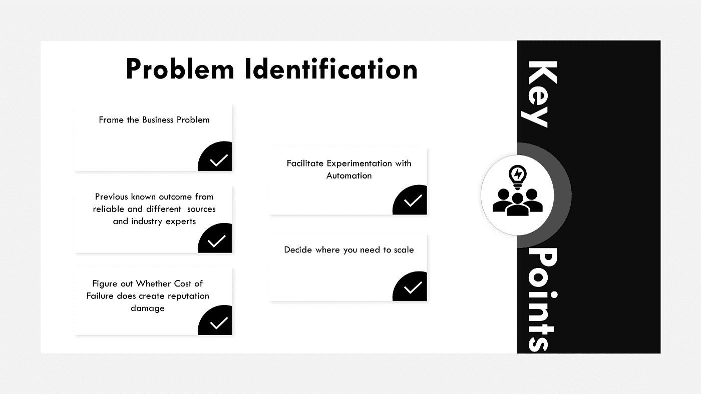

问题识别总结(图片由作者提供)

# 业务理解:

这是定义业务问题的地方，理解业务问题是提出一个好模型的关键，因为它使你理解业务目标。

例如，如果您是信用卡客户，您希望确保我承保可能付款的客户，或者另一个客户可能会发现欺诈客户，因此目的可以是降低风险，同时增加收入。

现在我们已经有了业务理解，我们可以定义 ML 项目的成功标准，成功标准可以基于我们当前正在做的事情。你需要看看这个项目从长远来看是否可行，它是否能给你带来业务优势，让你真正向前推进。

现在有一件事非常明显，但仍然非常重要的是，进入互联网市场的门槛很低，任何人都可以获得大量信息，从商业角度来看，这使得整个市场竞争非常激烈。我们每个人都面临着竞争，因此只有通过不断衡量和**跟踪正确的指标，并思考如何移动这些指标来提高您的绩效，我们才能增加脱颖而出的机会。**

这就是我们需要正确指标的地方:

**KPI(关键绩效指标)**

KPI 代表**关键绩效指标:**根据关键业务目标衡量您的绩效。企业利用这一点来衡量他们的业绩目标和整体健康的业务。为每个企业商定正确的 KPI 非常重要，不要陷入追逐看起来很棒但没有意义的虚荣指标的陷阱。

**SLA(服务水平协议)**

一份**服务水平协议(**[**SLA**](https://www.cio.com/article/2438284/outsourcing-sla-definitions-and-solutions.html)**)**定义了客户对供应商的期望服务水平，列出了衡量服务的标准。例如，如果您正在创建一个非常复杂的管道，您需要满足 100 毫秒的 SLA，并且您必须每秒处理 2000 个事务。您必须确保您将满足您的 SLA 和 KPI 需求，否则，该模型将不会对您有任何好处。

指标不一致会对交易定价、服务交付质量、客户体验、整体业务目标和声誉产生负面影响。最好的方法是监控这些 KPI 和 SLA，例如使用 KPI 仪表板来监控关键结果。

同样，需要记住的一个非常重要的区别是算法目标和业务目标之间的区别。大多数时候，他们可能会被混淆，商业目标必须简单明了。

不应该是:

> “降低模型 ecc 的均方误差…”

相反，应该是:

> “将我的收入提高 5%”
> 
> “吸引更多客户，并将客户数量减少 10%”

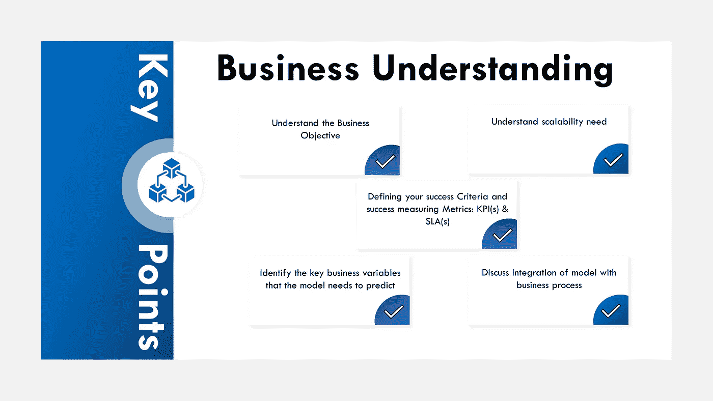

业务理解摘要(图片由作者提供)

# 数据采集

一旦我们了解了业务及其目标。我们需要了解数据和所有不同的需求。首先，我们去收集数据。后者可能已经被订购或集中，或者我们可能不得不去单独的源系统并收集我们的模型所需的数据。确定是否有足够的数据推进下一个建模步骤。同样，这个过程经常是迭代的。这是数据采集阶段。这通常是通过 ETL 管道完成的，ETL 代表提取、转换和加载。

# 抽取、转换、加载至目的端（extract-transform-load 的缩写）

在这一步中，数据被提取、处理并加载到数据仓库中，这通常是通过 ETL 管道完成的，ETL 代表提取、转换和加载。

ETL 是一个 3 步流程:

*   ***从单个或多个数据源中提取*** 数据。
*   ***按照业务逻辑转换*** 数据。转换本身是一个两步过程——数据清理和数据操作。
*   ***将*** 之前转换的数据加载到目标数据源或数据仓库中。

在数据的转换部分，我们可能需要处理不同的问题，例如缺失值的**插补**。数据经常包含缺失值或空值，导致模型潜力降低。所以我们试图估算缺失的值。

1.  对于**连续值**，我们根据需要使用平均值、众数或中位数填充空值。
2.  对于**分类值**，我们使用最频繁出现的分类值。

此外，数据几乎从来没有正确的格式，因此预处理步骤总是必须的，所以识别这些预处理规则例如:日期-时间数据。

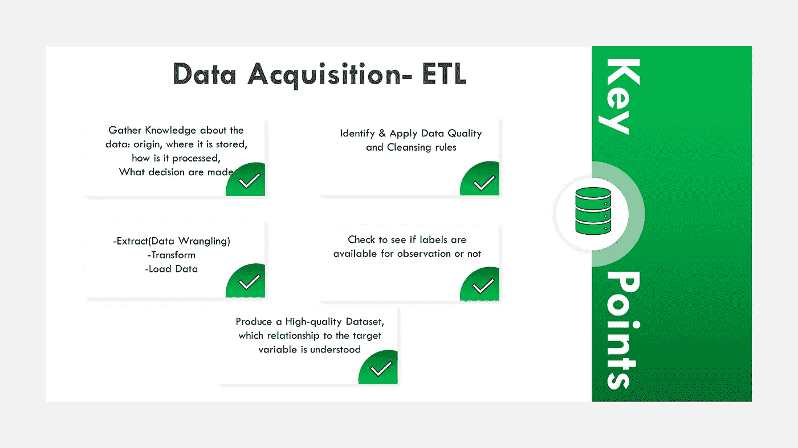

数据采集和 ETL 总结(图片由作者提供)

## **EDA(探索性数据分析)**

探索性数据分析部分是我们理解数据、模式等一切的部分...这是通过采用**统计和数据可视化**来完成的。在这里，我们研究如下信息:

*   不同的变量是如何相互关联的，它们的分布是什么样的？
*   变量之间的相关性是什么，寻找数据与目标变量有多好联系的证据？

**统计数据**

1.  我们使用 ***描述性统计*** 来获得数据的更大图像，这基于数据的属性来描述数据。

描述性统计的四种主要类型是:

*   *测量频率*
*   *集中趋势的度量*
*   *离差或变化的度量*
*   *位置测量*

2.我们使用 ***推断统计*** 来验证数据集和模型输出的分布，最常用的方法有:

*   *参数的估计*
*   *T* [*统计假设的估计*](https://statistics.laerd.com/statistical-guides/hypothesis-testing.php) *。*

3.最后，我们采用 ***单变量和多变量分析*** 来识别从属和独立特征之间的相关性和趋势:

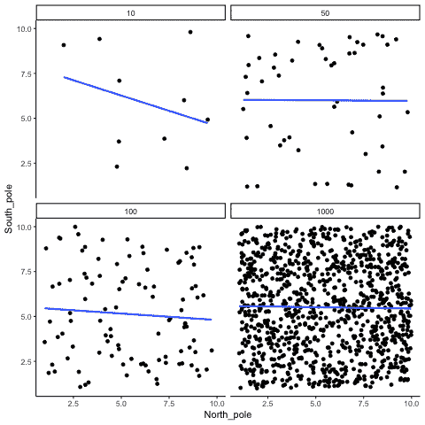

来源:[https://crumplab.github.io/statistics/gifs.html](https://crumplab.github.io/statistics/gifs.html)

**数据可视化**

来源:[靴板](https://boostlabs.com/10-types-of-data-visualization-tools/)

数据可视化在数据科学生命周期中发挥着重要作用，它被用于从数据理解到部署，再到与利益相关者交流业务洞察力的每一个部分。

数据可视化能够生成所有方面的可见见解，只需在图表上绘制一个简单的模式，这使得模式和趋势的识别变得容易得多，而不是只查看电子表格上的数千行和只使用统计数据。

即使从统计数据中提取信息，如果没有良好和适当的可视化，来自没有可视化的数据的洞察力也很难交流，上图是不同类型的可视化的示例。

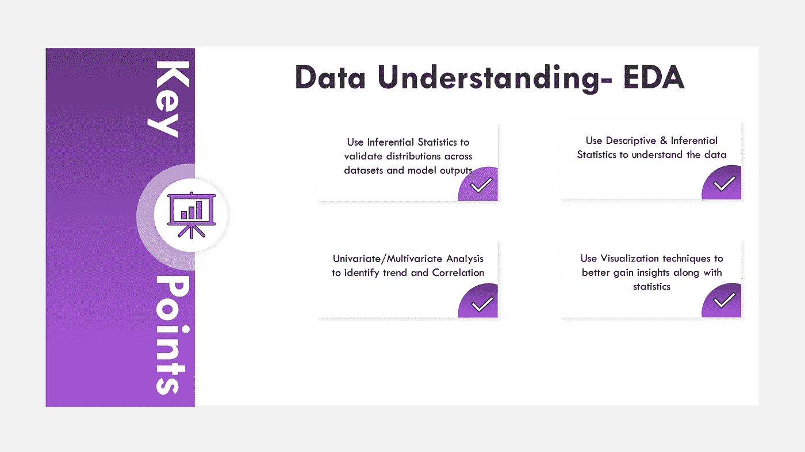

EDA 摘要(图片由作者提供)

# 特征工程:

**特征工程**是利用领域知识通过数据挖掘技术从原始数据中提取**特征**的过程。这些**特征**可以用来加强机器学习模型的性能。**特征工程**可以认为是应用机器学习本身。

> “机器学习只占整个数据科学生命周期的 20%到 30 %”

最有意义的特征工程技术用于将数据转换为模型可以更好理解的形式，并处理数据和模式异常:

*   **数据变换技术:** *对数变换、平方根变换、分类编码、幂函数和缩放。*
*   **处理:** S *kewed 数据、偏差缓解、宁滨、异常值检测*后者识别偏离数据集正常行为的数据点或观察值。异常值数据可以指示关键事件，如技术故障或潜在危险，因此需要相应地处理，否则会误导我们的最终模型。

在将数据转换为正确的格式并处理潜在的数据危险之后，大多数时候，特别是对于高维数据集，我们最终会得到许多特征，我们不能将所有特征输入到机器学习模型中，这不是它的工作方式，这将极大地过度拟合模型。相反，我们必须选择正确数量的功能。这在前面的步骤中，在数据分析或 EDA 中部分完成:然而，当研究变量的相关性时，有一种适当的方法可以做到这一点，这被称为**特征选择。**

这是三种主要方法:

*   ***基于过滤方法:*** *w* e 指定一些度量并基于过滤特征，例如:C *orrelation、卡方、ANOVA* 。
*   ***基于包装器的方法:*** 我们把一组特征的选择看作一个搜索问题，例如:*递归特征消除，向前/向后选择*。
*   ***嵌入方法:*** 我们使用内置特征选择方法的算法，例如*拉索(L1)和岭(L2)回归*。

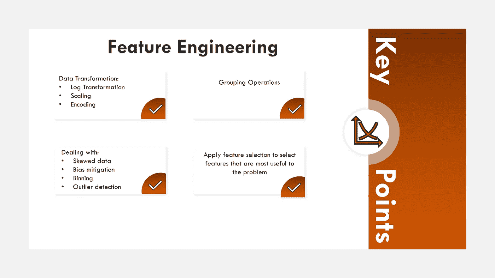

特征工程总结(图片由作者提供)

# 模特培训

一旦首先准备好对特征进行建模，我们就创建一个**基线模型**，然后我们进行模型训练，然后我们不断增加模型的复杂性，增加各种算法的测试，看看这个特定的数据集如何响应这个算法，然后你进行**超参数调整**来设置模型的正确超参数，然后我们应用技术来防止过度拟合，例如**交叉验证**。

来源:[奥雷利](https://www.oreilly.com/library/view/evaluating-machine-learning/9781492048756/ch03.html)作者:[爱丽丝郑](https://learning.oreilly.com/library/view/evaluating-machine-learning/9781492048756/)

我们需要在数据集上评估训练模型的性能，这发生在测试集上，因为模型可能会过度拟合，不能很好地概括，所以我们必须确保我们消除了模型中的任何偏差，这就是为什么这一部分非常重要。

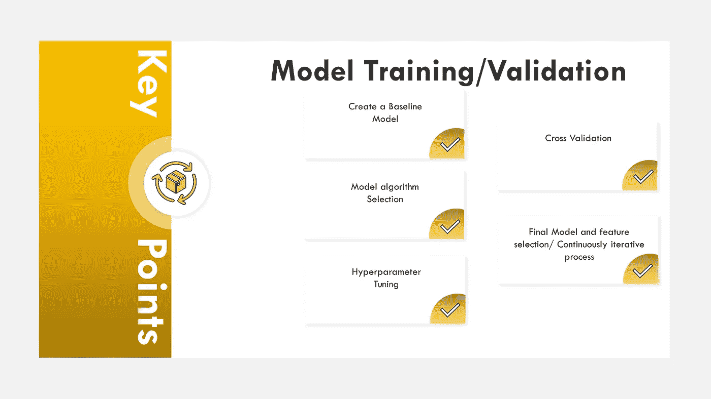

模型训练总结(图片由作者提供)

# 模型部署

一旦我们训练了模型，模型部署就不是简单的了，我们需要提前考虑。

> 模型开发很难，但模型部署更难— Srivatsan Srinivasan

在部署之前，我们必须确保测试以下内容:

*   部署的模型是否符合原始模型的预期。通过使用在开发阶段确定的测试输入集，产生经过验证的结果。
*   确保数据是干净的，这样它就可以被下游的机器学习组件处理，这样我们就可以通过数据的一致性和质量来加强流程之间的预期和事务。
*   正在部署的模型是否足够健壮，能够通过测试这些输出的极端值来接受不同范围的输入。

通过在将模型部署到生产环境之前进行持续的定期检查和运行测试，我们可以最大限度地降低和防止模型崩溃的风险，以及影响其下游消费者的风险。

## **将模型投入生产的不同方式**

选择如何将预测模型部署到生产中是一个相当复杂的问题，有不同的方式来处理预测模型的生命周期管理，不同的格式和存储方式，多种方式来部署它们，以及非常广阔的技术前景可供选择。

*通常有不同的方法将训练和服务器模型投入生产:*

*   **训练**:一次性、批量、实时
*   **服务:**批处理，实时(数据库触发器，发布/订阅，网络服务，inApp)

**一次性培训**

机器学习模型不一定需要不断地训练才能生产，它可以只是训练并推向生产，直到它的性能足够恶化，然后它们被刷新和重新训练。

这种类型的模型部署是进行原型开发和机器学习的数据科学家的首选，典型的模型格式有:

*   [泡菜](https://docs.python.org/3/library/pickle.html)
*   [ONNX](https://github.com/onnx)
*   [PMML](https://en.wikipedia.org/wiki/Predictive_Model_Markup_Language)
*   [POJO 和 MOJO](http://docs.h2o.ai/h2o/latest-stable/h2o-docs/productionizing.html#about-pojos-and-mojos)

**批量训练**

批量训练允许具有基于最新训练的模型的不断更新版本。

**实时训练**

当实时部署这种类型的模型时，需要足够的支持和监控，因为模型可能对新数据和噪声敏感，并且需要不断监控模型性能，这种类型的培训可以通过“在线机器学习模型”来实现，具体来说:

*   k 均值(通过小批量)
*   线性和逻辑回归(通过随机梯度下降)
*   朴素贝叶斯分类器

**批量 vs 实时预测**

在预测/发球方面，在看是设置批量还是实时预测的时候，了解关键的区别是非常重要的。

[*批量预测的例子*](https://mlinproduction.com/batch-inference-vs-online-inference/) *:*

> 批处理作业通常按照某种循环计划生成(例如每小时、每天)。这些预测然后被存储在数据库中，并可以提供给开发者或最终用户。批量推断有时可能会利用 Spark 等大数据技术来生成预测。这使得数据科学家和机器学习工程师可以利用可扩展的计算资源来一次生成许多预测。

[*实时预测或在线推理的例子:*](https://mlinproduction.com/batch-inference-vs-online-inference/)

> 每当用户通过该服务订购食品时，就会生成 UberEats [估计交付时间](https://eng.uber.com/uber-eats-trip-optimization/)。不可能生成一批这样的评估，然后提供给用户。想象一下，在食物到达之后的*之前，你不知道要多久才能收到你的订单。其他可以受益于在线推理的应用例子包括增强现实、虚拟现实、人机界面、自动驾驶汽车以及任何允许用户实时查询模型的面向消费者的应用。*

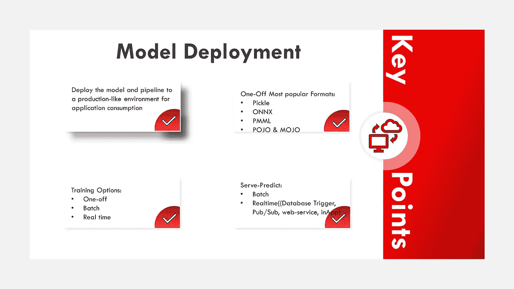

模型部署摘要(图片由作者提供)

# 模型监控

一旦模型被部署，在一些极端的情况下，模型可能是非性能的，它可能只是抛出垃圾分数，这将影响业务目标等等，因此我们需要持续地监控模型，这部分经常被初学者忽略。

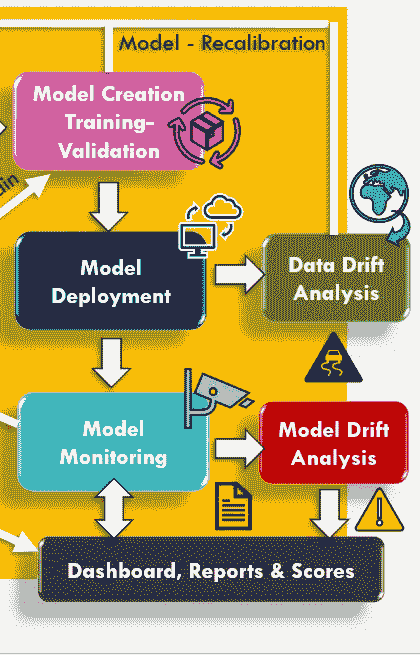

(图片由作者提供)

这里有两个重要的组成部分:

**数据漂移分析**:我们将来自真实世界的传入数据分布与被评分的数据分布进行比较，如果我们注意到它们之间的一些差异，我们需要选择一个阈值。但是，如果差异很大，则传入的数据会发生漂移。在这种情况下，我们需要回过头来分析差异。

**模型漂移分析**:我们将现实世界模型分布的分数与已评分的模型分布的分数进行比较，因此在这里，这被输入到一个系统中，该系统持续地向业务用户报告并给出输出。同样，业务部门不会理解准确性、召回率和精确度，如之前在业务理解部分中所述，因此这里的最佳指标是通常在仪表板中找到的 KPI:作为可视化和报告，它会说明例如我们获得了多少客户、我们赚了多少美元以及这在收入流中意味着什么等等。

就数据漂移而言，原因可能是:

*   上游过程改变，例如传感器被更换，改变了测量单位，损坏的传感器读数总是 0。
*   数据的自然漂移，如平均温度随季节变化。
*   特征之间关系的变化。

## 如何介入？

*   清除错误的标签
*   重新训练/校准模型
*   尽早发现并纠正上游数据问题

如果出现概念或数据漂移，并且您的机器学习模型变得陈旧，如下面左侧图表所示，我们可以在右侧看到，通过随着时间的推移刷新模型，我们可以防止模型随着时间的推移变得陈旧。

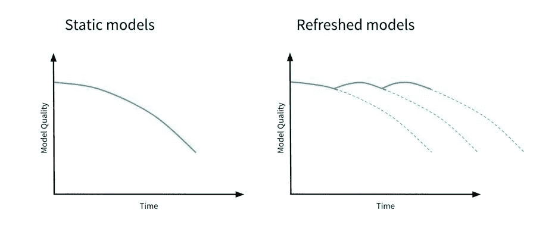

资料来源:[数据报告](https://slacker.ro/2019/09/18/productionizing-machine-learning-from-deployment-to-drift-detection/?__cf_chl_jschl_tk__=f342e6062b9d025da1bd60796a55f900eda1ec2c-1593018949-0-AcfL62sKS4UXyrE-sDi56wppcgqlfySpXELDA3woLaF8qvDKV0ujdCLj-qGHsUojQETX6paxDOAokp9862Bu9TAYCQFu5QZm04ZZlvrc8NJMUbE2A89RkhQvdDW76ycRgoSDKCiaFq0IcZi_JK4iVyKmO-Wj_3cg-q--A07ElVfbOWR4_bjZJM4h4fCYNFLP4ufLK8WKdJdeLyGJTYcKWClU4Tlohv4NlZ9j9NE7aXMx4NJlxZWugM0MHLYXnxtS-SG5IbILXJpesMgLX7Tdcv-2gBAYjanOU5zgnUTqya8Jkcq62O00Ex5wVS3QUjM-0dVULa71I-wjtrzq4XQ6260mE8V8DdS_fJTkJbG0YYqIkI_KUpAgAoDRx35O-KfeIA)

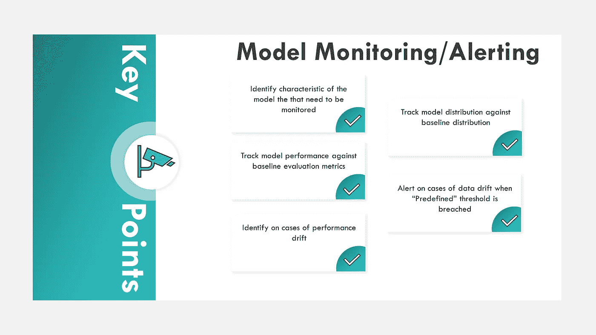

模型监控/警报摘要(图片由作者提供)

# **结论**

这是对数据科学项目流程和整体组织结构及其交互的建议。显然，这个周期有许多变化——出于复杂性的考虑，我没有深入研究模型构建和评估的某些方面，因为这些方面在所有数据科学和 ML 平台中都经常讨论，所以我更喜欢坚持研究其他部分。总结一下:

当采用时，确保选择最适合您的问题的方法，理解具体的用例，并从业务角度出发选择正确的指标:KPI 和 SLA，这将有助于从开发到将 ML 模型部署到生产的正确方法。机器学习不是万能的，如果你可以用更简单的方式解决问题而不采用 Ml，你应该选择它，越简单的解决方案越好。希望你发现这篇文章内容丰富！感谢您的阅读！

你有什么想法？我错过了什么或者我可以改进的吗？请在下面随意评论。我欢迎任何反馈。

# **参考文献**

 [## 在生产中部署机器学习模型的不同方法概述

### 将模型投入生产的方法有很多种，不同的方法会带来不同的好处

www.kdnuggets.com](https://www.kdnuggets.com/2019/06/approaches-deploying-machine-learning-production.html)  [## 什么是 KPI？定义、最佳实践和示例

### 根据关键业务目标衡量您的绩效。关键绩效指标是一个可衡量的值，它…

www.klipfolio.com](https://www.klipfolio.com/resources/articles/what-is-a-key-performance-indicator)  [## 模型:从实验室到工厂——硅谷数据科学

### 在我们的行业中，很多重点放在开发分析模型，以回答关键的业务问题和预测…

www.svds.com](https://www.svds.com/models-lab-factory/)  [## 批量推理与在线推理——生产中的 ML

### 过去几周你一直在训练一个新的机器学习模型。在与产品团队合作定义…

mlinproduction.com](https://mlinproduction.com/batch-inference-vs-online-inference/)