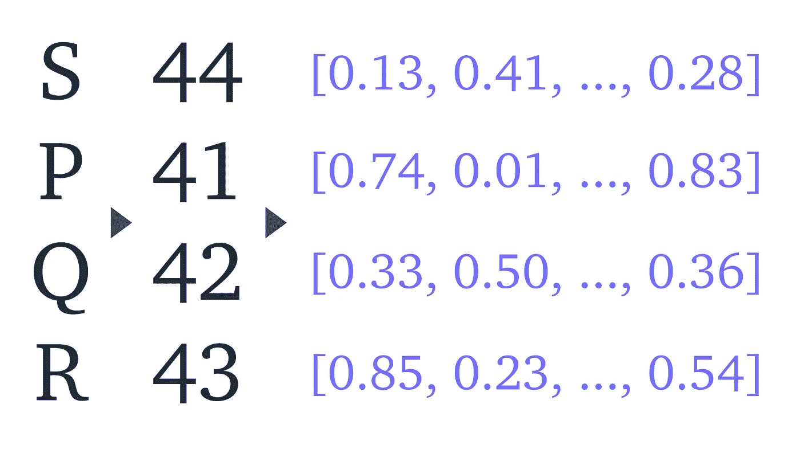
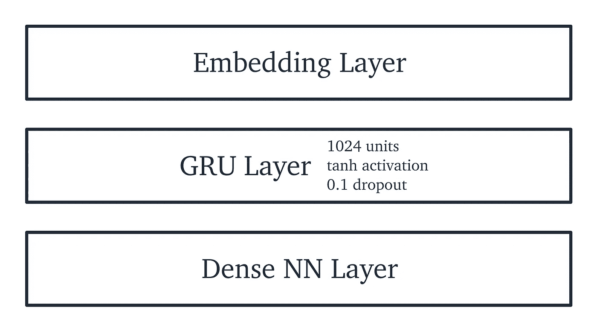
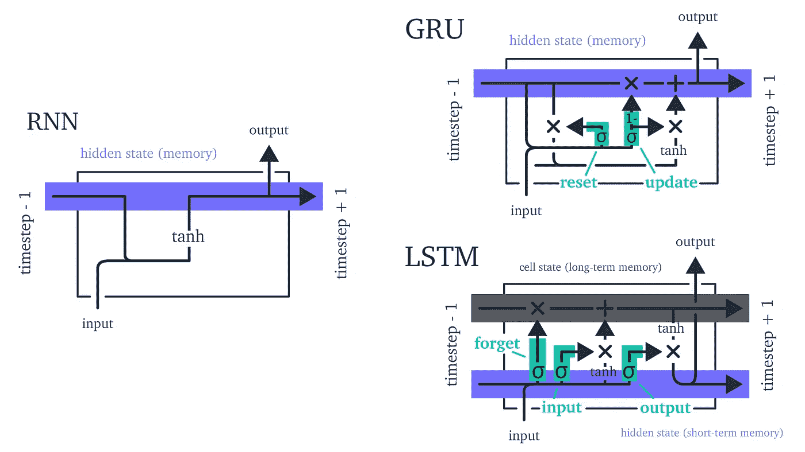
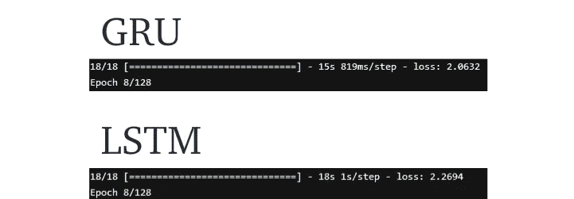

# 斯多葛派哲学——由算法构建

> 原文：<https://towardsdatascience.com/stoic-philosophy-built-by-algorithms-9cff7b91dcbd?source=collection_archive---------10----------------------->

## [冥想计划](http://www.towardsdatascience.com/tagged/the-meditations)

## 再现历史上最有权势的人之一所写的斯多葛派哲学


马尔科·奥雷里奥半身像——[Saiko](https://commons.wikimedia.org/wiki/User:Sailko)的“芝加哥艺术学院的[古罗马雕塑”由 3.0](https://commons.wikimedia.org/wiki/File:Roma,_busto_di_marco_aurelio,_170-180_dc_ca.jpg) 的 [CC 授权](https://creativecommons.org/licenses/by/3.0/)

使用机器学习来生成一个或几个古代文本风格的语言是那些经常给我留下深刻印象的常见应用之一。

马库斯·奥勒留的《沉思录》是斯多葛派哲学的巅峰之作，受到世界各地运动员、企业家和领导人的称赞。

> 向内看。不要让任何事物的特殊品质和价值逃离你。第六卷

令人难以置信的是，我们可以从像罗马皇帝马可·奥勒留这样的人的内心思想中阅读和学习这门古老的学科，他被广泛认为是有史以来最伟大的斯多葛派哲学家之一。

在写这篇文章的前几天，我读了几页这本书，这很快让我的思绪回到那些迷人的 ML 生成的古代文本的摘录。

与计算机生成雄辩的文本段落看似复杂的本质相反，这实际上是一个相当简单的过程。

我们将从包含在*冥想*中的所有书籍的在线文本格式开始。本语料库由麻省理工学院主持[【1】](http://classics.mit.edu/Antoninus/meditations.html)。

> 宇宙是变化的:生活是观点。第四卷


卡洛斯·伊瓦涅斯在 [Unsplash](https://unsplash.com?utm_source=medium&utm_medium=referral) 上的照片

# 数据

首先，我们必须导入并对《沉思》的原文做一些小的改动，例如:

*   页眉和页脚部分
*   装饰文字(如分册“— — —”)
*   书名(“第一册”、“第二册”等)
*   《末日》

我们用`requests.get`导入，用`split` / `replace`函数和一些小的正则表达式清理数据，如下所示:

# char2idx



字符>索引>向量

计算机处理数字，而不是语言。

为了将冥想翻译成计算机可以理解的东西，我们必须将我们的语料库分解成更小的输入实体。其然后可以被转换成索引(并且稍后被转换成独热编码或向量)。

这通常在两个粒度级别上完成。**字**级嵌入，或**字**级嵌入。

在这两种情况下，所有单独的实体(单词或字符)被用来创建一个*词汇表*——语料库中包含的所有语言实体的集合。冥想的字符级词汇表如下:

```
['\n', ' ', '!', '"', "'", '(', ')', ',', '.', ':', ';', '?', 'A', 'B', 'C', 'D', 'E', 'F', 'G', 'H', 'I', 'J', 'K', 'L', 'M', 'N', 'O', 'P', 'Q', 'R', 'S', 'T', 'U', 'V', 'W', 'X', 'Y', 'Z', '[', ']', 'a', 'b', 'c', 'd', 'e', 'f', 'g', 'h', 'i', 'j', 'k', 'l', 'm', 'n', 'o', 'p', 'q', 'r', 's', 't', 'u', 'v', 'w', 'x', 'y', 'z']
```

由此我们可以将每个独特的字符转换成一个索引。我们用`char2idx`字典来做这件事，反之亦然，使用`idx2char`数组:

然后我们可以将**人类**的思考转换成**机器**的思考:

> **我们看到的一切都是视角，不是真相。**
> 
> 16 61 44 57 64 59 47 48 53 46 1 62 44 1 58 44 44 1 48 58 1 40 1 55 44 57 58 55 44 42 59 48 61 44 7 1 53 54 59 1 59 47 44 1 59 57 60 59 47 8

就我个人而言，我更喜欢阅读《人类的沉思》。幸运的是，机器到人类冥想训练后的翻译将由我们的`idx2char`阵列负责。

> 无论理性和政治(社会)能力发现什么既不聪明也不社会，它正确地判断不如自己。第七卷


达里奥·维罗内西在 [Unsplash](https://unsplash.com?utm_source=medium&utm_medium=referral) 上拍摄的照片

# 配料和切片

我们使用`SEQ_LEN`为每个训练示例分配序列长度。更长的`SEQ_LEN`似乎以短期语言结构为代价改善了长期语言结构。例如:

> SEQ _ LEN = 100——“与许多人在一起，更加安静或更加自由，不会损害灵魂中的元素本身”
> 
> SEQ _ LEN = 300——“来自我的世界；但是，让这种规定成为一种政治，而不是生活，记住你自己，然而，他们关心穷人，祝福社会。”

我们可以通过增加训练历元的数量来避免这种情况。从而产生更好的短期和长期语言结构——然而，平衡这一点与过度拟合可能会变得困难。

## 张量流数据集

我们使用以下方法将索引数据转换成一个 **Tensorflow 数据集**对象[2]:

这允许我们在数据集上执行有用的内置操作，比如`.batch()`和`.shuffle()`。

因为我们打算预测序列的下一个字符，所以我们的目标值应该是向前移动一个字符的输入。例如，如果我们的**输入**是 *"Hello worl"* ，我们的**目标**将是 *"ello world"* 。

为此，每个序列必须包含`SEQ_LEN + 1`字符。我们使用`.batch()`将数据集分割成这个长度的序列:

现在我们有了长度`SEQ_LEN + 1`的序列，我们把它们分成输入/输出对:

现在，我们必须重组数据集并创建训练批次。注意，我们在这里再次使用了 batch。之前，我们使用`.batch()`将我们的 *241'199* 字符长的索引语料库分割成许多长度为`SEQ_LEN + 1`的序列。这一次，我们使用它将我们的序列分成 64 个一组(`BATCH_SIZE=**64**`)。

> 你的习惯性想法是什么，你的思想性格也将是什么；因为灵魂被思想所染。第六卷

# 定义模型



该模型非常简单，由嵌入层、GRU 层和致密层组成。

`tf.keras.layers.**Embedding**()`层是一个可训练的数组，我们用它将单个索引字符值转换成密集的浮点向量。这个过程叫做嵌入[4]。每个字符索引映射到该层中的特定向量。

下面的`tf.keras.layers.**GRU**()`层包含我们的递归神经网络(RNN)。由于在计算中增加了“时间”维度，rnn 是 NLP 应用中的常见选择。这意味着我们不仅根据输入的内容进行预测，还根据这些内容的顺序进行预测。以下列陈述为例:

> **【原文】:**我们看到的一切都是**一种视角**，而不是**真相**。
> 
> **【重新排序】:**我们看到的一切都是**真相**，而不是**一个视角**。

一个不考虑顺序的方法看不出这两个语句有什么不同。显然，顺序在语言中特别重要。请参阅 Andrej Kaparthy 的“[递归神经网络的不合理有效性](https://karpathy.github.io/2015/05/21/rnn-effectiveness/)”文章，了解更多关于 RNNs 的信息。



RNN、GRU 和 LSTM 单位的比较。在 GRU 和 LSTM，消失梯度问题是通过信息门(绿色突出显示)解决的。

**GRU** 和 **LSTM** 单元都是对原始 RNN 的改编，旨在通过使用信息门控[6][7]来解决消失梯度问题。两者共享相似的架构和性能(在大多数情况下)。



GRU 对 LSTM 的单个历元的训练时间——这在 128 个历元上产生了显著的差异

对于这个模型，我注意到两者之间没有明显的质量差异。因为 GRUs 需要更少的训练时间，我继续这样做。

最后，我发现`dropout=0.1`对提高泛化能力产生了巨大的影响。这随机屏蔽了 10%的输入。导致复制文本的大段显著减少，同时仍然保持正确的语言结构和可理解的陈述。

最后的`tf.keras.layers.**Dense**()`层产生我们的预测。GRU 输出被传递到一个密集连接的神经网络，该网络生成对 66 个字符中的一个的预测。

> 不再谈论一个好男人应该是什么样的人，而是成为这样的人。第十本书

# 培养

使用`adam`优化器和`sparse_categorical_crossentropy`损失函数编译该模型。

在训练过程中，我们用以下方式保存模型重量:

`checkpoint`然后在`model.fit()`期间被传递给`callbacks`自变量。在每个训练时期结束时，模型权重保存在`./training_checkpoint`目录中。

# 装货

训练后，我们可以从文件中加载训练好的模型权重，并使用它们来重建我们的模型。关键的区别在于，我们使用批量大小`1`而不是训练期间使用的`64`来重建模型。我们这样做是为了传递一个输入(例如`"From"`)来产生一个输出。

这一切都是通过以下方式完成的:

> 我常常想，为什么每个人爱自己胜过爱所有的人，但却不重视自己对自己的看法，而重视别人的看法。第十二卷


尼尔斯在 [Unsplash](https://unsplash.com?utm_source=medium&utm_medium=referral) 拍摄的照片

# 文本生成

一旦加载了模型，我们就可以轻松地开始生成文本了:

我们从一些非常奇怪的文本开始——它真的很像字母`e`。不过，普通标点的用法很快就学会了:

```
"From eeeeereeeeeseeceeeeeeeceeeeeeee,eeieeeeee. Leeeeeeeeeedeeepeeeeeeeeeeeeeeeereee;,eveeeeeeeeeeceeeeeeceeeeeeeepenesneee,eeeee."
```

该模型在很少的训练期后很快就能计算出单词:

```
"For the veppering doul to shod. Bubeeg if not it discoreor theselly alo hace."
```

再过几个时代，我们就会得到真正的单词——到处都有一些错误:

```
"Thou art dods thee from the deadgh of impuety by habour of mecrating, and oter coused by doing with gaves indifected, if thou hass serdect to him at a think. The way only not ando, nothing is compousted the that happoness; and de to be exturn and I he another suchivisicis inforaition with its Iw all vellected with does at all things, how sefull: and kill not the beact?"
```

最终模型会产生一些可理解的陈述，这看起来非常酷:

```
"Eudaemonia (happiness) is a good daemon, or a good thing. What then dost thou think of him who ave in harmony with what is really good.""Constantly contemplate the whole morals of those who live with us and present themselves in abundance, as far as is possible. Wherefore we must keep them before us."
```

进一步训练，我们倾向于复制大部分*几乎*冥想文本的副本:

```
"Remember that as it is a shame to be surprised if the figtree produces figs, so it is to be surprised, if a man has a fever"
```

# 结论

通过训练一个简单的关于冥想的 RNN 建筑，产生了一些令人惊讶的精彩的文本部分。它设法精确地组织句子，正确地产生真实的单词，并把它们合并成大部分实际上可读的东西。

虽然结果很酷，但进一步发展这一点需要的不仅仅是冥想。在 ML 中，数据为王。在这个项目中，独自坚持冥想是最大的限制因素。简而言之，我们需要更多的数据。

我的思路是，随着更多数据的纳入，我们将建立更大的词汇量。从那以后，我们将有更多的词供我们使用，所以词级嵌入似乎是合乎逻辑的下一步。使我们能够维护由单词提供但在字符级嵌入过程中丢失的语义。

目前，我对构建偶尔看起来很有见地的东西是多么容易印象深刻。我期待着在未来用更多的数据、词向量和其他工具进行更多的试验。

让我留给你一些我最喜欢的算法思考。

> “你忍受这一点是理所应当的；但另一个问题是，人们为了获得快乐而工作，这本身就是一种瘟疫，但无论如何，每个人的善与他为之忙碌的事情的价值是一样的。”

> “所有的事情都是一样的，在经历中是熟悉的，在时间上是短暂的，在物质上是没有价值的。现在的一切就像过去一样，时间是一个点，物质在流动，感知是应该的，然后不要让你的欲望找到它的终点。”

> 请记住，理性这个词的本意是表示分散，或者分解成原子，或者湮灭，它要么消失，要么改变。

这里的代码是[这里](https://github.com/jamescalam/meditations_ai/blob/master/code/meditation.py)你可以找到一个 100K 长的输出[这里](https://github.com/jamescalam/meditations_ai/blob/master/works/meditations.md)。

感谢阅读！

# 参考

[1] M. Aurelius，[《沉思录》](http://classics.mit.edu/Antoninus/meditations.html)(公元前 170-180)，麻省理工学院网络经典档案

[2] [文本生成与 RNN](https://www.tensorflow.org/tutorials/text/text_generation) ，Tensorflow 核心教程

[3] [td.data.Dataset](https://www.tensorflow.org/api_docs/python/tf/data/Dataset#from_tensor_slices) ，TensorFlow 核心文档

[4] [单词嵌入](https://www.tensorflow.org/tutorials/text/word_embeddings)，Tensorflow 核心教程

[5] A. Karpathy，[递归神经网络的不合理有效性](https://karpathy.github.io/2015/05/21/rnn-effectiveness/) (2015)，Andrej Karpathy 博客

[6] S. Hochreiter，J. Schmidhuber，[长短期记忆](https://www.bioinf.jku.at/publications/older/2604.pdf) (1997)，神经计算 9(8):1735–1780

[7] S. Hochreiter，[递归神经网络学习和消失梯度](https://citeseerx.ist.psu.edu/viewdoc/download?doi=10.1.1.4.7389&rep=rep1&type=pdf) (1998)，国际不确定性、模糊性和基于知识的系统杂志 6(2):107–116

[8] J. Chung，C. Gulcehre，K. Cho，Y. Bengio，[门控递归神经网络对序列建模的实证评估](https://arxiv.org/pdf/1412.3555v1.pdf) (2014)，NIPS 2014 深度学习和表征学习研讨会

如果你喜欢这篇文章，你可能会喜欢冥想项目的下一篇文章——我在那里介绍了使用多个竞争的 rnn 来产生更高质量的文本，请在这里查看:

[](/recurrent-ensemble-learning-caffdcd94092) [## 集成学习的增压预测

### 利用竞争神经网络提高文本生成质量

towardsdatascience.com](/recurrent-ensemble-learning-caffdcd94092)