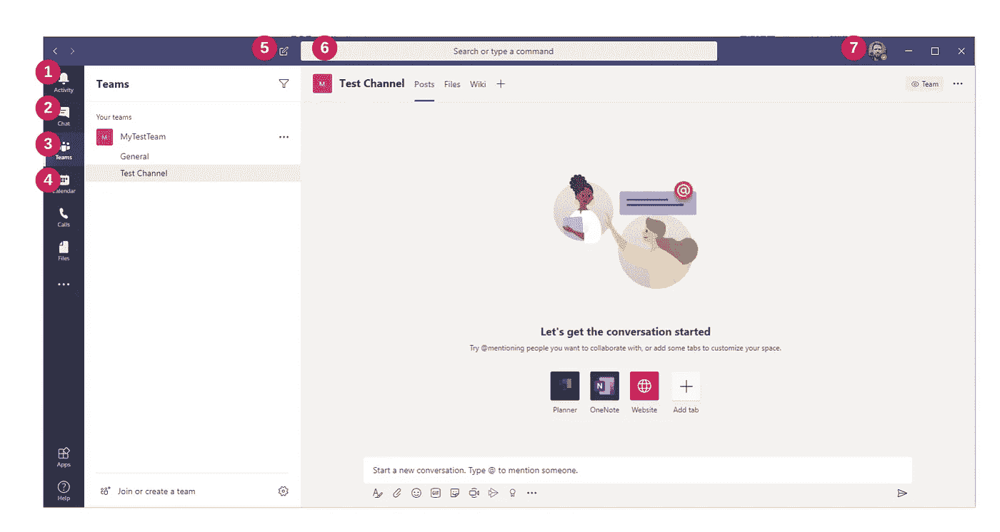
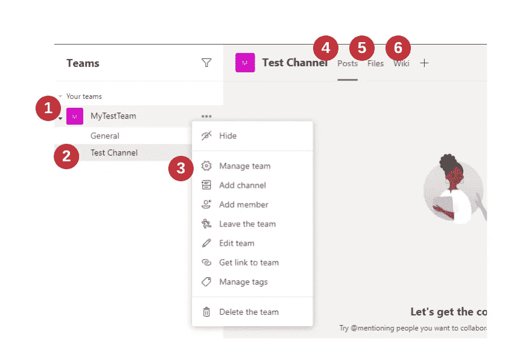
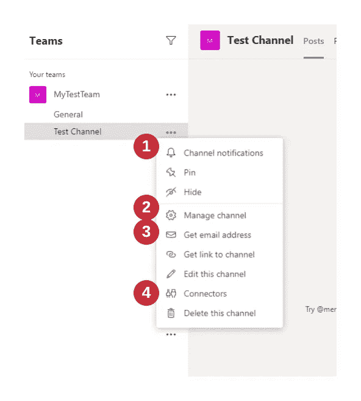
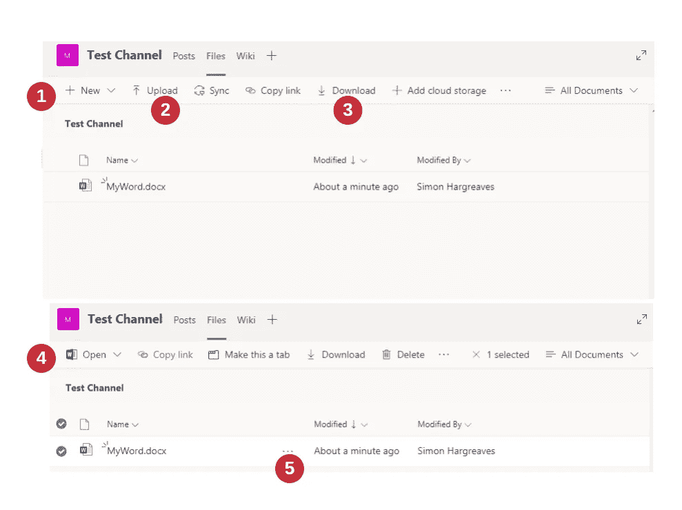
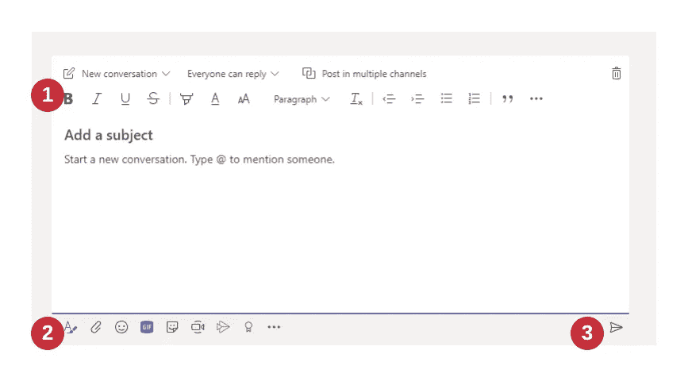
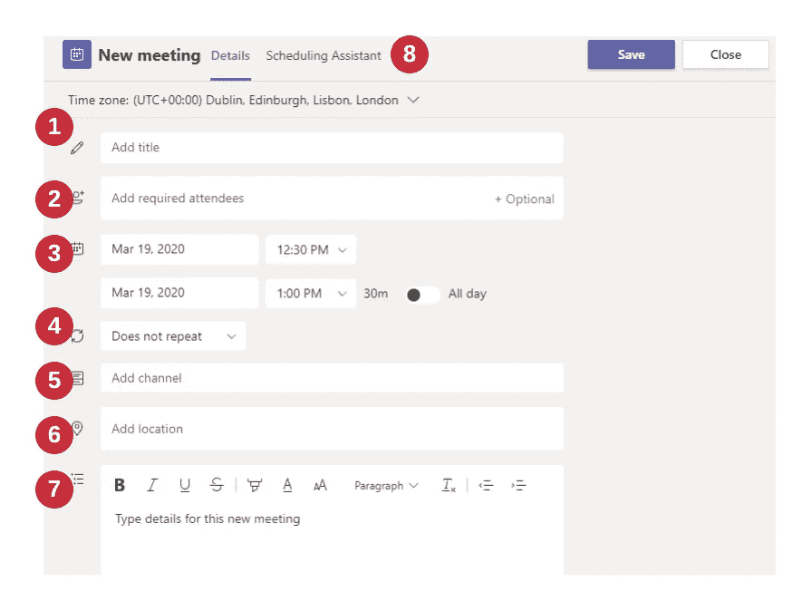
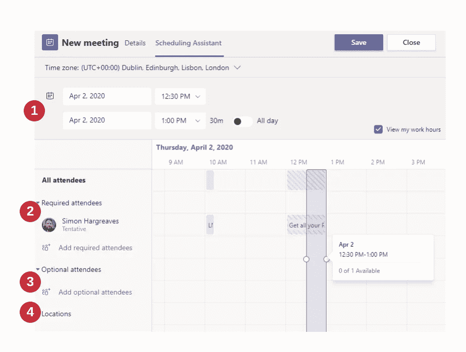
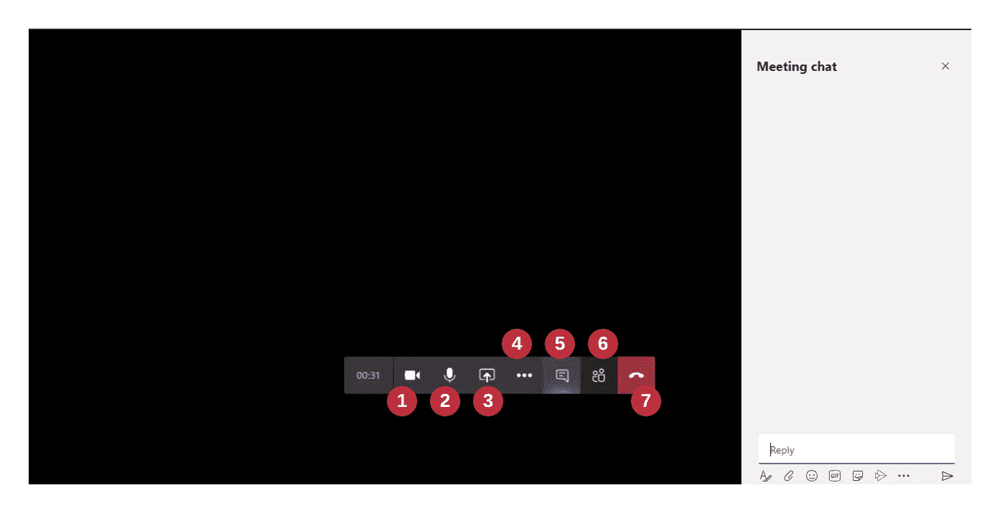
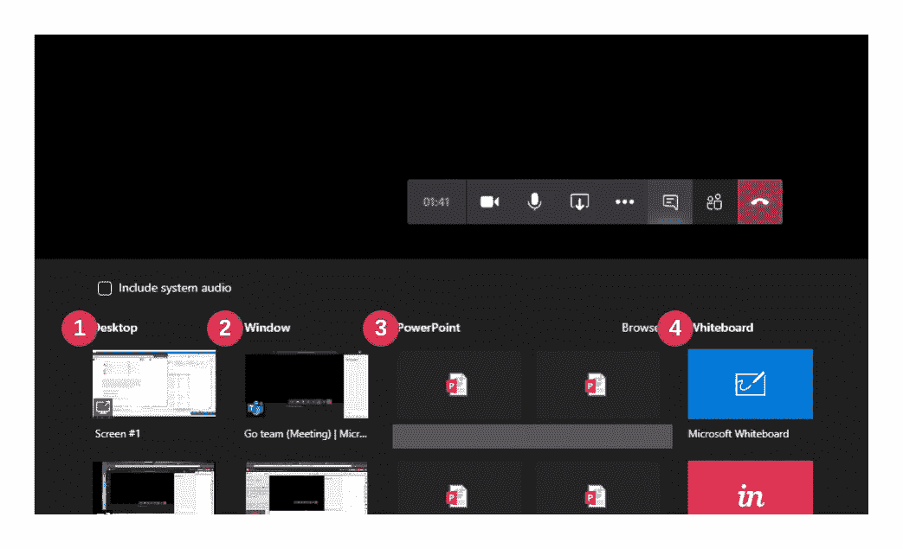
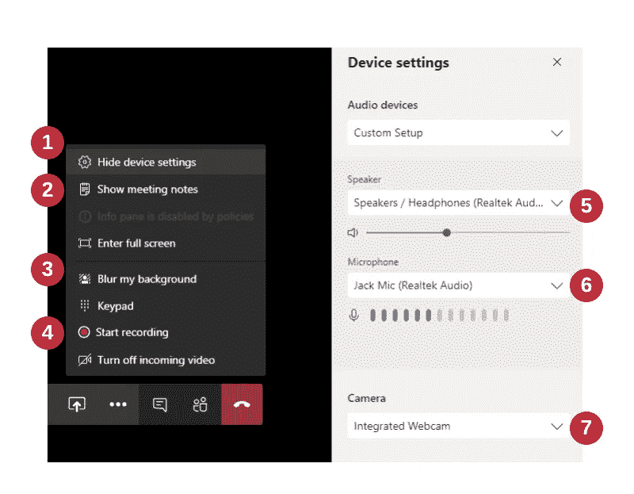

# 停下来，协作和倾听:在家与微软团队一起工作

> 原文：<https://towardsdatascience.com/stop-collaborate-and-listen-working-from-home-with-microsoft-teams-60166258565e?source=collection_archive---------36----------------------->

迈克尔·索莱达在 [Unsplash](https://unsplash.com?utm_source=medium&utm_medium=referral) 上的照片

对许多人来说，在家工作将是一件新鲜事。我写这篇文章的时间是 2020 年 3 月，在那里，在家工作是一种新常态。因此，我们将介绍一些一般的远程工作技巧，然后继续浏览一些快速的电源技巧，然后浏览微软团队界面。

# 一、远程工作者生存指南

对于很多人来说，你可能是第一次在家工作，这里有一些有用的提示让你在远程工作时保持高效和理智。

## 有规律可循

晚起床，穿着睡衣，甚至在床上或沙发上工作，真的很容易。应该避免这种情况。常规在工作和非工作之间建立了清晰的界限。例行公事不仅对良好的心理健康至关重要，而且由于从未真正有过休息时间，工作的模糊边缘也会产生压力。常规和精神健康研究([L . M . Lyle 等人，Lancet 2018](https://www.thelancet.com/journals/lanpsy/article/PIIS2215-0366(18)30139-1/fulltext) )。我总是确保在 8:30 左右开始工作之前洗完澡，穿好衣服。

## 晒晒太阳

因为你没有每天 2 小时的通勤时间，很可能你不会得到额外的 2 小时日光照射你的视网膜。季节性情感障碍的问题是众所周知的，但是远离屏幕看远处和白天也是有好处的，包括减少头痛，减少疲劳和通常更高的生产力。除了看到一些真正的日光，我建议买一个日光温度台灯。

## 有一些界限

正如我之前说过的，有一个开始和结束工作的常规对于描绘你工作日的边界是很重要的，但是如果可能的话，试着在你家的特定区域工作。如果可能的话，这应该是分开的和不同的，你家里的任何其他成员都知道，当你在那里的时候，你在工作，不被打扰。对你们中的许多人来说，一个单独的房间是不可能的，但是如果你能使用台灯或盆栽植物来使你的工作环境与众不同，那么这将有助于区分它。

## 打招呼

如果你在远程工作，有理由假设你的同事也在远程工作。试着养成早上 9 点左右对他们说早上好的习惯，这会让你感觉不那么孤独。

## 设置您的环境

你可能会在公司的笔记本电脑上工作，从长远来看，这对你的姿势和工作效率非常不利。如果可以的话，准备一把合适的椅子、鼠标、键盘和显示器。你会在那里坐很长时间，你需要保持健康。使用提升器确保您的显示器或笔记本电脑屏幕接近眼睛的高度。

## 协同工作

当你远程工作时，很容易感到自己置身事外，不知道团队内部发生了什么。这是正常的，这将成为你的团队中的一个问题。为了解决这个问题，尽量让帖子、文件、会议和状态更新共享。将他们链接到团队频道可让您的团队成员通过 chatter 和更新了解正在发生的事情。

## 虚拟会议

虚拟会议将成为你一天中的一大部分，这是一个公平的赌注，所以要学会做好它们。**质量好的耳机**是必不可少的，甚至**一些不太花哨的耳机也不错。拥有一个**网络摄像头**并不是必须的，但它确实能帮助你感受到自己是团队的一员，并迫使你穿好衣服，注意自己的外表，不管怎么说，是你的上半身。如果你不习惯戴着耳机工作，你说话的声音会比平时大得多，**试着以正常的音量说话**，摘下一只耳朵的耳机可以让你听到自己的声音并调节音量。如果你们中有一个以上的人同时在家工作，并且必须共享空间，这一点就变得非常重要。如果你和世界各地的团队交谈，根据交谈对象的时区使用**早上好或下午好是一种礼貌的习惯。这有助于你在协调会议时留意其他人的工作时间。对于几个人以上的会议，在不发言时将麦克风静音是一种良好的礼仪。周围的背景噪音往往比你意识到的要高得多，这使得你更难听到别人说话。最后一点，我再怎么强调也不为过，**不要在麦克风开着的时候喝咖啡或吃东西。如果需要喝水或者吃饭，就把自己静音，不然真的让通话中的其他人都不愉快。******

# 太久没有阅读—团队力量提示

## 安排会议

组织会议时，最好是通过团队**在日历标签**中预订，而不是通过 Outlook。你可以使用**调度助手**来避开人们的空闲和忙碌时间。向会议添加一个频道，以便会议结束后可以在该频道上看到任何消息或录音。

## 我们需要谈谈！

如果每个人都应该就某件事召开临时会议，请使用**立即开会**按钮。这通常被认为是有点粗鲁的做法，会议应该安排在日历中，并附加到频道上。

## 屏幕共享

如果没什么可看的，人们往往会在会议中走神，所以在你的屏幕上显示一份会议议程，并在会议期间与**分享你的屏幕**，这通常是一个不错的做法。

## 一幅画胜过千言万语

除了屏幕共享，你还可以共享一个**白板**。对于一些讨论来说，能够快速勾画出一些东西是非常有用的。我用一个便宜的 Wacom 平板电脑来快速地画东西。

## 文件不仅仅是用来分享的

如果在频道的“文件”部分有 MS Office 文档。它们不仅可以上传、下载和共享，而且还可以协同工作。您可以让多个用户同时处理同一个电子表格。

## 对重要消息使用增强型帖子

发布消息时，点击**格式按钮**打开格式选项。这将允许你创建具有主题行、完全格式化的文本、列表、表格、图像的帖子，并且重要的是将帖子标记为**重要！**

## 赞同

如果您只想肯定地确认一条消息，只需**点击喜欢按钮**。它可以防止消息窗口变得过于混乱。

## 抄送给频道

理想情况下，您希望确保所有聊天和讨论都在一个频道上，以跟踪历史和决策。这并不总是如此，电子邮件将会被使用。在这些情况下，使用渠道获取电子邮件地址功能，并将其添加到您的电子邮件抄送。

# 组

微软团队是一个很好的合作软件。它不仅仅是一个会议工具，而是一个完全集成的协作套件。我没有从微软获得报酬，我只是使用了许多系统，微软团队已经成为我的首选工具。团队中有很多工具可以帮助协作，但首先我们将介绍一些基础知识。

## 主视图

主面板可能相当吓人，但我们将分解重要的部分，以及它们的作用。

主接口

1.  活动—这是诸如“提及”和重要更新将被列出的地方。如果你有很多团队，这是开始你一天的好地方。
2.  聊天——这是一对一或小组对话。如果你想和一个人或一小部分人交谈。
3.  团队——大部分协作发生的地方，也是你大部分互动应该发生的地方。这是上面截图中选择的视图。
4.  日历—用于预订会议、检查日程和修改回复。这一切都与您的 Outlook 日历视图同步。
5.  新聊天—快速开始新图表按钮，开始与新朋友聊天。
6.  搜索栏—搜索您的联系人、团队、频道和日记。还有一大堆[快捷命令](https://support.microsoft.com/en-gb/office/use-commands-in-teams-88f61508-284d-417f-a53d-9e082164050b?ui=en-us&rs=en-gb&ad=gb)可以在这个工具条中供高级用户使用。
7.  帐户设置—您可以在这里设置您的在线状态，并配置应用程序设置，包括网络摄像头和耳机。

## 团队和渠道

团队视图

1.  这是你的团队。你可以加入很多不同的团队，他们都有不同的权限和成员。
2.  团队内部有渠道。把频道想成话题。通过这种方式，你可以按主题领域组织讨论和文件。所有队伍都以默认的**通用频道开始。**
3.  通过单击您的团队名称旁边的(…)，您可以调出团队管理菜单。通过添加和删除团队成员并设置他们的权限来管理团队。向您的团队添加新渠道。向您的团队添加人员。离队。编辑团队名称、描述和可见性。获取一个链接来打开团队，以便在电子邮件中发布。在团队中添加和删除标签。
4.  “帖子”选项卡是显示消息和渠道会议的地方。
5.  “文件”选项卡是协作共享文件和文档的地方。
6.  频道维基用于协作整理信息，有点像内部维基百科([维基百科](https://en.wikipedia.org/wiki/Wiki) —维基)

频道设置

1.  渠道通知允许您对群组中发生的事情的通知进行静音，这对高 chatter 渠道至关重要。
2.  管理频道用于设置谁可以发帖以及邮件是否被审核的权限。
3.  获取电子邮件地址是为了让您可以将该频道的电子邮件地址添加到电子邮件中，并且该消息的副本将被记录在该频道中。
4.  Connectors 是一个非常强大的用户工具，大多数用户根本不会使用它，但是它可以用来将通道与外部服务和应用程序连接起来。

## 文件

在团队中处理文件是它非常有用的特性之一，尽管很少使用。它将 Office365 的协作工具变成了一种非常有用的形式。可以使用“文件”选项卡共享文件，但也可以协作处理文件。在团队中打开文档进行编辑时，多人可以同时处理、审阅和评论文档。

使用文件

1.  在频道文件中创建新文件夹或文档(Word、Excel、Powerpoint 等)。
2.  从本地电脑上传文件。
3.  将文件从团队下载到您的本地 PC。
4.  以小组方式(通常首选)、Word Online(浏览器中的 Word)或 Word(电脑上的 Word 应用程序)打开文件，进行查看或编辑。
5.  对文件执行操作，如重命名、删除、复制等。

## 帖子、消息和聊天

聊天窗口有很多选项，隐藏了很多强大的工具，这可以让你的团队体验更加有用。

发布消息

1.  文章的格式选项，类似于 Word 中的基本格式选项。
2.  底部工具栏。

*   **格式**/折叠撰写框—在基本帖子和更丰富的格式选项之间切换。
*   **从“文件”标签、你的本地电脑或一个硬盘中给帖子附加一个文件**。
*   **给帖子添加表情符号**(笑脸)。
*   给帖子添加动画 Gif 图片。这对于一对一的消息来说很好也很有趣，但是对于频道帖子来说通常是不好的形式。因为它们很快就会变得很烦人。
*   **添加一个贴纸**，类似于 gif，如有必要，请谨慎使用。
*   **立即开会**，立即在频道上开始会议，并提醒频道的所有成员会议已经开始。将此用于任何临时会议。
*   **流**，除非你知道自己在做什么，否则不要使用。
*   **赞**是你可以分配给别人的俗气贴纸。我不会用它，但这取决于你的团队动态。

3.发送，将您的消息发布到频道

## 日历

大多数有组织的讨论应该安排在日程表部分。创建新事件时，您可以管理 Outlook 中的许多功能，尽管功能不是很强大。

日历详细信息

1.  会议名称
2.  添加必需和可选的与会者
3.  会议的开始和结束时间，有一个确定的会议开始和结束时间是非常重要的，因为它决定了你的忙/闲信息如何显示给其他人。
4.  重复选项，如每个工作日、每周、每月等。
5.  会议应附加到的渠道。非常重要。
6.  地点如果您的一些与会者在会议室，您可以在此处添加这些地点。
7.  会议的描述。重要的是在这里添加议程项目，以保持对主题的讨论，并让人们做好准备。
8.  调度助手选项卡(见下文)

日程安排助理

“日程安排助手”有许多与前一个窗格相同的细节，但布局方式不同。它还有一个主要的区别，空闲和忙碌视图。“忙/闲”视图向您显示所有与会者何时安排了其他事情，让您找到一个让每个人都开心的时间，这几乎与 Outlook 中的“日程安排助手”相同。

1.  会议的开始和结束。
2.  管理必需的与会者。
3.  管理可选与会者。
4.  管理其他地点，如房间预订。

# 会议

可以使用聊天系统开始会议，使用日历或使用频道中的“立即开会”安排会议，但无论以哪种方式开始，工具都几乎相同。

会议界面

1.  启用和禁用您的摄像头。
2.  静音和取消静音您自己的音频。
3.  调出共享面板(用于屏幕共享)。
4.  调出设置菜单。
5.  显示会议聊天。这应在同一频道、事件或群组的聊天之间保存。
6.  显示已加入或被邀请加入聊天的人。
7.  断开连接并关闭会议。

共享面板

1.  共享您的整个屏幕。如果您有多个显示器，您可以选择要共享的显示器。
2.  共享窗口以共享单个应用程序，而不是整个屏幕。
3.  在会议中播放 PowerPoint 幻灯片。对于这些类型的文档，比屏幕共享好得多。
4.  共享白板为所有参与者提供了一个协作的绘图空间。如果你的电脑上没有绘图板，那就没什么用了。

会议设置

1.  显示和隐藏仪器设置(如图所示)
2.  显示和隐藏会议笔记(记录会议纪要的一种方式)
3.  一个并非所有平台都提供的新功能，允许你模糊相机的背景，这样人们就看不到你身后的东西。壁纸背景即将推出，所以你甚至可以假装在海滩上。
4.  开始录制，这在预定的会议和立即开会中可用。它将会议录制为视频文件，在会议结束后提供给可能错过会议的人。
5.  选择音频输出设备。
6.  选择麦克风设备。
7.  选择用于视频的摄像机。