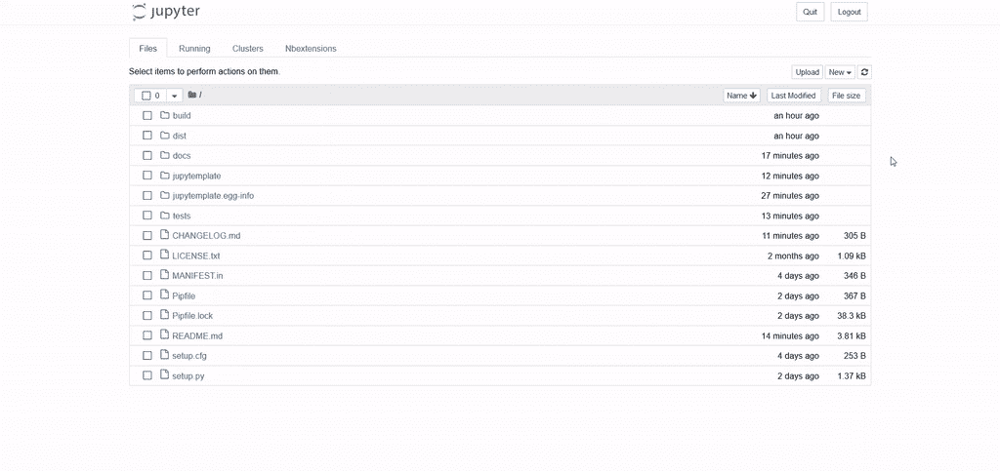

# 停止复制粘贴笔记本，拥抱 Jupyter 模板！

> 原文：<https://towardsdatascience.com/stop-copy-pasting-notebooks-embrace-jupyter-templates-6bd7b6c00b94?source=collection_archive---------9----------------------->

## jupytemplate 简介:Jupyter 的可配置模板


Jupyter 笔记本很牛逼。它们结合了代码、输出和文本，实现了快速原型开发、早期调试和有效的故事讲述。

尽管如此，笔记本电脑也有其自身的局限性，最令人讨厌的是有限的可扩展性、[促使开发人员重复代码的倾向](/lessons-from-a-real-machine-learning-project-part-1-from-jupyter-to-luigi-bdfd0b050ca5)以及缺乏标准结构。

许多文章、帖子和讲座都涉及这些话题。其中两个与本文特别相关。Joel Grus 在[*我不喜欢笔记本*](https://www.youtube.com/watch?reload=9&v=7jiPeIFXb6U) 中指责笔记本给开发人员和数据科学家灌输坏习惯。在回答 Joel 关于 [Medium](/set-your-jupyter-notebook-up-right-with-this-extension-24921838a332) 的问题时，Will Koehrsen 建议谴责罪恶而非罪人，并提出了一个有趣的解决方案。

# 笔记本的模板

一个模板。适用于各种数据科学笔记本的标准而灵活的框架。威尔认为，如果给人们提供一个合适的结构来填充他们的内容，他们就会被推动去实施最佳实践。

> 这种方法的好处是它改变了默认值。

当我们阅读 Will 的帖子时，x team 的数据科学团队和我立即寻找实施该解决方案的包。不幸的是，我们发现 PiPy 或 conda 上没有这种东西。

然后，我们决定构建自己的:我们开发了一个 [Jupyter 扩展](/jupyter-notebook-extensions-517fa69d2231)，它有两个主要特性。

首先，它允许你从一个模板创建每一个新的笔记本。模板本身就是一个笔记本，这样可以方便用户编辑，适应不同的需求。我们还提供了在现有笔记本中插入模板的可能性。

扩展附带的默认模板由 6 部分组成:

1.  **摘要**:笔记本的快速总结，包括其目的、方法、结果和建议的后续步骤
2.  **设置**:包和本地模块导入，最常见的数据科学库已经用它们的标准别名导入
3.  **参数**:影响笔记本的参数定义
4.  **数据导入**:报表加载笔记本中要使用的所有数据
5.  **数据处理**:核心处理，通常需要进一步细分
6.  **参考资料**:对文献或其他笔记本有用的参考资料

需要注意的是，这只是一个*默认的*模板。每个数据科学家都可以创建自己的数据。如果您碰巧这样做了，请告诉我，以便我们可以改进我们的存储库。

第二，每保存一个笔记本为*无标题*，要求用户重命名。

当然，这两种功能都可以通过扩展的[配置](https://github.com/Jupyter-contrib/jupyter_nbextensions_configurator)来启用或禁用。

# 利益

当我们在工作流中引入扩展的用法时，显著的改进变得显而易见。

有了共同的框架，其他团队成员的笔记本变得更容易阅读和共享。特别是摘要，为我们提供了 2 分钟的总结，让读者决定是深入研究代码还是查看其他地方。

随着部分准备好被填充，当肤浅地记录我们的代码时，我们开始感到内疚。这导致了更长更深刻的评论，从而提高了笔记本的整体可读性。

配置好本地导入并准备好使用后，就没有借口阻止相关代码从笔记本中重构到公共模块中。

有了模板中明确的命名约定，没有人会忘记它们。

最后，通过模板中嵌入的标准导入，我们能够节省一些时间来搜索正确导入模块的方法。

# 快速入门

我们的扩展可以在包`jupytemplate`中获得，开源并发布在 GitHub 上:[https://github.com/xtreamsrl/jupytemplate](https://github.com/donlelef/jupytemplate)。

虽然不是严格要求，但我们建议开始下载整套 [jupyter 扩展](https://github.com/ipython-contrib/jupyter_contrib_nbextensions)，目前还不包括 jupytemplate。

然后，通过运行以下命令安装 jupytemplate:

```
pip install jupytemplate
```

最后，在本地 Jupyter 实例中启用扩展:

```
jupyter nbextension install --py jupytemplate --sys-prefix
jupyter nbextension enable jupytemplate/main --sys-prefix
```

关于 GitHub 的文档中有更多的细节。

就是这样。您现在应该能够做这样的事情了。



我的读者，感谢你来到这里！

欢迎任何评论、问题或总体反馈。你可以在 LinkedIn 上和我联系(下面的链接)。

*如果你喜欢这篇文章，你可能会感兴趣:*

*   [*真实机器学习项目的经验，第 1 部分:从 Jupyter 到 Luigi*](/lessons-from-a-real-machine-learning-project-part-1-from-jupyter-to-luigi-bdfd0b050ca5)
*   [*真实机器学习项目的经验，第二部分:数据探索的陷阱*](/lessons-from-a-real-machine-learning-project-part-2-the-traps-of-data-exploration-e0061ace84aa)
*   [*介绍 tsviz，R Studio 中的交互式时间序列可视化*](/introducing-tsviz-interactive-time-series-visualization-in-r-studio-a96cde507a14)

*如果你对* [*me*](https://www.linkedin.com/in/emanuelefabbiani/) *或者*[*xtream*](https://www.linkedin.com/company/18545289/admin/)*有什么好奇的话，上 LinkedIn 看看吧！*