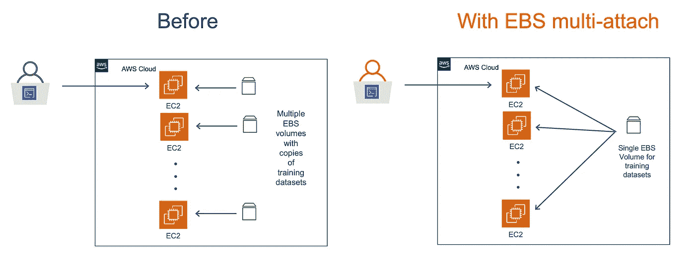
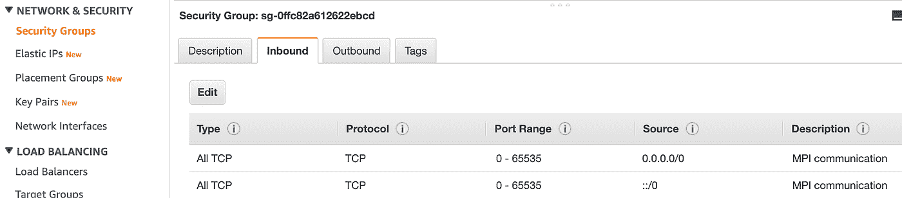
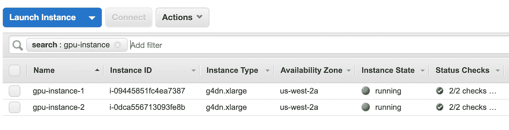
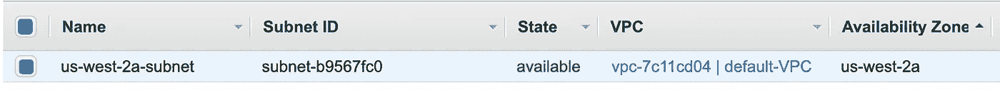
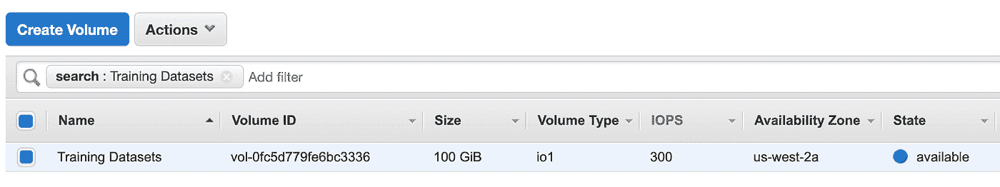
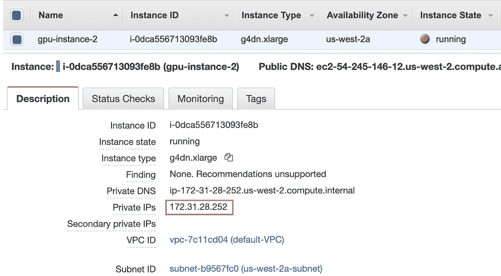
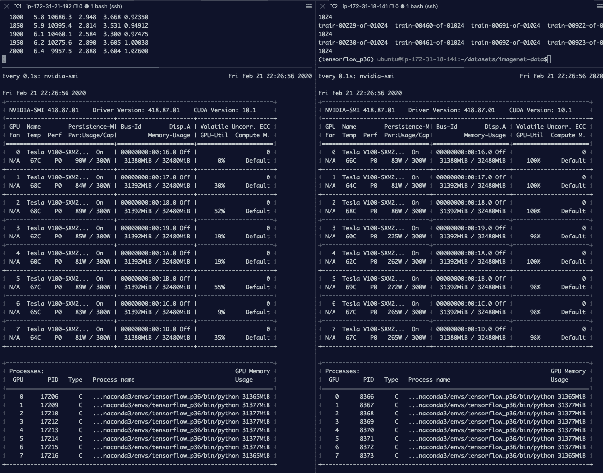
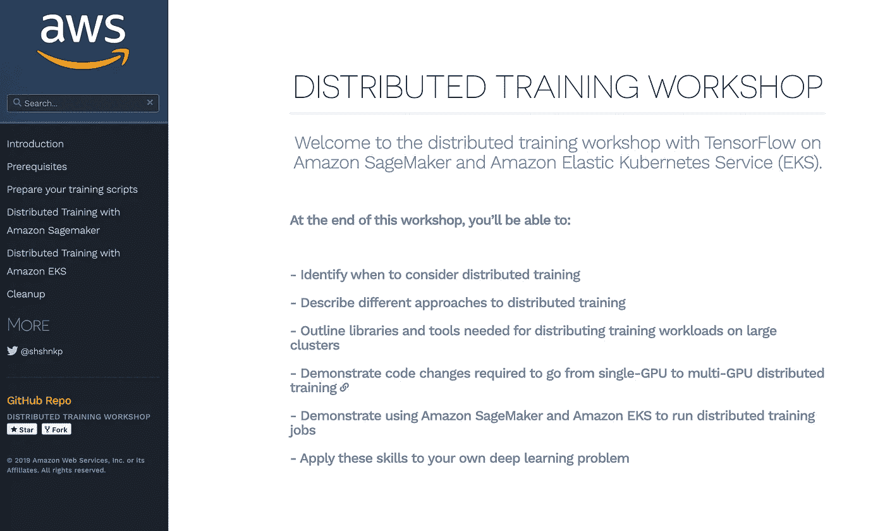

# 使用 Amazon EBS multi-attach 停止复制深度学习训练数据集

> 原文：<https://towardsdatascience.com/stop-duplicating-deep-learning-training-datasets-with-amazon-ebs-multi-attach-d9f61fdc1de4?source=collection_archive---------24----------------------->

## 使用单个训练数据集 EBS 卷在多达 16 个 EC2 实例和 128 个 GPU 上进行分布式训练！



> (20 年 2 月 26 日编辑:AWS 支持团队[发布警告](https://aws.amazon.com/premiumsupport/knowledge-center/ebs-access-volumes-using-multi-attach/)不鼓励使用标准文件系统，比如带有 EBS 多重连接的 xfs。xfs 不是一个支持集群的文件系统，可能会导致多重访问集群设置中的数据丢失。在我的实验中，这篇博文中的两个例子都没有出现问题，但是要小心生产工作负载。[点击此处阅读更多](https://aws.amazon.com/premiumsupport/knowledge-center/ebs-access-volumes-using-multi-attach/)。)

你们中的一些做深度学习的人足够幸运，他们有基础设施团队来帮助你设置 GPU 集群，安装和管理作业调度器，并为训练数据集托管和管理文件系统。

其余的人，你们必须管理好自己的装备。在开发过程中的某个时候，您将开始探索分布式训练，并运行并行模型和超参数搜索实验。当您考虑扩展选项时，您会发现使用 EC2 添加更多 GPU 非常容易。不容易的部分？—复制和管理数据集。

如果您熟悉云，您可以完成为您的训练数据集创建和管理 Amazon EBS 卷快照的过程，或者您可以为您的所有训练 EC2 实例托管一个网络附加文件系统。但让我们面对它，这比你报名参加的工作更多，当你想做的只是回去开发机器学习模型。

在我看来，AWS 最近宣布了自 12 月 re:invent 2019 以来最令人兴奋的 AI/ML 更新之一——亚马逊 EBS 的新[多附加功能。现在，您可以将单个 EBS 卷附加到多个 EC2 实例，最多 16 个 EC2 实例！对于深度学习，翻译过来就是一个**单个 EBS 卷向多达 128 个 GPU 提供训练数据**！您可以从已经使用的 EBS 卷中获得所有网络文件系统的好处。](https://aws.amazon.com/blogs/aws/new-multi-attach-for-provisioned-iops-io1-amazon-ebs-volumes/)

在这篇博文中，我将展示在多个 EC2 GPU 实例上运行分布式训练的一步一步的演练。我将向您展示如何使用单个 EBS 卷来存储整个训练数据集，并将其附加到多个 EC2 实例。不再拷贝和复制数据集！

这篇博文包含两个使用 EBS 多附加的深度学习示例:

1.  第一个示例是设置两个 GPU EC2 实例的分步演练，两个实例都连接了一个公共 EBS 卷，并在 CIFAR-10 数据集上运行分布式培训
2.  第二个例子是一个更现实的场景，展示了如何使用 16 个 GPU 在 ImageNet 数据集上进行训练。ImageNet 数据集消耗 144 GB 的磁盘空间，使用 EBS 多重连接，您不再需要在多个实例之间复制它。

GitHub 上的所有代码和示例都在这里:[https://GitHub . com/shashankprasanna/distributed-training-EBS-multi-attach . git](https://github.com/shashankprasanna/distributed-training-ebs-multi-attach.git)

如果您对管理集群和存储的替代方法感兴趣，请向下滚动到“替代方法和建议”部分。

# 示例 1:在 Amazon EC2 和 Amazon EBS multi-attach 上使用 TensorFlow 和 Horovod 进行分布式深度学习训练

为了演示使用 EBS 多附加功能进行分布式深度学习培训的过程，我使用了一个简单的双节点设置，其中,`g4dn.xlarge` EC2 实例中的每个节点都有一个 NVIDIA T4 GPU。接下来，我假设您有一个 [AWS 帐户](https://aws.amazon.com/free/)，并且在您的主机上安装了 [AWS CLI 工具](https://aws.amazon.com/cli/)。您将主要使用 AWS CLI 来创建和管理资源，但是，您也可以使用 AWS 控制台来执行其中的大多数步骤。

# 步骤 1:启动 EC2 实例

首先启动 2 个类型为`g4dn.xlarge`的 EC2 实例。对于深度学习训练，G4 实例不如 P3 实例强大，但价格低廉，非常适合原型开发。G4 实例在推理工作负载方面非常出色，您可以在 [G4 产品页面](https://aws.amazon.com/ec2/instance-types/g4/)上了解更多信息。

```
aws ec2 run-instances \
 --image-id ami-07728e9e2742b0662 \
 --security-group-ids <SECURITY_GROUP_ID> \
 --count 2 \
 --instance-type g4dn.xlarge \
 --key-name <KEYPAIR_NAME> \
 --subnet-id <SUBNET_ID> \
 --query “Instances[0].InstanceId”
```

`image-id` 对应深度学习 AMI Ubuntu 镜像，预装深度学习框架，如 TensorFlow、PyTorch、MXNet 等。指定您的`security-group-ids`、`key-name`和`subnet-id`并启动您的实例。您应该在输出中看到每个实例的实例 id。

输出:

```
[
“i-<INSTANCE_ID>”,
“i-<INSTANCE_ID>”
]
```

确保您的安全组允许消息传递接口(MPI)工作的所有端口上的 TCP 流量。本例用来进行分布式训练的 Horovod 库依靠 MPI 通信协议与所有其他 EC2 实例对话，并在训练期间分担工作负载。



显示安全组允许所有端口上的 TCP 通信的屏幕截图

为新创建的 EC2 实例添加标记。让我们将它们命名为`gpu-instance-1`和`gpu-instance-2`，以便在 AWS 控制台中容易识别和搜索。在这篇文章的剩余部分，我将引用这些名字的实例。

```
aws ec2 create-tags --resources <INSTANCE_ID> --tags Key=Name,Value=gpu-instance-1aws ec2 create-tags --resources <INSTANCE_ID> --tags Key=Name,Value=gpu-instance-2
```



AWS EC2 控制台显示 gpu-instance-1 和 gpu-instance-2

# 步骤 2:创建一个启用了多重连接的 EBS 卷，用于存储训练数据集

在与启动 EC2 实例的`SUBNET_ID`相同的可用性区域中创建一个 100G 的卷。即****EBS 卷必须与 EC2 实例在同一个可用区(AZ)中，它将被附加到**。在本例中，我的 EC2 实例和 EBS 卷都在`us-west-2a`可用性区域和相应的`subnet-id`中，如 AWS VPC 控制台所示。**

****

**确保 EC2 实例子网 id 对应于 EBS 卷可用性区域(us-west-2a)**

**要在`us-west-2a`中创建一个带有名称标签`Training Datasets`的 100G 卷，请运行以下命令:**

```
aws ec2 create-volume --volume-type io1 --multi-attach-enabled --size 100 --iops 300 --availability-zone us-west-2a --tag-specifications 'ResourceType=Name,Tags=[{Key=Name,Value=Training Datasets}]'
```

****

**显示在 us-west-2a 可用性区域中新创建的 EBS 卷的屏幕截图**

# **步骤 3:将 EBS 附加到多个 EC2 实例**

**在本例中，您只使用 2 个 EC2 实例，因此您将使用正确的实例 ID 调用`aws ec2 attach-volume`两次，将 EBS 卷连接到两个 EC2 实例。如果有其他 EC2 实例需要访问该 EBS 卷，请重复此步骤。**

```
aws ec2 attach-volume —-volume-id vol-<VOLUME_ID> —-instance-id i-<INSTANCE_ID> --device /dev/xvdfaws ec2 attach-volume —-volume-id vol-<VOLUME_ID> -—instance-id i-<INSTANCE_ID> --device /dev/xvdf
```

**输出:**

```
{
“AttachTime”: “2020–02–20T00:47:46.563Z”,
“Device”: “/dev/xvdf”,
“InstanceId”: “i-<INSTANCE_ID>”,
“State”: “attaching”,
“VolumeId”: “vol-<VOLUME_ID>”
}
```

# **步骤 4:将代码和数据集下载到 EBS 卷**

## **获取实例 IP 地址，以便我们可以 SSH 到实例中**

```
aws ec2 describe-instances --query 'Reservations[].Instances[].{Name:Tags[0].Value,IP:PublicIpAddress}' --filters Name=instance-state-name,Values=running
```

**输出:**

```
[
 {
  “Name”: “gpu-instance-1”,
  “IP”: “<IP_ADDRESS>”
 },
 {
  “Name”: “gpu-instance-2”,
  “IP”: “<IP_ADDRESS>”
 }
]
```

## **使用您的密钥对 SSH 到第一个实例 gpu-instance-1**

**从您的主机上，使用 EC2 密钥对 SSH 到`gpu-instance-1`**

```
ssh -i ~/.ssh/<key_pair>.pem ubuntu@<IP_ADDRESS>
```

## **运行 lsblk 来识别要装载的卷**

```
lsblk
```

**输出:**

```
…
…
nvme0n1 259:2 0 95G 0 disk
└─nvme0n1p1 259:3 0 95G 0 part /
nvme1n1 259:1 0 116.4G 0 disk
**nvme2n1 259:0 0 100G 0 disk**
```

****注意:**不能保证卷的顺序，请检查以确认您的卷的确切名称。应该是 nvme1n1 或者 nvme2n1。如果您附加了额外的 EBS 卷，它可能会有不同的名称。**

## **创建新的文件系统**

**因为这是一个新的 EBS 卷，所以它还没有文件系统。如果没有文件系统，您应该会看到如下输出:**

```
sudo file -s /dev/nvme2n1
```

**输出:**

```
/dev/nvme2n1: data
```

**让我们创建一个文件系统:**

```
sudo mkfs -t xfs /dev/nvme2n1
```

**确认文件系统已创建:**

```
sudo file -s /dev/nvme2n1
```

**输出:**

```
/dev/nvme2n1: SGI XFS filesystem data (blksz 4096, inosz 512, v2 dirs)
```

## **在 home 下创建一个数据集目录，并挂载 EBS 卷**

```
mkdir ~/datasets
sudo mount /dev/nvme2n1 ~/datasets
```

## **将 CIFAR10 培训数据集下载到卷中**

```
cd ~/datasetsgit clone [https://github.com/shashankprasanna/distributed-training-ebs-multi-attach.git](https://github.com/shashankprasanna/distributed-training-ebs-multi-attach.git)source activate tensorflow_p36python ~/datasets/distributed-training-ebs-multi-attach/generate_cifar10_tfrecords.py --data-dir ~/datasets/cifar10
```

**验证数据集是否已下载(使用`sudo apt install tree`安装树包)**

```
tree ~/datasets/cifar10
```

**输出:**

```
/home/ubuntu/datasets/cifar10
├── eval
│ └── eval.tfrecords
├── train
│ └── train.tfrecords
└── validation
  └── validation.tfrecords
```

# **步骤 5:授权 gpu-instance-1 和 gpu-instance-2 EC2 实例之间的 SSH 通信**

**第一个 EC2 实例`gpu-instance-1`应该被授权建立到`gpu-instance-2`的 SSH 连接。在`gpu-instance-1`上运行以下步骤**

## **在 gpu-instance-1 上创建新的密钥对**

**运行`ssh-keygen`并按两次回车键来创建一个新的密钥对。**

```
ssh-keygenls ~/.ssh
```

**输出:**

```
authorized_keys id_rsa id_rsa.pub
```

## **选择公钥并将其从终端复制到剪贴板**

```
cat ~/.ssh/id_rsa.pub
```

## **将复制的公钥添加到 gpu-instance-2 中的 authorized_key**

**从您的主机(不是`gpu-instance-1`)建立到`gpu-instance-2`的 SSH 连接，并将`gpu-instance-1`的公钥添加到`gpu-instance-2`的授权密钥列表中。使用步骤 4 中的说明获取 IP 地址。**

```
ssh -i ~/.ssh/<key_pair>.pem ubuntu@<IP_ADDRESS>cat >> ~/.ssh/authorized_keys
```

**在提示符下粘贴你的剪贴板内容并按 Ctrl+d 退出(或者你可以使用你最喜欢的文本编辑器打开`~/.ssh/authorized_keys`并在文件末尾粘贴密钥，保存并退出)**

## **确认密钥已被添加**

```
cat ~/.ssh/authorized_keys
```

## **确认您可以建立从 gpu-instance-1 到 gpu-instance-2 的 SSH 连接**

**从你的主机 SSH 到`gpu-instance-1`。并从`gpu-instance-1`建立到`gpu-instance-2`的 SSH 连接，以确保它们两个实例可以通信。**

**在`gpu-instance-1`上，运行:**

```
ssh <IP_GPU_INSTANCE_2>
```

**您应该可以成功登录`gpu-instance-2`**

# **步骤 6:在 gpu-instance-2 上挂载多附加 EBS 卷**

**从您的主机 ssh 到`gpu-instance-2`，按照与**步骤 4** 相同的步骤 SSH 到`gpu-instance-2`，挂载 EBS 卷。**

```
ssh -i ~/.ssh/<key_pair>.pem ubuntu@<IP_ADDRESS>
mkdir ~/datasets
lsblk
```

**输出:**

```
…
…
nvme0n1 259:2 0 95G 0 disk
└─nvme0n1p1 259:3 0 95G 0 part /
nvme1n1 259:1 0 116.4G 0 disk
**nvme2n1 259:0 0 100G 0 disk**
```

**如果您不打算在培训期间将元数据或其他调试信息写入该卷，请将 EBS 卷挂载为只读。如果您确实希望在培训期间使用相同的卷来保存其他信息，请移除下面的`-o ro`选项。请确保在卷上创建一个专用位置来保存您的信息，以避免由于多个实例写入同一个卷而导致潜在的数据丢失。**

```
sudo mount -o ro /dev/nvme2n1 ~/datasets
```

**验证您可以看到数据集(使用 sudo apt install tree 安装树包)**

```
tree ~/datasets/cifar10
```

**输出:**

```
/home/ubuntu/datasets/cifar10
├── eval
│ └── eval.tfrecords
├── train
│ └── train.tfrecords
└── validation
└── validation.tfrecords
```

**执行 TensorFlow 环境的一次性激活，以初始化`~/.keras`中的 keras 配置文件**

```
source activate tensorflow_p36
```

# **步骤 7:运行分布式培训**

**通过运行以下命令获取`gpu-instance-2`的私有 IP**

```
aws ec2 describe-instances --query 'Reservations[].Instances[].{Name:Tags[0].Value,IP:PrivateIpAddress}' --filters Name=instance-state-name,Values=running
```

**或者在 AWS EC2 控制台上查找。**

****

**AWS EC2 控制台的屏幕截图，显示了 gpu-instance-2 的私有 IP 地址**

**从您的主机 SSH 到`gpu-instance-1` EC2 实例，并使用您喜欢的编辑器在`run-dist-training-cifar10`脚本中将`<PRIVATE_IP_ADDR>`替换为私有 IP 地址`gpu-instance-2`。**

```
vim ~/datasets/distributed-training-ebs-multi-attach/run-dist-training
```

**如果`tensorflow_p36`环境仍处于活动状态，则将其停用**

```
source deactivate
```

**开始分布式训练**

```
sh datasets/distributed-training-ebs-multi-attach/run-dist-training-cifar10
```

**培训应该开始了。您将在终端输出中看到，每个时期有两个条目，对应于以分布式方式在两个 EC2 实例上运行的训练。您可以通过运行`nvidia-smi`来监控每个实例上的 GPU 利用率。在下面的例子中，我提供了一个截图。**

```
…
Epoch 25/30
156/156 [==============================] — 7s 46ms/step — loss: 1.2140 — acc: 0.5605 — val_loss: 1.3709 — val_acc: 0.4946
Epoch 25/30
156/156 [==============================] — 7s 47ms/step — loss: 1.2073 — acc: 0.5665 — val_loss: 1.2615 — val_acc: 0.5337 ETA: 0s — loss: 1.2065 — acc: 0.5670
Epoch 26/30
156/156 [==============================] — 7s 47ms/step — loss: 1.2005 — acc: 0.5665 — val_loss: 1.2615 — val_acc: 0.5337
Epoch 26/30
156/156 [==============================] — 7s 46ms/step — loss: 1.2034 — acc: 0.5677 — val_loss: 1.2524 — val_acc: 0.5239 ETA: 0s — loss: 1.1819 — acc: 0.5729
Epoch 27/30
156/156 [==============================] — 7s 46ms/step — loss: 1.1850 — acc: 0.5677 — val_loss: 1.2524 — val_acc: 0.5239
Epoch 27/30
156/156 [==============================] — 7s 46ms/step — loss: 1.1833 — acc: 0.5769 — val_loss: 1.1436 — val_acc: 0.5825 ETA: 0s — loss: 1.1798 — acc: 0.5774
Epoch 28/30
156/156 [==============================] — 7s 46ms/step — loss: 1.1797 — acc: 0.5769 — val_loss: 1.1436 — val_acc: 0.5825
Epoch 28/30
…
```

# **示例 2:在 16 个 GPU 上使用 144 GB Imagenet 数据集的分布式培训，使用单个 EBS 卷作为培训数据集**

**遵循示例 1 中的步骤 1、2 和 3，对步骤 1 进行以下更改——在 instance-type 下将 GPU 实例从`g4dn.xlarge`更新为`**p3dn.24xlarge**` 。`p3dn.24xlarge`实例包括 8 个 NVIDIA V100 GPUs。**

**在步骤 4 中，不下载 CIFAR10 数据集，而是下载 144 GB ImageNet 数据集，如“准备 ImageNet 数据集”一节下的[文档中所述。继续执行示例 1 中的步骤 5 和 6。](https://docs.aws.amazon.com/dlami/latest/devguide/tutorial-horovod-tensorflow.html)**

**完成所有设置后，运行以下脚本启动分布式培训:**

```
cd ~/datasetsgit clone [https://github.com/shashankprasanna/distributed-training-ebs-multi-attach.git](https://github.com/shashankprasanna/distributed-training-ebs-multi-attach.git)sh datasets/distributed-training-ebs-multi-attach/run-dist-training-cifar10
```

****

**显示训练期间 gpu-instance-1 和 gpu-instance-2 上 GPU 利用率的屏幕截图**

# **限制**

**特性文档页面列出了多附加特性的注意事项和限制，我建议浏览一遍以避免将来可能出现的问题:[https://docs . AWS . Amazon . com/AWS ec2/latest/user guide/EBS-volumes-multi . html #注意事项](https://docs.aws.amazon.com/AWSEC2/latest/UserGuide/ebs-volumes-multi.html#considerations)**

**机器学习工作负载的主要考虑因素是:**

*   **避免让多个实例写入多附加 EBS 卷。对于数据覆盖，您没有任何保护措施。我建议以一次写入多次读取的方式使用它。**
*   **该功能仅在基于硝基的实例上可用。Nitro 系统依赖于 AWS 构建的硬件和软件，通常提供更好的性能。缺点是可供选择的实例较少。对于深度学习训练，你可以选择基于 G4 的实例和`p3dn.24xlarge`实例。**
*   **您只能将一个 EBS 卷多重连接到同一可用性分区中的实例。**

# **分布式培训的替代方案和建议**

**上面的设置非常适合不想处理与容器技术和网络文件系统相关的复杂性的开发人员和数据科学家的小团队。然而，在机器学习开发过程的某个时刻，开始容器化您的工作负载并利用集群编排服务来管理大规模机器学习会有所帮助。**

**对于 AWS 上的集群管理培训，您有几个选择:Amazon Elastic Kubernetes Services(EKS)，Amazon Elastic Container Service(ECS)。您将不得不深入 devops 领域，学习管理生产 EKS 和 ECS 集群的神秘艺术。作为机器学习的实践者，你可能不喜欢这样做。**

**在完全管理的一端，有 Amazon SageMaker，在我看来，这是扩展您的培训工作量的最简单和最容易的方法之一。此外，它还与亚马逊 S3 无缝集成，因此您不必管理数据集迁移。**

**在存储方面，您可以考虑托管一个 Amazon 弹性文件系统(EFS)，并将其安装到您的所有实例中。EFS 的一个好处是它是多可用性区域(AZ ),您可以将文件系统挂载到同一区域的多个子网中的 EC2 实例。为了获得更高的性能，您可以考虑 Amazon FSx for Lustre 文件系统。FSx 给 Lustre 带来的好处是，它可以链接到现有的亚马逊 S3 桶。如果您的数据首先位于 S3，那么您就不必将数据集从 S3 迁移到 FSx 以用于 Lustre，也不必担心同步更改，这是自动为您完成的！**

**如果你对以上任何一种方法感兴趣，你可以按照这里的说明亲自尝试一下:[distributed-training-workshop.go-aws.com/](https://distributed-training-workshop.go-aws.com/kubernetes_dist_training/workflow.html)**

****

**在你走之前，另一个小建议:**在你横向扩展之前总是纵向扩展****

**纵向扩展是将更多的计算打包到一台机器上的过程。换句话说，从一个 EC2 实例开始，使用一个更小的 GPU，比如 G4。如果你的实验进行得很顺利，那就换一个更强大的 GPU，比如 p3.2xlarge 上的 V100。如果您想要更大的马力，那么在单个实例上获得额外的 GPU，并且您可以通过 p3.16xlarge 和 p3dn.24xlarge 获得最多 8 个 GPU。纵向扩展的优势是您不会跨越网络障碍来与其他 CPU 和 GPU 通信，这可能会增加通信延迟。一旦达到纵向扩展的极限(每个 EC2 实例 8 个 GPU)，就可以开始横向扩展，即添加额外的实例。例如，如果您需要 8 个 GPU，请始终首选单个具有 8 个 GPU 的 EC2 实例，如 p3.16xlarge，而不是两个各具有 4 个 GPU 的 EC2 实例，如 p3.8xlarge。**

**感谢您的阅读，GitHub 上的所有代码和示例都在这里:**

**[https://github . com/shashankprasanna/distributed-training-EBS-multi-attach . git](https://github.com/shashankprasanna/distributed-training-ebs-multi-attach.git)**

**如果你有问题，请在推特( [@shshnkp](https://twitter.com/shshnkp) )、 [LinkedIn](https://www.linkedin.com/in/shashankprasanna/) 联系我或者在下面留言。尽情享受吧！**