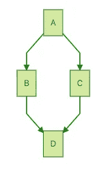

# 停止寻找借口，开始记录你的代码。现在。

> 原文：<https://towardsdatascience.com/stop-finding-excuses-and-start-documenting-your-code-now-1c53da69eb5e?source=collection_archive---------47----------------------->

## 学习如何记录你的代码，并帮助他人自然地完成它

记录代码是一门艺术还是仅仅是一个简单的程序？我过去和现在都在听同样的老故事。他们没有给我们足够的时间做记录。我们太忙了，没有时间记录代码。这可能是一个方便的借口。事实是很多项目都没有文档记录，大部分代码也是如此。这将我们带到了一个危险的境地，只有在开始时做过的人才会去做，因为只有他知道事情是如何运作的。我认为这种情况对于所有中型\大型项目来说都是不可容忍的。项目和代码需要被很好地记录，所有的知识必须被编写并在团队中共享。这是幻想？我知道这可能很难实现。我知道我们在压力下工作，顾客总是匆匆忙忙。但是我们有两个选择:做正确的事情或者承受未记录代码的后果。

在本文中，我将揭示一些我在开发生涯中经历过的技巧和最佳实践。我不能保证时间会停止，在你离开办公室之前，你会有时间记录代码。我不能保证每个人都能理解你所有的代码。我不是骗子，我不能创造奇迹😄。我可以肯定的是分享我的经验，帮助您更有效地编写文档，并让这些实践与业务请求共存。我希望这有所帮助。


福图迪[像素](https://pixabay.com/it/users/Pexels-2286921/?utm_source=link-attribution&utm_medium=referral&utm_campaign=image&utm_content=1845614)达[像素](https://pixabay.com/it/?utm_source=link-attribution&utm_medium=referral&utm_campaign=image&utm_content=1845614)

# 在代码中记录，在编码时记录

文档例行程序的第一个目标是消除任何摩擦。传统的方法需要复杂的上下文切换，并且使文档不舒服。想想你开始创建代码，然后(可能几天后)完成它并开始记录的流程。这样做的精神压力很大。你需要记住所有的东西，找到合适的 postman 样本添加到文档中，查看代码找到片段…这需要大量的时间和精力。

我的建议是边编码边记录。当你在做某件事的时候，你会把它写下来。这意味着没有上下文切换。这样可以节省时间，让你一步步“冲洗”思路。它还能在您工作时帮助您，因为您正在构建的文档也会对您有所帮助。

许多 IDE 允许你编写混合了代码的文档，并用一些魔法(或工具……)自动创建文档。

我不相信你需要把大脑放在哪里的自动化。我更喜欢在需要的地方使用常规的代码注释，并使用单独的文档来解释代码是如何工作的。

在“代码本身内部”记录代码是有帮助的，因为它减少了工具之间的摩擦(你不需要在工具之间切换)。在大多数情况下，您的文件可以用 markdown 编写，并以人的形式查看，因此这是一个好的解决方案。

> 不要把今天能做的事情推迟到明天

在我的 IDE 上，我总是找到一种方法来管理代码附近的文档，并且在我处理它的时候记录我正在做的事情。例如，如果我准备了一个 API，并且我正在用 Postman 测试它，我将把这个例子复制粘贴到 markdown 文件上，因为它是稳定的，注释输入和输出。当我开发它的时候，我会花一分钟来做这件事。如果我在那之后几天做，我可能会花半个小时来仔细检查 API 调用，记住我对这样的输入和输出的意思…这种实践将帮助你和你的团队保持文档更新。

# 更好的评论是没有写出来的

当我们谈论代码本身时，第一条规则是，如果你需要对一行代码进行注释，那就有问题了。理论上，每一行代码、每一个过程名、每一个变量名都应该被选择成不言自明的。在现实世界中，这并不总是可能的，或者我们有违反直觉的要求。这就是我们被迫注释部分代码的原因。你解释得越少，读者就会越清楚。任何时候你打算评论一段代码，你都会问自己“为什么”如果是因为有害代码，那就改吧。

PS:这并不意味着你不必对代码进行评论😄。我的意思是，第一个选项是写不需要注释的好代码，第二个选项是对它进行注释。编写不可理解的代码并且不做注释是不可取的。

# 一张图胜过千言万语

有可能(成千上万)的情况下，事情太复杂，无法用语言来解释。即使你能，难以解释的事情往往也难以理解。如果可以的话，在你的解释中添加一张图。这很有帮助。这对你很有用，因为它有助于修正想法，并且对将来阅读文档的人来说是纯金(你可能就是其中之一！).

我们不需要艺术品。我们只需要一幅画。所以，尽可能少花时间在审美问题上，把注意力放在你放入图表的信息上。信息很重要，只有这个。我经常使用 draw.io 平台，这个平台简单易用，免费，只需要一个浏览器就可以工作。这是一个很好的解决方案，但需要一点努力。您需要将图表保存到云中并下载图像，或者将图表作为文件保存到您的代码库中。在任何情况下，您都需要手动步骤和摩擦(打开文件、绘制、保存、重新绘制、修复…)。另一个可以使用的解决方案是一种图表的 markdown(Mermaid，PlantUML，但是还有其他的),它可以直接集成到 markdown 文件中。下面仅举一个例子:

```
graph TD;     
A-->B;     
A-->C;     
B-->D;     
C-->D;
```

会产生这样一个自上而下的流程:



用美人鱼制作的一个例子

要呈现图表，您需要您的 markdown 呈现支持这种语法，或者您可以安装一些 web 浏览器扩展。

# 带什么回家

我们可以用一句话来总结记录代码的必要性:

> Verba volant，scripta manent

这个拉丁句子的意思是，你所写的保持不变，所讲述的……是不稳定的。我们为他人，也为我们自己记录代码。想想你，“明天的你”，当你在那个棘手的功能上工作的时候。或者对自己说，插手你同事的工作。你更愿意开始做逆向工程来满足功能需求(如果功能端有写的话)还是干脆看个解释？

记录不是一个选项。你用书面交流的越多，留下的痕迹就越多。开始写而不是说是连续记录的第一步。下一步是找到一个过程和一些工具来帮助我们利用每天的每一个小贡献。

要有好的文档，你需要合适的工具，合适的规则，但最重要的是。你需要培养正确的习惯。

如果做得正确，记录代码是一项投资，它会让你节省更多的时间\金钱。如果只是因为我们需要去做而去做，它并不会带来结果，它只是一种成本。