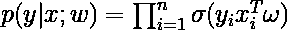
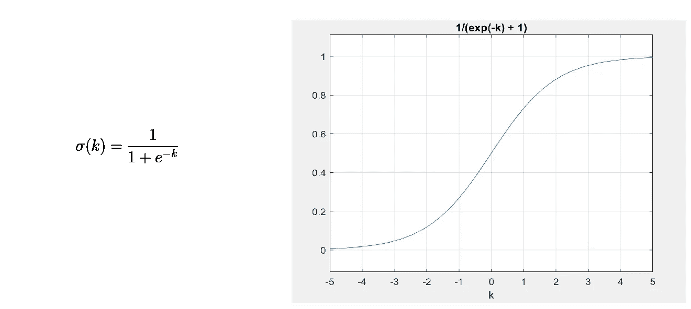

# 基于逻辑回归的停车标志检测——第一部分

> 原文：<https://towardsdatascience.com/stop-sign-detection-using-logistic-regression-part-i-315f7c0c8636?source=collection_archive---------37----------------------->

在本教程中，我们将使用二进制逻辑回归来训练 Python 中的红色分类器。

为了保持教程相对简短，我将它分为两部分——第一部分:使用逻辑回归创建颜色分类器。第二部分:使用从颜色分类器获得的二值掩码检测停车标志。

照片由[免费使用声音](https://unsplash.com/@freetousesoundscom?utm_source=unsplash&utm_medium=referral&utm_content=creditCopyText)在 [Unsplash](https://unsplash.com/s/photos/stop-sign?utm_source=unsplash&utm_medium=referral&utm_content=creditCopyText)

任何机器学习问题的第一步都涉及到访问一个好的训练数据集——在我们的例子中，我们需要仅由红色组成的图像(正样本)，以及包含除红色之外的其他颜色的图像(负样本)。我能够创建一个数据集，它有一个不同的红色图像池，这些图像是在不同的照明条件下从停车标志中提取的。这些光照变化将允许我们训练相对健壮的颜色分类器。除了红色之外的颜色被包括在训练集中作为负样本。你可以在我的 GitHub 上找到数据集:[https://github.com/MariaHarris24/StopSign_detection](https://github.com/MariaHarris24/StopSign_detection)。

在我说明本教程的编码部分之前，我们首先需要理解逻辑回归的基本原理和训练它所涉及的数学。

# 作为分类问题的颜色分割

逻辑回归是一种判别模型，即，它模拟条件概率分布**P(y | x；w)** 使用 Sigmoid 函数:

这里，' **x** 是指单个像素值，而' **y** '是标量(-1 或 1)，是与像素 x 相关联的标签，' **ω** '是训练时需要学习的权重参数。

下面您可以看到 sigmoid 函数的数学和图形表示:

Sigmoid 函数——作者图片

sigmoid 函数具有将连续值转换为伯努利(离散)分布的特性，而伯努利分布又可用于分类目的。从上图中我们可以看到，对于 k 的较大值，该函数将产生 1，对于 k 的较小值，该函数将产生 0。需要注意的是，当我们处理两个类之间的分类时，即二元分类(这是我们的情况)时，使用 sigmoid。对于两个以上/多类分类，使用 softmax 函数。

现在，我们已经对 sigmoid 如何工作有了直观的了解，我们现在需要估计权重参数“ω”,以便我们能够最大化条件概率 P(y | x；ω) —从数学上讲，这可以写成如下形式:

> 上面的等式是 MLE 版本，我不会在文章中涉及这个主题。我只是想提一下，这样你就可以验证这个等式的来源了。

对于上面的等式，可以通过使用梯度下降来获得‘ω’的最佳值。由于梯度下降涉及到 ***最小化*** 一个函数；因此，我们将使用 log p 的 ***负***(y | x；ω)作为最小化的函数，这在数学上等同于上面的等式。我们现在可以为我们的问题写出梯度下降方程如下:

给出梯度下降的快速入门；这是一种优化技术，可用于迭代寻找函数的最小值。这个最小值可能是/可能不是全局最小值。梯度下降背后的直觉是，我们对我们试图寻找最小值的函数求导。这个导数本质上是函数的切线/斜率，我们的目标是向与此相反的方向移动，即负梯度的方向，直到我们达到最小值。收敛速度由称为学习速度"**α"-**的参数决定，这决定了每次迭代过程中的步长(移动量)。

*太好了！我们已经奠定了这一切背后的基础数学，现在我们可以实际编写代码来训练我们的颜色分类器。*

# 导入数据集:

首先，我们需要加载和重塑我们的训练数据。下面你可以找到一个函数的代码，这个函数将从指定的文件夹中读取图像，并将它们堆叠成一个 Nx3 矩阵。这里，单独的三个通道(RGB)将用作特征，三个 RGB 通道中每个通道的像素值将填充特征空间，这就是为什么我们有一个 Nx3 矩阵。此外，该函数还将为每个像素值生成适当的标签:红色为 1，其他颜色为-1。请确保为“label_val”参数传入正确的值，因为这决定了对应于像素的标签将占用什么值。

# 培训:

一旦我们加载了训练数据，下一步就是使用梯度下降来训练颜色分类器(参考下面的代码)。该函数返回参数“ω”的向量(3x1)。我们将使用这个参数来描述我们在测试部分中解释的分类边界。您可以更改学习率和迭代次数。为了检查收敛性，我绘制了以前的ω和现在的ω之间的差异。如果它们之间的绝对差异在几次迭代中非常小，这表明我们很可能已经获得了最小值。但是，一定不要通过大量迭代训练分类器来过度拟合数据。

还有一点要澄清的是，梯度下降的代码实现与我之前引用的公式不同；这是因为代码是矢量化的格式(效率要高得多)，而不是前面提到的基于元素的公式。

# 测试:

逻辑回归生成一个线性决策边界，由等式**x .ω= 0**(x 和ω的点积)描述。因此，对于 **x.ω≥0，**即位于或高于线性边界的像素值将被预测为红色正像素，而对于 **x.ω < 0，**该像素将被预测为红色负像素。这可以通过参考下图的两个特征来更好地理解:

使用 x.w=0 的点分类示例-按作者分类的图像

这一步的代码非常简单。我们将测试图像和ω发送到一个函数，该函数执行两者之间的点积，然后根据前面提到的点积标准对像素进行分类。对于分类步骤，我们将为预测为红色的像素分配值 255，为预测为非红色的像素分配值 0，这样我们将获得二进制掩码。该函数的代码如下所示:

原始图像及其二进制遮罩如下所示。

左图:原图(照片由[威尔·波拉达](https://unsplash.com/@will0629?utm_source=unsplash&utm_medium=referral&utm_content=creditCopyText)在 [Unsplash](https://unsplash.com/s/photos/stop-sign?utm_source=unsplash&utm_medium=referral&utm_content=creditCopyText) 上拍摄)。右图:二进制掩码

正如你所看到的，我们的分类器能够分割红色像素。接下来，我们需要使用某种形状检测标准来辨别停车标志的形状。这将在第二部分讨论。感谢您的阅读！