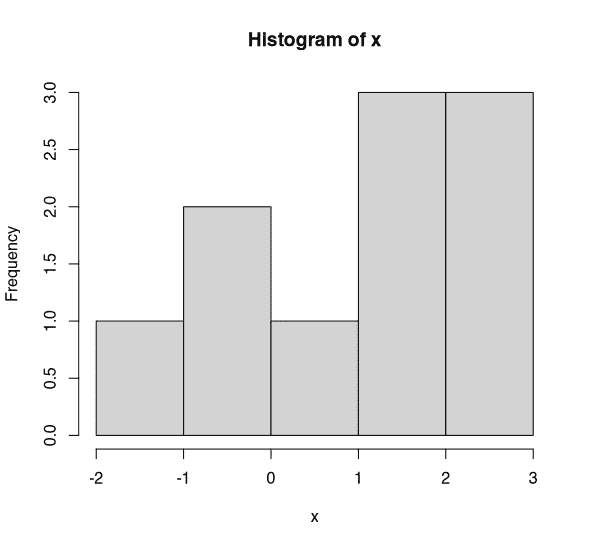
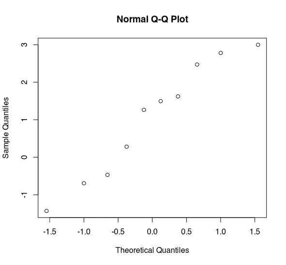
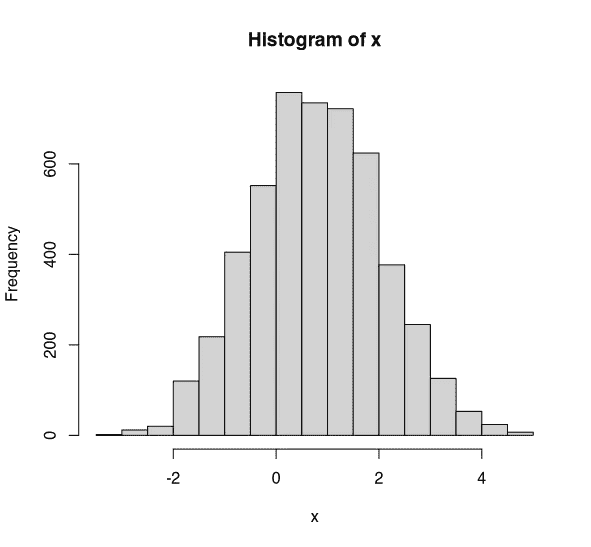
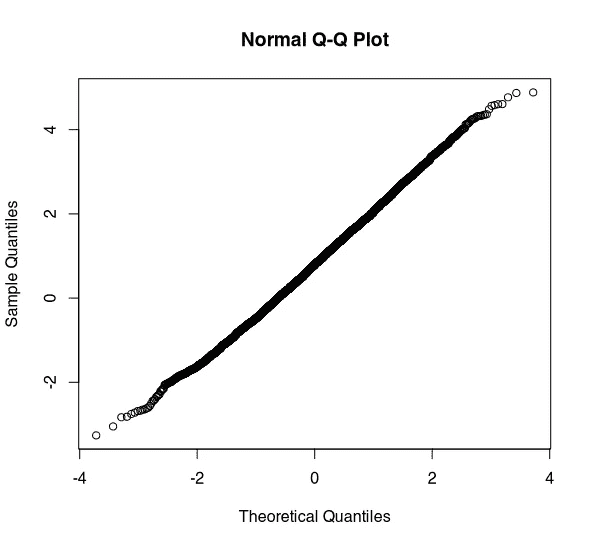

# 停止测试正常性

> 原文：<https://towardsdatascience.com/stop-testing-for-normality-dba96bb73f90?source=collection_archive---------18----------------------->

拉斐尔·比斯卡尔迪在 [Unsplash](https://unsplash.com?utm_source=medium&utm_medium=referral) 上拍摄的照片

## 常态测试是误导和浪费你的时间！

我看到许多数据科学家使用诸如[夏皮罗-维尔克](https://en.wikipedia.org/wiki/Shapiro%E2%80%93Wilk_test)测试和[科尔莫戈罗夫-斯米尔诺夫](https://en.wikipedia.org/wiki/Kolmogorov%E2%80%93Smirnov_test)测试来检验正态性。别这样。别说了。如果你还不相信(我不怪你！)，让我告诉你为什么这些是浪费你的时间。

# 我们为什么要在乎常态？

我们应该关心常态。这是一个重要的假设，支撑着各种各样的统计程序。我们应该始终确信我们的假设，并努力检查它们是否正确。然而，正态性检验不是我们这样做的方式。

然而，在大样本(n > 30)中，我们作为数据科学家的大部分工作都基于通常适用的[中心极限定理](https://en.wikipedia.org/wiki/Central_limit_theorem)，我们无需担心数据的正态性。但是在它不适用的情况下，让我们考虑如何在一系列不同的样本中检验正态性。

# 小样本的正态性检验

首先让我们考虑一个小样本。假设 n=10。让我们看看这些数据的直方图。

x 的直方图(n=10)。(图片由作者提供)

这是正态分布吗？看起来不太像，是吗？希望你和我一样，接受这不是正态分布。现在让我们对这些数据进行夏皮罗-维尔克检验。

哦。p=0.53。没有证据表明 x 不是正态分布的。嗯。那么你的结论是什么？当然，不是 x 不服从正态分布的证据并不意味着 x 服从正态分布。实际情况是，在小样本中，测试*不足以*检测偏离正态的情况。

x 的正常 Q-Q 图(n=10)。(图片由作者提供)

评估正态性的最佳方法是使用分位数-分位数图，简称 Q-Q 图。如果数据呈正态分布，我们会看到一条直线。这个数据显示了一些偏离常态的情况，这条线不是很直。尾部似乎有些问题。诚然，没有更多的数据很难说。

有了这些数据，我会担心假设正态性，因为在 Q-Q 图和直方图中似乎有一些偏差。但是，如果我们仅仅依靠我们的正态性测试，我们就不会发现这个。这是因为该测试在小样本中能力不足。

# 大样本的正态性检验

现在我们来看看大样本(n=5000)的正态性检验。让我们来看一个直方图。

x 的直方图(n=5000)。(图片由作者提供)

我希望你们都同意这看起来是正态分布的。好吧，夏皮罗-维尔克测试怎么说。巴赞加！p=0.001。有非常有力的证据表明 x 是正态分布的。哦亲爱的。让我们快速看一下 Q-Q 图。只是为了再确认一下。

x (n=5000)的正常 Q-Q 图。(图片由作者提供)

哇哦。这看起来是正态分布的。事实上，不应该有*任何*怀疑这是正态分布。但是，夏皮罗-维尔克测试表明并非如此。

这是怎么回事？夏皮罗-维尔克检验(和其他正态性检验)是设计来检验理论正态性(即完美的钟形曲线)的。在小样本的情况下，这些测试不足以检测出与正态分布相当大的偏差，而这种偏差可以通过图解法很容易地检测出来。在较大的样本中，这些测试甚至可以检测出与理论正态性极小的偏差，而这些偏差并不具有实际意义。

# 结论

希望我已经向你展示了正态性检验对数据科学家来说没有实际效用。不要使用它们。别管他们了。充其量，它们是无用的；最糟糕的是，它们会误导人。如果你想评估一些数据的正态性，使用 Q-Q 图和直方图。他们会给你一个关于数据正态性的更清晰的图像。