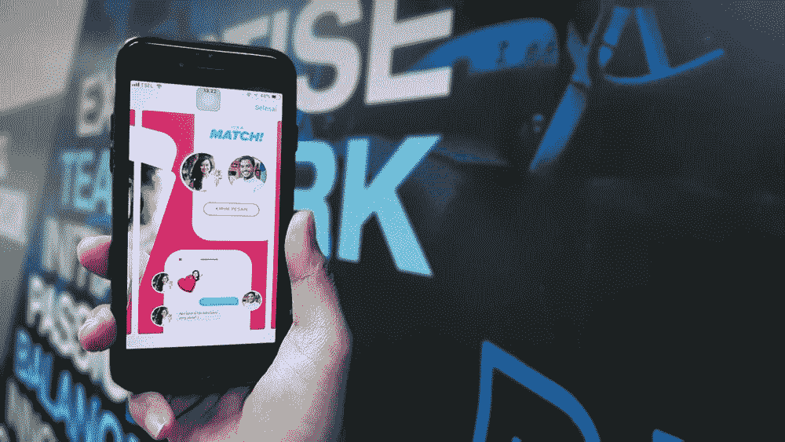

# 推荐系统并不总是你的朋友

> 原文：<https://towardsdatascience.com/stop-trusting-recommendation-systems-blindly-e8f52937034c?source=collection_archive---------45----------------------->

## 多个利益相关方意味着最终用户的偏好不是唯一的目标

图片来自 [Unsplash](https://unsplash.com/photos/rPzEQ7tTRr8)

在这个网络狂热的时代，每个人肯定都遇到过推荐系统。约会应用并不是这类系统的唯一用例。它们被用于各种不同的领域，以帮助用户找到与其个人喜好相关的项目/信息。你可能倾向于认为这些系统的主要目标是最大限度地满足用户(即你)的兴趣。尽管这很重要，但用户肯定不是唯一希望从这些系统中受益的人。换句话说，有多个利益相关者。我将使用更一般的例子来解释这些。

## 多利益攸关方建议

多利益相关者推荐系统是一个有多个商业利益相关者的系统，这些利益相关者通常有相互冲突的利益，在生成推荐时需要考虑他们的偏好[1]。

假设你是一家大型在线零售商，在网上销售数百万件产品。像每一个主要的在线零售商一样，你有一个推荐系统，根据顾客的喜好向他们推荐产品。在这种情况下，至少有 3 个利益相关者:

1.  客户
2.  交货伙伴
3.  你们

客户肯定是这个系统中最重要的利益相关者之一，因为客户满意是你的目标。这个目标反过来会让你受益，因为它增加了销售额和客户保持率。但与此同时，你的送货伙伴也在根据你卖的产品赚钱。因此，他们在任何决策过程中也很重要。这构成了多利益相关方推荐系统的基础。

## 为什么推荐系统不总是友好的

在许多业务场景中，由于利益相关者的利益冲突，向用户提供最佳推荐并不总是正确的方法。我们来看看网恋。

在线约会推荐系统(又名互惠系统)的主要目标是匹配两个有相似兴趣的人。如果一个在线约会应用程序没有让你和你感兴趣的人匹配，你就不会使用它。但是平台的最终用户是系统的唯一利益相关者吗？这可能会让你吃惊；不要！

平台所有者和最终用户的偏好之间会产生冲突。最好的用户体验将是在最短的时间内找到一个好的匹配，并且不再回来。另一方面，企业主希望通过拥有重复用户和更高的保留率来增加利润。这些相互冲突的最终目标就是为什么推荐系统并不总是你最好的朋友。

**图 1:** [**图像**](https://www.clipartkey.com/view/xJmoxh_inquiring-minds-want-to-know-worried-clip-art/)

因此，如果你看看在线约会应用的商业模式，他们会更喜欢你继续回来，原因有两个。推荐的内容刚好能满足你的喜好，但不能完全满足你的喜好。

再比如零售。想象一下，有人向你推荐两种不同品牌的麦片，如图 1 所示。假设两者在客户偏好方面没有差异，由于与谷物 b 相比的相关成本，零售商可以向您出售谷物 A，实际上可能会获得更大的利润。这可能不是恶意意图，但在另一种情况下，零售商可能会以您为代价获得利润。

## 这是一场公平的比赛吗？

你可能会倾向于相信所有的企业都试图削弱你来实现他们的最终目标。然而，这并不完全正确。许多研究表明，根据用户偏好定制的个性化推荐会增加商业价值，例如提高销售额。这意味着客户仍然是推荐系统的重要驱动力。这个问题只出现在这样的系统中:利润不仅是从满足客户需求中获得的，而且是从企业的利润中获得的，而不一定能最大化用户满意度。所以并非都是坏消息。

**资源**

[1][https://www . research gate . net/publication/338516177 _ multi stakeholder _ recommendation _ Survey _ and _ research _ directions](https://www.researchgate.net/publication/338516177_Multistakeholder_recommendation_Survey_and_research_directions)
【2】[https://arxiv.org/pdf/1907.13158.pdf](https://arxiv.org/pdf/1907.13158.pdf)

# 关于作者

Usman Gohar 是一名数据科学家，明尼阿波利斯数据科学的共同组织者，也是一名技术演讲人。他非常热衷于最新的数据科学研究，机器学习，并通过帮助和授权年轻人在数据科学中取得成功而蓬勃发展。你可以在 [LinkedIn](https://www.linkedin.com/in/usman-gohar/) 、 [Twitter](https://twitter.com/UsmanGohar) 、[Medium](https://medium.com/@usman.gohar)T21【关注 [Github](https://github.com/UsmanGohar) 上与他联系。