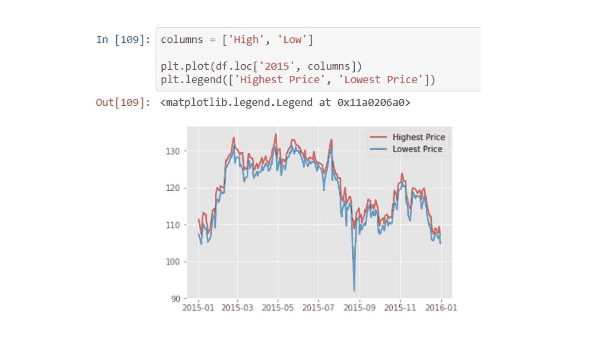
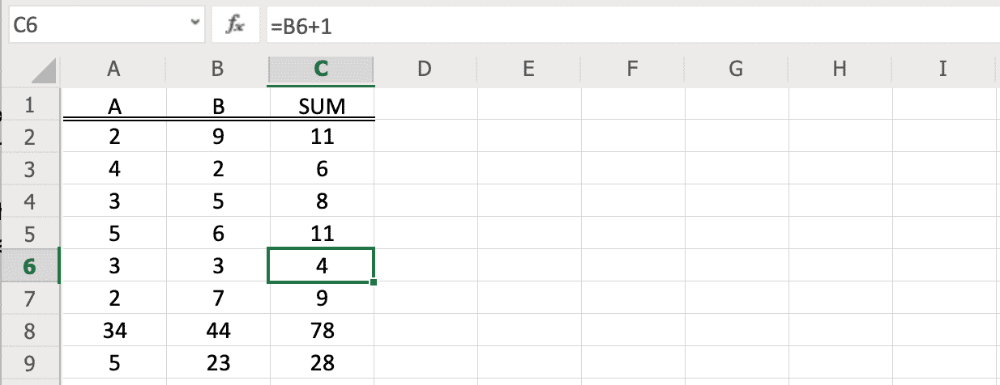
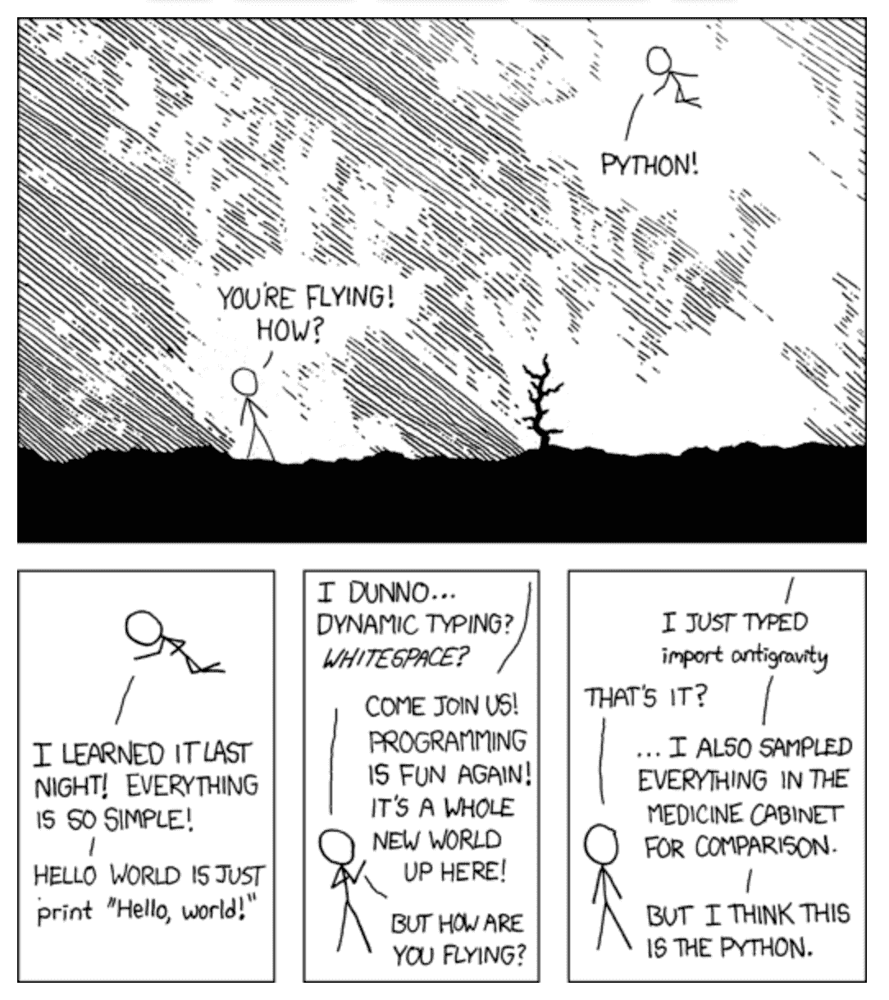

# 停止使用 Excel 进行数据分析:升级到 Python

> 原文：<https://towardsdatascience.com/stop-using-excel-for-data-analytics-upgrade-to-python-46b5963fb036?source=collection_archive---------18----------------------->


2017 年，估计全球有 7.5 亿人使用 Excel。2017 年世界人口约为 76 亿。这意味着大约 10%的人在使用 Excel，我猜主要是为了数据分析。这太疯狂了。

毫无疑问，Excel 对于公司来说是一个极其重要的工具，并且仍然在每个数据分析师和科学家的工具包中占有一席之地，但是对于你的大部分工作来说，你需要停止使用 Excel 并升级到 Python。我会告诉你为什么。

所以，如果你还没有开始学习 Python，并把你的数据分析和可视化技能提高到一个新的水平，我给你提供了 5 个你现在需要学习 Python 的理由。最后，我相信你会期待用 Python 取代你的大部分 Excel 工作。

# 规模和自动化

当你想对小数据进行快速、特别的分析时，Excel 是很好的工具，但是一旦你想进行更大规模的分析，它就不起作用了。Excel 最多可以支持 1，048，576 行 16，384 列的数据。另一方面，Python 可以扩展到内存大小，并且有许多工具支持内存外计算。

例如，Dask 库允许您将计算扩展到在一个机器集群上运行，而不仅仅是在您的笔记本电脑上。事实上，如果你熟悉熊猫，在 CSV 中阅读几乎完全相同的代码:

```
import dask.dataframe as dd

# Load the data with Dask instead of Pandas.

df = dd.read_csv(<file_path>)
```

一行代码，你现在读入的数据就超过了你电脑的内存。我会告诉你如何在 Excel 中做到这一点，但这甚至是不可能的。

> *如果这段代码看起来很奇怪，看看这个* [*课程*](https://www.educative.io/courses/python-data-analysis-and-visualization) *，它会教你入门熊猫所需要知道的一切。*

此外，Python 可以扩展到多个数据源。虽然 Excel 既是数据存储又是计算引擎，但是 Python 完全是数据不可知的。如果您能找到将数据读入 Python 的方法，您就可以使用它。由于 Python 有这么多优秀的库，从 CSV、Excel、JSON 和 SQL 数据库等许多来源读入数据是很容易的。

最后，就自动化而言，Python 是一种令人惊叹的编程语言。因为您可以将 Python 直接连接到任何数据源，所以很容易安排一个作业，该作业将使用任何更新重新提取您的数据，运行您的计算，甚至创建报告或动态仪表板，从而节省您大量的时间。另一方面，Excel 需要太多的手工劳动，并且不能自动更新。



Python 可以直接连接到数据库进行自动更新。来源:NobleDesktop

# 再现性

可再现性是这样一个概念，即你创建的任何分析或可视化都应该简单明了地为他人再现。不仅需要有人能够重新运行您的过程并以相同的结果结束，而且他们还应该能够通过您的步骤来确保准确性。当你开始依赖自动化时，这个概念是极其重要的。当工作正常时，自动化是惊人的，但当不正确时，自动化报告可能是一场噩梦。

Excel 的重现性非常具有挑战性。单元格中的 Excel 计算几乎不可能在任何规模下进行检查。数据类型非常令人困惑，因为你看到的并不总是原始数据中所表示的，虽然 VBA 使再现性稍微好一点，但在这一点上，你最好投资学习 Python。

看看这个 Excel 文档:



你知道`sum`列应该是 a 和 b 的和，但是你怎么确认呢？您可以检查其中一个公式，并看到它实际上是总和，但由于每个单元格都可以是自己的公式，如果它们都不正确呢？如果你没有注意，你可能会错过 x 行是错误的。

但是在 Python 中，您求和将如下所示:

```
a = [1,2,3,4]
b = [5,6,7,8]
sum = []
for i in range(a):
    sum.append(a[i] + b[i])
```

这段代码很清楚，很容易确认总和总是计算正确。

有了 Python，你可以获得为软件工程师更好地实现**再现性和协作而开发的所有工具。最重要的是，Python 在数据连接方面更胜一筹，允许我们在云端分析数据，并立即重复一个过程。Git、单元测试、文档和代码格式标准在 Python 社区中非常流行。使用 Python 3，您甚至可以添加静态类型，使您的代码更加清晰。所有这些工具都使得确保你的代码写得又好又正确变得更加容易。这样下次你看你的代码或者别人拿起它的时候，就很容易复制和理解了。**

# 可转移的技能

懂 Excel 就懂 Excel。虽然你学到的技能是有用的，但它们不能转移到其他任何东西上。我最喜欢 Python 的一点是，它不仅是一个令人惊叹的数据分析和可视化工具，而且是一种可靠的编程语言，可以用于许多其他事情。

想做[机器学习](https://www.educative.io/blog/machine-learning-for-data-science)甚至深度学习？使用 Python 可以做到这一点。想建个网站？Python 可以做到这一点。想让你的智能家居自动化吗？Python 也可以这样做。

此外，Python 比 Excel 更接近于其他编程语言。这使得你更容易学会沿途可能遇到的其他语言。学习 Python 比 Excel 打开了更多的大门。

最后，对 Python 的**需求非常高**。根据 StackOverflow 的数据，2019 年，它在专业软件开发人员中被评为世界第四大最受欢迎的编程语言，也是第一大最受欢迎的编程语言。事实上，据说 2020 年美国 Python 开发人员的平均年薪是 12 万美元。还不错。

# 高级功能

Excel 有很多内置公式，但与 Python 的功能相比就相形见绌了。Python 不仅提供了数百个库来简化高级统计和分析，还可以将您的可视化提升到另一个层次。使用 Matplotlib、Plotly、Streamlit 和 Seaborn 等工具，您可以创建漂亮的数据可视化以及交互式仪表盘和绘图。

Numpy 和 scipy 对科学计算、线性代数和矢量化计算有惊人的支持。而 scikit-learn 可以让你训练从决策树到梯度推进机器的机器学习算法。我觉得 [xkcd](https://xkcd.com/353/) 说的最好:



# Python 很容易学

鉴于 Python 相对于 Excel 的所有惊人优势，它一定很难学，对吗？*不！*查看 Java 版的`Hello World`，最简单的程序:

```
class HelloWorld { public static void main( String args[] ) { System.out.println( "Hello World!" ); }}
```

Python 字面上就是一行:`print(“Hello World!”)`。没有比这更简单的了。Python 是最容易掌握的编程语言之一，并且拥有最活跃的社区之一，尤其是在数据分析领域。Python 是最直观的编程语言之一，即使对计算机科学没有多少背景知识的人也能理解！虽然学习曲线 Excel 可能看起来更好，但另一端的回报要少得多。 **Python 的学习曲线值得花费时间和精力**，这是 Excel 因其一刀切的设计而永远无法比拟的。

Python 很容易使用，而且有一个巨大的支持社区，学习它从来没有这么容易过。

为了向您展示 Python 有多简单，在下一节中，我将向您介绍 Python 中数据分析和可视化的一些基础。

# 开始使用 Python 进行数据分析

为了让您入门，我想带您了解 Python 中的一些基本命令和操作，这对您的数据分析技能至关重要。让我们从基础开始。

你会注意到的第一件事是 Python 使用了空格，而不像其他语言那样使用分号`;`。这里有一个非常简单的例子:

```
x = 5y = 10print(x+y)
```

# 导入功能

我们将利用许多库，有些是 Python 预装的，有些我们必须自己安装。使用 import 语句获取库:

```
from collections import Counter
```

这个命令从集合库中导入类计数器。计数器对于数据科学家来说是非常有用的工具；它可以计算项目在列表等集合中出现的次数。例如，在下面的代码中，我们将创建一个结婚年龄列表。使用计数器，我们可以快速计算每个独特的年龄出现的次数。

# Python 中的列表

列表是存储数据的一种有用的数据结构。我们将在下一课中更详细地研究它们。例如:

```
from collections import Countermarriage_ages = [22, 22, 25, 25, 30, 24, 26, 24, 35]value_counts = Counter(marriage_ages)print(value_counts.most_common())
```

您可以看到，我们在第 2 行使用`[]`创建了一个包含结婚年龄的列表。然后，我们在第 4 行将该列表输入到`Counter`函数中，在第 5 行将最常见的值作为元组列表打印出来。

元组是`()`内部的集合。这些元组包含两个元素:值和该值在列表中出现的次数。频率对元组列表进行排序。出现次数最多的值最先出现。

# Python 中的函数

函数也很有用。Python 中的函数以关键字`def`和函数名开始，后面是函数在括号中期望的输入。下面是一个函数，它接受两个输入，`x`和`y`，并返回`sum`:

```
def add_two_numbers(x, y):  # function header """ Takes in two numbers and returns the sum parameters x : str first number y : str second number returns x+y """ z = x + y return z  # function returnprint(add_two_numbers(100,5))  # function  call
```

函数也可以是匿名的，这意味着你不必用上面的结构来声明它们。相反，您可以使用`lambda`关键字。下面是与上面相同的函数，但作为匿名函数:

```
y = lambda x, y: x + yprint(y(100,5))  # call the function
```

# 包扎

是时候转换到 Python 了。再也没有借口了！我希望这篇文章能帮助你看到学习 Python 的好处，并打破一些学习的障碍。

*快去用 Python 把你的技能* [*更上一层楼吧！*](https://www.educative.io/courses/python-data-analysis-and-visualization)