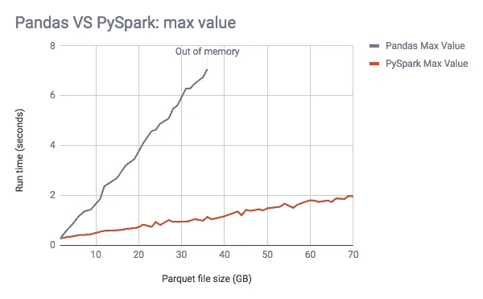

# 停止使用熊猫，开始使用 Spark 和 Scala

> 原文：<https://towardsdatascience.com/stop-using-pandas-and-start-using-spark-with-scala-f7364077c2e0?source=collection_archive---------7----------------------->

## 为什么数据科学家和工程师应该考虑使用 Spark 和 Scala 作为 Pandas 的替代方案，以及如何开始


来源:https://unsplash.com/photos/8IGKYypIZ9k

用 Scala 从 Pandas 迁移到 Spark 并不像你想象的那样具有挑战性，因此你的代码会运行得更快，你可能会写出更好的代码。

在我作为一名数据工程师的经历中，我发现在 Pandas 中构建数据管道通常需要我们定期增加资源，以跟上不断增长的内存使用量。此外，我们经常会看到由于意外的数据类型或空值而导致的许多运行时错误。将 Spark 与 Scala 结合使用的结果是，解决方案感觉更健壮，更容易重构和扩展。

**在本文中，我们将浏览以下内容:**

1.  为什么你应该在 Scala 中使用 Spark 而不是 Pandas
2.  Scala Spark API 和 Pandas API 并没有太大的不同
3.  如何开始使用 Jupyter 笔记本或您最喜欢的 IDE

# 什么是火花？

*   Spark 是一个 Apache 开源**框架**
*   它可以作为一个库，在“本地”集群上运行，或者在 Spark 集群上运行
*   在 Spark 集群上，代码可以以分布式方式执行，一个主节点和多个工作节点分担负载
*   即使在本地集群上，你仍然会看到性能比 Pandas 有所提高，我们将在下面解释原因

# 为什么要用 Spark？

**Spark 因其快速处理大型数据集的能力而广受欢迎**

*   默认情况下，Spark 是多线程的，而 Pandas 是单线程的
*   Spark 代码可以在 Spark 集群上以分布式方式执行，而 Pandas 运行在单台机器上
*   Spark 是懒惰的，这意味着它只会在你*收集*(即。当你真的需要返回一些东西的时候)，同时它建立一个执行计划并找到执行你的代码的最佳方式
*   这与熊猫不同，熊猫很急切，每走一步就执行一步
*   Spark 也不太可能耗尽内存，因为当它达到内存限制时，它将开始使用磁盘

关于运行时间的直观比较，请参见下面来自 Databricks 的图表，从中我们可以看到 Spark 明显比 Pandas 快，并且 Pandas 在较低的阈值下耗尽了内存。



[https://databricks . com/blog/2018/05/03/benchmarking-Apache-spark-on-a-single-node-machine . html](https://databricks.com/blog/2018/05/03/benchmarking-apache-spark-on-a-single-node-machine.html)

**Spark 拥有丰富的生态系统**

*   数据科学库，比如内置的 Spark ML，或者图形算法的 Graph X
*   实时数据处理的火花流
*   与其他系统和文件类型(orc、parquet 等)的互操作性。)

# 为什么要用 Scala 而不是 PySpark？

Spark 提供了一个熟悉的 API，所以使用 Scala 而不是 Python 不会感觉是一个巨大的学习曲线。以下是您可能想要使用 Scala 的几个原因:

*   Scala 是一种静态类型语言，这意味着你会发现你的代码比 Python 有更少的运行时错误
*   Scala 还允许您创建不可变的对象，这意味着当引用一个对象时，您可以确信在创建它和调用它之间，它的状态没有发生变化
*   Spark 是用 Scala 编写的，所以 Scala 中的新特性比 Python 早
*   对于一起工作的数据科学家和数据工程师来说，使用 Scala 有助于协作，因为 Scala 代码具有类型安全性和不变性

# Spark 核心概念

*   数据帧:spark 数据帧是一种与熊猫数据帧非常相似的数据结构
*   **数据集**:数据集是一种类型化的数据帧，对于确保数据符合预期的模式非常有用
*   **RDD** :这是 Spark 中的核心数据结构，数据帧和数据集就是建立在这个基础上的

一般来说，我们会尽可能地使用**数据集**，因为它们是类型安全的，更有效，并且提高了可读性，因为我们可以清楚地看到数据集中的数据。

# 数据集

为了创建数据集，我们首先需要创建一个 case 类，它类似于 Python 中的数据类，实际上只是一种指定数据结构的方法。

例如，让我们创建一个名为 *FootballTeam* 的案例类，它有几个字段:

```
**case class FootballTeam(** name**: String,** league**: String,** matches_played**: Int,** goals_this_season**: Int,** top_goal_scorer**: String,** wins**: Int
)**
```

现在，让我们创建这个 case 类的一个实例:

```
**val** brighton: **FootballTeam** =
    **FootballTeam**(
      "Brighton and Hove Albion",
      "Premier League",
      matches_played = 29,
      goals_this_season = 32,
      top_goal_scorer = "Neil Maupay",
      wins = 6
    )
```

让我们创建另一个名为 *manCity* 的实例，现在我们将创建一个包含这两支足球队的数据集:

```
**val** teams: **Dataset**[**FootballTeam**] = spark.createDataset(***Seq***(*brighton*,  
      *manCity*))
```

另一种方法是:

```
**val** teams: **Dataset**[**FootballTeam**] = 
      spark.createDataFrame(**Seq**(*brighton*, *manCity*)).as[**FootballTeam**]
```

第二种方法在从外部数据源读取数据并返回 DataFrame 时非常有用，因为您可以转换为数据集，这样我们现在就有了一个类型化的集合。

# 数据转换

Spark 中提供了大多数(如果不是全部)可以应用于 Pandas 数据帧的数据转换。当然，在语法上有所不同，有时还需要注意一些额外的东西，其中一些我们现在就来看看。

总的来说，我发现 Spark 在符号上比 Pandas 更一致，而且因为 Scala 是静态类型的，所以你通常可以只做`myDataset.`然后等待你的编译器告诉你什么方法是可用的！

让我们从一个简单的转换开始，我们只想向数据集添加一个新列，并为它赋予一个常数值。在熊猫身上，这看起来像是:

```
**Pandas**df_teams['sport'] = 'football'
```

除了语法之外，spark 还有一个小的不同，那就是向这个新字段添加一个常量值需要我们导入一个名为 *lit* 的 Spark 函数。

```
**Spark****import** org.apache.spark.sql.functions.lit**val** newTeams = teams.withColumn("sport", lit("football"))
```

注意，我们已经创建了一个新对象，因为我们最初的*团队*数据集是一个 *val，*这意味着它是不可变的。这是一件好事，因为我们知道无论何时使用我们的*团队*数据集，我们总是得到相同的对象。

现在让我们添加一个基于函数的列。对熊猫来说，这看起来像是:

```
**Pandas****def** **is_prem**(league):
    **if** league == 'Premier League':
        **return** **True**
    **else**:
        **return** **False** df_teams['premier_league'] = df_teams['league'].apply(**lambda** x: 
                                    is_prem(x)) 
```

为了在 Spark 中做同样的事情，我们需要序列化函数，以便 Spark 可以应用它。这是通过使用名为 *UserDefinedFunctions* 的东西来完成的。我们还使用了大小写匹配，因为这是 Scala 中比 if-else 更好的实现，但是两者都可以。

我们还需要导入另一个有用的 spark 函数， *col，*用于引用列。

```
**Spark****import** org.apache.spark.sql.functions.col**def** **isPrem**(league: **String**): **Boolean** =
    league **match** {
      **case** "Premier League" => **true**
      **case** _                => **false**
    } **val** isPremUDF: **UserDefinedFunction** =
    udf[**Boolean**, **String**](isPrem) **val** teamsWithLeague: **DataFrame** = teams.withColumn("premier_league",                                                            
          isPremUDF(col("league")))
```

现在我们已经添加了一个不在 case 类中的新列，这将把它转换回 DataFrame。所以我们要么需要向我们的原始 case 类添加另一个字段(并允许它为空，使用*选项*)，要么创建一个新的 case 类。

Scala 中的一个*选项*仅仅意味着该字段是可空的。如果值为空，我们使用`None`，如果值为空，我们使用`Some("value")`。可选字符串的示例:

```
**val** optionalString : **Option[String]** = Some("something")
```

要从中获取字符串，我们可以调用`optionalString.get()`，这将返回`"something"`。注意，如果我们不确定它是否为空，我们可以使用`optionalString.getOrElse("nothing")`，如果为空，它将返回字符串`"nothing"`。

过滤数据集是另一个常见的需求，这是 Spark 比 Pandas 更一致的一个很好的例子，因为它遵循与其他转换相同的模式，我们在那里进行数据集“点”转换(即`dataset.filter(...)`)。

```
**Pandas**df_teams = df_teams[df_teams['goals_this_season'] > 50] **Spark****val** filteredTeams = teams.filter(col("goals_this_season") > 50)
```

我们可能需要在数据集上执行一些聚合，这在 Pandas 和 Spark 中非常相似。

```
**Pandas**df_teams.groupby(['league']).count() **Spark**teams.groupBy("league").count()
```

对于多重聚合，我们可以再次做一些类似于 Pandas 的事情，使用一个字段到聚合的映射。如果我们想做自己的聚合，我们可以使用 *UserDefinedAggregations。*

```
teams.agg(**Map**(
    "matches_played" -> "avg",
    "goals_this_season" -> "count"))
```

通常，我们还希望组合多个数据集，这可能需要 union:

```
**Pandas**pd.concat([teams, another_teams], ignore_index=**True**) **Spark**teams.unionByName(anotherTeams)
```

…或者使用连接:

```
**val** players: **Dataset[Player]** = spark
        .createDataset(**Seq**(*neilMaupey*, *sergioAguero*)) teams.join(players,
        teams.col("top_goal_scorer") === players.col("player_name"),
        "left"
      ).drop("player_name")
```

在这个例子中，我们还创建了一个新的数据集，这次使用了一个名为 *Player 的 case 类。*注意，这个案例类有一个字段 *injury，*可以为空。

```
**case** **class** **Player**(player_name: **String**, goals_scored: **Int,** injury: **Option[String]**)
```

请注意，我们已经删除了 *player_name* 列，因为这将是 *top_goal_scorer* 的副本。

我们可能还希望部分代码只使用 Scala 原生数据结构，如数组、列表等。要将我们的一列作为数组，我们需要映射到我们的值并调用`.collect()`。

```
**val** teamNames: **Array[String]**  = teams.map(team => team.name)
      .collect()
```

请注意，我们可以使用 case 类的内置 getters 来返回 *name* 字段，如果 *name* 不是我们的类 *FootballTeam* 中的字段，这将无法编译。

顺便说一下，我们也可以在 case 类中添加函数，当使用 IntelliJ 或 vs code with Metals plugin 等 ide 时，值和函数都会作为自动完成的选项出现。

为了根据数据集是否存在于这个数组中来过滤我们的数据集，我们需要通过调用 *_** 将它视为一个 args 序列。

```
**val** filteredPlayers: **Dataset[Player]** = players
      .filter(col("team").isin(teamNames: _*))
```

# 运行一些代码

在这一点上，希望你热衷于写一些 Spark 代码，即使只是为了看看我的说法是否站得住脚，它与熊猫没有太大的不同。

首先，我们有几个选项。我们可以使用笔记本，这是一种快速获取一些数据并开始到处玩的方法。或者，我们可以建立一个简单的项目。无论哪种方式，你都需要安装 Java 8。

# 笔记本

对于这个例子，我们将在 Jupyter 笔记本中使用 spylon 内核。[https://pypi.org/project/spylon-kernel/](https://pypi.org/project/spylon-kernel/)。首先运行以下命令来设置您的笔记本，这将在浏览器中打开您的笔记本。然后从可用的内核中选择 *spylon 内核*。

```
 pip install spylon-kernel
 python -m spylon_kernel install
 jupyter notebook
```

让我们通过向一个单元格添加以下内容来检查我们是否有正确的 Java 版本:

```
!java -version
```

输出应该是:

```
java version "1.8.0_211"
Java(TM) SE Runtime Environment (build 1.8.0_211-b12)
Java HotSpot(TM) 64-Bit Server VM (build 25.211-b12, mixed mode)
```

如果没有，检查 bash 概要文件中的 *JAVA_HOME* ，确保它指向 Java 8。

下一步是安装一些依赖项。为此，我们可以将以下代码片段添加到一个新的单元格中。这将设置一些 spark 配置，并允许您添加依赖项。这里我添加了一个可视化库，名为 vegas。

```
*%%init_spark*
launcher.num_executors = 4
launcher.executor_cores = 2
launcher.driver_memory = '4g'
launcher.conf.set("spark.sql.catalogImplementation", "hive")
launcher.packages = ["org.vegas-viz:vegas_2.11:0.3.11",
                    "org.vegas-viz:vegas-spark_2.11:0.3.11"]
```

为了连接到我们的数据源，我们可以定义一个函数，可能是这样的:

```
**def** **getData**(file: **String**): **DataFrame** = 
        spark.read
        .format("csv")
        .option("header", "true")
        .load(file)
```

这是一个到 csv 文件的连接，但是我们可以连接到许多其他数据源。这个函数返回一个 DataFrame，我们可能想把它转换成一个数据集:

```
**val** footballTeams: **Dataset[FootballTeam]** = 
      getData("footballs_teams.csv").as[FootballTeam]
```

然后，我们可以开始处理这些数据，并尝试我们讨论过的一些数据转换，以及更多。

# 设置项目

既然您已经尝试了一些数据，您可能想要建立一个项目。

两个主要的东西包括:

*   **build.sbt**——之前我们在笔记本的一个单元格中添加了依赖项，现在我们需要将它们添加到 build . SBT 文件中
*   **SparkSession** -在笔记本中我们已经有了一个 SparkSession，这意味着我们可以做诸如`spark.createDataFrame`之类的事情。在我们的项目中，我们需要创建这个 spark 会话

**示例 build.sbt:**

```
name := "spark-template"
version := "0.1" 
scalaVersion := "2.12.11"val sparkVersion = "2.4.3"
**libraryDependencies** += "org.apache.spark" %% "spark-core" % sparkVersion
**libraryDependencies** += "org.apache.spark" %% "spark-sql" % sparkVersion
```

**示例 SparkSession:**

```
**import** org.apache.spark.sql.SparkSession **trait** SparkSessionWrapper { val spark: SparkSession = SparkSession
           .builder()
           .master("local")
           .appName("spark-example")
           .getOrCreate()
}
```

然后我们可以用这个包装器扩展对象，这给了我们一个 spark 会话。

```
**object** RunMyCode **extends** SparkSessionWrapper { //your code here
}
```

然后，您就可以开始编写您的 spark 代码了！

总之，Spark 是一个非常好的快速数据处理工具，并且在数据领域越来越受欢迎。因此，Scala 也正在成为一种更受欢迎的语言，由于它的类型安全性，对于数据工程师和数据科学家来说是一个很好的选择，他们可能更熟悉 Python 和 Pandas。Spark 是对该语言的一个很好的介绍，因为我们可以使用熟悉的概念，如 DataFrames，所以感觉不像是一个巨大的学习曲线。

希望这已经给了你一个快速的概述，也许能让你开始探索 Spark，无论是在你的笔记本中，还是在你的新项目中。祝你好运！