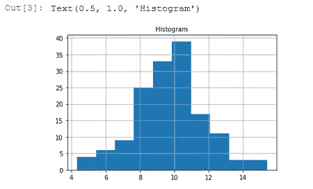

# 在 Python 中停止使用分号

> 原文：<https://towardsdatascience.com/stop-using-semicolons-in-python-fd3ce4ff1086?source=collection_archive---------6----------------------->

## 它们很少有用，看起来也不漂亮


照片由[纳丁·沙巴纳](https://unsplash.com/@nadineshaabana?utm_source=medium&utm_medium=referral)在 [Unsplash](https://unsplash.com?utm_source=medium&utm_medium=referral) 拍摄

来自 C/C++背景的我，习惯了在代码中看到很多分号`;`。它们用来代表 [**语句终止**](https://www.tutorialspoint.com/Semicolons-in-Cplusplus) **。**

但是，Python [**并不强制**](https://python-reference.readthedocs.io/en/latest/docs/operators/semicolon.html) 使用分号来分隔语句。然而，我经常遇到充斥着分号的 Python 代码。

最近，我参加了一个关于 Python 的数据科学课程。讲师正在介绍[条件语句](https://realpython.com/python-conditional-statements/)并编写了以下代码:

```
temp = 10;if temp <12: print('It is cold'); cold = True;
```

我的反应:纯恐怖！

来源: [Giphy](https://giphy.com/gifs/yXIeZ0EH2hORG)

在 Python 中，分号只在非典型情况下使用。因此，我准备了一个小指南，解释为什么不应该在 Python 中使用分号，并指出少数例外。

# 语句终止符

在许多流行的编程语言中，你需要在每个语句的末尾添加一个分号。例如，在 C++中:

```
int c = 10;
int a = 5;printf('In C++, semicolon at the end is must');
```

但是对于 Python 来说，这是不成立的。

Python 是一种不废话的编程语言。它远离**不必要的字符和语法**。

在 Python 中，语句在行尾结束(左括号、引号或圆括号除外)。例如:

```
c = 10
a = 5print('No semicolons in Python')
```

# 报表分隔符

Python 中的分号表示 [**分隔**](https://stackoverflow.com/questions/8236380/why-is-semicolon-allowed-in-this-python-snippet) ，而不是终止。它允许你在同一行写多条语句。

```
print('Statement 1'); print('Statement 2'); print('Statement 3')
```

这种语法也使得在单个语句的末尾放置分号是合法的:

```
print('Why God? WHY?');
```

这个语句的意思是打印(“…”)，然后什么都不做。所以，它实际上是两个语句，其中第二个是空的。

尽管这种语言允许用分号来分隔语句，但大多数 Python 程序员都不会在他们的代码中使用它。

这是为什么呢？**它不是** [**蟒**](https://docs.python-guide.org/writing/style/) **。**

来源: [Giphy](https://giphy.com/gifs/annoyed-eye-roll-judge-judy-Rhhr8D5mKSX7O)

> Python 应该是**干净**和**可读**的。像分号这样的语法字符增加了不必要的混乱。

如果你把这样的代码发给一个有经验的 Python 程序员，你将永远听不到它的结尾。

将多条语句放在一行会使琐碎的代码更难阅读。

# 什么时候使用分号？

因此，这里的一个逻辑问题是:**为什么 Python 中允许使用分号？**

我相信这样做是为了使从其他编程语言的过渡稍微容易一些。有 Java、C++和 PHP 背景的程序员习惯性地在每一行的末尾加上**一个(无用的)终止符**。

尽管如此，在某些情况下分号会派上用场。

## 从 Shell 运行脚本

最常见的一种情况是**使用`python -c '<script>'`从 shell** 运行一个简短的脚本。

我们需要键入许多用分号分隔的表达式，因为我们在这里不能使用缩进。看一看:

```
python -c 'import math; t = math.pi;print(int(t))’
```

另一个用例是 [**exec 语句**](https://www.geeksforgeeks.org/exec-in-python/) :

```
exec('for i in [100,200,300]: print(i);print(i*2)')
```

## 评估表达式的副作用

在类似 [**Jupyter 笔记本**](https://jupyter.org/) 的交互环境下工作时，最后一个表达式返回的值以字符串的形式打印出来。

在我们评估一个函数的[副作用](https://stackoverflow.com/questions/44036657/side-effects-in-python)的情况下，这可能很烦人。我们来看`[matplotlib](https://matplotlib.org/)`中副作用是剧情的这一期。

我会在我的 Jupyter 笔记本里创建一个 [**简单直方图**](https://matplotlib.org/3.2.1/api/_as_gen/matplotlib.pyplot.hist.html) 。

如下图所示，运行这个脚本在输出:`Text(0.5, 1.0, ‘Histogram’)`中添加了**一个多余的行**。



来源:作者

这其实就是对`.set_title(...)`调用的**返回值**。

为了抑制输出，我们**在最后一条语句**的末尾添加了一个分号:

```
axis.set_title('Histogram', size=10);
```

# 结论

像许多 Python 程序员一样，我认为我们应该在编写代码时避免添加任何多余的字符。

**分号是合法的。但这并不意味着你应该使用它。**

> 只有在必要时才使用它。

我希望你发现这个故事信息丰富和有用！你可以在这里阅读更多关于 Python 哲学的内容:

[](https://medium.com/better-programming/contemplating-the-zen-of-python-186722b833e5) [## 思考 Python 的禅

### 浅析 Python 设计的 19 条指导原则

medium.com](https://medium.com/better-programming/contemplating-the-zen-of-python-186722b833e5)