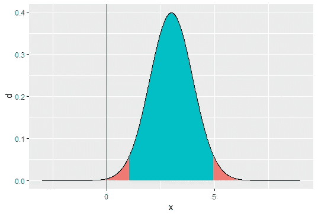
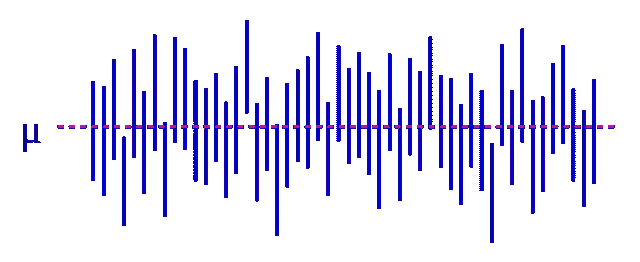
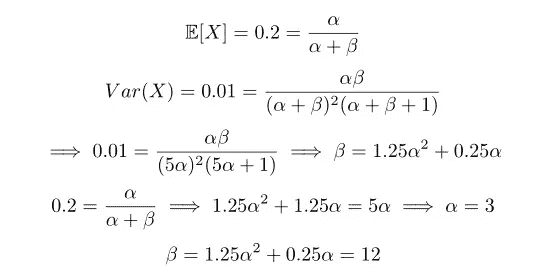
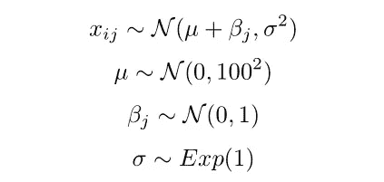

# 不要使用统一的前科

> 原文：<https://towardsdatascience.com/stop-using-uniform-priors-47473bdd0b8a?source=collection_archive---------24----------------------->

## 它们在统计学上没有意义

这是一个微不足道的咆哮，但却是必要的。我们需要让从业者不再使用统一的前科。概率编程发展很快，这很好，但这意味着有些人学习了 MCMC，却从未学习过 ANOVA。

贝叶斯统计学家一致认为，统一的先验知识是愚蠢的。标准文件[不鼓励统一的前科](https://github.com/stan-dev/stan/wiki/Prior-Choice-Recommendations)。它们出现在教科书中是为了简化计算——我们不想让学生在交流概念时陷入繁琐的计算中。然而，统一的先验知识在教科书之外几乎没有位置。

在解释了原因之后，我将在文章的后半部分提供选择更好先验的方法，记住实际应用，比如 A/B 测试。

# 无信息的前科？更像是荒谬的前科

一篇[的前一篇文章](https://medium.com/analytics-vidhya/how-this-frequentist-turned-bayesian-7066e210a301?source=friends_link&sk=578af7782e8824afe55043bc5d6c2838)解释了附在不具信息性的前文中的所有不合理的陈述。我们应该使用先前的预测检查来诊断我们的病史，最好是通过[可视化](https://arxiv.org/pdf/1709.01449.pdf)。贝叶斯模型是可生成的，我们可以模拟一些数据来评估我们假设的合理性。

我会编造一个愚蠢的对话来说明我对统一先验的反对。在这种情况下，我们希望用大 n 进行单侧假设检验。

爱丽丝:“什么是 95%的置信区间？”

鲍勃:“参数有 95%的概率在区间内。”

爱丽丝:“不！别开玩笑了！例如，如果我们知道参数为 0，那么它包含在这个 95% CI 中的概率为 0:"

鲍勃:“哦，对了。如果我们从总体中随机抽取大小为 n 的样本，那么 95%的区间将覆盖真实参数。”

[来源](https://en.m.wikipedia.org/wiki/File:NYW-confidence-interval.svg)

艾丽斯:“是的！什么是 p 值？”

鲍勃:“零假设正确的概率。”

爱丽丝:“不！不好！”

[来源](https://www.pickpik.com/spray-water-mist-cleaner-background-black-61136)

鲍勃:“嗯，我的意思是，假设零假设是真的，这是观察测试统计的概率或更极端的东西。”

爱丽丝:“对！重要的是要精准！”

鲍勃:“但是这太令人困惑和不直观了！我们如何向外行人解释？哦，我知道了！我们在那上面打一个制服 prior 怎么样？”

爱丽丝:“你什么意思？”

鲍勃:“那么 95%可信区间与 95%置信区间相同，但我们可以说参数有 95%的概率在区间内！”

爱丽丝:

[来源](https://knowyourmeme.com/memes/wait-thats-illegal)

鲍勃:“忘记令人困惑的 p 值！我们可以给人们零假设为真的概率！在这里，我放置一个均匀的β(1，1)先验，在抛一次硬币并得到正面后，我得出结论，有 75%的概率 P(H) > 0.5！”

爱丽丝:“但是那个结论完全是荒谬的！你真的认为世界上大多数硬币都是极不公平的吗？”

鲍勃:“这叫做贝叶斯。你没听说过所有的流行吗？这比 i n t e r p r e t a b l e 要多得多。我们改变几个词，然后以前不正确的陈述神奇地变成了正确的。将军，常客！”

# 选择更好的前科

统一先验不提供任何[正则化](https://en.wikipedia.org/wiki/Regularization_(mathematics))，尽管这是贝叶斯的主要优势之一。更糟糕的是，如果你选择一个均匀的(0，10)先验，那么你就是在这个区间之外放置了 0 质量，并且 [Bernstein-von Mises 定理](https://en.wikipedia.org/wiki/Bernstein%E2%80%93von_Mises_theorem)不成立。换句话说，即使你有无限的数据，你仍然可能在这些先验知识上犯严重的错误。

在缺乏知情先验信念的情况下，我们仍然可以做得比一致先验更好。正如 [Stan 文档](https://github.com/stan-dev/stan/wiki/Prior-Choice-Recommendations)所建议的:

> 不要使用统一的先验或更一般的硬约束，除非界限代表真正的约束(例如比例参数被限制为正，或相关性被限制为-1 和 1 之间)。一些例子:
> 
> 您认为参数可以是从 0 到 1 的任何值，因此您将 prior 设置为 uniform(0，1)。请改用 normal(.5，. 5)。

## 经验贝叶斯

[经验贝叶斯](https://en.wikipedia.org/wiki/Empirical_Bayes_method)利用你的数据得出先验。我们将忽略“从数据中估计出来的先验值是先验值吗？”在实践中，经验贝叶斯非常有效。詹姆斯-斯坦估计量的表现让人们困惑了一段时间，但我们已经接受了这一点，就像许多药物一样，重要的是它是有效的。

最简单的方法是使用[矩量法](https://en.wikipedia.org/wiki/Method_of_moments_(statistics))。假设您正在测试 50/50 分割的转换率。结合你所有的观察，计算转换的均值和方差，并用它们来估计你将用作先验的[贝塔分布](https://en.wikipedia.org/wiki/Beta_distribution)的α和β。假设均值和方差分别为 0.2 和 0.01。然后:

因此，根据经验贝叶斯，我们的先验应该是 Beta(3，12)。

如果您对每个用户有多个观察值或没有观察值，例如购买量，那么您希望在使用矩量法之前按用户进行汇总(例如总购买量、购买次数)。请记住，有些用户购买了 0 次，我们需要将他们包括在估算中。我们假设参数因人而异，而不是因购买而异。

## 贝叶斯分层模型

分层模型可以解释为从数据中学习先验知识。您可以尝试对此运行 MCMC，其中 x_i 是我们的第 I 个观察值，β_ j 是该组的平均值(例如，对照组与治疗组):

选择的先验是一般性的，但是你应该根据你的历史数据得到更多的信息，特别是对于 mu。此外，您可以根据您在实验中评估的指标做出更好的分布假设。即使超参数的先验非常弱，在部分汇集之后，我们仍然应该得到β的合理分布。

## N(0，1)

可笑的是，你总是可以重新调整你的数据，使 N(0，1)先验有意义。例如，如果我们认为 1%的变化是合理的，但 20%的变化是不可能的，那么重新调整你的数据(或正常的先验)来反映这一点。如果你害怕离群值的影响，尝试使用 t 分布作为先验。正如本节开始时提到的，正态先验几乎总是比均匀先验好。

# 最后

每当你想使用制服优先，记住:**只是不要**。