# 不要担心，在 30 分钟内创建您的深度学习服务器

> 原文：<https://towardsdatascience.com/stop-worrying-and-create-your-deep-learning-server-in-30-minutes-bb5bd956b8de?source=collection_archive---------23----------------------->

## 对于所有的安装和环境


图片来自 [Pixabay](https://pixabay.com/?utm_source=link-attribution&utm_medium=referral&utm_campaign=image&utm_content=738305) 的 [Bessi](https://pixabay.com/users/Bessi-909086/?utm_source=link-attribution&utm_medium=referral&utm_campaign=image&utm_content=738305)

每当我开始一个新项目时，我都发现自己一次又一次地创建深度学习机器。

您从安装 Anaconda 开始，最后为 Pytorch 和 Tensorflow 创建不同的环境，因此它们不会相互干扰。在这个过程中，你不可避免地会把事情搞砸，然后从头开始。而且这种情况经常发生多次。

这不仅仅是大量浪费时间；这也是强大的(试图避免亵渎这里)令人恼火。检查所有的堆栈溢出线程。经常想知道哪里出了问题。

那么有没有更有效的方法呢？

原来是有的。 ***在这篇博客中，我将尝试以最小的努力在 EC2 上建立一个深度学习服务器，以便我可以专注于更重要的事情。***

*这个博客明确地由两部分组成:*

1.  *设置预装深度学习库的亚马逊 EC2 机器。*
2.  *使用 TMUX 和 SSH 隧道设置 Jupyter 笔记本。*

*不用担心；这并没有听起来那么难。只需按照步骤操作，然后单击下一步。*

# 设置 Amazon EC2 机器

我假设你有一个 AWS 帐户，并且你可以访问 [AWS 控制台](https://aws.amazon.com/console/)。如果没有，你可能需要注册一个亚马逊 AWS 账户。

1.  首先，我们需要转到 Services 选项卡来访问 EC2 仪表板。

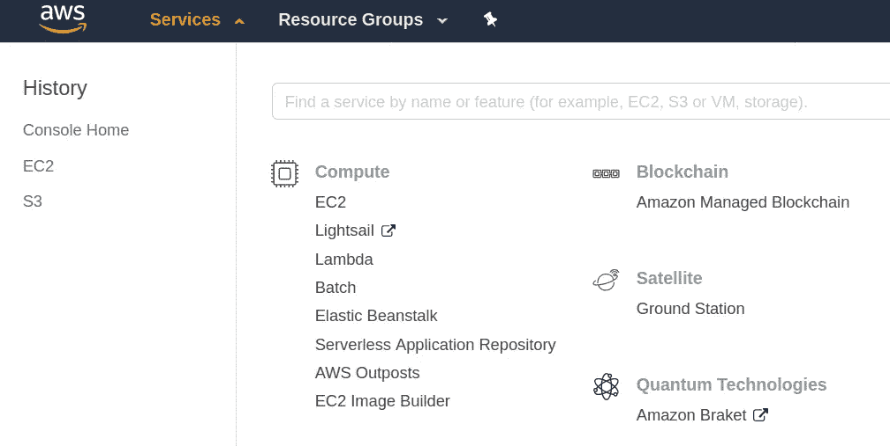

2.在 EC2 仪表板上，您可以从创建实例开始。

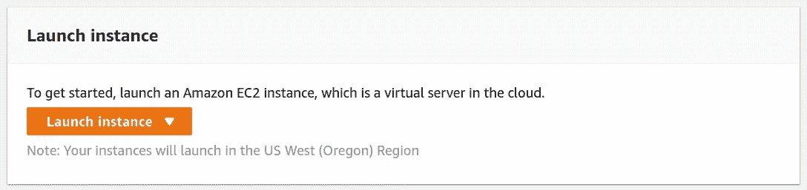

3.亚马逊提供预装深度学习软件的社区 AMIs(亚马逊机器映像)。要访问这些 ami，你需要在社区 ami 中查找，并在搜索选项卡中搜索“Ubuntu Deep Learning”。你可以选择任何其他的 Linux 版本，但我发现 Ubuntu 对我的深度学习需求最有用。在目前的设置中，我将使用深度学习 AMI (Ubuntu 18.04)版本 27.0

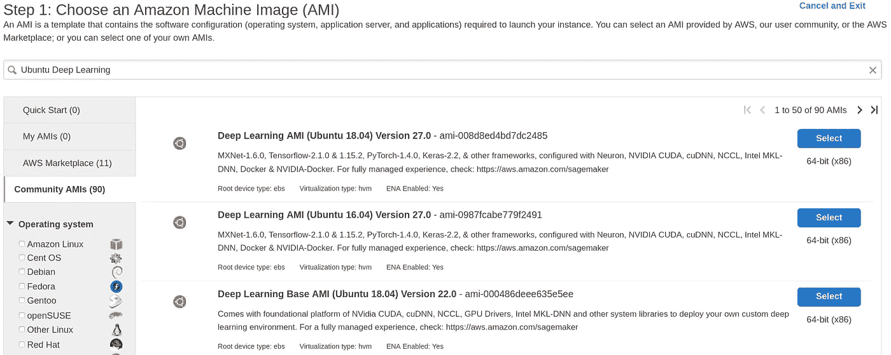

4.一旦选择了 AMI，就可以选择实例类型。您可以在这里指定系统中需要的 CPU、内存和 GPU 的数量。亚马逊根据个人需求提供了很多选择。您可以使用“过滤方式”过滤器来过滤 GPU 实例。

在本教程中，我用的是 p2.xlarge 实例，它为 NVIDIA K80 GPU 提供了 2496 个并行处理核心和 12GiB 的 GPU 内存。要了解不同的实例类型，您可以在这里查看[文档](https://aws.amazon.com/ec2/instance-types/)，在这里查看[定价](https://aws.amazon.com/emr/pricing/)。

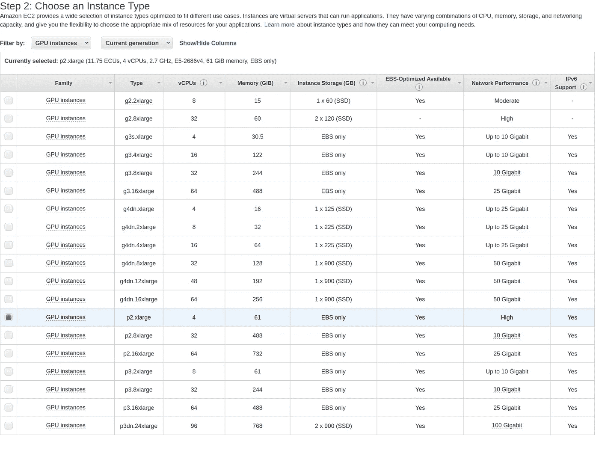

5.您可以在第 4 步中更改连接到机器的存储器。如果您没有提前添加存储，也没关系，因为您也可以在以后添加。我将存储从 90 GB 更改为 500 GB，因为大多数深度学习需求都需要适当的存储。

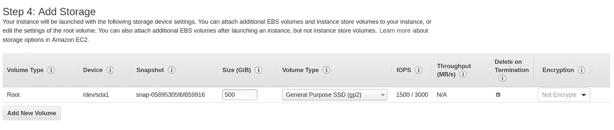

6.这就是全部，您可以在转到最终查看实例设置屏幕后启动实例。一旦你点击启动，你会看到这个屏幕。只需在密钥对名称中键入任意密钥名称，然后单击“下载密钥对”。您的密钥将以您提供的名称下载到您的计算机上。对我来说，它被保存为“aws_key.pem”。完成后，您可以单击“启动实例”。

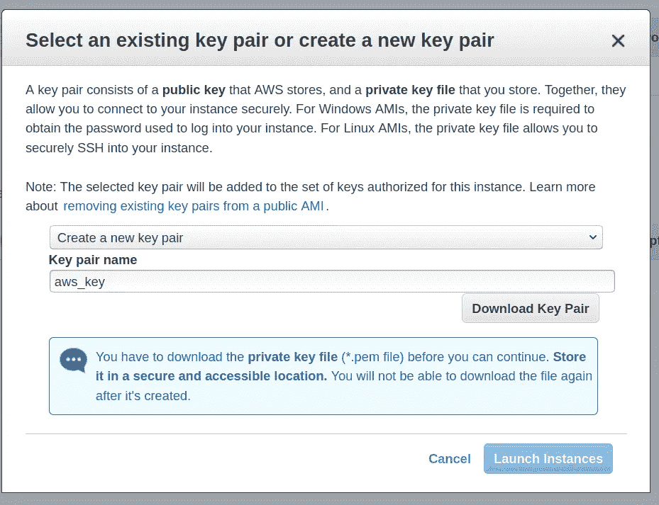

保持这个密钥对的安全，因为每当您想要登录到您的实例时，都将需要这个密钥对。

7.现在，您可以单击下一页上的“查看实例”来查看您的实例。您的实例将如下所示:

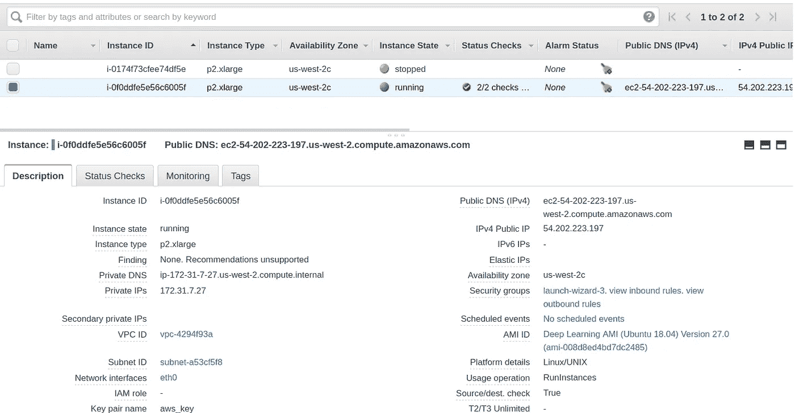

8.要连接到您的实例，只需在本地机器上打开一个终端窗口，浏览到保存密钥对文件的文件夹，并修改一些权限。

```
chmod 400 aws_key.pem
```

一旦你这样做了，你将能够通过 ssh 连接到你的实例。SSH 命令将采用以下形式:

```
ssh -i "aws_key.pem" ubuntu@<Your PublicDNS(IPv4)>
```

对我来说，命令是:

```
ssh -i "aws_key.pem" ubuntu@ec2-54-202-223-197.us-west-2.compute.amazonaws.com
```

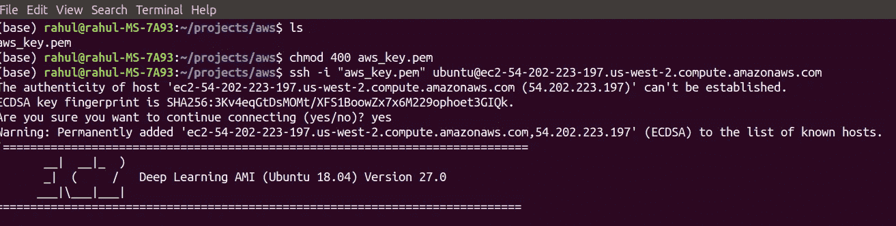

另外，请记住，一旦关闭实例，公共 DNS 可能会发生变化。

9.您已经启动并准备好了您的机器。这台机器包含不同的环境，其中有您可能需要的各种库。这台机器有 MXNet、Tensorflow 和 Pytorch 以及不同版本的 python。最棒的是，我们预装了所有这一切，因此开箱即可使用。

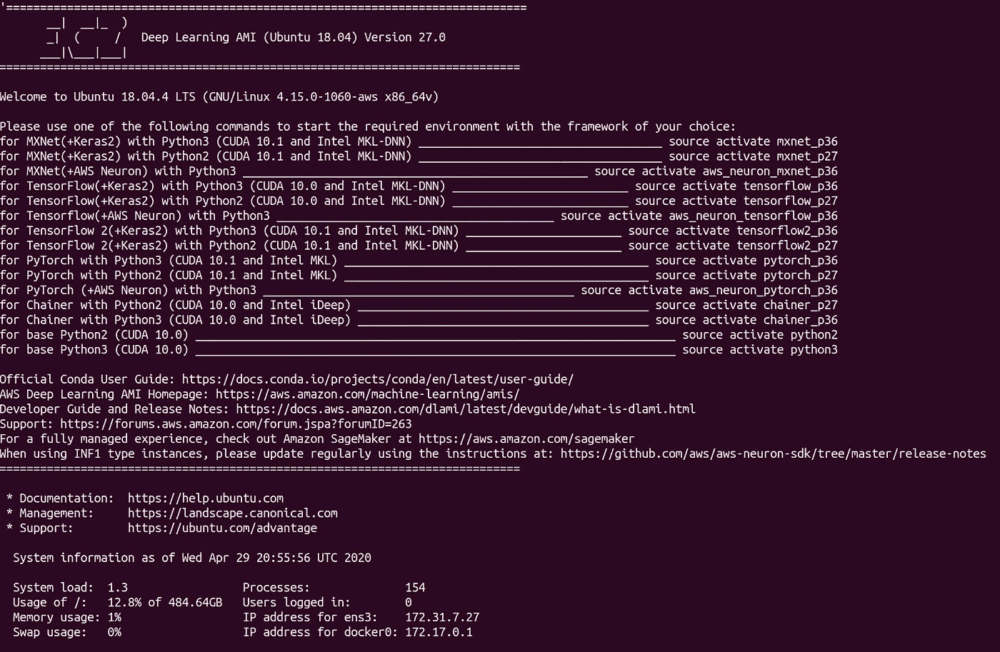

# 设置 Jupyter 笔记本

但是你仍然需要一些东西来充分使用你的机器。其中之一是朱庇特笔记本。要在您的机器上设置 Jupyter 笔记本，我建议使用 TMUX 和隧道。让我们一步一步地完成 Jupyter 笔记本的设置。

## 1.使用 TMUX 运行 Jupyter 笔记本

我们将首先使用 TMUX 在我们的实例上运行 Jupyter 笔记本。我们主要使用这一点，以便即使终端连接丢失，我们的笔记本仍然可以运行。

为此，您需要使用以下命令创建一个新的 TMUX 会话:

```
tmux new -s StreamSession
```

一旦你这样做了，你会看到一个新的屏幕，底部有一个绿色的边框。您可以使用常用的`jupyter notebook`命令在这台机器上启动您的 Jupyter 笔记本。您将看到如下内容:

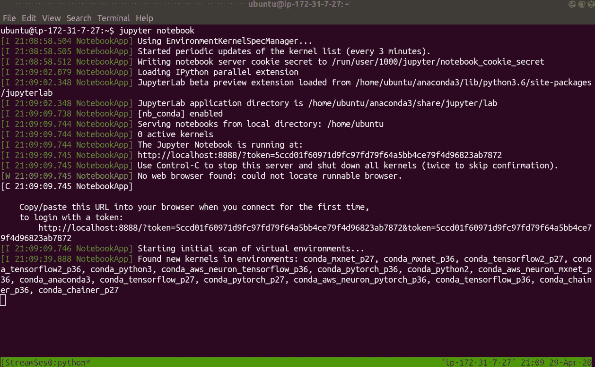

复制登录 URL 是有益的，这样当我们以后尝试登录我们的 jupyter 笔记本时，我们将能够获得令牌。对我来说，就是:

```
[http://localhost:8888/?token=5ccd01f60971d9fc97fd79f64a5bb4ce79f4d96823ab7872](http://localhost:8888/?token=5ccd01f60971d9fc97fd79f64a5bb4ce79f4d96823ab7872&token=5ccd01f60971d9fc97fd79f64a5bb4ce79f4d96823ab7872)
```

***下一步是分离我们的 TMUX 会话*** ，这样即使您离开 SSH shell，它也能继续在后台运行。为此，只需按 Ctrl+B，然后按 D(按 D 时不要按 Ctrl ),您将返回初始屏幕，显示您已从 TMUX 会话中分离的消息。

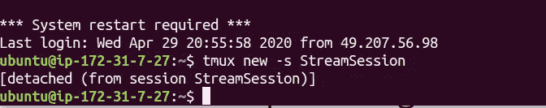

如果需要，您可以使用以下命令再次重新连接到会话:

```
tmux attach -t StreamSession
```

## 2.通过 SSH 隧道在本地浏览器上访问笔记本

第二步是隧道进入 Amazon 实例，以便能够在本地浏览器上获得 Jupyter 笔记本。正如我们所看到的，Jupyter 笔记本实际上运行在云实例的本地主机上。我们如何访问它？我们使用 SSH 隧道。别担心，填空很简单。只需在您的本地机器终端窗口上使用以下命令:

```
ssh -i "aws_key.pem" -L <Local Machine Port>:localhost:8888 [ubuntu@](mailto:ubuntu@ec2-34-212-131-240.us-west-2.compute.amazonaws.com)<Your PublicDNS(IPv4)>
```

对于这种情况，我使用了:

```
ssh -i "aws_key.pem" -L 8001:localhost:8888 [ubuntu@](mailto:ubuntu@ec2-34-212-131-240.us-west-2.compute.amazonaws.com)ec2-54-202-223-197.us-west-2.compute.amazonaws.com
```

这意味着如果我在本地机器浏览器中打开 localhost:8001，我将能够使用 Jupyter 笔记本。我当然可以。现在，我们只需输入在之前的某个步骤中保存的令牌即可访问笔记本。对我来说令牌是[5 CCD 01 f 60971d 9 fc 97 FD 79 f 64 a5 bb 4 ce 79 F4 d 96823 ab 7872](http://localhost:8888/?token=5ccd01f60971d9fc97fd79f64a5bb4ce79f4d96823ab7872&token=5ccd01f60971d9fc97fd79f64a5bb4ce79f4d96823ab7872)

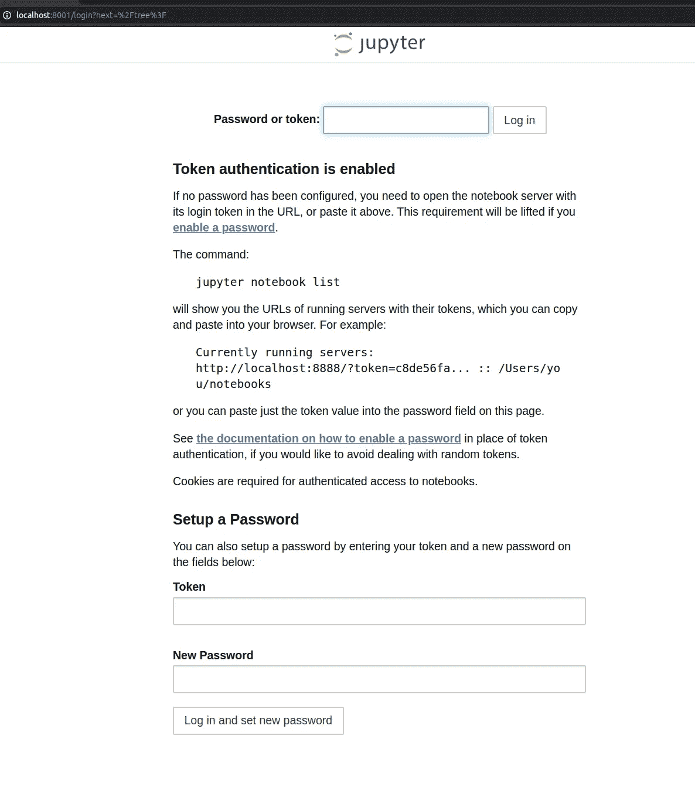

您只需使用您的令牌登录，瞧，我们就能获得这款荣耀的笔记本电脑。

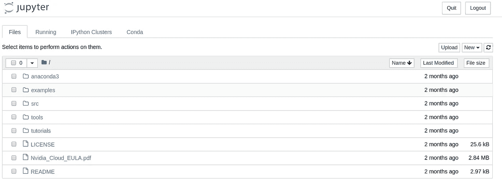

现在，您可以通过选择任何您想要的不同环境来选择一个新项目。你可以来自 Tensorflow 或 Pytorch，或者可能愿意同时拥有两个世界的优势。这款笔记本不会让你失望。

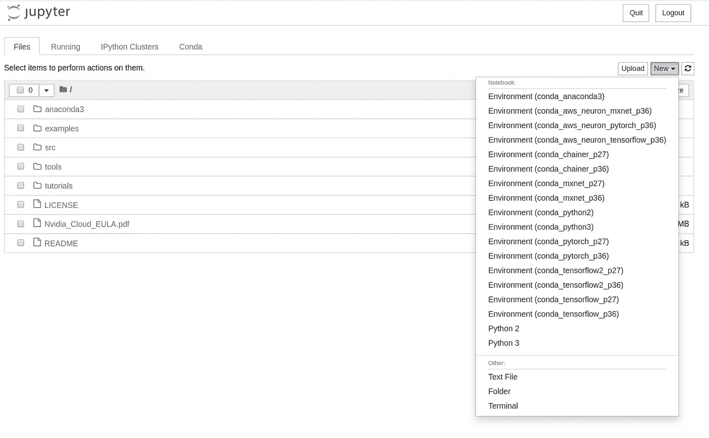

# 解决纷争

一旦机器重新启动，你可能会遇到一些 NVIDIA 显卡的问题。具体来说，在我的例子中，`nvidia-smi`命令停止了工作。如果遇到这个问题，解决方法是从 NVIDIA [网站](https://www.nvidia.in/Download/index.aspx?lang=en-in)下载显卡驱动。

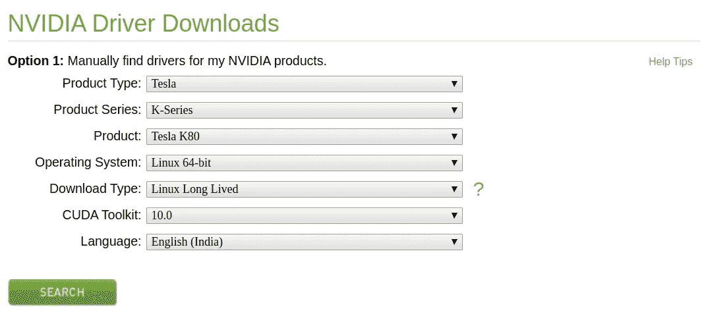

以上是我选择的特定 AMI 的设置。点击搜索后，您将看到下一页:

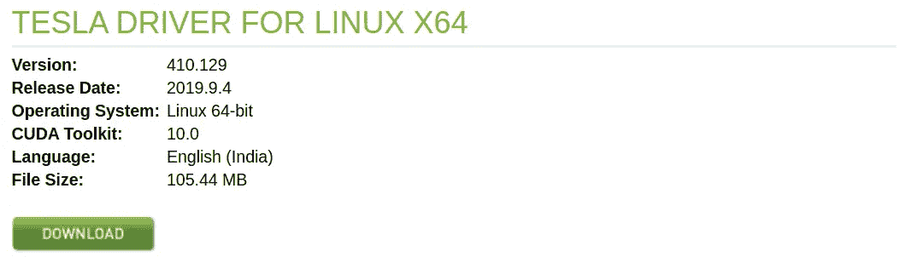

只需右键点击复制链接地址即可复制下载链接。并在您的机器上运行以下命令。您可能需要更改此中的链接地址和文件名。

```
# When nvidia-smi doesnt work:wget [https://www.nvidia.in/content/DriverDownload-March2009/confirmation.php?url=/tesla/410.129/NVIDIA-Linux-x86_64-410.129-diagnostic.run&lang=in&type=Tesla](https://www.nvidia.in/content/DriverDownload-March2009/confirmation.php?url=/tesla/410.129/NVIDIA-Linux-x86_64-410.129-diagnostic.run&lang=in&type=Tesla)sudo sh NVIDIA-Linux-x86_64-410.129-diagnostic.run --no-drm --disable-nouveau --dkms --silent --install-libglvndmodinfo nvidia | head -7sudo modprobe nvidia
```

# 停止您的实例

仅此而已。你已经拥有并运行深度学习机器，你可以随心所欲地使用它。请记住，无论何时停止工作，都要停止实例，这样当您不在处理实例时，就不需要向 Amazon 付费了。您可以在实例页面上右键单击您的实例来完成此操作。请注意，当您需要再次登录到这台机器时，您需要从实例页面获取公共 DNS (IPv4)地址，因为它可能已经更改。

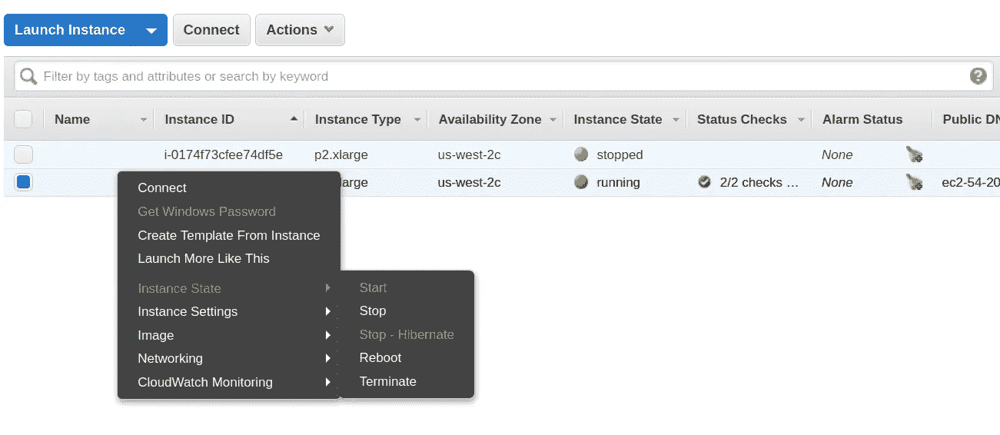

# 结论

我一直觉得建立深度学习环境是一件很大的苦差事。

在这篇博客中，我们通过使用深度学习社区 AMI，TMUX 和 Jupyter 笔记本的隧道，在最短的时间内在 EC2 上建立了一个新的深度学习服务器。该服务器预装了您工作中可能需要的所有深度学习库，并且开箱即用。

你还在等什么？用自己的服务器开始深度学习就行了。

如果你想了解更多关于 AWS 以及如何在生产设置和部署模型中使用它，我想在 AWS 上调出一个优秀的[课程。一定要去看看。](https://click.linksynergy.com/link?id=lVarvwc5BD0&offerid=467035.14884356434&type=2&murl=https%3A%2F%2Fwww.coursera.org%2Flearn%2Faws-machine-learning)

谢谢你的阅读。将来我也会写更多初学者友好的帖子。在[媒体](https://medium.com/@rahul_agarwal?source=post_page---------------------------)关注我，或者订阅我的[博客](http://eepurl.com/dbQnuX?source=post_page---------------------------)来了解他们。一如既往，我欢迎反馈和建设性的批评，可以通过 Twitter [@mlwhiz](https://twitter.com/MLWhiz?source=post_page---------------------------) 联系到我

此外，一个小小的免责声明——这篇文章中可能会有一些相关资源的附属链接，因为分享知识从来都不是一个坏主意。