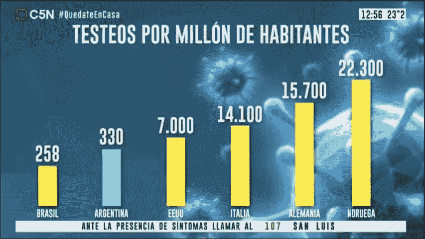
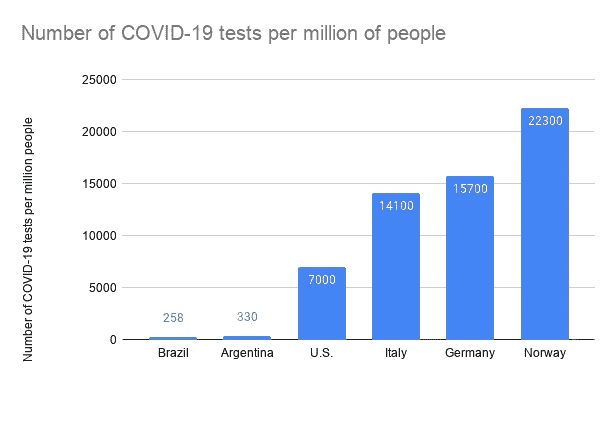
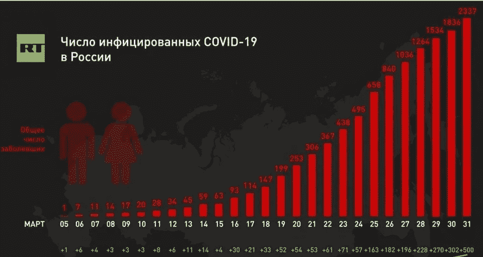
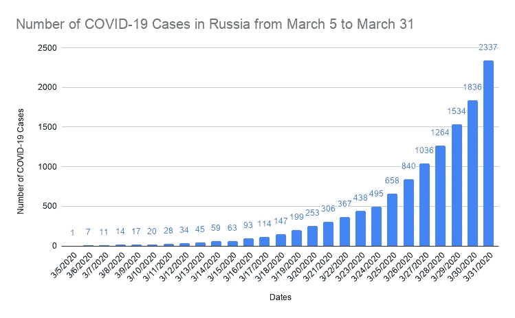
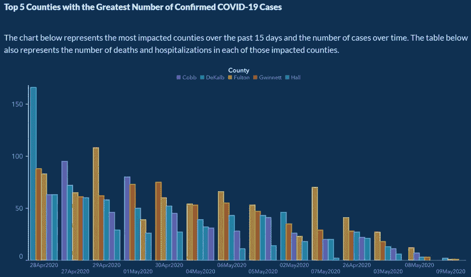

# 用误导的图表阻止新冠肺炎

> 原文：<https://towardsdatascience.com/stopping-covid-19-with-misleading-graphs-6812a61a57c9?source=collection_archive---------1----------------------->

## 阿根廷、俄罗斯和格鲁吉亚媒体如何在新冠肺炎期间操纵图表来推动他们的议程。

自新冠肺炎疫情爆发以来，全世界的媒体都在争相制作关于疫情的最漂亮、最翔实的图表。图表在向普通观众传达复杂的统计数据方面非常出色。图表还擅长误导人们对世界做出错误的结论。一些媒体因其在统计方面的无能而误导，而另一些媒体则故意操纵数据来描绘他们国家更好的图景。在这篇文章中，我们将看看阿根廷、俄罗斯和格鲁吉亚媒体是如何通过操纵图表来“抗击”疫情的。

# 阿根廷的新冠肺炎测试次数

如果你需要证明你的国家在测试人方面很棒，只需向阿根廷媒体寻求建议，他们在下图中做得很好:

阿根廷电视频道 C5N 操纵 y 轴来隐藏新冠肺炎测试的可怕数字。来源: [Reddit](https://www.reddit.com/r/dataisugly/comments/g6b1vu/argentina_is_testing_like_crazy_oh_wait_let_me/) 。原文来源: [C5N](https://www.facebook.com/C5N.Noticias/)

图表显示了每百万人中新冠肺炎测试的数量。对于不讲西班牙语的人来说，EEUU 是美国，Alemania 是德国，Noruega 是挪威。现在，看看那些柱状图:阿根廷测试的人数几乎和美国一样多！至少在你看数字之前看起来是这样。阿根廷每百万检测 330 人，而美国检测 7000 人。这是 20 倍多，但美国的标准只有 1.2 倍高。这张图表让阿根廷在测试人方面看起来还不错，但事实显然并非如此。电视频道任意操纵条形的大小，完全不考虑逻辑或缩放规则。这是未经处理的图形外观:

阿根廷的新冠肺炎图表做对了。作者的数据可视化。

这种可视化描绘了一幅完全不同的画面，表明阿根廷远没有美国和其他国家那样多的测试。但是谁想看到坏消息呢，对吧？

# 俄罗斯使曲线变平

把曲线拉平是每个国家都痴迷的事情，并不是一件容易的事情。但不是这个俄罗斯电视频道:

俄罗斯 3 月 5 日至 3 月 31 日的新冠肺炎病例数。来源: [Reddit](https://www.reddit.com/r/dataisugly/comments/fsdbzm/russian_state_tv_reporting_the_number_of_people/) 。原文来源:[今日俄罗斯](https://www.rt.com/)

图表显示了从 3 月 5 日到 3 月 31 日新冠肺炎病例的增长情况。病例开始快速增长，但自 3 月 26 日以来，增长似乎放缓，并接近曲线的顶部。然而，正如我们从阿根廷图表中了解到的那样，外表可能具有欺骗性。

在 3 月 26 日之前，条形的高度与数字相对应。例如，您可以通过查看包含 495 个案例的 3 月 24 日棒线是包含 253 个案例的 3 月 20 日棒线的两倍来验证这一点，视觉上的增加对应于数字上的增加，其中 495 几乎是 253 的两倍。然而，从 3 月 26 日开始，条形的缩放变得与数字差异不一致。如果你看看这些数字，增长率保持不变:

*   3 月 28 日新增病例+228 例(增长 22%)
*   3 月 29 日+270(增长 21%)
*   3 月 30 日+302(增加 20%)
*   3 月 31 日+500(增长 27%)

然而，这些变化并没有用柱状图准确地描述出来。3 月 31 日病例增加 500 例并不对应于视觉上的增加，视觉上的增加显示了大约 50 例的增加。电视频道给上周的酒吧指定了任意的高度。下图应该是这样的:

新冠肺炎案例的俄罗斯图表做对了。作者的数据可视化。

在这个图表中，视觉上的差异与数字上的差异相对应，并描绘了一幅准确的画面:病例呈指数增长，这是一个不好的迹象。此外，如果你想知道，俄罗斯的图表也不是对数图。

更糟糕的是，由于这些图表是在电视上播放的，它们只显示了几秒钟，这对于任何人来说都太短了，无法详细检查图表并评估其标签、单位以及视觉元素与数值的对应关系。大多数人只会花几秒钟时间看一下柱状图，然后得出结论:情况正在好转。我们中很少有人会努力暂停电视，批判性地关注图表，一些媒体利用它来欺骗我们。

# 格鲁吉亚消灭了病毒

虽然对于前两张图，你仍然可以想出一些借口，如节省空间或使条形更明显，但来自佐治亚州公共卫生部的这张图没有留下原谅的余地:

来源: [Reddit](https://www.reddit.com/r/Moronavirus/comments/gmnpbd/georgia_usa_creating_an_artificial_down_slope_to/) 。最初来自[佐治亚州公共卫生部](https://dph.georgia.gov/covid-19-daily-status-report)

图表显示了从 4 月 28 日到 5 月 9 日新增病例数量的下降。然而，看看 x 轴上的日期顺序:4 月 28 日，回到 4 月 27 日，现在是 4 月 29 日，4 月 26 日一直在 5 月 7 日和 5 月 3 日之间。人们不可能不小心把日期排列成如此奇怪的顺序。它需要手动和有意识的重新洗牌。

格鲁吉亚人很快就发现了操纵行为，并表达了他们的不满。一天后，图表被撤下，州长发言人坎迪斯·布罗斯为这个奇特的数字道歉:

提供的借口并没有使图表更有信息量，我不认为有任何方法来证明这样的错误。格鲁吉亚政府本可以利用这张图表来说服其公民支持早日重新开业。如果你想了解更多关于此案的信息，亚特兰大宪法日报有一篇很棒的文章。

# 结论

正如我们所见，有时媒体利用公众缺乏关注来推动他们的议程。我们对这些图表的误导性解释可能会影响我们投票、行为和决策的方式。因此，在如此多的图表中，停下来问一些关键问题是很重要的:

*   视觉效果和数字相符吗？
*   y 轴和 x 轴的顺序和比例是否正确？
*   图表是夸大了某件小事的重要性，还是相反？

核对每一张图表并不总是容易的，但这是不被数据操纵所误导的必要条件。因此，让我们留意我们消费的新闻，并仔细思考我们相信的信息。

谢谢你看我的文章！如果你有任何意见、担忧或问题，我很乐意在评论中讨论！

启发我写这篇文章的书:[达雷尔·赫夫的《如何用统计数据撒谎》。](https://www.goodreads.com/book/show/51291.How_to_Lie_with_Statistics?from_search=true&from_srp=true&qid=JDZnkFWFSY&rank=1)

你可以在 Reddit 上的 [r/dataisugly](https://www.reddit.com/r/dataisugly/) 找到更多误导性和糟糕的图表。