# 基于 NLP 和时间序列的特朗普竞选策略分析

> 原文：<https://towardsdatascience.com/strategic-analysis-of-trump-rallies-with-nlp-and-time-series-618615daec20?source=collection_archive---------23----------------------->

## 主题建模、聚类和时间序列预测的案例研究

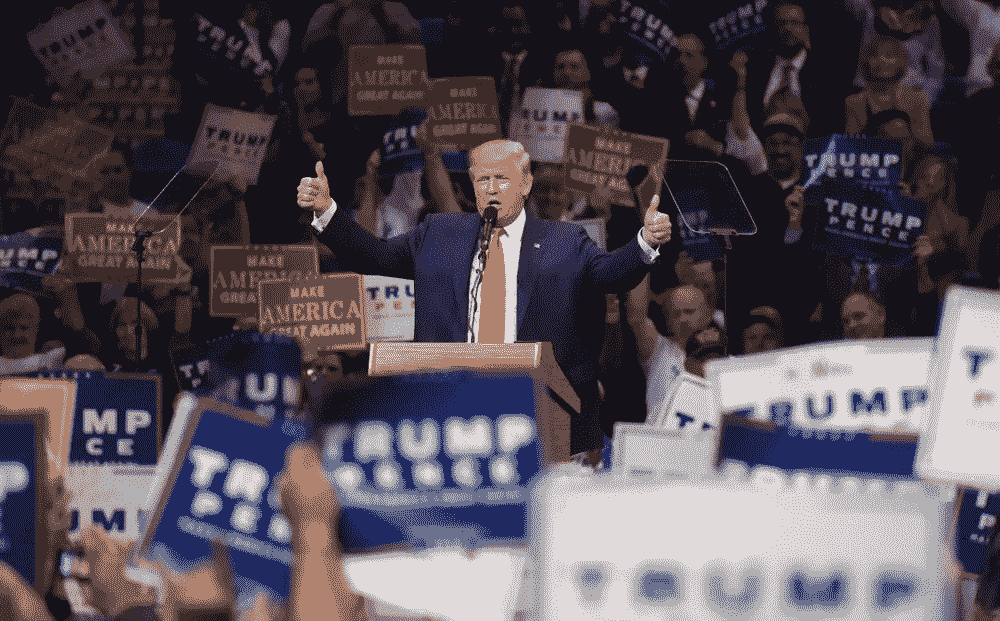

[马特·史密斯](https://www.shutterstock.com/g/Matt+Smith+Photographer)在[快门](https://www.shutterstock.com/)上拍摄的照片

美国总统选举将于 2020 年 11 月 3 日决定，对美国和世界产生巨大影响。虽然一些人认为特朗普是一位好总统，但其他人认为他是一位民粹主义者。不管一个人的政治倾向是好是坏，2020 年大选的后果可能会是惊天动地的。

尽管如此，在这篇文章中，我将向你展示特朗普集会的战略分析，作为拜登-哈里斯竞选团队事实上的数据科学家。我将尝试使用自然语言处理(NLP)对反弹进行主题建模，然后在提供策略分析之前，我将使用时间序列识别反弹中的主题趋势。首先，我从 https://factba.se/transcripts 的[那里获得了川普集会的记录。](https://factba.se/trump/transcripts/)

# 1.文本预处理

从 2017 年特朗普的第一次集会(佛罗里达州墨尔本)到 2020 年 10 月 12 日特朗普从新冠肺炎恢复后的第一次集会(佛罗里达州桑福德)，我总共获得了约 100 份特朗普集会记录的数据。此后，我将数据放入 Pandas 数据框，以地点、日期和记录为列。以下是特朗普在佛罗里达州桑福德的集会摘录，我们立即看到了文本处理的必要性:

> 大家好。你好，奥兰多。你好，桑福德。和你在一起真好。谢谢你。回来真好。[观众唱“美国”]这是很多人。你知道我们的竞争对手，瞌睡虫乔，他今天有个集会，但几乎没人出席。我不知道这是怎么回事。昏昏欲睡的乔，但回到我的家乡佛罗里达州进行我的正式竞选活动真是太棒了。你们的祈祷让我充满活力，你们的支持让我谦卑。我们得到了难以置信的支持，现在我们在这里。你知道，我们在这里。但是我们会完成的，我们会让这个国家比以往任何时候都更伟大。[观众高呼“我们爱你”]谢谢。谢谢你。谢谢您们。

使用正则表达式，我从文字记录中删除了观众输入(在方括号中)。我还使用 NLTK 的 RegexpTokenizer 对包含 3 个或更多字母的单词进行标记，并删除带有任何标点符号的单词，然后再将它们连接到一个经过处理/分割的抄本中。

# 2.EDA——特朗普的 50 大词汇

有了一套“干净”的抄本，我开始着手建模。在探索性数据分析中，我使用 WordCloud 生成了特朗普在他的前两次集会和我获得的后两次集会中经常使用的前 50 个词:

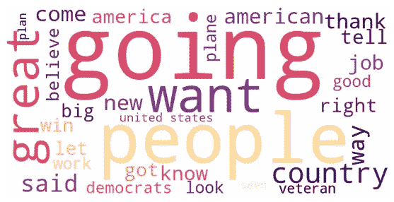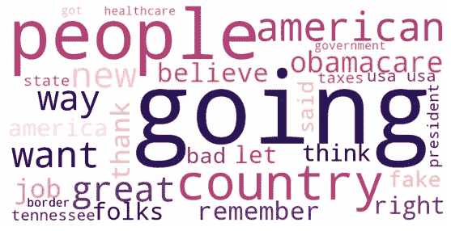

前两场拉力赛:佛罗里达拉力赛，2017 年 2 月(左)和田纳西拉力赛，2017 年 3 月(右)-作者图片

对于 WordCloud 图片，单词越大意味着该单词在抄本中出现的频率越高。通过上面的可视化，我们可以看到为什么特朗普对他的支持者如此有影响力，频繁使用诸如“去”、“伟大”、“人民”和“国家”等词，激发情绪和不断呼吁采取行动。我们还看到“奥巴马医改”的出现，显示了特朗普在总统任期早期的执着。

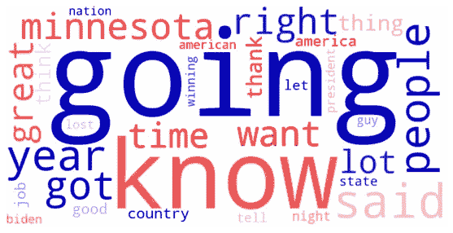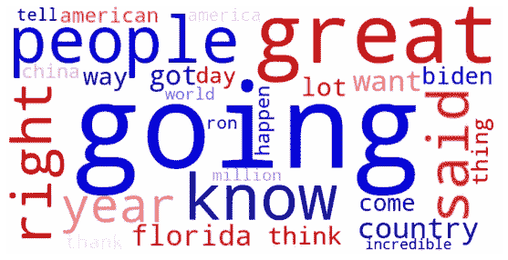

最近的两场拉力赛:2020 年 9 月的明尼苏达拉力赛(左)和 2020 年 10 月的佛罗里达拉力赛(右)——图片由作者提供

在最近两次集会中，我们看到特朗普的用词没有太大变化。“去”、“人民”和“伟大”等词继续是热门词汇，而“拜登”和“中国”等词出现在特朗普开始在大选临近时攻击政治对手之际。

# 3.NLP —主题建模

谈到主题建模，我们通常使用 Scikit-Learn 的计数矢量器或 TFIDF 矢量器将转录本中的所有单词量化为特征。此后，我们通过潜在语义分析(LSA)、非负矩阵分解(NMF)或潜在狄利克雷分配(LDA)将所有特征简化为组件(特征的线性组合)。因此，可以通过过滤组件的顶部单词来识别主要主题。

经过反复试验，我认为 NMF 的 Count Vectorizer(总共 11353 个单词)是特朗普集会的最权威工具。通过仔细的分析和辨别，我从 NMF 的组成部分中找出了 3 个主题(使用了 90 个热门词汇):

*   话题一:吹捧成绩

```
know, said, **right**, people, like, **great**, got, think, **going**, want, **good**, **lot**, **years**, **president**, guy, time, thing, look, **won**, sir, **trump**, love, **way**, **big**, billion, remember, come, let, money, million, went, **deal**, better, tell, little, year, new, mean, guys, world, things, came, democrats, **thank**, bad, win, state, **best**, country, **beautiful**, hell, times, ago, **believe**, actually, michigan, true, took, somebody, party, crazy, obama, american, **incredible**, fake, getting, job, place, happened, day, **greatest**, man, long, china, away, saying, number, news, america, election, night, nice, wouldn, states, care, **history**, wanted, everybody, texas, maybe
```

*   主题 2:计划和寻求支持

```
**going**, great, **want**, **people**, country, **thank**, **vote**, know, **america**, **american**, **right**, like, years, president, got, democrats, way, **good**, **jobs**, time, lot, **need**, think, said, come, **new**, state, **job**, let, love, incredible, **care**, states, americans, tell, united, **believe**, history, **tax**, **borders**, look, **election**, democrat, big, working, republicans, military, **wall**, **coming**, **happen**, world, percent, **law**, republican, **border**, **taxes**, won, billion, **protect**, trump, work, things, man, governor, **happening**, thing, pay, **win**, **deal**, ice, beautiful, day, remember, party, veterans, **help**, folks, **voted**, **passed**, everybody, greatest, strong, florida, called, bad, women, illegal, hard, **unemployment**, today
```

*   话题 3:攻击政治对手

```
**going**, know, **said**, people, got, **biden**, great, like, right, want, think, years, **joe**, good, way, thank, **china**, **remember**, america, lot, country, let, thing, look, tell, **win**, guy, time, job, **big**, **world**, **left**, president, american, mean, **police**, **law**, **bad**, won, states, happen, called, things, deal, **history**, better, love, state, **hell**, ago, new, took, end, **little**, wants, half, **ballots**, happened, **vote**, open, year, everybody, come, wall, jobs, went, **crazy**, **news**, second, **terrible**, **governor**, day, **sleepy**, **bernie**, **order**, pennsylvania, peace, north, military, energy, seen, watch, saw, suburbs, gave, closed, war, **fake**, trump, saying
```

采用新组件作为模型的特征(而不是来自计数矢量器的量化单词)，NMF 能够将主题相关性分数归因于每个集会。随后，我继续绘制各次集会的主题相关性时间序列:

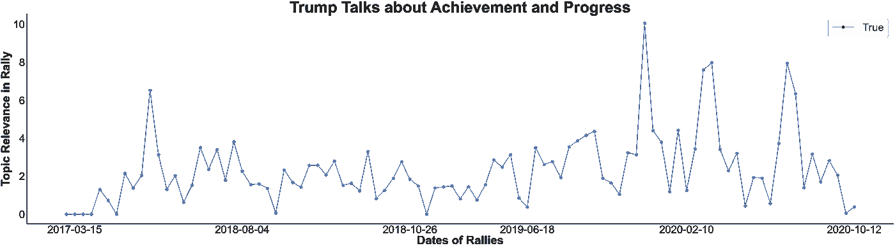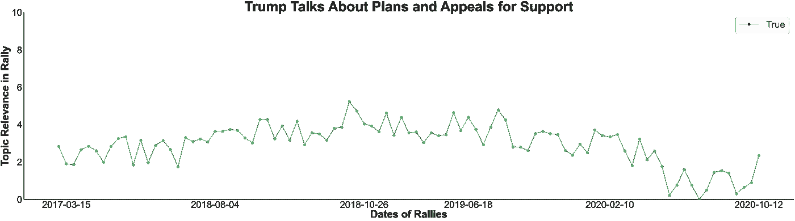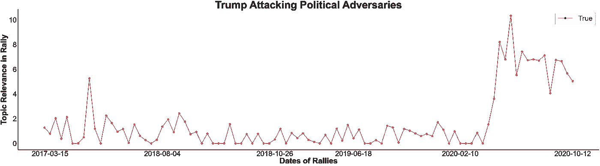

集会中主题相关性的时间序列(按连续的时间顺序绘制)-作者图片

从时间序列中，我们可以看到，虽然“吹捧成就”的主题没有显示出明显的趋势，但“计划和呼吁支持”的主题似乎在接近选举时呈下降趋势。关于“攻击政治对手”的话题显示出明显的上升趋势，接近选举的平台期。因此，特朗普在竞选集会上的语气似乎有所转变——特朗普似乎对自己的计划不太乐观，正在更多地攻击他的对手。这也可以通过余弦相似性热图清楚地观察到:

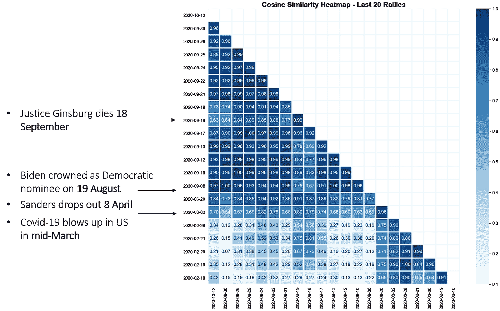

2020 年 10 月 12 日以来特朗普最后 20 场集会的余弦相似性热图。(图片由作者提供)

查看热图的第一列(与 10 月 12 日的集会相比)，特朗普在 2020 年 3 月 2 日集会上的语气似乎发生了突然转变。美国新冠肺炎的突然爆发会不会让川普缺乏安全感，从而促使他更多地攻击对手？

此外，我们在 2020 年 9 月 18 日的集会上观察到另一种语气的转变——根据时间序列，特朗普似乎对他的成就感到欢欣鼓舞。巧合的是，这也是最高法院大法官金斯伯格(民主党人)去世的日子。这是否也导致了特朗普语气的转变？

# 4.进一步 EDA:K-均值聚类

为了进一步分析特朗普集会，让我们探索一下是否可以根据其主题相关性将其分为几组。结果是，在绘制了总惯性与聚类数的关系以及剪影系数与聚类数的关系之后，我们可以:

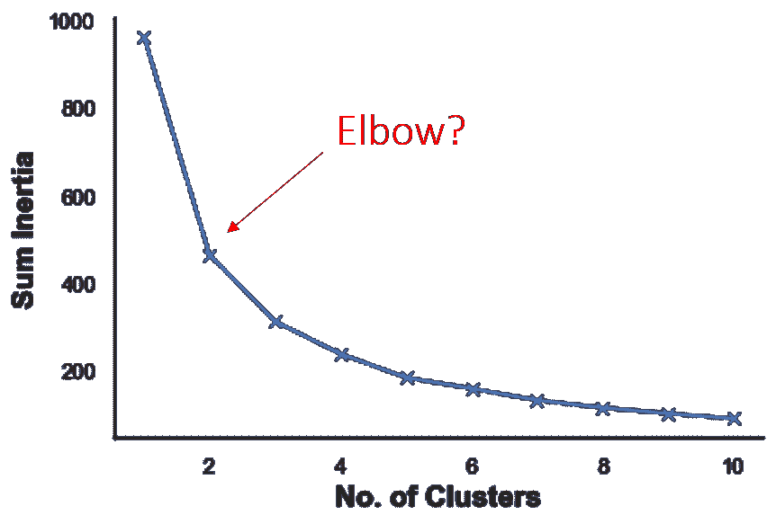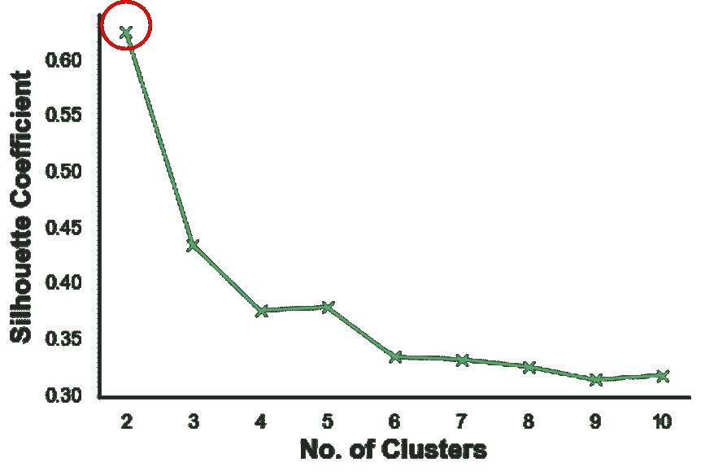

总惯性与聚类数的关系图(左)和剪影系数与聚类数的关系图(右)-作者提供的图片

尽管我们无法在总惯性对聚类图中清楚地识别出一个弯头(弯头方法),但轮廓系数图清楚地表明，聚类的最佳数量是两个！轮廓系数通常在 1 和-1 之间评分，并量化一个点到聚类质心和远离其他聚类质心的接近程度。

接下来，我们用 Plotly 制作了一个特朗普集会的三维图，其中我们看到了两种类型的特朗普集会，他主要攻击政治对手或主要吸引选民:

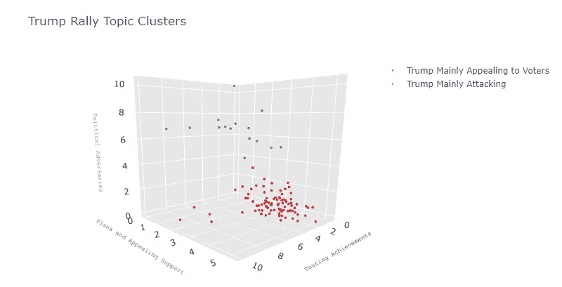

特朗普集会与主题相关性的三维图。(图片由作者提供)

# 5.用 SARIMA 进行时间序列预测

回到我们的时间序列图，我们注意到一些有趣的事情——特朗普集会中似乎有一种主题相关性的周期性暗示。此外，关于“计划和呼吁支持”和“攻击政治对手”的主题似乎也有趋势成分。因此，时间序列是非平稳的，我们可以使用季节性自回归综合移动平均(SARIMA)模型进行预测分析。

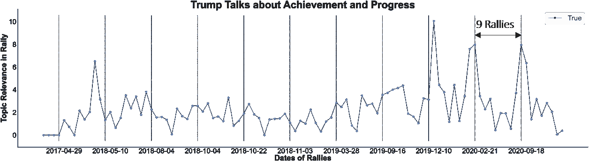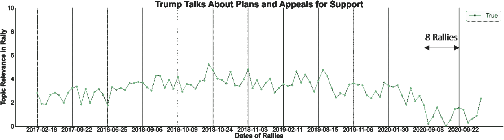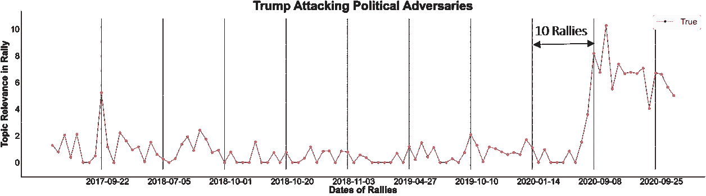

集会上的主题相关性时间序列(按连续顺序)，显示周期性。(图片由作者提供)

沿着探索的道路，我通过以 90:5:5 的比例将数据集分为训练集、验证集和测试集，进行了简单的正向验证

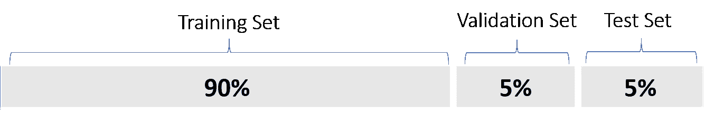

简单的验证模式。验证和测试集在时间上向前验证。(图片由作者提供)

使用 SARIMA 对最佳超参数进行简单的网格搜索后，我获得了以下平均绝对误差(MAE)分数:

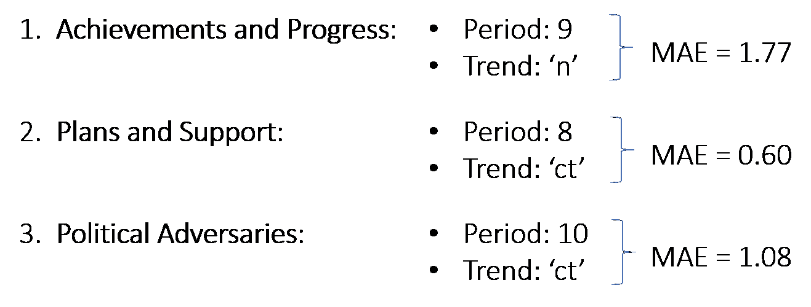

使用最佳超参数，我将训练和验证集与 SARIMA 模型一起重新训练，然后在测试集上进行评估。我发现下面的错误分数还是很合理的:

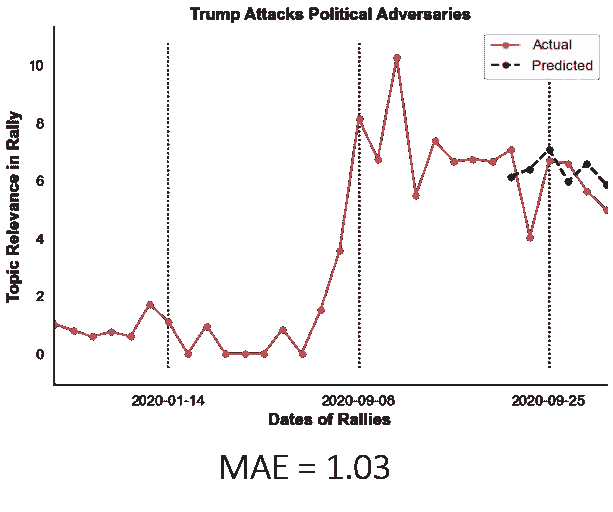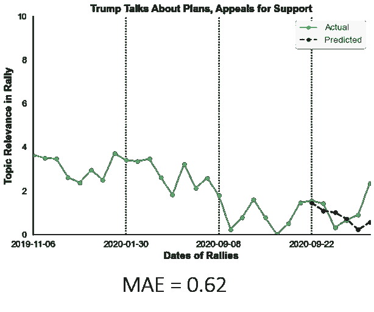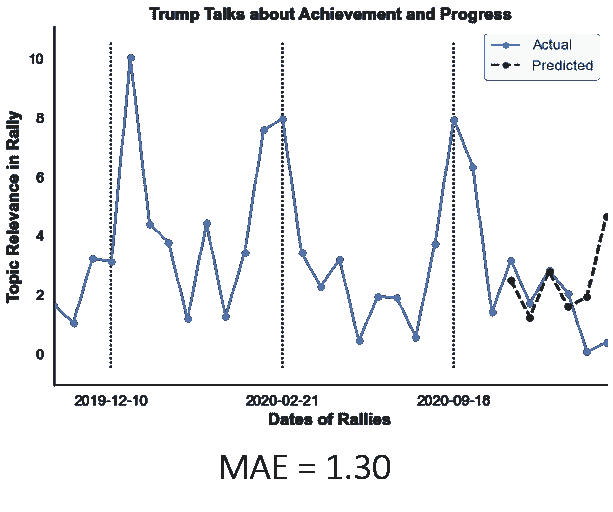

跨集会的主题相关性时间序列及其在最近 6 次集会中的预测。(图片由作者提供)

# 6.模型与策略一起使用

时间序列预测模型可用于发现未来特朗普集会主题的潜在波峰和波谷。虽然拜登-哈里斯竞选团队可能有自己的一套对抗特朗普竞选团队的策略，但人们也可以参考中国古代战略手册《孙子兵法》，该手册提倡与对手反其道而行之。

> “强的时候，避开他们。如果士气高昂，就让他们沮丧。似乎卑微到让他们充满自负。如果放心，就把它们耗尽。如果团结，就把他们分开。攻击他们的弱点。让他们大吃一惊。”
> ― **孙子**

例如，拜登可以在特朗普被预测不那么咄咄逼人的时候更多地攻击他。相反，拜登可以吸引人群，并在特朗普预计会更具侵略性时谈论他的计划。因此，一个可以预测特朗普在竞选中的气质和语气的模型对拜登-哈里斯阵营非常有用。

# 7.结论

综上所述，我已经完成了对特朗普集会的颇有见地的探索性数据分析，也创建了对特朗普话题趋势的预测模型，作为案例研究。

这份仔细的分析是 Metis 数据科学训练营(新加坡)的项目 4，我要感谢所有人，特别是我的导师尼奥·韩伟，他迄今为止一直在指导我。这是一次令人兴奋的经历，也是一次惊人的学习之旅。谢谢大家！

> 这里是到我的 GitHub 的[链接，它包含了这个项目的所有代码和演示幻灯片。也可以通过我的](https://github.com/tanpengshi/Metis_Project_4_Trump_Rallies) [LinkedIn](https://www.linkedin.com/in/tanpengshi/) 联系我或在下面评论来讨论！
> 
> ***支持我！*** —如果你*没有*订阅 Medium，并且喜欢我的内容，请考虑通过我的[推荐链接](https://tanpengshi.medium.com/membership)加入 Medium 来支持我。

[](https://tanpengshi.medium.com/membership) [## 加入我的介绍链接媒体-谭师鹏阿尔文

### 阅读谭·师鹏·阿尔文(以及媒体上成千上万其他作家)的每一个故事。您的会员费直接…

tanpengshi.medium.com](https://tanpengshi.medium.com/membership)