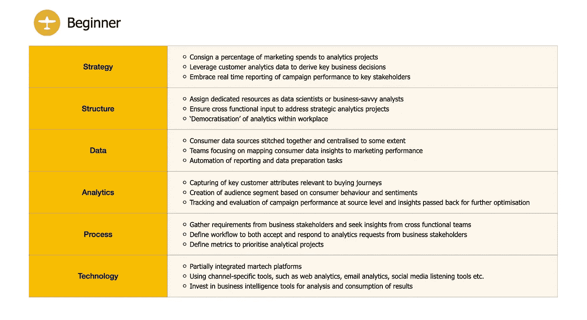
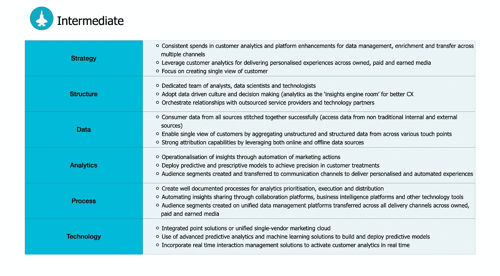
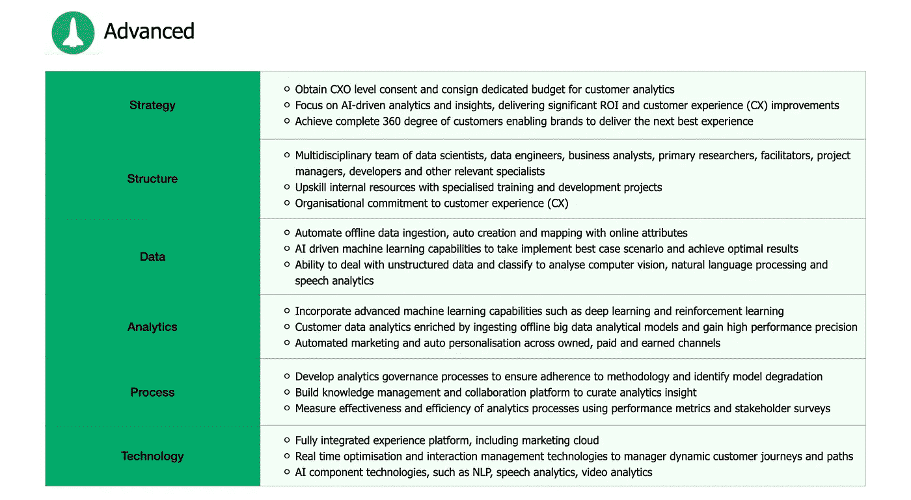

# 提高客户分析成熟度的战略方法

> 原文：<https://towardsdatascience.com/strategic-approach-to-advance-your-customer-analytics-maturity-a873bd761988?source=collection_archive---------49----------------------->

## 客户分析成熟度级别和不同成熟度级别公司的战略路线图

在 [Unsplash](https://unsplash.com?utm_source=medium&utm_medium=referral) 上由 [Austin Distel](https://unsplash.com/@austindistel?utm_source=medium&utm_medium=referral) 拍摄的照片

> 根据[麦肯锡的一项研究](https://www.mckinsey.com/business-functions/marketing-and-sales/our-insights/why-customer-analytics-matter)，广泛利用客户分析的公司更有可能在关键绩效指标上超越竞争对手，无论是利润、销售额、销售增长还是投资回报

如今，企业已经意识到，客户分析是在当今市场中获得竞争优势的必备能力。近年来，客户数据的泛滥为企业更好地了解他们的客户并在战略决策中占据中心位置提供了一系列机会。然而, [research](https://www.gartner.com/smarterwithgartner/take-your-analytics-maturity-to-the-next-level/) 表示，虽然企业拥有本地化分析能力，但不到 15%的企业拥有根深蒂固的分析能力，或者认为这是他们组织内的一种差异化能力。

企业正在努力组织和构建大量的消费者数据，努力从多个接触点获取高质量的数据，并建立一种包含洞察力驱动的决策的组织文化。 [Forrester 的客户分析成熟度评估](https://www.forrester.com/report/Gauge+Your+Customer+Analytics+Maturity/-/E-RES92201#)为企业提供了涵盖六项关键能力的基准客户分析成熟度水平:**战略、结构、数据、分析、流程和技术**。根据[客户分析成熟度报告](https://reprints.forrester.com/#/assets/2/108/RES150120/reports)，公司可以分为三个成熟度等级——初级、中级和高级。

初学者:有时使用基于汇总数据的后视镜报告分析，但不使用它来收集和分析有用的客户信息的公司属于初学者类别。这些公司没有投资专门的资源来处理消费者数据并推断出有价值的见解，而是基于假设和预感做出不科学的决策。对于这些公司来说，数据是在小仓库中获得的，并且数据提取源没有被缝合在一起以创建客户的单一视图。这些公司采用免费的分析工具或部分集成的 martech 平台来管理和组织数据。

**中级:**这些公司正处于从报告向洞察和注重行动的分析转变的过程中。这些公司将拥有专门的资源或团队(分析专家或数据科学家)，他们正在学习将数据和见解转化为行动。团队努力创造一种数据驱动的文化，这种文化基于消费者的洞察和智能来支持协作决策。数据源被缝合在一起，集中于创建客户的单一视图，并且还促进了强大的归因能力。

**高级:**高级公司正在利用分析技术实时释放消费者意图信号和情感，在多个接触点提供有意义的个性化体验。这些公司采用人工智能驱动的分析和见解，专注于提供显著的投资回报率和 CX 改善。这些公司将有数据分析师和数据科学家团队与业务团队合作，共同致力于为消费者提供下一个最佳体验。团队能够处理非结构化数据，并将受众数据无缝地推送到集成的 martech 和 business tech 平台。这些公司通常采用完全集成的体验平台，包括营销云。

下面提到的是不同成熟度的公司的战略路线图。

一旦团队评估了他们当前的分析成熟度并确定了战略路线图，下一个任务就是确定实现客户分析成功的关键驱动因素。对于每一个公司来说，要将他们的成熟度等级提高到高级，团队必须努力建立实现关键业务目标所必需的能力。这些能力不仅将推动营销的改进，还将为客户服务、入职、保留和其他职能团队提供有意义的见解。

# **客户分析成功的战略方法**

在 [Unsplash](https://unsplash.com?utm_source=medium&utm_medium=referral) 上由 [Adeolu Eletu](https://unsplash.com/@adeolueletu?utm_source=medium&utm_medium=referral) 拍摄的照片

1.  **能够创建客户的单一视图:**

数据驱动型企业的口头禅是客户情报和可操作见解的重要性。在客户体验时代，领先的企业确保在各种不同的接触点和设备上最大限度地了解他们正在接触的客户和潜在客户。这成为满足多个跨职能团队需求的客户智能的基石。创建单一客户视图的能力使多个业务职能部门能够在正确的时间和地点做出最合适的决策，以提供增强的无缝客户体验。

客户分析必须从整体层面来看，考虑通过自有、付费和盈利媒体跟踪的消费者情绪和行为。从搜索引擎上的查询中捕获的消费者意图信号可以传递到统一的客户数据平台，该平台可以进一步推送到活动工作流，以实时触发定制的直接渠道活动。事实上，捕捉意图层面的数据甚至可以触发一线员工在各种线下接触点向消费者传达相关信息，并促成令人印象深刻的结果。

这将进一步导致消费者以特定的方式做出响应，并且数据必须再次传递回统一数据平台，以便为特定消费者的购买漏斗提供更多行为洞察。创建客户的单一视图不仅包括实时交付上下文体验，还将允许分析平台不断学习、优化各种底层流程，并向相关利益相关方推荐规范的见解。

**2。能够进行预测性和规范性分析:**

推动实时决策和触发沟通事件不仅是可能的，而且越来越有望成为卓越客户体验的基础组成部分。另一项能力是执行预测和说明性分析的能力，这是由客户交互的完整视图和技术的有效使用支撑的。

预测分析有助于企业根据历史消费者数据了解最有可能的未来情景及其影响。预测分析可以展示在“假设”场景中可能发生的情况，使企业能够预测任何给定流程中的哪些变化最有可能成功或失败。在营销领域利用预测分析的一个最成功的用例是线索评分。营销人员通常利用数据管理平台或客户数据平台上的潜在客户评分功能。这使得品牌能够为不同类别的潜在客户(热销售线索、温销售线索或冷销售线索)提供差异化的处理方式。

说明性分析利用人工智能和人工智能，使企业能够从消费者洞察中学习，并在整个消费者旅程中自动指定行动。说明性分析的用例可以在个性化、受众细分、内容管理等领域找到。Adobe Test and Target 使用说明性分析，根据历史用户行为向消费者推荐跨自有资产的下一个最佳体验。

**3。建立归因模型的能力:**

由[斯蒂芬·道森](https://unsplash.com/@srd844?utm_source=medium&utm_medium=referral)在 [Unsplash](https://unsplash.com?utm_source=medium&utm_medium=referral) 上拍摄的照片

随着洞察能力系统的出现，尤其是在自动化营销领域，营销人员和分析师必须建立模型，确定如何将任何形式的转化的信用分配给转化路径中的接触点。对于企业来说，了解哪些渠道在多大程度上促成了特定的转化是至关重要的。企业可以从付费搜索或自然搜索结果中获得巨大的流量转换率。但这是否意味着以多种频率展示给消费者的展示广告活动对整体转化率没有贡献呢？

在大多数潜在客户开发或客户获取案例中，都有涉及帮助渠道的流程，如呼叫中心、触发式电子邮件、短信等，以将离开的访问者带回购买之旅。在这种情况下，营销人员考虑多渠道渠道来比较不同归因模型如何影响不同接触点的价值变得至关重要。为了比较线下和线上渠道对推动在线转化的影响，企业必须认识到平台集成和自动化的重要性。

捕捉消费者时刻并根据分析生成的消费者情报触发行动的能力在很大程度上取决于如何将内部应用程序和 martech 平台缝合在一起，从而无缝地摄取离线数据。