# 建立餐馆的战略集群

> 原文：<https://towardsdatascience.com/strategic-location-for-establishing-an-asian-restaurant-c3aecf2496b1?source=collection_archive---------22----------------------->

## 使用 k-Means 聚类实现在加拿大多伦多开设亚洲餐馆的最佳位置

加拿大多伦多[由**蕾切尔**安娜贝尔](https://unsplash.com/photos/XeYmx-qBsUk)

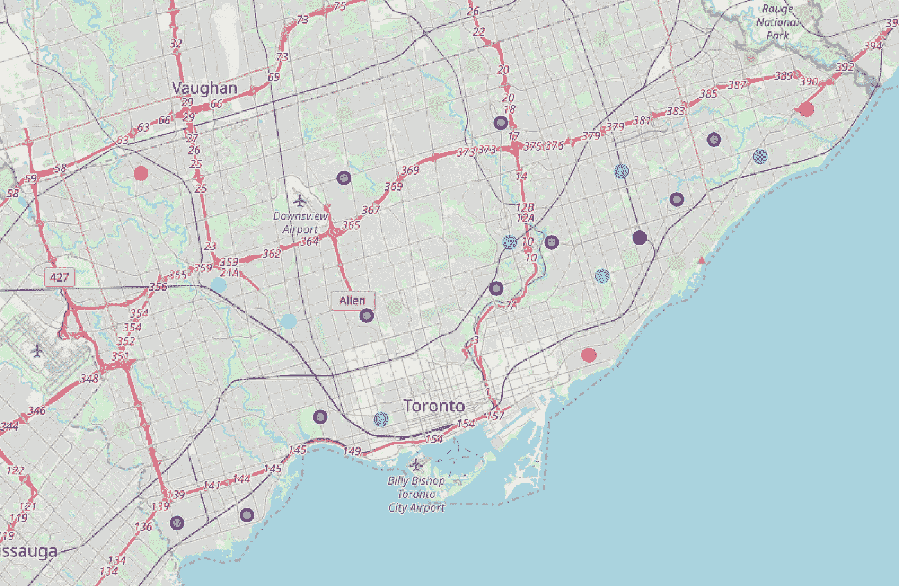

***多伦多街区根据它们的集群标签进行颜色编码***

# **1。简介**

## **1.1 背景**

建立一家新餐馆的成功取决于几个因素:需求、品牌忠诚度、食物质量、竞争等等。在大多数情况下，一家餐馆的地理位置是其成功的决定性因素。因此，为了最大化商业利润，确定最具战略意义的建立地点是有利的，也是最重要的。

## **1.2 业务问题**

一位客户寻求在多伦多附近建立一家专营东南亚美食的亚洲餐厅。哪个社区似乎是企业运营的最佳和最具战略意义的位置？

这个顶点计划的目标是为操作定位最佳邻域。我们推理的基础是基于消费能力、种族群体的分布和每个社区的竞争。我们将主要利用 Foursquare API 和来自多伦多开放数据门户的大量地理和人口普查数据。

## **1.3 利益**

寻求建立一个特定领域的新餐馆或计划扩大其特许餐馆的企业家伙伴们会对这一发现可能带来的竞争优势和商业价值非常感兴趣。

# **2。数据采集和清理**

## **2.1 数据来源**

他们各自的邮政编码和行政区旁边的街区是从维基百科上搜集来的。每个街区的地理坐标都是从[这里](https://cocl.us/Geospatial_data)提取的。至于多伦多的人口普查数据——家庭收入中值、总人口和每个街区的东南亚人口——多伦多的开放数据门户在这里[提供了所有这些数据](http://map.toronto.ca/wellbeing/#eyJ0b3Itd2lkZ2V0LWNsYXNzYnJlYWsiOsSAcGVyY2VudE9wYWNpdHnElzcwfSwiY3VzxIJtYcSTYcSXxIBuZWlnaGJvdXJob29kc8S2fcSrxIHEg8SFxIfEicSLdGFixYXEmCLEo3RpdmVUxZBJZMSXxYnEhMWPYi1pbmRpY2HEgnLFhcWIYWdzTWFwxLYiesWCbcSXMTPErHjEly04ODM3NzQ2LjDEqTc4MDnErMSnOjU0MTI5MzkuOTIyxorGmsWIxaTFpsWoxarFksSAxZjFq2lvbsSXMsSsc8WkZ2xlxYbErMWWbWVzxJtpxrbGssStxL%2FEk8SfScWlxafFqcSDTcWDxrE6IsatbsavxrHFhw%3D%3D)。

为了返回每个街区附近亚洲餐馆的数量，我们将利用 Foursquare API，更具体地说，它的 *explore* 函数。你必须注册一个 Foursquare 开发者账户[才能访问他们的 API 证书。](https://developer.foursquare.com/)

## **2.2 数据清理**

从多个来源下载或搜集的数据被合并到一个表中。由于缺乏记录，某些街区有很多缺失值。为实现图 1 中*所示的数据帧，进行了一些假设:*

*   只会处理具有指定区的像元；未分配的行政区被忽略。
*   丢失两个以上普查数据值的邻域被删除。
*   通过将东南亚人口统计的人口数除以每个街区的总人口数，计算出东南亚人口在每个街区的分布百分比；后两列是多余的，被删除了。

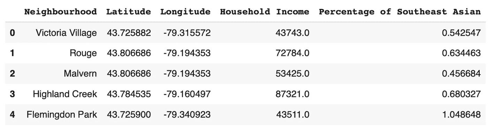

*图 1:数据清理后的数据帧*

# **3。探索性数据分析**

## **3.1 树叶映射**

该图书馆被称为帮助可视化，从地理上来说，每个以多伦多为中心的街区的位置。

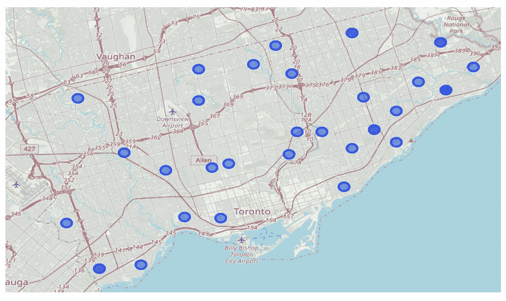

*图 2:用叶子在多伦多地图上标出的街区*

## **3.2 亚洲餐厅的频率分布**

使用 Foursquare API 的 explore 函数，我们可以返回位于每个街区的亚洲餐馆的数量。通过分别计算平均值，它可以让我们更好地了解每个邻域的发生频率。使用亚洲餐馆频率的理由是，我假设亚洲餐馆的数量和竞争之间存在相关性。一个街区中所述餐馆的数量越多，竞争就越激烈。我们分析的假设是，在竞争激烈的市场中建立一家新餐厅的进入壁垒很高，因为现有的亚洲餐厅可能具有品牌忠诚度的竞争优势。

虽然，与直觉相反，这些餐馆的存在可能是对亚洲美食需求的一个指标；竞争的存在甚至可能激励创新以降低成本和提高生产率。

因此，在一个由大约中等价值的餐馆组成的街区建立商业经营是合理的。

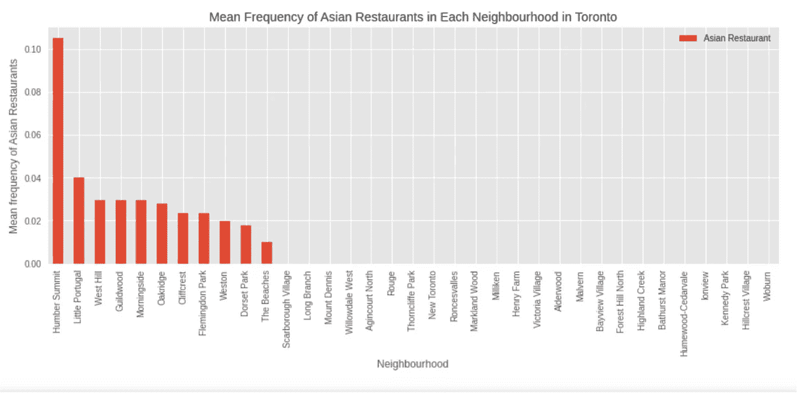

*图 3:每个街区亚洲餐馆的平均频率分布*

## **3.3 东南亚人口分布**

我假设在一个特定的种族群体的人口和对其各自文化的需求之间也存在着线性关系。因此，对我们的客户来说，在东南亚人相对更密集的社区开展业务活动才是明智之举。

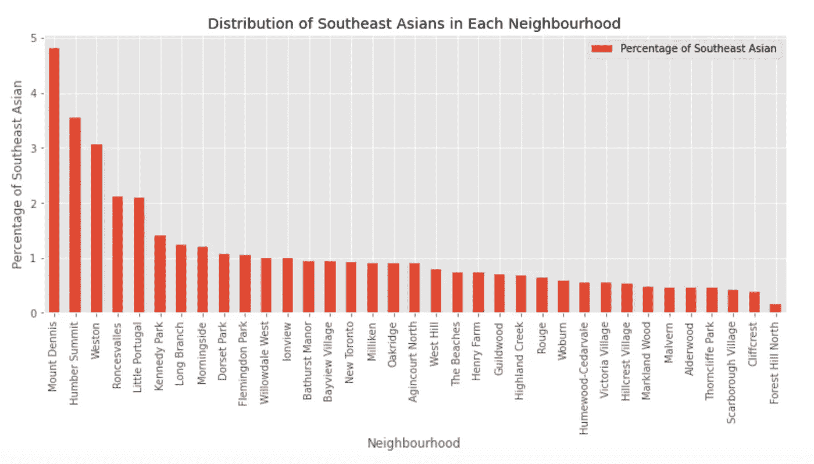

*图 4:东南亚人在各街区的百分比分布*

## **3.4 家庭收入中位数的分布**

由于特许经营的亚洲餐厅可以归类为休闲餐饮，其目标受众更多地面向中产阶级收入者。从下面的柱状图可以推断出，平均家庭收入附近的居民区很容易负担得起并享受上述亚洲美食。

这项研究还假设，在这项研究中，所有社区的生活费用在决定其各自的消费能力方面是相对平等的。

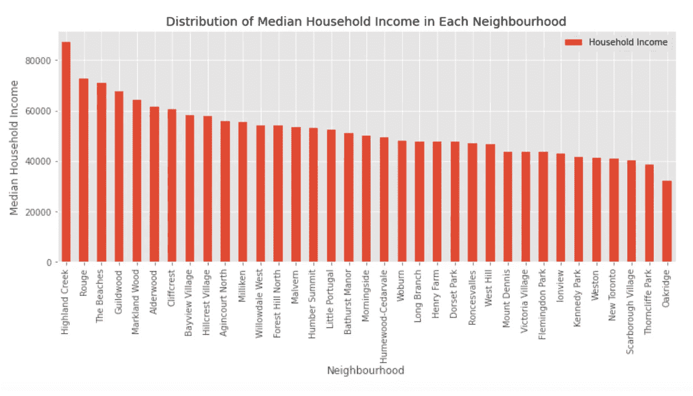

*图 5:各街区家庭收入中位数分布*

# **4。预测建模**

## **4.1 数据预处理**

为了帮助基于数学的算法——就像我们在这种情况下的 k-Means 算法——同等地解释具有不同量值和分布的特征，我们必须归一化我们的数据；由于这些特征列的比例不同，我们将把这些值标准化为一个共同的比例。数据标准化的一种方法是*标准定标器*。

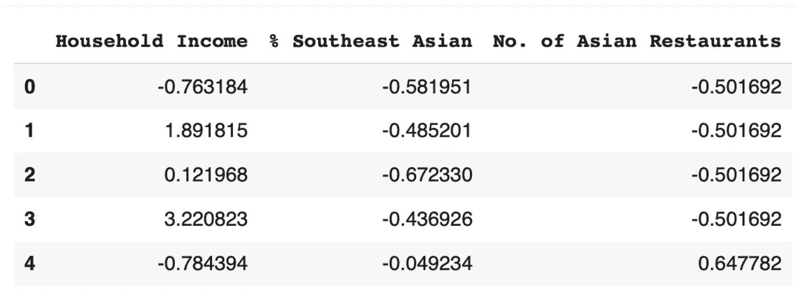

*图 6:具有所有特征的标准化值的数据帧片段*

## **4.2 k 均值聚类**

在我们将特征值放入模型之前，我们必须预先分配算法应该标记的聚类数。为了确定要使用的最佳数目的集群，使用了 3 至 10 个集群，然后分别计算的平方误差被用作其性能的度量。

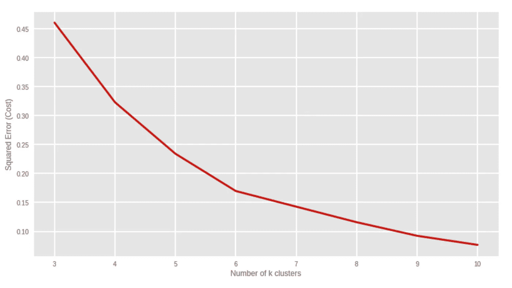

*图 7:k 个簇的数量与其对应的平方误差之间的关系*

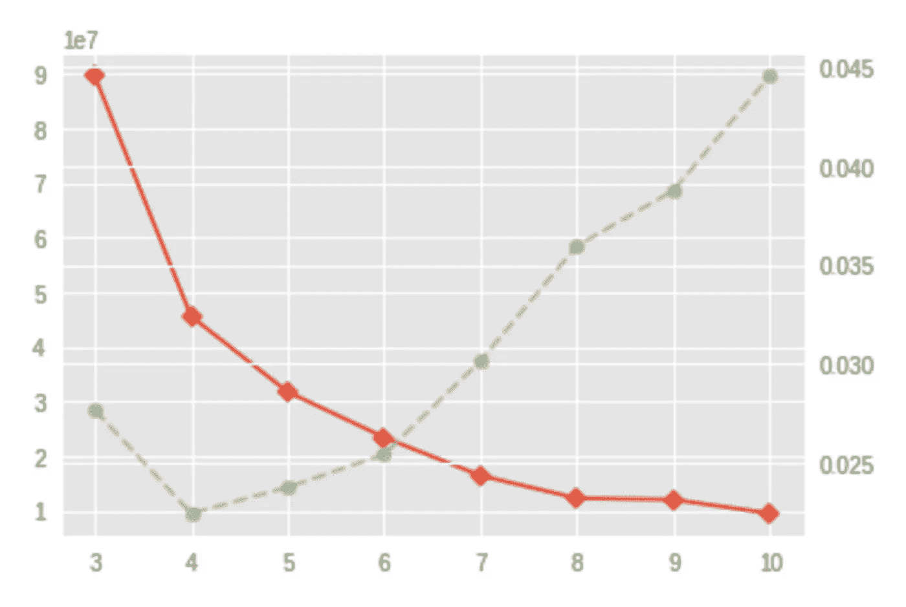

*图 8:使用 K 弯头可视化工具确定最佳 K 值的弯头点*

使用 K 肘可视化器和每个 K 值的平方误差的分析表明，k = 6 将是最佳值。

在确定了聚类的数量之后，我们将把标准化的特征值拟合到我们的 k-Means 算法中；从而形成 6 个具有相似特征的聚集社区。

## **4.2.1 集群标签**

***多伦多的街区根据它们的集群标签进行颜色编码***

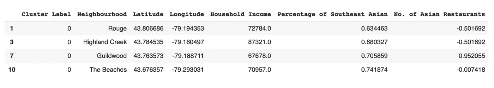

*图 9.1:聚类标签 0*

**集群 0:**

*   **消费能力高**
*   **中期**目标客户的百分比
*   **中期**竞争者数量

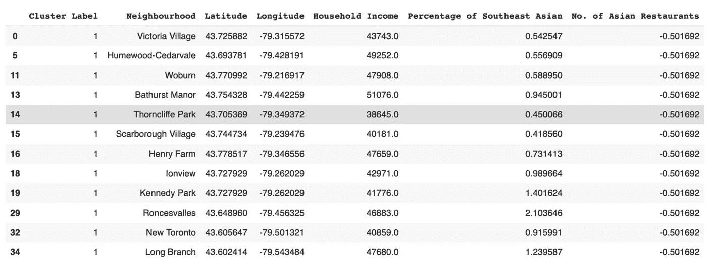

*图 9.2:集群标签 1*

**集群 1** :

*   **消费能力低**
*   **中期**目标客户的百分比
*   **竞争者数量少**

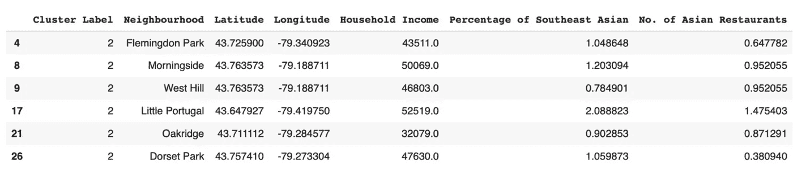

*图 9.3:集群标签 2*

**集群 2** :

*   **消费能力低**
*   **目标客户比例高**
*   **高**竞争者的数量

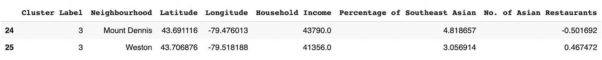

*图 9.4:集群标签 3*

**第三组**:

*   **消费能力低**
*   **目标客户比例高**
*   **中期**竞争者数量

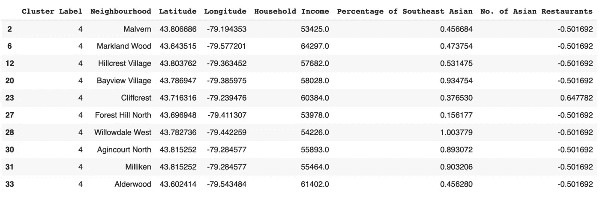

*图 9.5:集群标签 4*

**集群 4:**

*   **中期**消费能力
*   **中期**目标客户的百分比
*   **竞争者数量少**

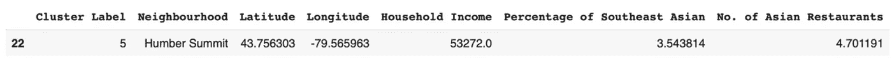

*图 9.6:集群标签 5*

**集群 5** :

*   **中期**消费能力
*   **目标客户比例高**
*   **高**竞争者的数量

## 4.2.2 集群摘要

总之，**集群 0** 的居民区拥有最高的相对消费能力，因为他们的家庭收入中位数明显高于其他集群。相当数量的东南亚人和亚洲餐馆表明对东南亚菜肴有足够的需求；和能够比其他人更有规律地消费膳食的顾客。

第 1 类消费能力低，同类餐馆数量少，这意味着消费能力指数低，需求不足，因此这类餐馆是最不理想的选择。

**集群 2** 在该地区拥有大量东南亚人口或目标客户，因此前景看好。然而，它的低消费能力和类似利基的大量竞争对手可能表明进入的高壁垒-与竞争对手提供的更便宜的选择相比，它的人口统计可能要求我们客户的更昂贵的菜单更少。

**集群 3** ，尽管在人口统计和最佳竞争者数量方面有利，但其低消费能力将不幸地证明消费不足。

**集群 4** 在该地区的竞争者数量较少，这表明该地区对该美食的需求较低，尽管该地区拥有足够的消费能力水平和人口分布。

**聚类 5** 仅由一个小区组成，这是因为其竞争对手的数量非常多，并且分布在东南亚。尽管竞争对手众多，但这显示了前景。如果客户的特许经营餐厅已经建立，那么“集群标签 5”中的社区也可以考虑，因为该餐厅具有品牌忠诚度的竞争优势，可以对抗竞争对手的密度。

# **5。结论**

在这项研究中，我根据他们的特征——消费能力、目标客户的百分比和竞争对手的数量——对社区进行了标记。最有希望开一家亚洲餐馆的社区群，以东南亚美食为利基，似乎是“集群标签 0”。

这个集群中的居民区的较高消费能力使他们很容易负担客户的亚洲餐馆菜单的稍微升级的价格。

目标顾客百分比的平均分布——东南亚人口统计——表明对亚洲美食的需求相对合理。

竞争者的数量并不多，但足以成为亚洲美食需求的良好指标。

我们的客户可以更具体地考虑 Guildwood 作为最佳结果的建立地点。然而，每当商业需求的动态发生变化时，我们总是可以瞄准不同的社区集群。举例来说，如果客户计划扩展一家知名的特许经营餐厅，那么“集群标签 5”中的社区将是最佳位置；这是基于一种假设，即上述餐馆相对于该地区的众多竞争者而言，具有品牌忠诚度的竞争优势。

总之，以上广泛的分析将大大增加餐馆成功的可能性。同样，我们可以用这个项目来分析可互换的场景，比如开一家不同菜系的餐厅。

# **6。未来方向**

我认为这个模型可以在捕捉餐馆的个性特征方面做更多的改进。例如，两家餐馆可能有相似数量的竞争对手，但其中一家的地理半径可能较小，而另一家的地理半径较大。另一个例子是，东南亚人口更密集的餐馆可能不会比他们的民族同行更渴望他们的亚洲美食。

这项研究中的消费能力属性过于无知地假设所有上述社区的生活成本相对相等。更精确地计算购买力的生活成本账户将极大地改善研究结果。更多的数据，尤其是不同类型的数据，将有助于显著提高模型性能。

# **7。参考文献**

[1]我这个项目的 Github:【https://github.com/TheClub4/Coursera_Capstone 

[2]维基百科关于多伦多街区的信息收集页面:[https://en.wikipedia.org/w/index.php?title =加拿大邮政编码列表:_M & oldid=945633050](https://en.wikipedia.org/w/index.php?title=List_of_postal_codes_of_Canada:_M&oldid=945633050)

[3]多伦多人口普查数据开放数据门户:

 [## 幸福多伦多

### 最小值和最大值之间的数据值范围被划分为等长的类。例如，如果 5…

bit.ly](https://bit.ly/2Ja4v81) 

[3]多伦多街区的地理坐标:[https://cocl.us/Geospatial_data](https://cocl.us/Geospatial_data)

[4] Foursquare 开发者 API:[https://developer.foursquare.com](https://developer.foursquare.com)