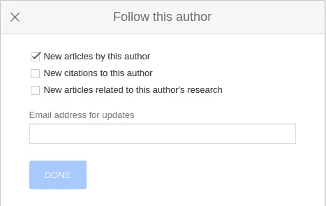
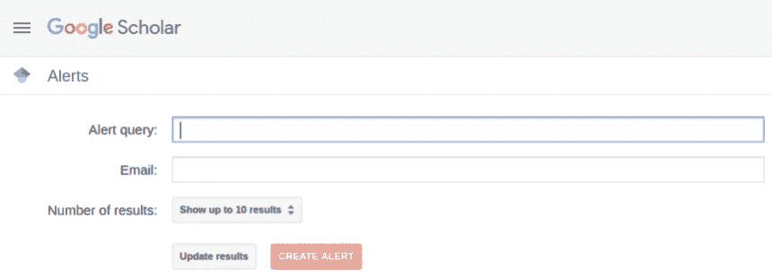

# 跟上人工智能研究的策略

> 原文：<https://towardsdatascience.com/strategies-for-keeping-up-with-ai-research-7861037c7247?source=collection_archive---------70----------------------->

原始图像由 OpenClipart-Vectors 在 [Pixabay](https://pixabay.com/images/id-2026529/) 上生成

## 帮助您掌控一切的 7 个技巧

# 人工智能的速度

对于任何关注人工智能(AI)、深度学习(DL)或机器学习(ML)领域的人来说，研究有时会像赛车一样从你身边飞驰而过。在 arXiv.org 上快速搜索显示，今年(2020 年)4 月 1 日至 5 月 1 日期间，宣布了 2683 篇与 AI、DL 或 ML 相关的新文章。研究社区不断被新的工作(好的和坏的)淹没，跟上似乎是不可能的。媒体对大赦国际的报道进一步加剧了这种情况。无论是自动驾驶汽车的即将到来，自然语言处理的进步，自动化医疗诊断，还是对控制论机器人起义的恐惧，人工智能都受到了广泛关注。

当然，人工智能接受的无数曝光有许多好处；然而，对于那些在实地工作的人来说，也有一些负面影响。首先，来自新应用程序、更好的体系结构、新兴子领域等的大量信息会分散注意力。随时都有数不清的兔子洞可以跳下来。虽然探索可能提供更好解决方案的新的和新兴的解决方案很重要，但如果我们把所有的时间都花在追逐闪亮的物体上，那么我们将永远不会取得任何进展。

其次，大量新研究和不断增长的人工智能行业可能会产生不必要的焦虑。成功和快速成功的压力甚至会动摇最有经验的研究人员和开发人员的信心。似乎其他研究人员的发布速度是他们的两倍，或者公司开发的应用程序也是他们的两倍。这可能导致糟糕的设计决策和浪费时间，从而破坏我们有效应用人工智能的能力。此外，这可能会使我们容易受到群体思维的影响，并限制我们用新颖和创造性的解决方案处理问题的能力。

最后，如果你想保持相关性，跟上与你的应用领域或行业相关的研究是必要的。诀窍是找到不消耗你所有时间并且最适合你的方法。本文的其余部分确定了实现这一目标的策略。同样重要的是，我们要让最先进的研究启发我们，而不仅仅是影响我们，但这将是未来文章的主题。

# 跟上的策略

所以好消息是有大量的资源可以帮助我们跟上与我们兴趣相关的研究。在这篇文章中，我分享了一些我使用的资源，并讨论了我的一些保持与人工智能研究同步的策略。下面的项目是根据我个人的优先顺序排列的，但是每个人的学习方式都不一样，所以我鼓励你尝试一下，看看哪些适合你。

## 0。实事求是，始终如一

我们所有人花在跟上人工智能上的时间都是有限的，所以要现实和一致。在你的时间表中留出固定的时间。认识到你的时间限制会帮助你选择最适合你的策略。聪明努力地工作。

## 1.看报纸

因此，尽管听起来很明显，但花点时间阅读论文是非常重要的。这将为你提供学习新的和正在出现的工作的明显好处，但它也将加强你提炼和理解复杂概念的能力。阅读技术论文是一项对工程和科学至关重要的技能，就像所有其他技能一样，熟能生巧。**奖励**:批判性阅读论文也是一种很好的方式，通过真正挑战作者提出的一切来提出新的研究/算法想法。

以下是我的一些读报小技巧。

**1A。保持有条理。**

所以我的第一个建议是保持你的文件有条理。就我而言，我的云驱动器上有一个“_ReadMe_”文件夹，里面有我想阅读的所有论文。所以，当你有一点时间的时候，你可以直接去你的文件夹，开始阅读。一旦你阅读了这篇论文，你可以把它移到你的数字图书馆的其他地方，或者简单地删除它。

**1B。聪明阅读。**

正如我在博士期间很快了解到的那样，阅读论文会花费很多时间，如果你没有一个好的策略，你将永远不会看完你需要的所有论文。就我个人而言，我发现三阶段方法对我非常有效。每个阶段都有特定的目的，随后的阶段建立在前一个阶段的基础上。这可以大大加快这个过程，因为你经常会发现，在许多情况下，完成第二阶段就足够了。

这是我的一般做法。

*   第一阶段:阅读摘要和结论。
*   第二阶段:通读整篇论文，但是跳过任何需要大量脑力劳动的技术细节。
*   第三阶段:批判性阅读，质疑作者的假设和主张。
*   第四阶段(奖金！):码起来！这显然不仅仅是阅读，而是最终真正理解新概念的最佳方式。

在不久的将来，我将发表一篇关于我的方法的更详细的文章。我也鼓励你去读一些其他的策略，找到适合你的。

**1C。设置提醒。**

[谷歌学术](https://scholar.google.com/)是一个了不起的资源，原因有很多，但自动提醒是跟上新潮流的好方法。可以基于作者或搜索字符串创建通知。作者提醒对于关注该领域的重量级人物非常有用，搜索字符串提醒对于寻找新作者非常有用。

要创建作者提醒:

1.  搜索一个作者，点击他们的名字，进入他们的谷歌学术简介。
2.  选择个人资料右上角的“关注”按钮。
3.  输入您的电子邮件地址并选择提醒选项。

作者图片

要创建搜索字符串警报:

1.  登录谷歌学术，从侧面菜单中选择“提醒”。
2.  点击“创建提醒”。
3.  输入您的电子邮件地址、应该查询的搜索字符串以及应该包含的结果总数。

作者图片

专业提示:如果你使用 GMail，那么你可以利用这些奇特的过滤技巧来自动组织收件箱中的提醒。你可以在这里阅读花式过滤。

## 2.观看 YouTube

YouTube 是最令人兴奋的地方之一，我开始看到真正好的内容。有很多非常聪明的人正在发表论文评论、在线讲座和教程。所有这些都是快速了解新主题和获得直觉的极好来源。我发现这些视频为我节省了时间，并让我意识到了一些我以前不会看到的新话题。

我没有提供一个长长的潜在频道列表，而是只列出了三个 YouTube 频道，我建议从它们开始。我对每个频道都做了一些简介，并解释了为什么我认为这是值得的。检查完这些频道后，我会鼓励你检查更多的频道，找到适合你需要的频道。

*   [扬尼克·基尔彻](https://www.youtube.com/channel/UCZHmQk67mSJgfCCTn7xBfew):扬尼克发表了非常好的论文评论。他浏览新发表的论文，并提供大部分必要的背景材料，以便很好地理解论文的贡献。他的视频直截了当，这使得他可以发布大量视频，其中大多数不到 30 分钟。如今，如果有我感兴趣的新论文，我会快速搜索一下，看看 Yannic 是否已经覆盖了它。
*   亨利人工智能实验室(Henry AI Labs):该频道由康纳·肖恩(Connor Shorten)运营，同时提供大量论文综述和讲解视频。像扬尼克一样，康纳非常博学，在解释人工智能概念方面做得非常出色。这个频道真正的金块(至少对我来说)是“AI 每周更新”系列。Connor 每周都会对人工智能研究的最新消息进行高水平的回顾。更新视频不到 30 分钟，包含大量内容。
*   [两分钟论文](https://www.youtube.com/user/keeroyz):这个频道由 Karoly Zsolnai-Feher 运营，已经积累了超过 60 万的订户。Karoly 制作了制作精良的短视频(约 5 分钟)。这些视频通常水平很高，但非常清楚地说明了主题。这些视频很容易观看，而且可能会上瘾(从好的方面来说)。

专业提示:YouTube 设置允许你以高达 2 倍的速度播放视频，这对浏览人工智能内容非常有帮助。我发现 2 倍的速度是可以忍受的，只要你习惯了。为了更好的控制，你也可以使用插件，比如 YouTube 的[增强器](https://www.mrfdev.com/enhancer-for-youtube)。

## 3.订阅新闻信件和子编辑

另一个很好的资源是使用新闻信件和子编辑来帮助过滤内容。诚然，我没有订阅很多新闻信件，但我发现 deeplearning.ai 的批次非常有用。吴恩达是人工智能领域最著名的人物之一，这是有充分理由的。每周他都会提供一份人工智能热门话题的精选列表，以及相关的背景和为什么这项研究可能很重要。我个人也认为 Andrew 涵盖了研究人员和应用程序开发人员都感兴趣的主题。我强烈推荐订阅这封新闻信，并寻找其他符合你兴趣的新闻信。

多年来，我一直是 Reddit 的忠实粉丝。我一直认为 Reddit 是一个基于社区的互联网过滤器。Reddit 拥有许多子社区 can Subreddits，这些子社区致力于特定的主题或主题。成员可以张贴内容，可以根据内容的接收情况进行投票表决。希望最有用和信息最丰富的内容被提升到列表的顶部。有几个不同的子主题与 AI 和 ML 相关，但我建议从[深度学习](https://www.reddit.com/r/deeplearning/)开始。这个社区有不到 5 万名成员，Subreddit 非常活跃。

作为题外话，Reddit 不仅是一个很好的信息来源，也是一个与志同道合的人工智能爱好者互动的地方。我认为这对于该领域的新手和希望得到一些反馈的人，或者那些不经常与人工智能专家互动的人来说特别有用。我个人目前并没有在这些子栏目中发表文章，但希望在不久的将来会有所改变。

## 4.回到基础

我发现花点时间复习基础知识是很有用的。巩固你的基础会让你在阅读你所在领域的论文时更有效率。我也试着根据我一直在读的东西来选择这些话题。例如，假设您正在尝试学习语音识别算法，那么回顾一下您的基本信号处理和频谱分析是值得的。这将会给你一个优势，让你更好地理解和提高你正在阅读的内容。它还会帮助你挑战那些你可能信以为真的假设。

虽然不可能涵盖每个人的兴趣，但我会推荐以下几类作为考虑的主题。

*   结石
*   线性代数
*   最佳化
*   编程；编排
*   数字信号处理
*   随机过程、统计学和信息论
*   领域知识(取决于你的兴趣领域)

有很多免费和付费的在线资源可以学习这些类型的主题。我会推荐你看看 [Coursera](https://www.coursera.org/) 、 [edX](https://www.edx.org/) 、[斯坦福在线](https://online.stanford.edu/search-catalog?type=All&topics[1054]=1054&topics[1047]=1047&topics[1057]=1057&topics[1064]=1064&topics[1073]=1073&topics[1062]=1062&topics[1060]=1060&topics[1065]=1065&topics[1063]=1063&topics[1043]=1043&topics[1046]=1046&free_or_paid[free]=free)和[麻省理工学院开放课件](https://ocw.mit.edu/index.htm)快速入门。

## 5.阅读技术博客

这年头绝对不缺 AI 和 ML 博客。基于博客的站点和目的，内容可以有很大的不同。当我试图寻找某个特定主题的信息时，我通常会通过谷歌搜索进入大多数博客。然而，有一些博客我会定期浏览，寻找新的内容。这里是我发现的前三个信息，但通常这将取决于你的兴趣。

*   [英伟达深度学习博客](https://blogs.nvidia.com/blog/category/deep-learning/)
*   [谷歌人工智能博客](https://deepmind.com/blog)
*   [微软的人工智能博客](https://blogs.microsoft.com/ai/)

专业提示:你可以使用新闻阅读器工具，如 in reader 或 Feedly 将你所有的博客内容收集到一个地方。

## 6.听播客

播客可能成功也可能失败，这取决于你是谁。有许多不同的人工智能和人工智能相关的播客，其中许多遵循相当相似的格式。其中大多数包括对研究人员和开发人员的采访，谈论新出现的问题，并涵盖这些领域的基础知识。我发现自己最近花在播客上的时间越来越少，但我仍然认为它们是很好的资源，值得一读。有些播客可能会很长，所以最好选择几个，坚持一段时间。

与 YouTube 上的部分类似，我没有提供一长串的可能性，而是在下面提供了一些建议。

*   [线性题外话](https://lineardigressions.com/):这个播客提供了极少量的技术机器学习内容。剧集很短(不到 20 分钟)，涉及的话题很广。
*   [会说话的机器](https://www.thetalkingmachines.com/):这个播客的特点是更长的剧集(大约一个小时)，比线性题外话更没有技术含量。这种形式是基于采访正在工作的人工智能从业者，并在非常实际的意义上讨论相关话题。
*   [人工智能播客](https://lexfridman.com/ai/):该播客完全基于采访，每集时长 1 至 3 小时。完全透明，这个播客涵盖了广泛的主题，其中许多都是非技术性的，甚至是哲学性质的。我个人觉得很多剧集都很有趣，而且很多嘉宾都是人工智能社区中非常受尊敬的研究人员和开发人员。

## 7.监控社交媒体

现在，我承认这个建议有点虚伪，因为我几乎完全放弃了社交媒体。然而，我认识到它可以是一个很好的工具，用来跟踪你最喜欢的作者发生了什么，或者在你的领域发生了什么。许多研究人员和开发人员会经常在 Tweet 上发布关于行业新论文或发展的消息。这可以作为过滤掉重要信息的另一个来源。所以，如果你喜欢社交媒体，那就想办法让它为你服务。

# 结论

人工智能(和相关领域)正在经历一个前所未有的增长时期，这对这个领域来说是梦幻般的，但它肯定会势不可挡。每时每刻都有这么多事情发生，很容易分心，这可能会对你的工作造成损害。知道你并不孤单，这让你得到一些安慰。最重要的是认识到你有多少时间，并尽可能明智地使用它。

这篇文章介绍了一些我用来继续研究的策略。从列表中选择一些策略，并尝试一下。不要试图一次实现太多，否则它会很快变得难以承受。当你慢慢找到自己的学习方法时，看看哪些有用，哪些没用。最终，你需要找到最适合你的方式，这可能会随着时间而改变。不断探索，不断学习，增长见识。