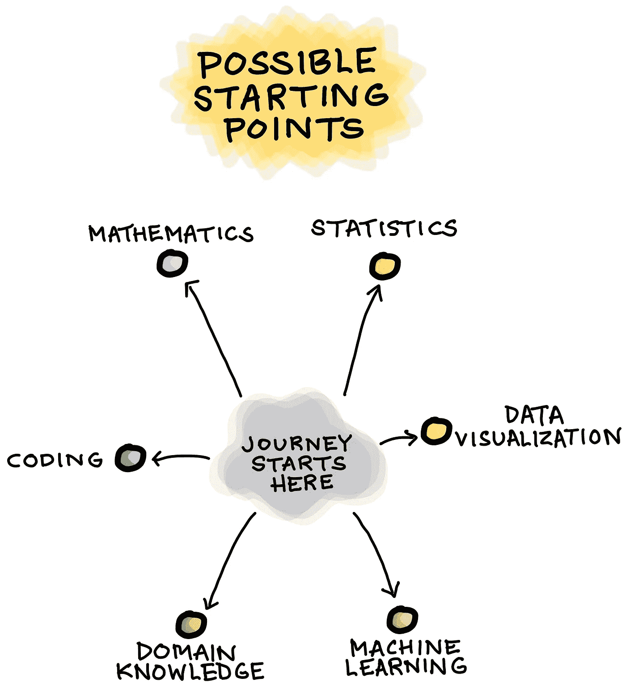

# 学习数据科学的策略

> 原文：<https://towardsdatascience.com/strategies-for-learning-data-science-47053b58c19f?source=collection_archive---------5----------------------->

**数据科学之旅可能起点的卡通插图。**(由 Chanin Nantasenamat 绘制)

## [数据科学](https://medium.com/tag/data-science)

## 进入数据科学的实用建议

你想进入数据科学领域吗？但就是不知道怎么做？如果是这样，那么继续读下去，因为这篇文章是为你而写的。

去年年底，也就是 2019 年 12 月，我发布了一个 YouTube 视频，名为[***2020 年学习数据科学的策略***](https://www.youtube.com/watch?v=7XdoaQYwTeA) ，这是我最近开设的 YouTube 频道，名为 [**数据教授**](http://youtube.com/dataprofessor) ，在那里我分享了我作为一名自学数据科学的学术教授学习数据科学的策略，自 2004 年以来一直活跃在该领域长达 16 年。

在本文中，我将讨论如何通过与您分享我用来学习数据科学的一些学习策略，让您也走上成为数据科学家的类似道路。

# 闯入数据科学需要什么背景？

为了成为一名数据科学家，你应该拥有计算机科学学位吗？或者，如果你来自一个非技术背景，你也可以做一个类似的转变到数据科学吗？

首先，我不是计算机科学家，你可能还记得我的第一篇关于媒体的文章( [***生物学家如何成为数据科学家:我如何从非技术背景过渡到数据科学***](/how-a-biologist-became-a-data-scientist-c52ec0060b8c) )，我的本科学位是生物科学。而且因为对计算机和数据的迷恋，我一直在自学做数据科学所必须的概念和技能。

数据科学是一个多学科领域，包括几个学科，如信息学、计算机科学、统计学、科学、数学、数据可视化以及最重要的问题解决。如果你查看 LinkedIn 上数据科学家的职位描述，你会注意到数据科学家可能拥有各种第一学位。如你所见，背景相当多样化。事实上，许多人不是计算机科学毕业生。然而，如果你有计算机科学学位，你可能会有优势。如果你没有，那也没关系(我也是生物专业的)。

拥有学习数据科学并将其应用于任何领域的热情，我相信这是成为数据科学家的关键。由于生物学中的大量数据，这刺激了我成为一名数据科学家的转变。特别是，通过应用机器学习来分析大生物数据，以努力(1)发现和发现新药，(2)理解药物的作用机制，以及(3)创建诊断工具，该工具将能够帮助临床医生和卫生专业人员诊断患者的特定感兴趣的疾病。

# 从哪里开始？

这是一个棘手的问题。当您想要进入数据科学领域时，实际上应该从哪里开始呢？答案可能会非常不同。如果你问一百个数据科学家，你可能会得到一百个不同的答案！

如果你问我，我是从生物学领域的知识开始的。我在生物学上遇到了一些数据问题，需要解答。在我最终成为一名数据科学家的过程中，我慢慢地一项一项地学会了必要的技能。这不是在 3 个月或 1 年内完成的，而是从 2004 年开始的。在数据科学这个术语被创造出来之前，我已经做了 16 年，发表了 100 多篇研究文章，从 2006 年开始教授数据科学(当时是数据挖掘)，我能说我已经掌握了数据科学吗？绝对不行！我每天都在继续学习数据科学的新概念。数据科学的前景如此广阔，以至于可能需要花一生的时间来掌握(甚至可能不掌握整个领域，而只是其中的一个子集)。

正如您将在下面的漫画插图中看到的那样，闯入数据科学的起点相当灵活。无论你来自哪种背景，你都可以进入数据科学领域，只要投入必要的努力、时间和实践，你就会成为一名数据科学家。

**数据科学之旅可能起点的卡通插图。**在这里，您将看到无论您从哪里开始，您都可以继续学习数据科学中使用的其他技能。(由 Chanin Nantasenamat 绘制)

# 成为一名数据科学家需要多少时间？

另一个你可能想知道的流行问题是成为一名数据科学家需要多少时间。您可能从某个地方听说过，您可以在 3 个月或更短的时间内学习数据科学。

但是说真的，这可能吗？答案是有也没有，迷茫？你看，3 个月后，你可能会对数据科学提供的东西有所了解。你也许能获得数据科学的初步介绍。你甚至可能获得数据素养或成为一名公民数据科学家。

比方说，如果你有一个计算机科学学位，成为一名数据科学家所需的时间不会太长，因为你已经具备了计算的基础，你已经有了技术背景，你已经知道如何编程(如果没有，那也没关系！).所以你所拥有的这些技术技能会让你的转变更快。

比方说，如果你是一名 web 开发人员，你将学习 R 或 Python，那么你将比一个来自生物学等领域的非技术人员更有能力学习这两种语言或其中任何一种语言(没错，就是我！).

对于一个生物学专业的学生来说，学习 R 或 Python 所需要的时间可能会更长。然而，我相信如果你有学习的心态和热情，那么我认为这是必要的。我在某处读到过，如果你花 10，000 个小时，你就能掌握技能或知识。

比方说，你每天花大约两个小时学习编程和数据科学的概念，所以我相信在一两年内，你将能够学到足够的知识，成为一名数据科学家。既然你也在练习。我认为数据科学家是一种生活方式。成为其中一员需要奉献和终身学习来获得新的技能，这将使你在这个领域中处于循环之中。这是一个*使用它或失去它*的哲学。因此，除了终身学习，我还强烈建议将新获得的知识和技能应用到数据科学项目中。

就我个人而言，我作为生物信息学副教授的日常工作要求我跟上该领域的最新发展，以促进创新和开发新的生物信息学工具，以及应用现有的机器学习算法来提取知识，提供对疾病潜在机制的见解，以及寻求发现潜在治疗应用的新药。

# 我需要学习如何编码吗？

因此，你可能会有下一个问题，你是否需要学习如何编码，以便成为一名数据科学家？这真的取决于环境，所以是和不是。在我学习如何编码之前，我会使用这个叫 WEKA 的软件。它是一个点击式图形用户界面(GUI)软件，用于执行数据挖掘，我依靠它来分析我在博士研究期间收集的数据。

随着时间的推移，我开始注意到通过点击式界面进行数据分析并不是一个高效的过程。主要原因是它需要大量的手动工作，我将不得不实际使用鼠标点击并执行软件中的各种任务:(1)导入数据，(2)指定输入参数，(3)启动模型的训练，(4)收集数据，(5)将其放入 Excel，(6)将其合并，因此所有这些都非常繁琐。

在我读博期间，有一段时间我记忆犹新。就是我在大学机房控制 40-50 台电脑的时候。因此，在每台计算机上，我会运行一些计算(使用 WEKA 软件建立模型)，然后我会手动从 40-50 台计算机中的每一台收集数据，然后将结果汇集在一起，以便在 Microsoft Excel 中进行后续分析和绘图。

在我的博士研究过程中，我从未学习过编码，而我只是依靠 WEKA 软件的数据挖掘功能，使用线性回归、J48(c 4.5 算法的 Java 实现)、反向传播神经网络和支持向量机等算法来完成所有的机器学习模型构建。在我的博士研究接近尾声时，我遇到了另一个伟大的基于 GUI 的多变量分析软件，称为 Unscrambler，它允许我运行另外两个机器学习算法，即主成分分析和偏最小二乘回归。

因此，在我 4 年的博士学习结束时，由于使用了两个基于 GUI 的软件:WEKA 和 unbrowser 软件，我能够以 13 篇论文(研究文章)毕业。我有没有提到，在我读博士的过程中，我确实尝试过学习 C++和 Java，但是没有成功。很大程度上停留在 Hello World 示例上，并没有真正获得任何进一步的进展。

那么我是什么时候学会编码的呢？你可能想知道。在透露答案之前，我先给你讲一下背景。于是在拿到博士学位后，我被同一所大学聘为讲师(快进到今天，我刚刚庆祝了我在学术界的 14 年+ 4 年读博= 18 年研究)。

好了，现在是我学习如何编码的时候了。在我担任讲师大约一年后，我遇到了一位研究助理(我将在下文中称为 RA ),他加入了我的研究实验室，帮助我将一些现有的工作流转换成编程工作流，即 Python 中的工作流。于是 RA 给我看了他一直用来学习 Python 的这本书叫做 ***Python Power！这是我第二次(也是成功的)尝试学习如何编码。那么为什么第二次尝试成功了呢？让我在下一节解释一下。***

所以说了这么多，不编码做数据科学有可能吗？可以使用基于 GUI 的软件，如 *WEKA* 、 *Rapid Miner* 、 *Orange* 或其他类似软件(在现代称为无代码 AI)来执行机器学习模型构建。

但是，整个数据挖掘项目的整个端到端工作流程并不完全可能仅通过使用一个软件，如 *WEKA* 。所以我最终使用了名为 *Ultra Edit* 的文本编辑器，它允许我应用录制的宏来半自动完成一些所需的数据预处理。

绘图主要是使用 *Microsoft Excel* 和 *Powerpoint* 创建的(用于添加图内面板标签和设计多绘图图的布局)。我还使用了另一个软件来制作更复杂的图，比如等高线图，这是通过使用*适马图*软件实现的。挑战在于手动将第一个软件的输出转换为第二个软件的输入。这个过程反复重复，由此第二软件的输出被用作第三软件的输入，等等。

如您所见，通过基于 GUI 的软件来执行整个数据挖掘模型构建的整个端到端工作流确实是可能的，但代价是需要手工操作。

所以回想起来，如果我能重新开始我的博士学位，我肯定会在学习如何编码上投入更多的努力(事实是，我确实试图学习如何编码，但没有成功；几年后的第二次尝试成功了，因为心态的改变，我将在接下来的章节*自学程序员中与你分享？*)。

你看，如果你知道如何编码，即使只是一点点，它将有助于大大加快你的工作流程。想象一下用 R 或 Python 代码自动化整个端到端项目，而不是必须手动做所有事情。那么有什么区别呢？答案是时间和可靠性。特别是，自动化方法更不容易出现人为错误，同时计算和完成速度明显更快。

# 学什么语言？r 还是 Python？

所以现在非常重要的问题是你应该学习什么语言如何编码。如果你一直在谷歌搜索或者在 YouTube 上看视频，你可能会遇到两种在数据科学领域非常流行的语言。所以第一个是 R，第二个是 Python。一个经常被问到和争论的流行问题是，是学 R 还是 Python？

## R 或 Python 有令人信服的理由吗？

所以答案真的取决于是否有令人信服的理由选择 R 或 Python。例如，您可能想要使用 ***Bio3D*** R 包或 ***shiny*** 包，因此如果是这种情况，那么就选择 R。或者，您可能真的想要使用 python 中的 ***Biopython*** 库，那么无论如何都要使用 Python。

## 你有学习伙伴或导师吗？

所以就我个人而言，我首先学习 Python 并不是因为语言本身的任何特殊原因。所以决定学习 Python 是因为我在前面提到的 RA 已经使用 Python 为我们正在进行的项目编写了工作流程。这或多或少地限制了使用 Python 的选择，因此我学习编码的旅程从这里开始。

所以我要求 RA 逐行解释 Python 源代码的意思。第一个解释对我来说没有意义。所以在一张纸上画一些漫画来描述每一行执行时实际发生了什么。不久之后，他离开了这个团队去攻读博士学位。所以我继续学习编码。

## 自学编码员？

因此，我得出结论，按照书中的例子编写代码并没有真正点燃我的学习过程。那么究竟是什么推动了我的学习呢？它框定了我自己的数据问题，并基于这个问题(这是最终的激励)，我会寻找如何有计划地解决数据问题并产生必要结果的方法。这个小任务的完成会给我带来小小的胜利，有助于激发我的学习动力。通过*寻找解决数据问题的方法*，我实际上做了什么？

答案很简单。我发现了 ***栈溢出*** 。这是一个神奇而强大的资源，它允许我通过学习别人如何解决编码问题的例子来自学编码。有时，一些问题有多个答案，最终导致相同的结果。特别是，一些答案获得了更多的支持，而另一些可能获得了更少的支持，这实际上是一个关于它是否也帮助了其他人的学习旅程的主观问题。通过比较和学习这些多重答案，这帮助我认识到，为了完成工作(解决数据问题)，我不需要记住语法(几年前当我试图学习 C++或 Java 但没有成功时，我盲目地试图这样做)。

所以这一次，我被解决数据/编码问题的**愿望**和达成最终解决方案所需任务的**逻辑**所引导。那么，我是如何得出需要完成哪些任务的逻辑的呢？我会简单地查看数据/编码问题，并尝试在纸上列出所有步骤，如果我必须手动完成，我会如何做。然后，我会一个接一个地对每一步进行顺序编码，直到所有问题都得到解决。在你知道之前，已经被分解成一口大小的馅饼被一个接一个地抓住并完成。

# 了解您的 Python 库和 R 包

因此，成为数据科学家的下一步是，你需要熟悉 Python 的标准库或 R 的标准包和模块。特别是，你需要知道 R 或 Python 中的哪些包或库可用于处理数据、预处理数据以及创建预测模型。

## 数据帧

例如，如果你在 Python 中处理数据帧，你将使用 ***pandas，因此，*** 你将不得不学习 pandas，以便你可以将不同的数据帧合并在一起。在 R 中，可以使用 ***dplyr*** 以及 R 中的 ***数据帧内置函数。***

## 数据可视化

如果你想在 Python 中创建图形，你可以使用 ***matplotlib*** ， ***seaborn*** ， ***altair*** ， ***plotly*** 和 ***plotnine*** ，而在 R 中你可以使用 R 基本绘图函数 ***ggplot2* 和**

## 机器学习

为了在 Python 中进行机器学习和建立预测模型，你需要使用 ***scikit-learn*** 或者你可以使用[***tensor flow***](https://www.tensorflow.org/)，[***keras***](https://keras.io/)，[***py torch***](https://pytorch.org/)和 [***fast。***](https://www.fast.ai/)

在 R 中你会用到*和 ***拨浪鼓*** 以及 [***张量流***](https://tensorflow.rstudio.com/) 和[***keras***](https://keras.rstudio.com/)。*

## *部署*

*在您已经构建了模型并且想要部署它之后。您可以从两种方法中选择一种:(1)作为应用程序编程接口(API)部署，或者(2)作为 web 应用程序部署。*

*在 Python 中，您可以使用 [***flask***](https://palletsprojects.com/p/flask/) 部署您的 scikit-learn 模型(参见本教程 [*将机器学习模型部署为 REST API*](/deploying-a-machine-learning-model-as-a-rest-api-4a03b865c166) 作者 [Nguyen Ngo](https://towardsdatascience.com/@nguyenngo) )。来自 Google 的 [***云 ML 引擎***](https://aihub.cloud.google.com/u/0/p/products%2Fe4dce5bd-f7b1-4d1a-842d-36f42be5608d) 也是另一种选择(参见本教程 [*部署 scikit-大规模学习模型*](/deploying-scikit-learn-models-at-scale-f632f86477b8) 作者[高玉峰](https://towardsdatascience.com/@yufengg))。在 R 中，您可以使用[***plumber***](https://www.rplumber.io/)包来创建 web API(参见本教程 [*如何使用由*](https://www.shirin-glander.de/2018/01/plumber/) *[Shirin Elsinghorst](https://www.shirin-glander.de/page/about/) 编写的 plumber 包* 将您的机器学习模型作为 API 使用，以及本教程 [*R 可以 API，您也可以！*](https://medium.com/tmobile-tech/r-can-api-c184951a24a3) 作者[希瑟·诺利斯](https://medium.com/@heathernolis)。*

*要将机器学习模型部署为 web 应用程序，建议您首先通过 Python 中的 ***pickle*** 函数和 R 中的 ***saveRDS*** 函数将模型保存到一个文件中。然后可以使用[***flask***](https://palletsprojects.com/p/flask/)和[***Streamlit***](https://www.streamlit.io/)**来提供实际的 web 应用程序***

*我还制作了一个视频系列教程，讲述如何使用 ***Streamlit*** 库用 Python 创建数据科学 web 应用程序。*

* [## 如何用 Python 构建数据科学 Web 应用程序

### 第 1 部分:您的第一个 Web 应用程序，只有几行代码

towardsdatascience.com](/how-to-build-a-data-science-web-app-in-python-61d1bed65020) 

如果您想用 R 语言创建数据科学 web 应用程序，那么请使用 ***闪亮*** 包查看下面的教程视频系列。* 

# *掌控您的数据科学之旅*

*成为一名数据科学家最重要的部分是你必须坚持不懈。你必须努力尝试。你必须拥有自己的数据科学之旅。这段旅程并不容易，所以你必须付出额外的努力来完成它。*

*我的数据科学之旅非常了不起。我学到了很多东西。我见过很多有才华的人。我有机会做我真正喜欢的事情并获得报酬。所以我从来没有厌倦这份工作，总是有新的数据要收集，要分析，我们有持续的合作，真的有新的数据和新的机会不断流入学习生物学，所以这是一个非常非常令人满意的工作。如果我能让时光倒流，重新决定我想做什么，我会坚持同样的道路，成为一名数据科学家。我相信数据科学非常适合我自己的 Ikigai(查看令人敬畏的文章 [*Ikigai:过有意义生活的秘密*](https://medium.com/@kittuvaidyakv/ikigai-the-secret-to-living-a-meaningful-life-6314bd007e09) ，作者 [Ketaki Vaidya](https://medium.com/@kittuvaidyakv) )。*

*如果您想获得更多关于开始学习数据科学的建议和路线图，请不要忘记查看我之前在《走向数据科学》中的文章 [*关于学习数据科学我希望知道的 10 件事:开始数据科学之旅的终极路线图*](/10-things-i-wish-i-knew-about-learning-data-science-7a30bfb91759) 。*

* [## 关于学习数据科学，我希望知道的 10 件事

### 开始数据科学之旅的终极实用建议

towardsdatascience.com](/10-things-i-wish-i-knew-about-learning-data-science-7a30bfb91759)* 

# *最终带回家的信息*

*最重要的是，你必须编码。你必须做数据科学项目。如果您能从这篇文章中获得 2 个关键信息，请获得 2 个:(1)学习编码和(2)将您的编码技能应用到您自己的数据科学项目中。*

> *“学习数据科学的最好方法是做数据科学。”
> — Chanin Nantasenamat，数据教授*

## *[订阅我的邮件列表，获取我在数据科学方面的最佳更新(偶尔还有免费内容)!](http://newsletter.dataprofessor.org/)*

# *关于我*

*我是泰国一所研究型大学的生物信息学副教授和数据挖掘和生物医学信息学负责人。在我下班后的时间里，我是一名 YouTuber(又名[数据教授](http://bit.ly/dataprofessor/))制作关于数据科学的在线视频。在我制作的所有教程视频中，我也在 GitHub 上分享 Jupyter 笔记本([数据教授 GitHub 页面](https://github.com/dataprofessor/))。*

* [## 数据教授

### 数据科学、机器学习、生物信息学、研究和教学是我的激情所在。数据教授 YouTube…

www.youtube.com](https://www.youtube.com/dataprofessor?sub_confirmation=1) 

## 在社交网络上与我联系

✅YouTube:[http://youtube.com/dataprofessor/](http://youtube.com/dataprofessor/)
♇网站:[http://dataprofessor.org/](https://www.youtube.com/redirect?redir_token=w4MajL6v6Oi_kOAZNbMprRRJrvJ8MTU5MjI5NjQzN0AxNTkyMjEwMDM3&q=http%3A%2F%2Fdataprofessor.org%2F&event=video_description&v=ZZ4B0QUHuNc)(在建)
♇LinkedIn:[https://www.linkedin.com/company/dataprofessor/](https://www.linkedin.com/company/dataprofessor/)
♇Twitter:[https://twitter.com/thedataprof](https://twitter.com/thedataprof)
♇Facebook:[http://facebook.com/dataprofessor/](https://www.youtube.com/redirect?redir_token=w4MajL6v6Oi_kOAZNbMprRRJrvJ8MTU5MjI5NjQzN0AxNTkyMjEwMDM3&q=http%3A%2F%2Ffacebook.com%2Fdataprofessor%2F&event=video_description&v=ZZ4B0QUHuNc)
♇github:[https://github.com/dataprofessor/](https://github.com/dataprofessor/)
♇insta gram:*